# 中通冷链系统操作场景汇总

> 按业务模块分类，列出支持的场景、涉及菜单和操作流程。

## 「必知必读」账号权限如何开通

### 系统如何访问？APP如何下载？

**涉及菜单**：
- 微信小程序（中通冷链司机小程序）

**操作流程**：
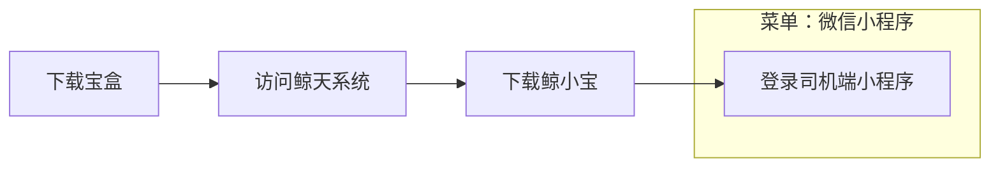

---

### 系统账号如何开通？权限如何配置？

**涉及菜单**：
- 菜单搜索（员工管理）
- 基础配置（用户中心 > 员工管理）
- ZTO 一级网点财务（ZTO 二级网点财务）

**操作流程**：
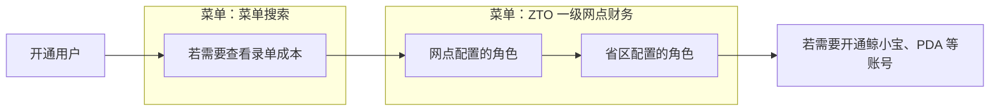

---

## 一、网点操作

### 客户如何通过电商平台下单？

**涉及菜单**：
- 交易（订单）（物流服务 > 电子面单）
- 经营管理中心（商户电子面单账户管理 > 审核, 商户电子面单账户管理 > 充值（审核后才有充值按钮）, 电子面单申购）

**操作流程**：
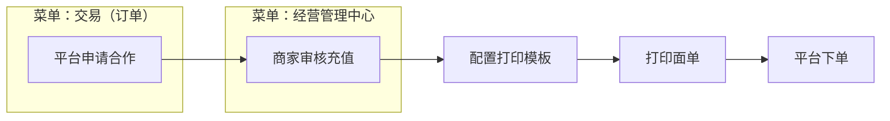

---

### 如何物料购买充值？

**涉及菜单**：
- 经营管理中心（电子面单 > 电子面单申购, 电子面单 > 电子面单申购记录, 电子面单 > 电子面单上架, 物料商城 > 我的订单）
- 鲸天经营管理中心（物料商城 > 物料购买）

**操作流程**：
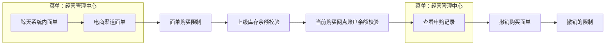

---

### 你不知道的 小程序对客报价？

**涉及菜单**：
- 报价管理（一级网点内部报价 > 对客报价）
- 优先对客报价(定位客户编码)（对客报价(全部客户兜底) > 报价时效查询）

---

### 如何引导客户在客户端下单？

**涉及菜单**：
- 微信小程序（中通冷链小程序, 冷链快运下单入口）
- 订单查询（订单状态及详情, 运单详情及物流轨迹）

**操作流程**：
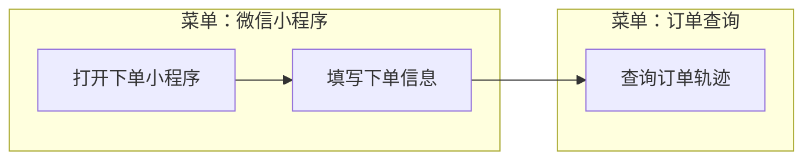

---

### 下单神器来了？网点的福音

**涉及菜单**：
- 鲸小宝（我的）

**操作流程**：
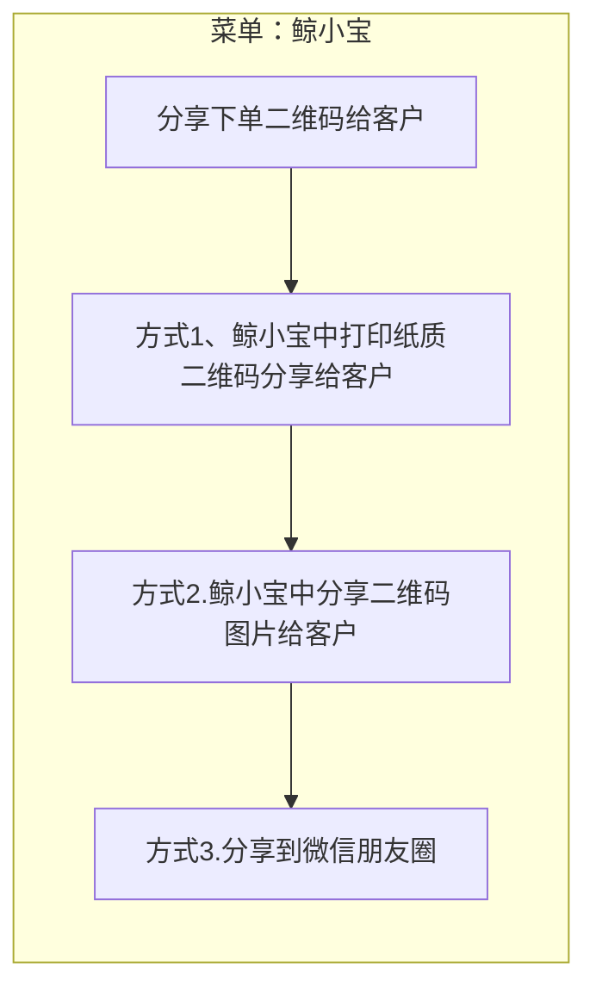

---

### 客户不会下单怎么办？如何手把手教客户？

**操作流程**：
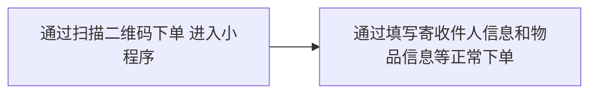

---

### 这个客户是扫谁的码下单的？

**操作流程**：
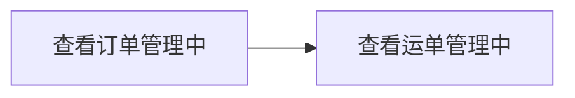

---

### 货物交接失温！不再担心！ 客户帮你搞定！

**涉及菜单**：
- 鲸天系统（经营管理中心 > 大客户结算 > 商户电子面单账户管理, 经营管理中心 > 订单管理）
- 大客户结算（大客户基础报价维护）
- 点击全部订单跳转至 物流跟踪（订单查询）

**操作流程**：
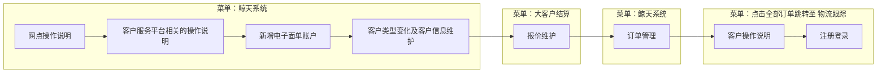

---

### 包仓, 你了解吗？

**操作流程**：


---

### 哪些情况下可以删单？系统主动取消逻辑是咋样的？

**操作流程**：
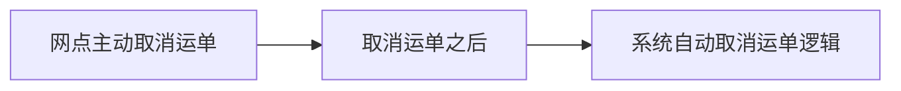

---

### 好多运单需要录？太耗时了，怎么办？

**操作流程**：
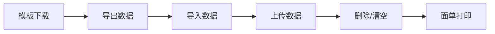

---

### 如何代客下运单？

**涉及菜单**：
- 收件人信息中（自选网点）

**操作流程**：
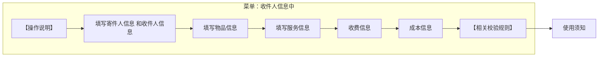

---

### 如何进行订单相关操作？

**操作流程**：


---

### 客户要回单怎么办？

**操作流程**：
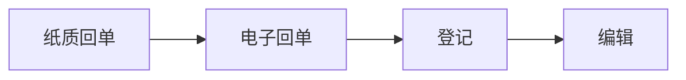

---

### 待派运单 都有哪些？？

**涉及菜单**：
- 寄件网点（派件网点：可向下选择下属网点）

**操作流程**：
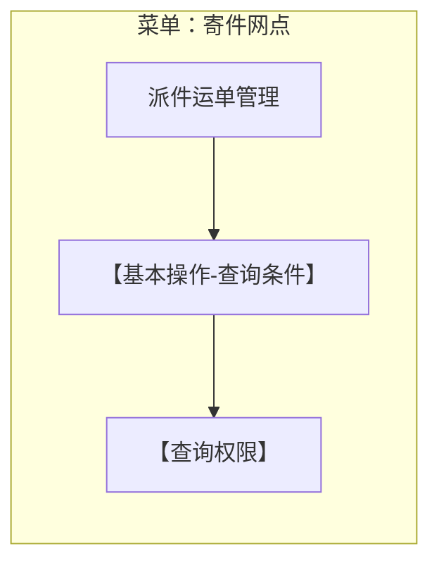

---

### 快件跟踪如何使用？

**操作流程**：


---

### 改单？

**涉及菜单**：
- 产品类型（温区 > 服务方式：可修改）
- 寄派件网点状态（服务校验）

**操作流程**：
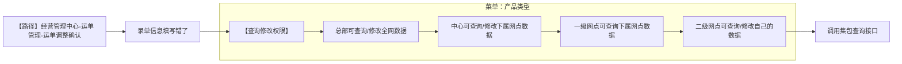

---

### 运单进度状态 哪里看？？

**涉及菜单**：
- 寄件网点（派件网点：可向下选择下属网点）

**操作流程**：
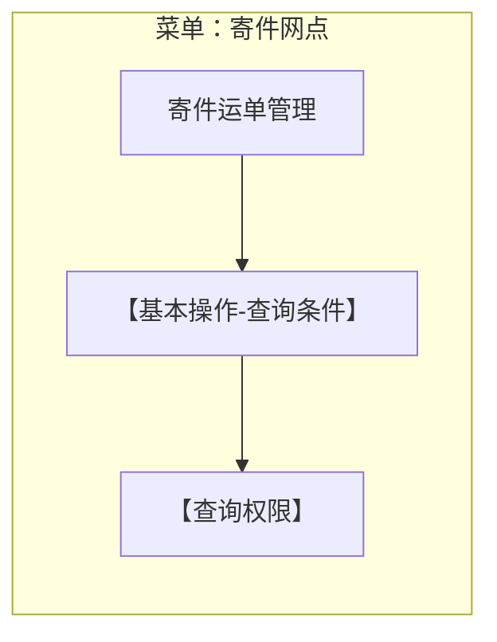

---

### 仲裁如何申报、申诉？

**涉及菜单**：
- 新增：新增仲裁（理赔单据）
- 仲裁处理（处理不通过）

**操作流程**：
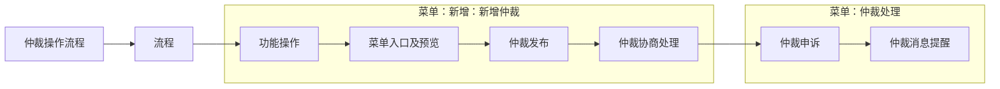

---

### 工单如何有效处理？

**涉及菜单**：
- 普通工单查询：处理（暂存（完结））
- 新普通工单（新建（升级 > 转单））

**操作流程**：
```mermaid
flowchart LR
  S1["处理工单"]
  S2["菜单入口及预览"]
  S3["网点处理工单"]
  S4["网点申诉工单"]
  S5["录单/发短信（总部权限）"]
  S6["待办消息通知"]
  subgraph G1["菜单：普通工单查询：处理（暂存"]
    S1
    S2
    S3
    S4
  end
  subgraph G2["菜单：新普通工单（新建"]
    S5
    S6
  end
  S1 --> S2
  S2 --> S3
  S3 --> S4
  S4 --> S5
  S5 --> S6
```

---

### 差重差方如何申报

**操作流程**：
```mermaid
flowchart LR
  S1["处理差重差方"]
  S2["菜单入口及预览"]
  S3["发布/申诉差重差方"]
  S4["待办消息通知"]
  S1 --> S2
  S2 --> S3
  S3 --> S4
```

---

### 差重差方如何申诉

**操作流程**：
```mermaid
flowchart LR
  S1["处理差重差方"]
  S2["申诉"]
  S1 --> S2
```

---

### 差错如何申报/申诉？

**涉及菜单**：
- 运单号（调度单号：非总部填写必填）

**操作流程**：
```mermaid
flowchart LR
  S1["理差重差方"]
  S2["处理流程"]
  S3["菜单入口及预览"]
  S4["查询/申报/申诉处理"]
  subgraph G1["菜单：运单号"]
    S1
    S2
    S3
    S4
  end
  S1 --> S2
  S2 --> S3
  S3 --> S4
```

---

### 敷衍问题件如何有效举证？

**操作流程**：
```mermaid
flowchart LR
  S1["问题件查询"]
  S2["问题件举证"]
  S1 --> S2
```

---

### 问题件如何有效回复

**涉及菜单**：
- > 2. 回复（发布问题件（鲸小宝））
- 支持鲸小宝问题件进行回复（完结 > 撤销操作）

**操作流程**：
```mermaid
flowchart LR
  S1["处理问题件（鲸天）"]
  S2["菜单入口及预览"]
  S3["发布/回复问题件"]
  S4["回复/发布问题件（鲸小宝）"]
  subgraph G1["菜单：支持鲸小宝问题件进行回复"]
    S4
  end
  S1 --> S2
  S2 --> S3
  S3 --> S4
```

---

### 问题件预处罚有歧义，想要申诉？

**操作流程**：
```mermaid
flowchart LR
  S1["举证申诉"]
  S2["超时未回复申诉"]
  S1 --> S2
```

---

### 包仓仓位用的好快，哪里能看到仓位的使用明细呢？

**操作流程**：
```mermaid
flowchart LR
  S1["登录鲸天系统"]
  S2["备注：查看运单的占仓情况时"]
  S1 --> S2
```

---

### 对总部的销项发票开好了，系统上还会被扣税点？

**操作流程**：
```mermaid
flowchart LR
  S1["查看应开发票金额"]
  S2["绑定发票"]
  S1 --> S2
```

---

### 网点账户好几个，分不清楚该看哪个余额咋办？

**操作流程**：
```mermaid
flowchart LR
  S1["基础版账户理解"]
  S2["进阶版账户理解"]
  S1 --> S2
```

---

### 应该什么时候交提签？

**操作流程**：
```mermaid
flowchart LR
  S1["交货明细规则"]
  S2["提货明细规则"]
  S3["签收明细规则"]
  S4["时效率规则"]
  S1 --> S2
  S2 --> S3
  S3 --> S4
```

---

### 进出港跟踪如何使用？

**操作流程**：
```mermaid
flowchart LR
  S1["打开方式"]
  S2["直接访问"]
  S3["跳转访问"]
  S4["页面说明"]
  S5["出港类使用说明"]
  S6["查看累计至当天需要跟踪处理的运单"]
  S7["方式一：通过查询1级网点包含下级网点数据"]
  S8["方式二：直接输入具体的某个二级网点名称"]
  S1 --> S2
  S2 --> S3
  S3 --> S4
  S4 --> S5
  S5 --> S6
  S6 --> S7
  S7 --> S8
```

---

### 鲸小宝如何使用

**涉及菜单**：
- 基础管理（用户中心 > 用户管理）

**操作流程**：
```mermaid
flowchart LR
  S1["下载鲸小宝"]
  S2["切换使用组织鲸小宝"]
  S3["修改密码鲸小宝"]
  S1 --> S2
  S2 --> S3
```

---

### 业务员码设置

**操作流程**：
```mermaid
flowchart LR
  S1["司机派送常见问题"]
  S2["三段码最后1位"]
  S3["快件跟踪或者运单详情中"]
  S4["勾画注意事项"]
  S1 --> S2
  S2 --> S3
  S3 --> S4
```

---

### 实名认证说明

**操作流程**：
```mermaid
flowchart LR
  S1["认证"]
  S2["其他备用认证渠道"]
  S3["其他常见问题"]
  S1 --> S2
  S2 --> S3
```

---

### 鲸准达相关配置说明

**操作流程**：
```mermaid
flowchart LR
  S1["新营业网点开启"]
  S2["省区勾画鲸准达围栏"]
  S1 --> S2
```

---

## 二、中心操作

### 为啥子这个月扣这么多？明细在哪里看？

**操作流程**：
```mermaid
flowchart LR
  S1["奖罚明细"]
  S2["补贴规则"]
  S1 --> S2
```

---

### 冷机温度老报警，那个那么烦人吔！

**操作流程**：
```mermaid
flowchart LR
  S1["面板告警处理"]
  S2["系统告警处理"]
  S3["告警处理办法"]
  S1 --> S2
  S2 --> S3
```

---

### 到达中心如何进行靠台操作？

**操作流程**：
```mermaid
flowchart LR
  S1["中心靠台介绍"]
  S2["中心靠台动作"]
  S3["中心靠台操作"]
  S4["中心靠台入口"]
  S5["靠台拍照要求"]
  S1 --> S2
  S2 --> S3
  S3 --> S4
  S4 --> S5
```

---

### 又到了保养周期，如何去保养呢?

**操作流程**：
```mermaid
flowchart LR
  S1["车辆维保前申请"]
  S2["车辆维保后提交"]
  S3["车辆保养指南"]
  S1 --> S2
  S2 --> S3
```

---

### 又垫付了，咋个报销呢？

**操作流程**：
```mermaid
flowchart LR
  S1["垫付报销"]
  S2["打开司机版小程序"]
  S3["提交之后等待 车队文员 统一审批（PS：轮渡费"]
  S1 --> S2
  S2 --> S3
```

---

### 司机小程序如何注册，认证？

**操作流程**：
```mermaid
flowchart LR
  S1["司机注册"]
  S2["司机认证"]
  S3["上传身份证信息、驾驶证信息"]
  S4["认证成功标识"]
  S1 --> S2
  S2 --> S3
  S3 --> S4
```

---

### 司机小程序如何访问？

**操作流程**：
```mermaid
flowchart LR
  S1["准备工作"]
  S2["访问步骤"]
  S3["通过微信访问"]
  S4["小程序二维码"]
  S1 --> S2
  S2 --> S3
  S3 --> S4
```

---

### 啷们老叫我去审车公里数算不算？

**涉及菜单**：
- 当然是司机小程序（无任务上报了）

**操作流程**：
```mermaid
flowchart LR
  S1["无任务申报"]
  S2["当然是司机小程序-无任务上报了"]
  S3["提交之后静静等待"]
  subgraph G1["菜单：当然是司机小程序"]
    S2
  end
  S1 --> S2
  S2 --> S3
```

---

### 如何成为车辆交接老手?

**操作流程**：
```mermaid
flowchart LR
  S1["打开司机小程序"]
  S2["点击 【去处理】执行车辆交接任务"]
  S1 --> S2
```

---

### 小程序服务站，司机如何使用？

**操作流程**：
```mermaid
flowchart LR
  S1["服务站介绍"]
  S2["服务站应用场景"]
  S3["服务站查询操作"]
  S4["访问入口"]
  S5["服务站加油应用"]
  S6["选择社会加油站"]
  S1 --> S2
  S2 --> S3
  S3 --> S4
  S4 --> S5
  S5 --> S6
```

---

### 新手司机如何接单操作?

**操作流程**：
```mermaid
flowchart LR
  S1["任务查找"]
  S2["任务签到"]
  S3["任务发车"]
  S4["任务到车"]
  S1 --> S2
  S2 --> S3
  S3 --> S4
```

---

### 昨晚手机刷多咾，有点打瞌睡啷个办?

**操作流程**：
```mermaid
flowchart LR
  S1["安全驾驶告警处理"]
  S2["货车司机连续驾驶货车4小时不休息的扣分情况"]
  S1 --> S2
```

---

### 运输过程中发生车祸了怎么办？

**操作流程**：
```mermaid
flowchart LR
  S1["报警处理"]
  S2["上报异常"]
  S1 --> S2
```

---

### 运输过程发生异常如何上报？

**操作流程**：
```mermaid
flowchart LR
  S1["异常上报"]
  S2["打开车线任务"]
  S3["选择异常类型、如道路拥堵、或道路封闭"]
  S4["提交上报后"]
  S1 --> S2
  S2 --> S3
  S3 --> S4
```

---

### 这个月的主驾补贴这么少，考勤在哪里看叻？？

**操作流程**：
```mermaid
flowchart LR
  S1["我的考勤"]
  S2["我的里程"]
  S1 --> S2
```

---

### 三方车辆温度设备如何授权？

**涉及菜单**：
- 设备管理（设备共享)）
- 打开设备共享菜单（菜单路径：设备管理（设备共享)）

**操作流程**：
```mermaid
flowchart LR
  S1["购买物料设备"]
  S2["登录易流后台系统"]
  S3["共享车辆"]
  subgraph G1["菜单：设备管理"]
    S1
    S2
    S3
  end
  S1 --> S2
  S2 --> S3
```

---

### 这个司机老请假，哪里可以查看司机综合信息？

**涉及菜单**：
- 菜单搜索（调度计划）

---

### 这趟任务超时了？哪里可以看到轨迹、停车记录?

**涉及菜单**：
- 菜单搜索（调度计划）

**操作流程**：
```mermaid
flowchart LR
  S1["访问鲸天系统"]
  S2["可以完整地查看车辆运行轨迹、温度趋势"]
  subgraph G1["菜单：菜单搜索"]
    S1
    S2
  end
  S1 --> S2
```

---

### PDA密码忘记怎么办？

**涉及菜单**：
- 打开操作小程序（我的 > 我的二维码 会显示个人二维码）

**操作流程**：
```mermaid
flowchart LR
  S1["PDA登录页面点击忘记密码修改"]
  S2["扫描二维码登录"]
  S3["联系技术支持修改"]
  subgraph G1["菜单：打开操作小程序"]
    S2
  end
  S1 --> S2
  S2 --> S3
```

---

### PDA软件在哪里下载？

**操作流程**：
```mermaid
flowchart LR
  S1["PDA软件下载"]
  S2["PC下载"]
  S3["扫码下载"]
  S1 --> S2
  S2 --> S3
```

---

### 三段码规则说明

**涉及菜单**：
- 通过规则计算分拨码为：01（12 （展示如上图1））
- 赤峰网(023)（高碑店分拨中心(02) > 广州分拨中心(01) > 广州白云网点(010)）
- 举例：广州分拨（广州一级网点 > 二级网点（一级+二级）001 > 01）
- 广州分拨（广州一级网点 （一级）001, 广州二级网点 （一级+二级）001 > 01）
- 广州分拨集配站（二级网点（一级+二级）001 > 01）

---

### 中心物资管理

**涉及菜单**：
- 地址：鲸天（运营操作管理 > 基础资料 > 物资管理, 运营运输管理 > 运输计划 > 调度计划）

**操作流程**：
```mermaid
flowchart LR
  S1["PC端物资管理"]
  S2["PC物资管理"]
  S3["PC调度计划物资查询"]
  S4["PDA物资查询"]
  S5["实时卸车"]
  S6["实时装车"]
  S7["小程序物资查询"]
  subgraph G1["菜单：地址：鲸天"]
    S1
    S2
    S3
  end
  S1 --> S2
  S2 --> S3
  S3 --> S4
  S4 --> S5
  S5 --> S6
  S6 --> S7
```

---

### 如何做到件扫描？

**涉及菜单**：
- 地址：鲸天（运营操作管理 > 扫描管理 > 到件扫描）
- 卸车任务（物资里面显示的数据为上一站发往本站的记录）

**操作流程**：
```mermaid
flowchart LR
  S1["PC到件"]
  S2["PDA到件"]
  S3["到件"]
  S4["实时卸车"]
  S5["鲸小宝到件"]
  subgraph G1["菜单：地址：鲸天"]
    S1
  end
  subgraph G2["菜单：卸车任务"]
    S2
    S3
    S4
  end
  S1 --> S2
  S2 --> S3
  S3 --> S4
  S4 --> S5
```

---

### 如何做发件扫描？

**涉及菜单**：
- 地址：鲸天（运营操作管理 > 扫描管理 > 发件扫描）

**操作流程**：
```mermaid
flowchart LR
  S1["PC发件"]
  S2["PDA发件"]
  S3["发件"]
  S4["实时装车"]
  S5["鲸小宝发件"]
  subgraph G1["菜单：地址：鲸天"]
    S1
  end
  S1 --> S2
  S2 --> S3
  S3 --> S4
  S4 --> S5
```

---

### 如何做收件扫描？

**涉及菜单**：
- 地址：鲸天（运营操作管理 > 扫描管理 > 收件扫描）

**操作流程**：
```mermaid
flowchart LR
  S1["PC收件"]
  S2["PDA收件"]
  S3["鲸小宝收件"]
  subgraph G1["菜单：地址：鲸天"]
    S1
  end
  S1 --> S2
  S2 --> S3
```

---

### 如何做派件扫描？

**涉及菜单**：
- 若货物已经正常签收（异常签收（非分批派送）则无法做派送）
- 地址：鲸天（运营操作管理 > 扫描管理 > 派件扫描）
- 打开PDA（操作页面显示 派件扫描（图1））

**操作流程**：
```mermaid
flowchart LR
  S1["PC派件"]
  S2["PDA派件"]
  S3["鲸小宝派件"]
  subgraph G1["菜单：地址：鲸天"]
    S1
  end
  subgraph G2["菜单：打开PDA"]
    S2
  end
  S1 --> S2
  S2 --> S3
```

---

### 如何做签收扫描？

**涉及菜单**：
- 地址：鲸天（运营操作管理 > 扫描管理 > 签收扫描）
- 打开PDA（操作页面显示 签件扫描（图1））

**操作流程**：
```mermaid
flowchart LR
  S1["PC签收"]
  S2["PDA签收"]
  S3["鲸小宝签收"]
  subgraph G1["菜单：地址：鲸天"]
    S1
  end
  subgraph G2["菜单：打开PDA"]
    S2
  end
  S1 --> S2
  S2 --> S3
```

---

### 电脑端如何查询库存？

**涉及菜单**：
- 地址：鲸天（运营操作管理 > 库存管理 > 库存明细查询, 运营操作管理 > 库存管理 > 库存流向查询）

**操作流程**：
```mermaid
flowchart LR
  S1["库存明细查询"]
  S2["库存流向查询"]
  subgraph G1["菜单：地址：鲸天"]
    S1
    S2
  end
  S1 --> S2
```

---

### 货物上无面单怎么办？

**涉及菜单**：
- 打印地址：鲸天（经营管理中心 > 运单管理 > 面单打印）
- PC 上报地址：鲸天（经营管理中心 > 运单管理 > 无头件登记查询）
- 地址：鲸天（经营管理中心 > 运单管理 > 无头件认领）

**操作流程**：
```mermaid
flowchart LR
  S1["PC 打印"]
  S2["鲸小宝打印"]
  S3["PDA 打印"]
  S4["上报无头件"]
  S5["PC 无头件发布"]
  S6["PDA 上报无头件"]
  S7["PC无头件认领"]
  subgraph G1["菜单：打印地址：鲸天"]
    S1
    S2
    S3
  end
  subgraph G2["菜单：PC 上报地址：鲸天"]
    S4
    S5
    S6
  end
  subgraph G3["菜单：地址：鲸天"]
    S7
  end
  S1 --> S2
  S2 --> S3
  S3 --> S4
  S4 --> S5
  S5 --> S6
  S6 --> S7
```

---

### 货物已到达中心客户不发了怎么办？

**涉及菜单**：
- 地址：电脑端（运营操作管理 > 扫描管理 > 拦截件）

**操作流程**：
```mermaid
flowchart LR
  S1["寄件网点发起拦截件"]
  S2["退货"]
  S3["等通知放货"]
  S4["中心扫描货物拦截"]
  S5["到件扫描拦截"]
  S6["发件扫描拦截"]
  subgraph G1["菜单：地址：电脑端"]
    S1
    S2
    S3
  end
  S1 --> S2
  S2 --> S3
  S3 --> S4
  S4 --> S5
  S5 --> S6
```

---

### 分拨进出港货量预测

**操作流程**：
```mermaid
flowchart LR
  S1["出港"]
  S2["进港"]
  S1 --> S2
```

---

### 月台、托盘、库区使用情况？

**涉及菜单**：
- 操作小程序（综合查询）
- 地址：PC端（运营操作管理 > 托盘管理, 运营操作管理 > 托盘子单查询）

**操作流程**：
```mermaid
flowchart LR
  S1["月台"]
  S2["库区"]
  S3["托盘"]
  subgraph G1["菜单：操作小程序"]
    S3
  end
  S1 --> S2
  S2 --> S3
```

---

### 装卸工如何打卡？

**涉及菜单**：
- 鲸天（基础管理 > 用户中心 > 员工管理）

**操作流程**：
```mermaid
flowchart LR
  S1["装卸工注册"]
  S2["装卸工首次到达分拨需系统账号注册"]
  S3["使用微信扫一扫"]
  S4["打上班卡"]
  S5["查询装卸工"]
  S6["打装卸任务卡"]
  S7["中心每一个装卸任务"]
  S8["装卸任务卡跟上下班打卡功能相同"]
  S1 --> S2
  S2 --> S3
  S3 --> S4
  S4 --> S5
  S5 --> S6
  S6 --> S7
  S7 --> S8
```

---

## 三、云仓操作

### 创建仓库、货主、员工、

**操作流程**：
```mermaid
flowchart LR
  S1["创建仓库"]
  S2["创建员工"]
  S3["按以下步骤创建员工与分配权限"]
  S4["创建总部员工、角色"]
  S5["创建仓库角色、员工"]
  S6["创建货主"]
  S1 --> S2
  S2 --> S3
  S3 --> S4
  S4 --> S5
  S5 --> S6
```

---

### 创建库位、SKU

**操作流程**：
```mermaid
flowchart LR
  S1["创建库位"]
  S2["库位相关参数意义"]
  S3["创建SKU"]
  S4["SKU相关参数意义"]
  S1 --> S2
  S2 --> S3
  S3 --> S4
```

---

### 云平台取号打印归纳

**操作流程**：
```mermaid
flowchart LR
  S1["出库包裹匹配承运商配置"]
  S2["当前完成测试"]
  S3["旧系统 相关配置"]
  S4["相关平台取号 API说明"]
  S5["从各平台找到编码"]
  S6["各平台取号接口"]
  S7["各平台电子面单常见问题"]
  S8["云打印客户自定义区域"]
  S1 --> S2
  S2 --> S3
  S3 --> S4
  S4 --> S5
  S5 --> S6
  S6 --> S7
  S7 --> S8
```

---

### 仓库初始配置（面向总部）

**操作流程**：
```mermaid
flowchart LR
  S1["管理后台配置"]
  S2["仓库初始配置（面向总部）"]
  S1 --> S2
```

---

### 配置规则策略

**操作流程**：
```mermaid
flowchart LR
  S1["配置"]
  S2["策略"]
  S3["策略清单"]
  S4["详细展开定位策略、分配策略、波次规则"]
  S1 --> S2
  S2 --> S3
  S3 --> S4
```

---

### WMS发云冷配置

**涉及菜单**：
- 需要维护 仓库档案（联系信息）

**操作流程**：
```mermaid
flowchart LR
  S1["发云冷分类"]
  S2["归纳中通系承运公司的区别"]
  S3["先讲业务怎么操作"]
  S4["配置的描述以下是关于技术支持"]
  S5["【出库包裹】2C 出库"]
  S6["承运商配置"]
  S7["承运方案"]
  S8["1） 中通鲸选"]
  S1 --> S2
  S2 --> S3
  S3 --> S4
  S4 --> S5
  S5 --> S6
  S6 --> S7
  S7 --> S8
```

---

### 取号打印配置流程详解

**操作流程**：
```mermaid
flowchart LR
  S1["山海通系统615配置范围"]
  S2["测试问题"]
  S3["各平台地址不同"]
  S4["旧系统 相关配置"]
  S5["相关API说明"]
  S6["小红书电子面单常见问题"]
  S7["以下文档为一个平台配置流程"]
  S8["目的"]
  S1 --> S2
  S2 --> S3
  S3 --> S4
  S4 --> S5
  S5 --> S6
  S6 --> S7
  S7 --> S8
```

---

### 微信视频号取号配置

**操作流程**：
```mermaid
flowchart LR
  S1["简述取号流程"]
  S2["微信取号详细配置流程"]
  S1 --> S2
```

---

### 旧系统物流业务平移操作说明

**操作流程**：
```mermaid
flowchart LR
  S1["先创建旧系统账号"]
  S2["导出旧系统出库单"]
  S3["根据物流业务名称 到旧系统找到相关参数"]
  S4["开始配置新系统"]
  S5["给自己开通旧 WMS 仓库账号"]
  S1 --> S2
  S2 --> S3
  S3 --> S4
  S4 --> S5
```

---

### 入库作业

**涉及菜单**：
- 可以使用PC收货扫描（PDA普通收货）

**操作流程**：
```mermaid
flowchart LR
  S1["新建入库单"]
  S2["开始收货"]
  S3["PC-收货扫描"]
  S4["以下两种方式均可进入收货扫描页面"]
  S5["PDA-普通收货"]
  S6["收货后会记录到收货记录"]
  S7["上架任务"]
  S8["功能说明"]
  subgraph G1["菜单：可以使用PC收货扫描"]
    S2
    S3
    S4
    S5
    S6
    S7
    S8
  end
  S1 --> S2
  S2 --> S3
  S3 --> S4
  S4 --> S5
  S5 --> S6
  S6 --> S7
  S7 --> S8
```

---

### 序列号场景

**操作流程**：
```mermaid
flowchart LR
  S1["序列号"]
  S2["相关页面"]
  S1 --> S2
```

---

### 包装方案功能说明

**操作流程**：
```mermaid
flowchart LR
  S1["包装方案"]
  S2["包材出库"]
  S1 --> S2
```

---

### WMS 2B出库作业

**操作流程**：
```mermaid
flowchart LR
  S1["概括"]
  S2["2B 出库涉及到的菜单页面"]
  S3["未交付功能"]
  S4["以下是完整出库流程"]
  S5["出库订单——用于生成出库计划"]
  S6["生成出库计划——即一次出库"]
  S7["拣货任务确认，即完成拣货任务"]
  S8["交接发货"]
  S1 --> S2
  S2 --> S3
  S3 --> S4
  S4 --> S5
  S5 --> S6
  S6 --> S7
  S7 --> S8
```

---

### 逆向/异常处理

**涉及菜单**：
- 上游拦截（仓库拦截）
- 多拣：复核（差异提报）
- 少拣：复核（缺货打印 > 补拣单）
- 拣错：复核（差异提报）

**操作流程**：
```mermaid
flowchart LR
  S1["逆向"]
  S2["异常处理"]
  subgraph G1["菜单：上游拦截"]
    S1
  end
  subgraph G2["菜单：多拣：复核"]
    S2
  end
  S1 --> S2
```

---

### 库内作业 盘点 移库 调整 补货

**涉及菜单**：
- 编辑（录入实盘数量 > 保存）
- 库内（加工拣货 可以查看拣货详情）

**操作流程**：
```mermaid
flowchart LR
  S1["盘点流程总览"]
  S2["盘点流程详解"]
  S3["【PDA-直接移库】"]
  S4["【PDA-移库下架 移库上架】"]
  S5["PC-移库"]
  S6["补货功能全览"]
  S7["补货预警"]
  S8["补货任务"]
  subgraph G1["菜单：编辑"]
    S2
  end
  S1 --> S2
  S2 --> S3
  S3 --> S4
  S4 --> S5
  S5 --> S6
  S6 --> S7
  S7 --> S8
```

---

### 盘点流程详解

**涉及菜单**：
- 编辑（录入实盘数量 > 保存）

**操作流程**：
```mermaid
flowchart LR
  S1["从创建盘点单据开始"]
  S2["总部创建盘点计划"]
  S3["总部确认各仓盘点范围的创建方式"]
  S4["总部仅确认盘点周期"]
  S5["仓库自主盘点，创建盘点单据"]
  S6["仓库盘点操作从【盘点单据】开始"]
  S7["展开 仓库盘点任务执行"]
  S8["PC 执行"]
  S1 --> S2
  S2 --> S3
  S3 --> S4
  S4 --> S5
  S5 --> S6
  S6 --> S7
  S7 --> S8
```

---

### 切仓流程

**操作流程**：
```mermaid
flowchart LR
  S1["中通云仓切仓流程"]
  S2["切仓流程"]
  S3["流程说明"]
  S1 --> S2
  S2 --> S3
```

---

### 真实货主切仓流程

**操作流程**：
```mermaid
flowchart LR
  S1["以下是WMS 真实切仓配置过程"]
  S2["旧系统找资料"]
  S3["新系统配置"]
  S4["何时配置"]
  S5["工作分类"]
  S6["工作流程"]
  S1 --> S2
  S2 --> S3
  S3 --> S4
  S4 --> S5
  S5 --> S6
```

---

### WMS操作手册V1（面向仓库）

**涉及菜单**：
- > 七. PDA（APP）
- 在 基础（SKU档案 维护SKU信息）
- PC（收货扫描）
- PDA（普通收货）
- 批量单拣选任务 使用PDA（批量单拣货）
- 散单拣选任务 使用PDA（散单拣货）

**操作流程**：
```mermaid
flowchart LR
  S1["创建库位"]
  S2["创建SKU"]
  S3["入库"]
  S4["上游系统推单至 WMS"]
  S5["开始收货"]
  S6["PC-收货扫描"]
  S7["PDA-普通收货"]
  S8["收货明细：收货后会产生收货记录"]
  subgraph G1["菜单：在 基础"]
    S2
  end
  subgraph G2["菜单：PC"]
    S3
    S4
    S5
  end
  subgraph G3["菜单：PDA"]
    S6
    S7
    S8
  end
  S1 --> S2
  S2 --> S3
  S3 --> S4
  S4 --> S5
  S5 --> S6
  S6 --> S7
  S7 --> S8
```

---

### 开仓准备

**操作流程**：
```mermaid
flowchart LR
  S1["准备工作，包括大类"]
  S2["清单如下"]
  S1 --> S2
```

---

### 仓库实操演示/PDA操作说明

**涉及菜单**：
- 出库包裹（补货分析 > 发现缺货会截图微信群通知操作员补货）

**操作流程**：
```mermaid
flowchart LR
  S1["仓库实操"]
  S2["散单拣货"]
  S3["普通复核"]
  S4["补货"]
  S5["称重交接"]
  S6["制单员通知补货"]
  S7["制单员汇单"]
  subgraph G1["菜单：出库包裹"]
    S1
    S2
    S3
    S4
    S5
    S6
    S7
  end
  S1 --> S2
  S2 --> S3
  S3 --> S4
  S4 --> S5
  S5 --> S6
  S6 --> S7
```

---

### 【操作耗时】系统操作说明20250221

**涉及菜单**：
- WMS（耗时 > 包裹耗时）

**操作流程**：
```mermaid
flowchart LR
  S1["所有作业类型"]
  S2["菜单说明"]
  S3["耗时配置"]
  S4["标准耗时"]
  S5["包裹工时"]
  S6["耗时汇总"]
  S7["计算总耗时"]
  S8["耗时计算推演"]
  S1 --> S2
  S2 --> S3
  S3 --> S4
  S4 --> S5
  S5 --> S6
  S6 --> S7
  S7 --> S8
```

---

### 云仓需求操作说明20240711

**涉及菜单**：
- 普通复核（批量复核）

**操作流程**：
```mermaid
flowchart LR
  S1["包装方案自动推荐"]
  S2["前置拆包"]
  S3["取号、自动刷新token"]
  S4["复核允许扫描全仓可用包材耗材"]
  S5["出库包裹突出sku条码"]
  S6["货品结构用货品名称*数量"]
  S7["PC普通收货"]
  S8["SKU档案/普通收货-规格描述"]
  subgraph G1["菜单：普通复核"]
    S5
  end
  S1 --> S2
  S2 --> S3
  S3 --> S4
  S4 --> S5
  S5 --> S6
  S6 --> S7
  S7 --> S8
```

---

### 云仓需求操作说明20240724

**涉及菜单**：
- 入库单据（打印 效果）
- 规格描述 会在 PC（PDA收货时展示）

**操作流程**：
```mermaid
flowchart LR
  S1["波次规则-波次分组"]
  S2["入库单据导出 增加“货品规格、SKU 类型”"]
  S3["出库包裹页面列表和导出增加多个字段"]
  S4["取号增加兜底仓库货主（共用）匹配逻辑"]
  S5["WMS 同步冷链快递末仓包装方案"]
  S6["拣货任务-打印：增加“换算数量”"]
  S7["复核并称重"]
  S8["复核扣减包材库存"]
  S1 --> S2
  S2 --> S3
  S3 --> S4
  S4 --> S5
  S5 --> S6
  S6 --> S7
  S7 --> S8
```

---

### 云仓需求操作说明20240815

**涉及菜单**：
- 波次管理（去掉效果）
- 包装方案（把包装方案名称 列宽自适应）

**操作流程**：
```mermaid
flowchart LR
  S1["配置较复杂"]
  S2["支持一次导出 10万条"]
  S3["出库包裹-查询条件 调整顺序"]
  subgraph G1["菜单：波次管理"]
    S1
    S2
  end
  subgraph G2["菜单：包装方案"]
    S3
  end
  S1 --> S2
  S2 --> S3
```

---

### 关于WMS内重量

**涉及菜单**：
- 出库包裹（理论重量（即首仓理论重量）, 末仓理论重量, 实际称重重量：称重环节录入重量）
- 首仓理论重量：出库包裹（理论重量（出库包裹 > 理论重量））
- 末仓理论重量：出库包裹（末仓理论重量（出库包裹 > 末仓理论重量））

**操作流程**：
```mermaid
flowchart LR
  S1["WMS 内的重量"]
  S2["后期增加了一个新字段“快递结算重量”"]
  subgraph G1["菜单：出库包裹"]
    S1
  end
  S1 --> S2
```

---

### 关于包装方案

**涉及菜单**：
- 首仓理论重量：出库包裹（理论重量）
- 末仓理论重量：出库包裹（末仓理论重量）

**操作流程**：
```mermaid
flowchart LR
  S1["包装方案预处理自动推荐"]
  S2["【包装方案】【操作配置】"]
  S3["【出库包裹】-列表字段"]
  S4["【出库包裹】-功能"]
  S5["打印面单"]
  S6["【普通复核、批量复核】"]
  S7["【称重、批量称重】"]
  S8["【出库完成】"]
  subgraph G1["菜单：首仓理论重量：出库包裹"]
    S7
  end
  S1 --> S2
  S2 --> S3
  S3 --> S4
  S4 --> S5
  S5 --> S6
  S6 --> S7
  S7 --> S8
```

---

### 关于商品编码

**操作流程**：
```mermaid
flowchart LR
  S1["OMS 有三个 sku 编码"]
  S2["PC、PDA 作业"]
  S3["对于商家商品编码有中文的问题"]
  S4["生成条形码”结果百度搜索“文字"]
  S5["间接生成条形码的具体方法"]
  S1 --> S2
  S2 --> S3
  S3 --> S4
  S4 --> S5
```

---

### 关于打印模板

**操作流程**：
```mermaid
flowchart LR
  S1["先从创建模板分类"]
  S2["菜单按钮和打印模板关系"]
  S3["具体模板和模板类型关系"]
  S4["对于打印使用 SKU 简称的情况"]
  S5["绘制模板里重要的内容"]
  S6["入库单模板的“规格描述、码盘规则、合计数量”"]
  S1 --> S2
  S2 --> S3
  S3 --> S4
  S4 --> S5
  S5 --> S6
```

---

### 关于托盘生成规则与托盘管理

**涉及菜单**：
- B 托盘+2024（01 > 01 在库天数, 10 > 01在库天数）
- 计算仓储费为 A 托盘+2024（01 > 01 在库天数）
- A 托盘+2024（01 > 01在库天数）

**操作流程**：
```mermaid
flowchart LR
  S1["托盘号产生流程"]
  S2["合托"]
  S3["合托后以最早入库日期计算托盘仓储费"]
  S4["拆托"]
  subgraph G1["菜单：B 托盘+2024"]
    S2
    S3
  end
  S1 --> S2
  S2 --> S3
  S3 --> S4
```

---

### 关于承运商配置地址

**涉及菜单**：
- 承运商配置的地址 必须从店铺（地址管理中复制）

**操作流程**：
```mermaid
flowchart LR
  S1["【承运公司配置】地址"]
  S2["绑定电子面单"]
  S3["承运商配置的地址 必须从店铺-地址管理中复制"]
  subgraph G1["菜单：承运商配置的地址 必须从店铺"]
    S2
    S3
  end
  S1 --> S2
  S2 --> S3
```

---

### 各开放平台 和店铺登录账号20241224

**操作流程**：
```mermaid
flowchart LR
  S1["开放平台"]
  S2["店铺"]
  S3["云模板平台"]
  S4["中通顺丰等开放平台"]
  S5["以下为扩展资料"]
  S1 --> S2
  S2 --> S3
  S3 --> S4
  S4 --> S5
```

---

### 对于不同节点客户拦截包裹的处理！

**操作流程**：
```mermaid
flowchart LR
  S1["客户拦截节点/处理操作"]
  S2["【问题】如果加入波次发现库存不足"]
  S3["解释三种不可用库存"]
  S1 --> S2
  S2 --> S3
```

---

### 小红书/调拨单/冷链快递切换手册

**操作流程**：
```mermaid
flowchart LR
  S1["冷链快递切换"]
  S2["待办"]
  S3["可能遇到的问题"]
  S4["各云模板平台地址登录账号"]
  S5["以下是在用新云平台模板"]
  S6["调拨单上线说明"]
  S7["小红书电子面单改版上线说明"]
  S1 --> S2
  S2 --> S3
  S3 --> S4
  S4 --> S5
  S5 --> S6
  S6 --> S7
```

---

### 插件打印面单不出单问题

**涉及菜单**：
- 把电脑本身安装的 电脑管家（杀毒软件等没用的软件全部卸载）

**操作流程**：
```mermaid
flowchart LR
  S1["【问题】误装在 C 盘"]
  S2["【问题】如果从 WCS 打开插件报文件不存在"]
  S3["【问题】同一平台开了多个插件"]
  S4["方法一：全部卸载插件"]
  S5["方法二：关闭插件自启动"]
  S6["方法三：使用清理后台任务脚本"]
  S1 --> S2
  S2 --> S3
  S3 --> S4
  S4 --> S5
  S5 --> S6
```

---

### 添加新的承运公司（最复杂）/增加产品或增值服务（比较简单）

**涉及菜单**：
- product_typ：SVC（TIMING > STANDARD）

**操作流程**：
```mermaid
flowchart LR
  S1["添加新的承运公司（最复杂）"]
  S2["添加新的产品或增值服务（比较简单）"]
  S3["添加新快递公司，比如极兔速递"]
  S4["各平台店铺电子面单绑定发货地址不同"]
  S5["添加新的组合“菜鸟+京东快递”"]
  S6["更换账号，比如更换顺丰账号"]
  S7["添加韵达的打印模板"]
  S8["参考文档"]
  subgraph G1["菜单：product_typ：SVC"]
    S8
  end
  S1 --> S2
  S2 --> S3
  S3 --> S4
  S4 --> S5
  S5 --> S6
  S6 --> S7
  S7 --> S8
```

---

### 贴单即发系统培训20250403

**涉及菜单**：
- 完成贴单货量达到快递提货车辆装载率2（3时快递车辆到仓库取件）

**操作流程**：
```mermaid
flowchart LR
  S1["流程设定"]
  S2["出库操作"]
  S3["订单预处理"]
  S4["创建波次"]
  S5["单据打印"]
  S6["拣货及系统出库"]
  S7["贴单操作"]
  S8["发货交接"]
  subgraph G1["菜单：完成贴单货量达到快递提货车辆装载率2"]
    S2
    S3
    S4
    S5
    S6
    S7
    S8
  end
  S1 --> S2
  S2 --> S3
  S3 --> S4
  S4 --> S5
  S5 --> S6
  S6 --> S7
  S7 --> S8
```

---

## 五、冷链智运

### 大票零担用户操作手册

**操作流程**：
```mermaid
flowchart LR
  S1["背景及现状 >>"]
  S2["大票零担产品定义 >>"]
  S3["组织架构 >>"]
  S4["业务模式 >>"]
  S5["【重泡比配置】"]
  S6["影响角色：总部网管"]
  S7["【限重配置】"]
  S8["【营业网点配置】"]
  S1 --> S2
  S2 --> S3
  S3 --> S4
  S4 --> S5
  S5 --> S6
  S6 --> S7
  S7 --> S8
```

---

### 大票零担系统操作手册

**操作流程**：
```mermaid
flowchart LR
  S1["【重泡比配置】"]
  S2["影响角色：总部网管"]
  S3["【限重配置】"]
  S4["【营业网点配置】"]
  S5["【网点录单】"]
  S6["影响角色：网点"]
  S7["【寄件运单管理】"]
  S8["【派件运单管理】"]
  S1 --> S2
  S2 --> S3
  S3 --> S4
  S4 --> S5
  S5 --> S6
  S6 --> S7
  S7 --> S8
```

---
