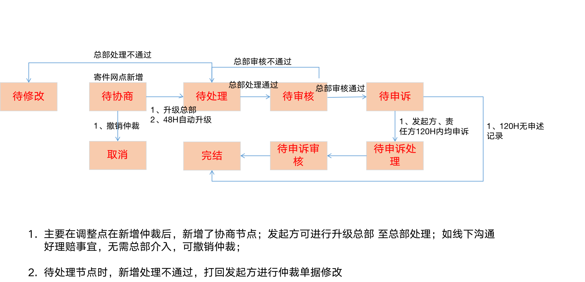
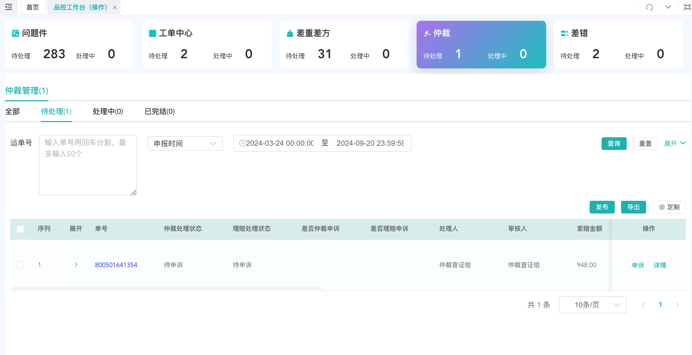

# 差重差方如何申报

## 一、适用场景

本文适用于需要在系统中进行**差重差方申报**、查看**差重差方查询**、处理**差重差方申诉**的人员。

## 二、前置条件

1. 已具备进入**服务质量**相关菜单的账号权限。
2. 流程节点人员可在操作环节查看对应数据。
3. 非流程节点人员可查询查看全部数据。

## 三、操作入口

**操作入口**：**服务质量**

相关菜单说明：

- **发布**：**差重差方申报**
- **差重差方查询**：查看**无影响申诉单**
- **差重差方申诉**：查看**有影响申诉单**，并进行**申诉处理**

## 四、操作步骤

### 4.1 发布/申诉差重差方

1. 进入**差重差方查询/申诉页**，点击**发布**。

2. 系统跳转到**发布页**后，按页面要求输入内容，并点击**发布**。

::: danger 重点提醒
登记方登记后，系统会判断是否有影响。

满足以下任一条件时，判定为**有影响需申诉**：

- （复核重量-录单重量）/录单重量>5%
- （录单重量-复核重量）/录单重量>5%
- （复核体积-录单体积）/录单体积＞5%
- （录单体积-复核体积）/录单体积＞5%
- （复核结算重量-录单结算重量）/录单结算重量>5%
- （录单结算重量-复核结算重量）/录单结算重量>5%
:::

::: warning 注意事项
- 判定为**有影响**后，进入**寄件网点72小时申诉流程**。
- **72小时内申诉**：单据立即流转到总部处理。
- **72小时未申诉**：单据在72小时后流转到总部处理。
- 判定为**无影响**时，仅做记录，流转至**差重差方查询**。
- **被投诉对象**可以是**任务机构**。
:::

3. 根据数据影响情况，查看后续流转结果。

- **差重差方申诉**：有影响数据会流转至**差重差方申诉**，责任方可申诉至总部，由总部进行审核处理。
- **差重差方查询**：无影响数据仅作为记录展示，无任何处理流程。

### 4.2 查看待办消息通知

以下场景会提醒处理网点（鲸天）：

1. **新差重差方**

## 五、操作结果

1. 发布后，系统会根据差异比例判断数据是否有影响。
2. **有影响数据**流转至**差重差方申诉**，责任方可发起申诉至总部审核处理。
3. **无影响数据**流转至**差重差方查询**，仅记录展示，无后续处理流程。
4. 有新差重差方时，处理网点会收到**待办消息通知（鲸天）**。

## 六、注意事项

::: warning 注意事项
- 流程节点人员在操作节点查看数据；非流程节点人员可查询查看全部数据。
- 有影响数据涉及**72小时申诉流程**，请按页面提示及时处理。
- 被投诉对象可以选择**任务机构**。
:::