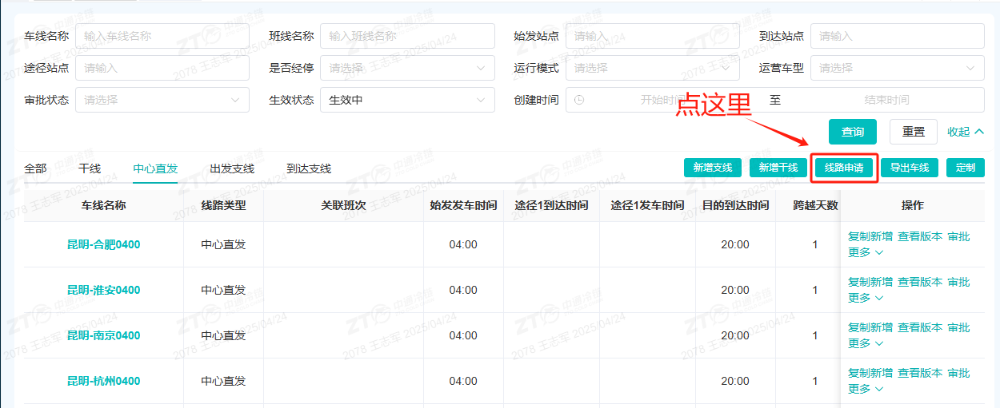

# 回单

## 一、适用场景

本文适用于网点操作人员在**鲸天系统**中办理回单相关操作，包括：

- **纸质回单**录单登记；
- **电子回单**查询、登记、上传与编辑；
- 回单操作异常处理与常见问题查询。

**文档名称**：中通冷链回单操作说明书
**适用对象**：网点操作人员
**使用系统**：鲸天系统

## 二、前置条件

### 2.1 账号与权限

操作账号需拥有以下权限：

- **回单录单**
- **回单查询**
- **回单上传**
- **回单编辑**

如权限不足，请联系系统管理员开通。

### 2.2 数据与材料准备

1. 电脑正常联网，可稳定访问**鲸天系统**。
2. 办理**纸质回单**前，需准备实体回单单据。
3. 办理**电子回单**前，需准备签收凭证图片，用于系统上传。

### 2.3 名词说明

- **纸质回单**：实体单据，由收件人签字确认后生效，需在系统单独录单登记。
- **电子回单**：线上电子化签收凭证，由派件网点在系统上传登记，无需纸质单据。
- **派方**：指派件网点、派件所属网点及下属二级网点承包区，为电子回单唯一操作主体。

## 三、操作入口

### 3.1 纸质回单录单入口

**鲸天系统 → 经营管理中心 → 运单管理 → 网点录单 → 录回单**

### 3.2 电子回单登记与编辑入口

**鲸天系统 → 经营管理中心 → 运单管理 → 回单管理**

## 四、操作步骤

### 4.1 纸质回单录单

1. 登录**鲸天系统**，进入**经营管理中心 → 运单管理 → 网点录单 → 录回单**。
2. 在网点录单页面，选择**录回单**类型。
3. 输入**原运单号**或**回单号**。
4. 系统会自动带出原运单全部信息，请核对信息是否正确。

::: danger 重点提醒
原运单信息由系统自动带出，**不可手动编辑**。
:::

5. 核对无误后，点击**保存**，完成纸质回单登记。

::: tip 补充说明
办理纸质回单仅扣除**1个主单额度**。
:::

### 4.2 电子回单查询

1. 登录**鲸天系统**，进入**经营管理中心 → 运单管理 → 回单管理**。
2. 根据需要选择查询条件，例如：
   - **运单号**
   - **回单类型**
   - **回单状态**
   - **寄/派件网点**
   - **寄件时间**
3. 点击查询后，查看对应回单记录。

### 4.3 电子回单登记

1. 在**回单管理**页面查询并选中目标运单。
2. 点击**详情**，进入回单登记页面。
3. 确认当前账号为**派方**账号，并确认原运单状态为**已签收**。

::: danger 重点提醒
仅**派方**可执行电子回单登记操作，且原运单状态必须为**已签收**。
:::

4. 点击上传区域，选择签收凭证图片并上传。
5. 提交后，完成电子回单登记。

::: danger 重点提醒
同一运单仅允许留存**一条电子回单数据**。
:::

### 4.4 电子回单编辑

1. 在**回单管理**页面找到需要修改的回单记录。
2. 点击对应记录的**编辑**。
3. 重新上传图片或修改内容。
4. 确认无误后保存。

## 五、操作结果

- **纸质回单**：点击**保存**后，系统完成纸质回单登记，并扣除**1个主单额度**。
- **电子回单**：提交上传后，系统生成并留存该运单的电子回单记录。
- **电子回单编辑**：保存后，原有电子回单记录更新为最新上传或修改后的内容。

## 六、注意事项

::: danger 重点提醒
- 纸质回单录入单号后，系统自动同步原运单信息，相关字段**不可编辑**。
- 纸质回单每办理一笔，系统扣除**1个主单额度**。
- 电子回单仅支持**派方**账号操作。
- 运单状态为**已签收**后，才能登记电子回单。
- 同一运单仅允许留存**一条电子回单数据**，如内容有误，请在原记录上点击**编辑**修改。
:::

::: warning 注意事项
如出现图片上传失败，请优先检查图片格式、文件大小及网络状态后重试。
:::

## 七、常见问题

### 7.1 常见异常与处理方式

| 序号 | ❌ 异常现象 / 报错提示 | 🔍 常见原因 | 🛠️ 解决方案 |
|------|-------------------------------|-----------------|--------------------|
| 1 | 录入运单号后无法带出原单信息 | 运单号/回单号输入错误，或单号不存在 | 仔细核对单号，确认无误后重新输入 |
| 2 | 无法发起电子回单登记 | 当前登录账号不属于派方，或运单未完成签收 | 1. 使用派方网点账号操作；2. 等待运单完成签收后再登记 |
| 3 | 电子回单无法重复新增 | 系统限制同一运单仅保留一条电子回单记录 | 直接对已有记录进行编辑修改即可 |
| 4 | 纸质回单保存失败 | 主单余额不足 | 前往账户充值主单额度后重新保存 |
| 5 | 图片上传失败 | 图片格式不符、文件过大、网络异常 | 检查图片格式，压缩文件大小，刷新网络后重试 |

### 7.2 Q1：纸质回单录入后可以修改运单信息吗？

A：不可以。输入单号后，系统会自动同步原运单信息，所有字段均禁止编辑。

### 7.3 Q2：纸质回单会扣除面单额度吗？

A：会。每办理一笔纸质回单，系统扣除**1个主单额度**。

### 7.4 Q3：哪些账号可以操作电子回单？

A：仅派件网点、派件所属网点、二级网点承包区等**派方**账号可操作。

### 7.5 Q4：运单签收前能上传电子回单吗？

A：不可以。系统要求运单状态为**已签收**时，才能进行电子回单登记。

### 7.6 Q5：电子回单登记错误怎么处理？

A：无需重新新增，直接在原有回单记录上点击**编辑**，修改后保存即可。