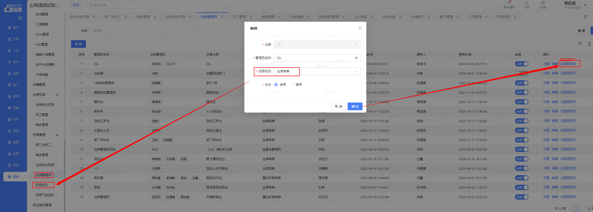
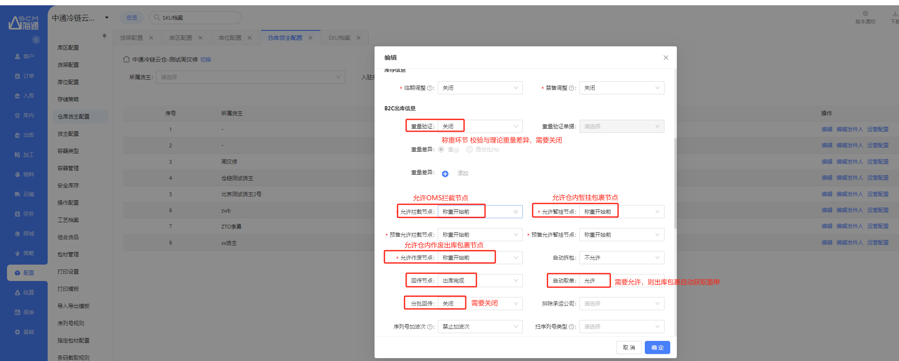
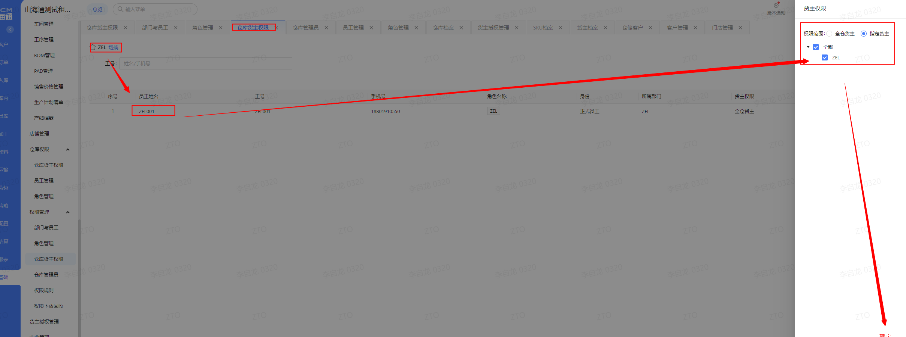
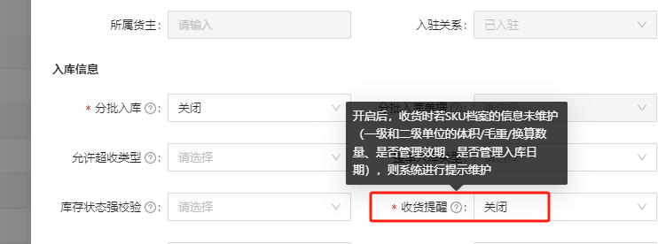
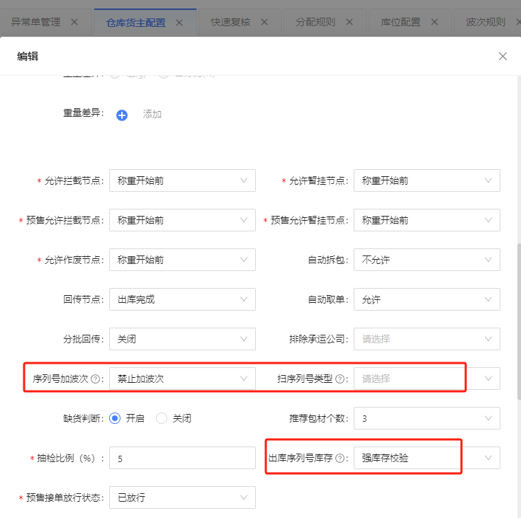

# 创建库位、SKU

## 一、适用场景

本文适用于仓库管理员及操作人员，在 WMS 系统中完成 **库位创建** 和 **SKU 档案创建/维护**。

适用情况包括：

1. 仓库已完成基础组织架构配置后，需要创建物理库位，用于入库上架、出库拣货等作业。
2. 需要维护货品基础档案（SKU），用于收货、质检、效期管理、序列号管理等作业环节。
3. 迁仓时需要保留原有库位编码，或开新仓时需要新增库位。
4. 首次入库新品需要进行 SKU 相关信息维护。

## 二、前置条件

操作前请确认：

- 已完成 **仓库、货主、员工** 的创建。
- 已明确库位与货架的物理布局。
- 已准备好库位编码方案。
- 如需迁仓，请准备《库位配置导入.xlsx》模板。
- 如需更新现有库位，请准备《库位配置更新模版.xlsx》。
- 如需通过上游同步 SKU，请确认 OMS 与 WMS 的接口同步正常。
- 如需首次入库新品维护，请确认仓库货主配置中已开启收货提醒。

## 三、操作入口

- 创建库位入口：**系统管理 -> 基础资料 -> 库位管理**
- 创建 SKU 入口：**系统管理 -> 基础资料 -> SKU档案**

## 四、操作步骤

### 4.1 创建库位

#### (1) 添加货架

1. 进入 **系统管理 -> 基础资料 -> 库位管理**。
2. 按仓库实际物理布局添加货架。

#### (2) 添加库区

1. 在货架下添加库区。
2. 按仓库作业规划设置库区，例如拣选区、存储区等。

#### (3) 创建库位

可根据实际场景选择 **导入库位** 或 **手动添加库位**。

##### 方式一：导入库位

适用于迁仓场景，可通过导入方式使用原有库位编码。

1. 在 **库位管理** 中选择导入库位。
2. 按模板填写库位信息。
3. 上传模板并执行导入。
4. 导入后查看导入结果。

查看导入结果：

::: tip 模板说明
导入模板请至钉钉文档查看附件《库位配置导入.xlsx》。

更新模板请至钉钉文档查看附件《库位配置更新模版.xlsx》。
:::

##### 方式二：手动添加库位

适用于开新仓场景。手动添加库位时，系统会自动编码。

1. 在 **库位管理** 中选择手动添加库位。
2. 按页面要求填写库位信息。
3. 保存后完成库位创建。

#### (4) 库位相关参数说明

| **库位参数** | **意义** |
|----------------|----------|
| 库位类型 | 统一选择"库存"，目前分配逻辑中只分配库存类型库位。收货、发货、加工类型需要移库到库存类型。 |
| 库存种类 | 用于对库位整库位限制业务类型。可以作为库位冻结使用。可以对特定库位库存特殊限制。 |
| 忽略容量 | 忽略容量后，就不会在入库定位时因库位剩余容量不足而跳过该库位。 |
| 巷道编码 | 填了巷道编码可以应用在：包裹汇单筛选包裹、波次规则按巷道分别创建拣选任务。  |
| 存储策略 | 关联存储策略后，可限制库位可存入货品属性。货品的多种属性包括效期、品类数、ABC分配、批次号等。范围控制：存入库位的库存范围。  |
| 动线号 | 上架动线号、拣货动线号、盘点动线号：用于在任务明细中排序库位动线。 |
| 绑定货主/绑定SKU | 绑定货主、SKU，会在定位、分配环节优先分配。如收货定位优选绑定库位，如绑定库位剩余容量不足，则会就近寻找空库位。  |

### 4.2 创建 SKU

#### (1) 方式一：上游通过接口同步 SKU

上游 OMS 系统通过接口推送 SKU 档案到 WMS，这是推荐的标准化方式。

#### (2) 方式二：手动创建 SKU

也可以在 WMS 中手动创建 SKU，用于应急场景，确保先把货收进来。

::: warning 注意事项
SKU 尽量不要在 WMS 手动创建，推荐由 OMS 推送，保证数据一致性。
:::

#### (3) 首次入库新品维护

1. 在仓库货主配置中开启收货提醒。
2. 首次入库时，系统会触发新品维护。
3. 按页面提示维护新品相关信息。

#### (4) SKU 中需要注意的配置

#### (5) SKU 相关参数说明

| **SKU属性参数** | **意义** |
|-------------------|----------|
| 行业属性 | 设置收货需要采集的信息。  |
| 类别、ABC分类 | 可用于定位库位与库位属性匹配。 |
| 单位尺寸 | 用于推荐包材、校验库位可存储商品数量时应用。 |
| 托规 | 会根据托规自动拆分多条收货明细，并创建多条上架任务明细，并为每次上架创建一个虚拟托盘码。 |
| 包装单位条码 | 扫描包装单位条码也可以收货。仅是通过扫描包装单位条码关联SKU编码，并不会将扫描单位记录到收货明细中。所以意义不大，仅便捷操作。 |
| 序列号管理/序列号规则 | 是否需要管理序列号、在哪些作业环节管理、序列号的截取规则。序列号其他配置参数在仓库货主配置中设置。  |
| 效期相关字段 | 失效日期 - 临期预警天数 = 临期日期；失效日期 - 禁售天数 = 禁售日期。库存到达临期日期自动转变为临期状态，到达禁售日期自动转变为禁售状态。  |

## 五、操作结果

完成后应达到以下结果：

1. **货架、库区、库位** 创建完成，库位可用于入库定位、出库分配、移库、盘点等作业。
2. **SKU 档案** 创建或同步完成，收货、上架、拣货、效期管理、序列号管理等环节可正常识别货品。
3. 如开启首次入库新品维护，首次入库时可根据提醒维护新品信息。
4. 如配置效期相关字段，库存到达对应日期后会按规则转变为 **临期状态** 或 **禁售状态**。

## 六、注意事项

::: danger 重点提醒
**库位类型** 统一选择 **"库存"**。目前分配逻辑中只分配库存类型库位，收货、发货、加工类型库位需要移库到库存类型后才能正常使用。
:::

::: warning 注意事项
- **库存种类** 可用于对库位整库位限制业务类型，也可以作为库位冻结使用。
- 开启 **忽略容量** 后，入库定位时不会因为库位剩余容量不足而跳过该库位。
- 绑定 **货主/SKU** 后，定位、分配环节会优先分配绑定库位；如绑定库位剩余容量不足，则会就近寻找空库位。
- **SKU** 推荐由上游 **OMS** 通过接口推送到 WMS，WMS 手动创建仅建议作为应急方式。
- **包装单位条码** 仅用于通过扫描包装单位条码关联 SKU 编码，不会将扫描单位记录到收货明细中。
:::

## 七、常见问题

### 7.1 Q1：库位类型如何选择？

**A**：统一选择 **"库存"** 类型。目前分配逻辑中只分配库存类型库位。收货、发货、加工类型库位需要移库到库存类型才能正常使用。

### 7.2 Q2：什么时候使用导入库位，什么时候手动添加？

**A**：

- 迁仓场景：使用 **导入库位**，可保留原有库位编码。
- 开新仓场景：使用 **手动添加库位**，系统会自动编码。

### 7.3 Q3：SKU 应该由 WMS 创建还是由 OMS 推送？

**A**：推荐由上游 **OMS** 通过接口同步 SKU 到 WMS，保证数据一致性。WMS 手动创建 SKU 仅作为应急手段，用于保证先把货收进来。

### 7.4 Q4：SKU 临期预警天数、禁售天数、收货预警天数如何使用？

**A**：

- **失效日期 - 临期预警天数 = 临期日期**
- **失效日期 - 禁售天数 = 禁售日期**
- 库位库存到达临期日期后，自动转变为 **临期状态**，前往调整单据中确认调整。
- 库位库存到达禁售日期后，自动转变为 **禁售状态**，前往调整单据中确认调整。

::: danger 重点提醒
入库日期距离失效日期小于 **禁收天数** 时，不能收货。
:::

::: warning 注意事项
入库日期距离失效日期小于 **收货预警天数** 时，收货时会提醒，但不阻断。
:::

### 7.5 Q5：条码截取规则如何使用？

**A**：作业扫描条码支持灵活截取条码，可为【冷链快递前置仓业务】打好基础。

1. 在【条码截取规则】中配置灵活截取规则。

2. 在【SKU 档案】中引用【条码截取规则】。
3. 当 **PC/PDA** 作业扫描条码时，系统会按截取规则截取条码；截取后的条码能等于“条码档案”中的某一条码，即扫描成功。

目前已支持条码截取的作业包括：**收货、上架、散单拣货、批量拣货、多波次拣货、库存查询、直接移库** 等。

## 八、常见异常与处理

| **序号** | **异常现象** | **常见原因** | **解决方案** |
|----------|----------------|----------------|----------------|
| 1 | 导入库位失败/部分失败 | 导入模板格式不正确或数据缺失 | 检查导入模板是否按格式填写，必填项是否填写完整 |
| 2 | 入库定位不到库位 | 库位类型未设为"库存"或库位容量已满 | 确认库位类型为"库存"；如容量限制可开启"忽略容量" |
| 3 | 收货提醒触发但无法维护新品 | SKU未创建或仓库货主配置未开启收货提醒 | 先手动创建SKU应急，同时检查收货提醒开关 |