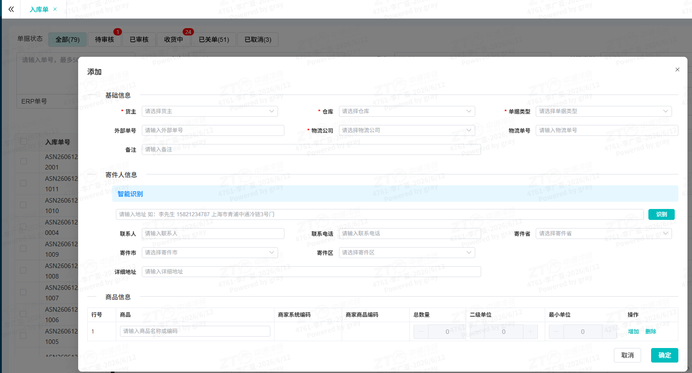

# 单据销售单(2C)

## 一、适用场景

本文适用于在 **OMS** 中处理 **销售单(2C)** 的场景：

- **ERP客户**：ERP 完成对接后，在 ERP 创建 **销售单(2C)**，并同步到 **OMS**。
- **非ERP客户**：手动在 **OMS** 创建或导入 **销售单(2C)**。

## 二、前置条件

操作前请确认以下事项：

- 已具备 **OMS订单中心** 相关菜单权限。
- ERP客户需已完成 **ERP 与 OMS 对接**。
- 非ERP客户需准备好创建或导入 **销售单(2C)** 所需信息。
- 商品、货主、仓库、单位等基础资料需已维护完成。

**配套工具/链接**：

- 🌐 官方系统登录入口：👉 [[出库单（2B)-鲸天系统](https://wms.ztocc.com/app/#/send/issue)]

## 三、操作入口

**系统功能路径**：`登录系统` -> `进入左侧菜单栏` -> `[OMS订单中心]` -> `[出库管理]` -> `[销售单(2C)]`

**快捷直达链接**：👉 [[销售单（2C）-鲸天系统](https://wms.ztocc.com/app/#/send/sellOrder)]

## 四、操作步骤

### 4.1 业务流程图

### 4.2 场景一：ERP客户>出库单(2B)

1. **ERP同步销售单(2C)->OMS**

   ERP客户在 **ERP** 中创建 **销售单(2C)**，系统同步 **销售单(2C)** 到 **OMS**。

   

2. **WMS对接**

   **OMS** 接收 **销售单(2C)** 后，自动同步到 **WMS** 中。

3. **入库单回传**

   **WMS销售单(2C)** 出库完成后，自动回传出库信息到 **OMS**；再由 **OMS** 回传出库信息到 **ERP**。

### 4.3 场景二：非ERP客户>出库单(2B)

1. **OMS创建出库单(2B)**

   客户在 **OMS** 中创建或导入 **销售单(2C)**。

   1. 点击 **新增** 或 **导入**。
   2. 按要求填写信息：

      - 头表信息：**货主**、**仓库**、**单据类型**、**外部单号**、**物流公司**、**物流单号**、**备注**、**联系人**、**联系电话**、**收件省**、**收件市**、**收件区**、**详细地址**
      - 明细信息：**商品**、**商家系统编码**、**商家商品编码**、**总数量**、**二级单位**、**最小单位**

   3. 新增或导入文件中的必填信息填写完成后，点击保存，返回 **销售单(2C)** 列表。

   

2. **WMS对接**

   1. 点击 **审核**：**OMS** 审核 **销售单(2C)** 后，系统自动同步到 **WMS** 中。

      

   2. 点击 **编辑**：新增完成后，如需调整信息，可点击 **编辑** 重新编辑 **销售单(2C)**。
   3. 点击 **复制**：如需创建相同类型的订单，可复制新增或导入的 **销售单(2C)**；复制后支持重新编辑 **销售单(2C)** 信息。
   4. 点击 **取消**：如创建入库单有问题，可点击 **取消** 按钮，取消 **销售单(2C)**。

3. **入库单回传**

   **WMS销售单(2C)** 出库完成后，自动回传出库信息到 **OMS**；再由 **OMS** 回传出库信息到 **ERP**。

## 五、操作结果

- ERP客户：**ERP** 创建的 **销售单(2C)** 成功同步到 **OMS**，并自动同步到 **WMS**。
- 非ERP客户：在 **OMS** 新增或导入 **销售单(2C)** 后，审核通过并同步到 **WMS**。
- **WMS销售单(2C)** 出库完成后，出库信息自动回传到 **OMS**，再由 **OMS** 回传到 **ERP**。

## 六、注意事项

::: warning 注意事项
- 创建或导入 **销售单(2C)** 时，需确保必填信息填写完整。
- 若新增完成后发现信息需要调整，可使用 **编辑**。
- 若需要创建相同类型订单，可使用 **复制**，复制后支持重新编辑。
- 若创建的单据有问题，可使用 **取消**。
:::

::: danger 重点提醒
- 导入时如提示商品单位、单据号、商品归属等异常，应先检查基础资料或导入数据后再重新导入。
- **OMS仓库开启库存管理** 后，OMS 接单或审核时会校验 **可用库存** 是否足够；校验的是 **可用库存**，不是 **总库存**。
- 若库存不足，单据状态会更新为 **缺货**，且不会推送 **WMS**。
:::

## 七、常见问题

| 序号 | ❌ 异常现象 / 报错提示 | 🔍 常见原因 | 🛠️ 解决方案 |
|------|-------------------------------|-----------------|--------------------|

### 7.1 Q1：导入时提示商品二级单位未维护，怎么办？

**A**：需要在 **WMS** 中维护商品单位。维护后，商品单位会自动同步到 **OMS**，可重新导入入库单。

### 7.2 Q2：导入时提示单据【xxx】已存在，怎么办？

**A**：当前导入的货主单据号已存在，不能重复导入。需要更新单据号后重新导入。

### 7.3 Q3：导入时提示商品【xxx】不属于货主【xxx】，怎么办？

**A**：导入的商品明细中的商品不是导入货主的商品。需要检查导入数据信息，更新后重新导入。

### 7.4 Q4：ERP下发单据或新增单据审核后，OMS单据状态为什么是缺货，但OMS中库存足够？

**A**：**OMS仓库开启库存管理** 后，在 **OMS** 接单或审核后会校验 **可用库存** 是否足够。若不足，则单据状态更新为 **缺货**，不推送 **WMS**。校验 OMS 库存是否足够时，校验的是 **可用库存**，不是 **总库存**。

### 7.5 Q5：缺货状态下单据如何处理？

**A**：需与客户确认是否继续出货：

1. 若继续出货：通知客户补货后重新审核，单据即可同步到 **WMS** 继续出货。
2. 若不继续出货：取消单据。