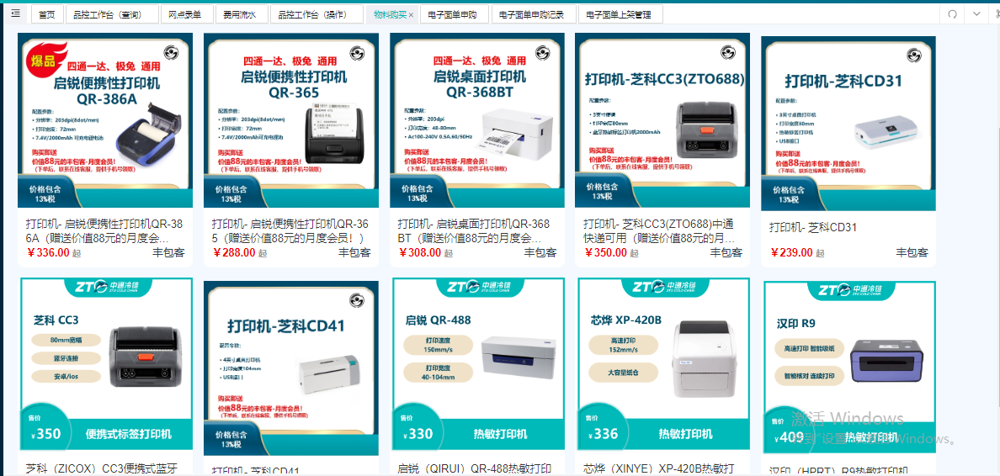
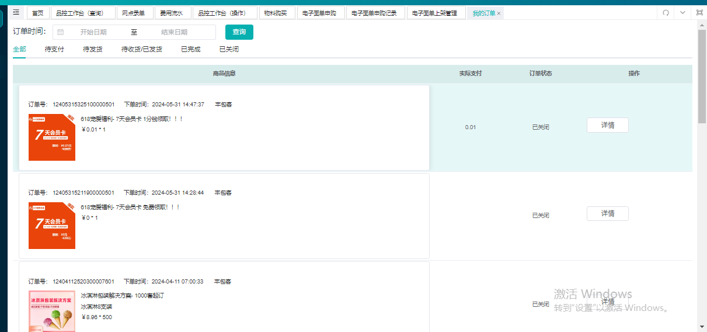

# 如何物料购买充值？

## 一、适用场景

本文适用于网点在系统内进行以下操作：

- 购买或充值电子面单，包括鲸天系统内面单、电商渠道面单。
- 查询电子面单申购记录。
- 撤销已购买的电子面单。
- 对下属机构单独定价并上架面单。
- 购买日常经营所需的包装耗材、各类设备。
- 查询物料申购记录、撤销购买、确认收货、查看物流轨迹。

## 二、前置条件

- 已登录对应系统账号。
- 账号具备对应菜单和操作权限。
- 购买电子面单前，请确认上级库存余额、当前购买网点账户余额满足购买要求。
- 购买物料前，请确认收件地址符合商品限售区域要求。

## 三、操作入口

- 电子面单申购入口：**经营管理中心 > 电子面单 > 电子面单申购**
- 电子面单申购记录查询入口：**经营管理中心 > 电子面单 > 电子面单申购记录**
- 电子面单上架入口：**经营管理中心 > 电子面单 > 电子面单上架**
- 物料购买入口：**鲸天经营管理中心 > 物料商城 > 物料购买**
- 物料申购记录查看入口：**经营管理中心 > 物料商城 > 我的订单**

## 四、操作步骤

### 4.1 电子面单申购

1. 进入 **经营管理中心 > 电子面单 > 电子面单申购**。

   

2. 根据使用场景选择需要购买或充值的面单类型。

   - **鲸天主单**：适用于网点在鲸天系统内进行录单，扣除主单使用。
   - **鲸天子单**：适用于网点在鲸天系统内进行录单，扣除子单使用。
   - **快手主单**：适用于网点开展快手渠道的客户，给客户进行主单充值操作。
   - **抖音主单**：适用于网点开展抖音渠道的客户，给客户进行主单充值操作。
   - **菜鸟主单**：适用于网点开展淘宝渠道的客户，给客户进行主单充值操作。
   - **客户主单**：适用于网点自行开展的客户，客户在自己的系统内或者商家平台进行打单操作场景下，网点给客户进行主单充值操作。

3. 按页面要求填写购买数量等信息，并提交申购。

::: danger 重点提醒
面单购买会进行以下校验：

- **上级库存余额校验**：一级网点向所属财务中心申购面单、二级网点向所属一级网点申购面单时，系统会判断 **上级库存余额** 是否满足此次购买数量。

  例如：那曲一级网点 **鲸天主单** 当前库存数量为 **1000**，若那曲二级网点购买 **鲸天主单** 数量为 **1001**，则会提示库存不足。

- **当前购买网点账户余额校验**：财务中心、一级网点、二级网点向所属上级申购面单时，系统会判断 **当前购买网点账户余额** 是否满足此次购买数量。

  例如：那曲一级网点账户可用余额 **1000 元**，锁机金额 **800 元**，若那曲一级网点购买 **鲸天主单** 数量 **201**，单价 **1**，则 **1000 - 201\*1 < 800**，会提示余额不足。
:::

### 4.2 查询面单申购记录

1. 进入 **经营管理中心 > 电子面单 > 电子面单申购记录**。

   

2. 在页面中查询网点申购明细。

### 4.3 撤销已购买的面单

1. 进入面单申购记录页面，找到需要撤销的购买记录。
2. 在满足撤销条件时，按页面操作进行撤销。

::: danger 重点提醒
撤销购买操作有以下限制：

- **仅允许当天撤销**。
- 撤销数量 **不可大于面单库存数量**。

例如：那曲一级网点早晨 **9 点** 购买了 **100 个鲸天主单**，下午 **19 点** 时，鲸天主单库存还剩余 **10 个**，此时进行撤销，会提示库存不足。
:::

### 4.4 电子面单上架并设置下属机构价格

1. 进入 **经营管理中心 > 电子面单 > 电子面单上架**。

   

2. 按页面要求设置对下级售卖的价格、起订量等信息。

   

::: tip 说明
上级可对下级进行售卖价格、起订量设置。

例如：**西藏财务中心** 可对下属的一级网点进行定价；**那曲一级网点** 可对下属的二级网点进行定价。
:::

::: tip 说明
上架操作支持财务中心、一级网点对下属机构区别定价。

例如：**西藏财务中心** 上架 **鲸天主单** 时，指定 **那曲一级网点** 价格为 **1 元**；同时上架 **鲸天主单**，网点选择全部，价格为 **2 元**。则只有 **那曲一级网点** 在进行 **鲸天主单** 申购时，价格为 **1 元**；非那曲一级网点进行 **鲸天主单** 申购时，价格为 **2 元**。
:::

### 4.5 购买包装耗材、各类设备

1. 进入 **鲸天经营管理中心 > 物料商城 > 物料购买**。

   

2. 选择需要购买的日常经营所需包装耗材或各类设备。
3. 填写收件地址等购买信息。
4. 按页面提示提交购买。

::: danger 重点提醒
- 加盟网点 **不允许购买**，需要联系省公司进行购买。
- 购买时，系统会根据网点输入的收件地址进行 **限售区域校验**。

例如：西安泡沫箱限购区域为 **陕西**，若网点输入的收件地址为 **上海**，则会提示限售区域不可购买。
:::

### 4.6 查看物料申购记录

1. 进入 **经营管理中心 > 物料商城 > 我的订单**。

   

2. 在订单列表中查看物料申购记录。
3. 根据订单状态进行后续操作：
   - **撤销购买**：商家未操作发货时，网点可进行撤销购买操作。
   - **收货完成**：网点收到货物后，可点击 **收货完成**；若一直未操作，在有签收轨迹 **7 天后**，会自动收货完成。
   - **物流轨迹**：商家发货后，网点可查看货物的物流轨迹。

## 五、操作结果

- 电子面单申购成功后，对应面单库存会增加，并按规则扣减账户余额。
- 电子面单撤销成功后，会将相应的面单库存、账户余额进行返还。
- 电子面单上架成功后，下属机构可按设置的价格、起订量进行申购。
- 物料购买成功后，可在 **我的订单** 中查看订单记录。
- 商家发货后，网点可查看物流轨迹；收到货物后可操作 **收货完成**。

::: tip 说明
电子面单撤销成功后，会将相应的面单库存、账户余额进行返还。

例如：那曲一级网点向西藏财务中心申购了 **100 个面单**，花费 **100 元**；撤销成功后，会给那曲一级网点面单账户扣减 **100 个鲸天主单**，网点账户返还 **100 元**；西藏财务中心增加 **100 个鲸天主单**，财务中心账户扣减 **100 元**。
:::

## 六、注意事项

::: danger 重点提醒
- 面单购买时，需满足 **上级库存余额** 和 **当前购买网点账户余额** 校验。
- 面单撤销 **仅允许当天撤销**，且撤销数量 **不可大于面单库存数量**。
- 加盟网点 **不允许购买** 物料，需要联系省公司进行购买。
- 物料购买会进行 **限售区域校验**，请确保收件地址符合商品限售区域。
:::

::: warning 注意事项
物料订单在有签收轨迹后，若网点一直未操作 **收货完成**，系统会在 **7 天后** 自动收货完成。
:::

## 七、常见问题

### 7.1 面单购买提示库存不足怎么办？

请确认上级库存余额是否满足本次购买数量。若购买数量大于上级当前库存，系统会提示库存不足。

### 7.2 面单购买提示余额不足怎么办？

请确认当前购买网点账户余额是否满足购买要求，并注意锁机金额校验。

### 7.3 已购买的面单可以撤销吗？

可以，但撤销操作 **仅允许当天撤销**，且撤销数量 **不可大于面单库存数量**。

### 7.4 物料订单什么时候可以撤销？

在商家未操作发货时，网点可进行撤销购买操作。

### 7.5 物料收到后需要怎么操作？

网点收到货物后，可在 **经营管理中心 > 物料商城 > 我的订单** 中点击 **收货完成**。若一直未操作，在有签收轨迹 **7 天后**，会自动收货完成。