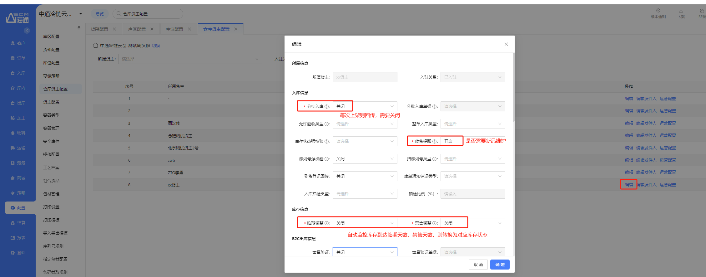
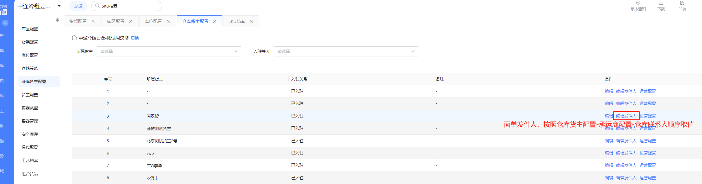
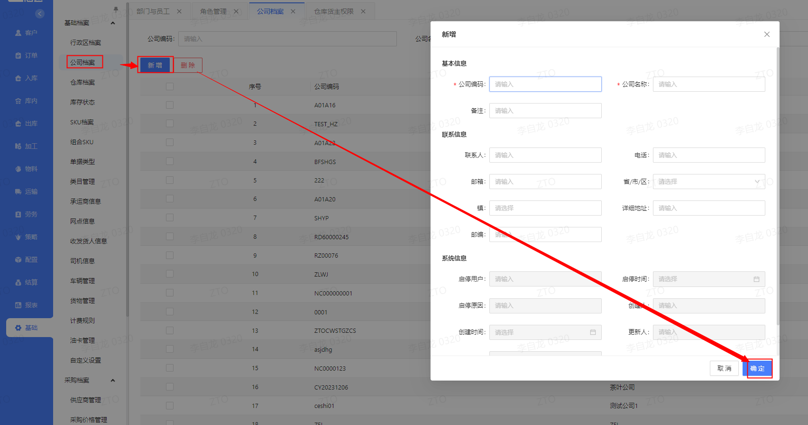
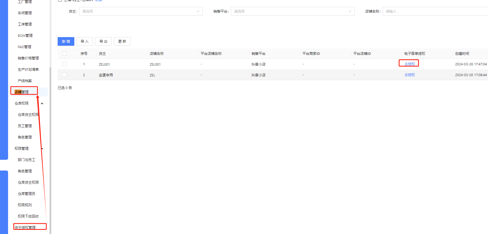
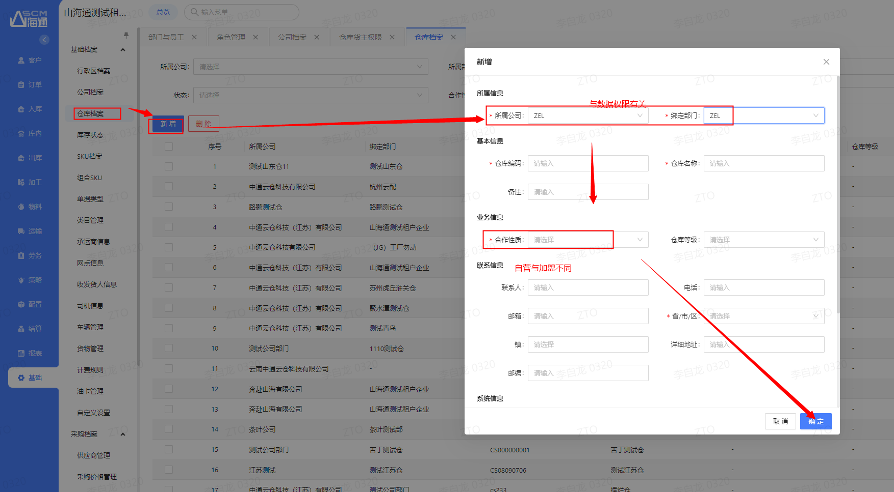

# 仓库初始配置（面向仓库）

## 一、适用场景

本文档面向**仓库管理员**。新仓库上线前，需要按照本文的配置清单逐项完成 **WMS 系统初始配置**，确保仓库能够顺利投入运营。

## 二、前置条件

- **账号与权限**：需总部管理员先完成**仓库、货主、员工**创建，并为仓库管理员分配对应的**权限规则**。
- **系统环境**：仓库电脑需安装 **WCS 客户端**及第三方打印插件。
- **参考文档**：部分配置项需参考《配置规则策略》《创建库位SKU》《包装方案》《云平台取号打印》等文档。

## 三、操作入口

请以系统实际菜单路径为准，按下方配置清单中的配置项进入对应菜单完成设置。

已知相关入口包括：

- **仓库权限-员工管理/角色管理**
- **配置-仓库货主配置**

## 四、核心名词解释

- **权限规则**：菜单权限集合，用于统一赋予仓库管理员，定义仓库管理员的最大权限集合。管理员可以继续分配给仓库员工。
- **仓库货主配置**：仓库维度下的货主级业务参数配置。仓库管理员仅可编辑发件人（即面单寄件人），其他参数由总部管理员配置。
- **容器类型**：复核环节需要扫描“工作台”类型容器。需要先在容器类型中配置“基本类型-工作台，使用环节-出库”。
- **工作台配置**：根据仓库实际复核工作台创建，可用于计件和追责。
- **WCS**：仓库本地打印客户端，用于打印面单、拣选单、上架单等。需下载安装并配置插件。

## 五、操作步骤

1. 确认总部管理员已完成**仓库、货主、员工**创建，并已给仓库管理员分配权限规则。
2. 确认仓库电脑已安装 **WCS 客户端**及第三方打印插件。
3. 按下方《仓库初始配置清单》中的序号逐项检查并完成配置。
4. 配置过程中，如涉及规则、库位、SKU、包装、打印等内容，按对应说明参考相关文档操作。

### 5.1 仓库初始配置清单（共15项）

| **序号** | **配置项** | **截图** | **说明** |
|----------|-------------|----------|----------|
| 1 | 创建员工、角色、仓库货主权限 |  | 参考《1. 创建仓库、货主、员工》。仓库菜单权限集：不给仓库下放新增货主仓库的配置，仅下放业务相关权限。 |
| 5 | 仓库货主配置 |  | 仅可编辑发件人，即面单寄件人。 |
| 9 | 定位规则 |  | 入库上架定位规则，参考《3. 配置规则策略》。 |
| 10 | 定位条件 |  | 仓库货主单据可用哪种定位规则，参考《3. 配置规则策略》。 |
| 11 | 分配规则 |  | 出库分配库存规则，参考《3. 配置规则策略》。 |
| 12 | 分配条件 |  | 仓库货主单据可用哪种分配规则，参考《3. 配置规则策略》。 |
| 13 | 波次规则 |  | 需注意：订单分组、按巷道拆分任务、分配规则、打印节点、波次类型、任务数拆分等。参考《3. 配置规则策略》。 |
| 14 | 容器类型 |  | 复核需要扫描工作台。需配置工作台类型的容器类型：基本类型-工作台，使用环节-出库。 |
| 15 | 工作台配置 |  | 创建复核工作台。根据仓库实际复核工作台添加，可用于计件和追责。 |
| 19 | 货架、库区、库位配置 |  | 参考《2. 创建库位、SKU》。 |
| 20 | SKU档案 |  | 参考《2. 创建库位、SKU》。 |
| 24 | 打印设置 | （无截图） | 设置作业流程节点使用的打印模板。参考《13. 云平台取号打印》。 |
| 27 | 下载WCS、插件、更新模板、保存打印机设置 |  | 仓库电脑需安装 WCS 客户端及第三方插件用于打印。参考《13. 云平台取号打印》。 |
| 28 | 指定包装方案 | （无截图） | 设置仓库订单特定货品结构匹配的包装方案。参考《11. 包装方案》。 |
| 29 | 包装方案 | （无截图） | 设置仓库使用的包装方案。参考《11. 包装方案》。 |

## 六、操作结果

完成以上配置后，仓库应具备以下基础能力：

- 仓库管理员可按权限管理仓库员工、角色及相关业务权限。
- 仓库货主的面单寄件人可按权限维护。
- 入库上架可使用已配置的**定位规则/定位条件**。
- 出库可使用已配置的**分配规则/分配条件**。
- 波次、容器类型、工作台、库区库位、SKU、打印、包装方案等基础配置已完成。
- 仓库电脑可通过 **WCS 客户端**及插件进行打印相关操作。

## 七、注意事项

::: danger 重点提醒
- **仓库货主配置**中，仓库管理员仅可编辑**发件人**，即**面单寄件人**。
- 其他入库、库存、B2C 出库等重要业务参数由总部管理员在**配置-仓库货主配置**中完成。
- 仓库菜单权限集：不给仓库下放新增货主仓库的配置，仅下放业务相关权限。
:::

::: warning 注意事项
- **波次规则**配置时需关注：订单分组、按巷道拆分任务、分配规则、打印节点、波次类型、任务数拆分等。
- 复核环节需要扫描工作台，需提前配置工作台类型的容器类型：**基本类型-工作台，使用环节-出库**。
- **工作台配置**需根据仓库实际复核工作台添加，可用于计件和追责。
- 仓库电脑需安装 **WCS 客户端**及第三方插件，用于打印面单、拣选单、上架单等。
:::

## 八、常见问题

### 8.1 Q1：配置项中序号不连续，是否有遗漏？

**A**：没有遗漏。源配置清单中序号不连续（**1→5→9→10...**），因为部分非仓库管理员负责的配置项已由总部管理员完成，不在此清单中。仓库管理员只需按表中序号逐项完成即可。

### 8.2 Q2：仓库管理员可以编辑仓库货主配置中的哪些参数？

**A**：仓库管理员仅可编辑**发件人**（即面单寄件人）参数。其他入库、库存、B2C 出库等重要业务参数由总部管理员在**配置-仓库货主配置**中完成。

### 8.3 Q3：WCS 打印失败怎么办？

**A**：常见原因是 **WCS 未安装或未连接**。请检查 WCS 右上角是否显示“已连接”；如未连接，需重新安装插件。

### 8.4 Q4：复核无法扫描工作台怎么办？

**A**：常见原因是**容器类型**或**工作台配置**未完成。请检查容器类型是否已配置“**基本类型-工作台**”，并确认工作台配置是否已创建。

### 8.5 Q5：仓库员工权限不足怎么办？

**A**：常见原因是仓库管理员未下放相应权限。仓库管理员可在**仓库权限-员工管理/角色管理**中分配权限。