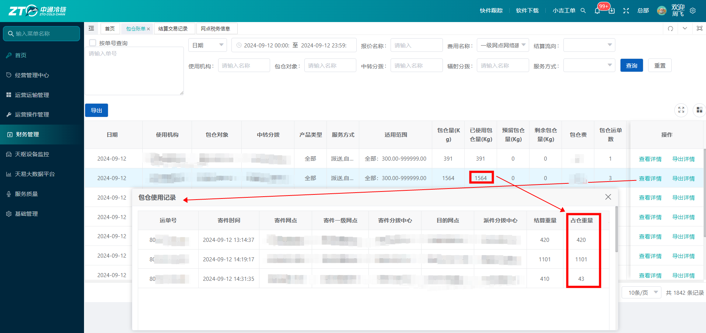
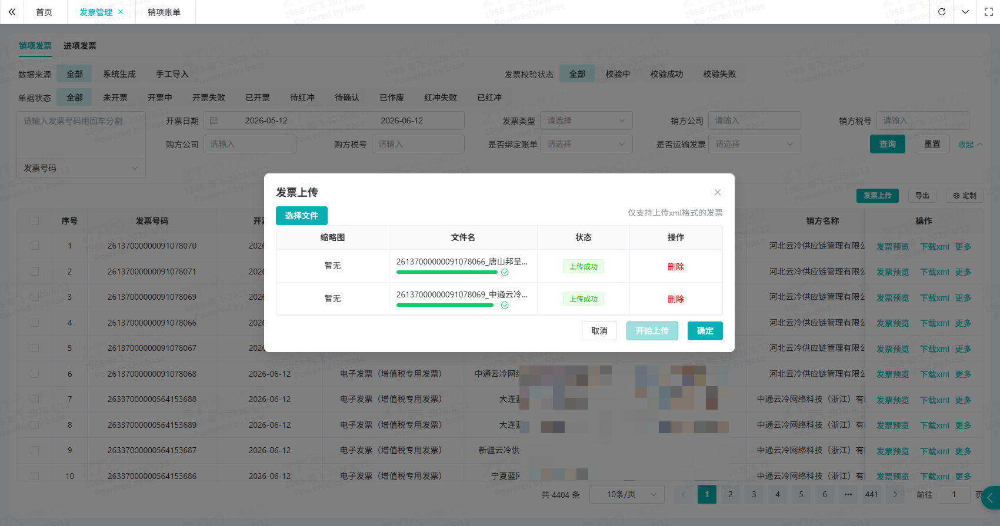
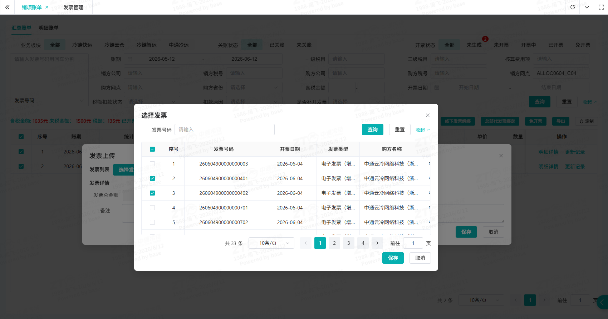

# 发票绑定

## 一、适用场景

本文适用于网点进行**线下发票绑定账单**、**发票红冲**等操作。

网点日常经营产生的**派件费**、**二级进港服务费**等收入，会按账期统一归集并映射成对应的开票税目，用于实现费用账单、发票单据、财务数据一一对应，满足网点财务对账、进项 / 销项发票归集需求，减少票据分散、账票不符、开票主体错误、税目错误等问题。

**核心名词：**

- **线下发票绑定**：将线下开具的电子发票与对应账单进行关联匹配。

## 二、前置条件

- **账号与权限要求**：权限角色需包含 **[网点财务]**，若无权限请联系系统管理员。
- **物理/环境准备**：无。
- **配套工具/链接**：
  - 🌐 官方系统登录入口：👉 [[点击进入系统](https://cwzx.ztocc.com/dashboard)]

## 三、操作入口

### 3.1 线下开票绑定账单

- **系统功能路径**：`登录系统` -> `进入左侧菜单栏` -> **[发票板块]** -> **[销项账单]/[发票管理]**
- **快捷直达链接**：👉 [[点击一键直达该页面](https://cwzx.ztocc.com/app/#/middlePlatform/salesInvoice)]

### 3.2 发票红冲

- **系统功能路径**：`财务中心` -> **[发票板块]** -> **[发票管理]**
- **快捷直达链接**：👉 [[点击一键直达该页面](https://cwzx.ztocc.com/app/#/middlePlatform/manage)]

## 四、操作步骤

### 4.1 场景一：线下开票绑定账单

1. **查询应开发票信息**

   进入页面后，在右上角查询条件中选择 **未生成**，点击 **查询**，查看应开发票的税目和金额。

   核对无误后，登录税局开票。

   

2. **上传发票验真**

   进入页面后，点击右上角 **发票上传**。

   在弹框中点击 **选择文件**，选择 **xml 格式**的电子发票进行上传。

   点击 **开始上传**，系统会校验上传文件的格式及内容是否满足条件。

   待状态更新为 **上传成功** 后，点击 **确定**，保存上传的发票文件。

   发票上传成功后，检查发票验真状态；待状态显示为 **校验成功** 后，再继续下一步操作。

   

3. **发票绑定账单**

   进入页面后，勾选待绑定发票的账单，点击右上角 **线下发票绑定**。

   在弹框中点击 **选择发票**。

   在发票选择弹框中，勾选对应发票后保存。

   点击 **解析发票**，系统会将发票的金额明细自动分摊到所选择的账单中。

   分摊成功后，点击 **保存**，完成发票绑定。

   

   

### 4.2 场景二：发票红冲

1. 进入 **发票管理** 页面后，点击右上角 **发票上传**。

2. 在弹框中点击 **选择文件**，选择 **xml 格式**的电子发票进行上传。

3. 点击 **开始上传**，系统会校验上传文件的格式及内容是否满足条件。

4. 待状态更新为 **上传成功** 后，点击 **确定**，保存上传的发票文件。

5. 发票上传成功后，检查发票验真状态；待状态显示为 **校验成功** 后，再继续下一步操作。

   ::: tip 提示
   红票上传方式与上一步蓝票上传方式一致。
   :::

6. 红票验真成功后，系统会自动红冲对应蓝票。

7. 查看上传的红票以及对应蓝票的单据状态，确认状态从 **已开票** 变为 **已红冲**。

## 五、操作结果

- 线下发票绑定完成后，发票与所选账单完成关联，发票金额明细已分摊到对应账单中。
- 发票红冲完成后，对应蓝票单据状态从 **已开票** 变为 **已红冲**。

## 六、注意事项

::: danger 重点提醒
- 上传发票时，请选择 **xml 格式**的电子发票文件。
- 税局下载的文件通常可能是 **zip 压缩包**，需要先解压，再选择其中的 **xml 文件**上传。
- 发票上传后，需等待验真状态为 **校验成功** 后，才能继续绑定账单。
- 绑定账单时，发票的购销方公司信息需与账单公司一致。
:::

## 七、常见问题

### 7.1 常见异常与处理方式

| 序号 | ❌ 异常现象 / 报错提示 | 🔍 常见原因 | 🛠️ 解决方案 |
|------|-------------------------------|-----------------|--------------------|
| 1 | 查询不到待开发票的账单 | 1. 账单未关账
2. 同时管理多家公司的账单时，登录人的角色权限缺少关联公司的数据权限。 | 1. 联系总部财务确认账单的关账状态

2. 联系管理员开通权限。 |
| 2 | 上传发票文件失败、格式不支持 | 1. 上传的发票文件格式为zip压缩包。 | 1. 税局下载的文件格式通常为zip的压缩包，需解压后，选择其中的xml文件上传。 |
| 3 | 绑定账单选择发票时，发票列表为空 | 1. 上传的发票校验中或者校验失败
2. 勾选账单的公司与上传发票的购销方公司信息不一致 | 1. 若单据状态为校验中则等到校验成功后再绑定，若校验失败则根据失败原因处理发票。

2. 确认发票的购销方与账单一致，若变更过公司名称，可联系管理员协助处理。 |

### 7.2 FAQ

**Q1：发票税率开错了，已经绑定到账单上，可以重开发票重新绑定吗？**

A：可以。若未跨月，可以勾选账单后点击 **线下发票解绑**；若已经跨月，需上传对应的红票，系统会自动红冲蓝票，账单开票状态更新为 **未生成**，再上传正确的发票重新绑定。

**Q2：未及时开票，已经被总部扣了税点，还可以补开发票吗？**

A：可以。当年的账单补开发票后可以正常绑定到账单上，已扣税点联系总部财务申请税点返还。