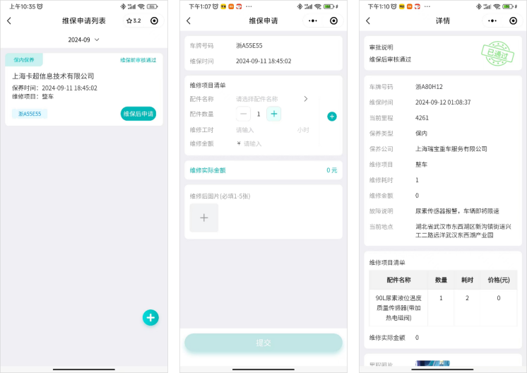

# 维保工单

## 一、适用场景

本手册适用于中通冷链全体司机，通过 **中通冷链司机版微信小程序** 完成车辆定期保养、故障维修的线上工单管理。

当车辆到达保养周期或出现故障时，司机需先线上发起 **维保前申请**，经车辆后勤专员审批通过后，再到指定站点进行维保；维保结束后，司机需线上提交 **维保后申请** 并补充凭证，完成工单闭环。

通过该流程，可实现车辆维保记录、费用、配件等信息线上留痕、统一管控。

## 二、前置条件

1. **账号与权限**
   - 使用个人微信登录 **中通冷链司机版** 小程序。
   - 司机账号默认开通 **维保申请** 权限；如找不到入口，请联系网点管理员核查。

2. **设备与权限**
   - 使用智能手机操作。
   - 需开启小程序 **相机、相册** 权限，用于拍摄并上传里程、车辆、票据等照片。

3. **数据与凭证准备**
   - 准备车辆当前 **车牌号码**、**当前里程**、**维保时间**、**维修项目**、**故障说明**、**预估维修金额** 等信息。
   - 准备上传 **里程照片**、**维修前图片**、**维修后照片** 等凭证。

4. **使用提醒**
   - 优先选择运输空档期安排维保。

::: danger 重点提醒
**禁止在运输任务途中进行车辆保养维修**。
:::

## 三、操作入口

系统路径：**中通冷链司机版小程序 → 首页 → 小工具 → 维保申请**

## 四、操作步骤

### 4.1 维保前申请

车辆进场维保或维修前，需先提交 **维保前申请**。

1. 确认车辆已达到保养周期，或存在需要维修的故障。
2. 合理规划维保时间，尽量避开运输作业时段。
3. 打开微信，搜索并进入 **中通冷链司机版** 小程序。
4. 在首页找到 **小工具** 板块，点击进入 **维保申请**。
5. 按页面要求填写维保前申请信息：
   - **车牌号码**：填写当前运营车辆号牌。
   - **当前里程**：如实填写车辆仪表盘行驶里程。
   - **保养类型**：常规保养选择 **保内**。
   - **维保时间、维修项目、故障说明**：详细填写保养项目或车辆故障问题。
   - **维修耗时、预估维修金额**：填写预估维修时长与费用。
   - **保养公司、当前地点**：系统自动带出，核对信息是否正确。
6. 上传凭证图片：
   - **里程照片**
   - **维修前图片**
7. 核对所有信息和照片，确认无误后点击 **提交**。
8. 等待车辆后勤专员审批。
9. 工单状态显示 **维保前审核通过** 后，前往指定站点开展维保作业。

::: danger 重点提醒
**里程照片、维修前图片** 均为必填，单次可上传 **1-5张**。
:::

### 4.2 维保后申请

车辆完成保养或维修后，需提交 **维保后申请**，用于补充实际维修项目、费用和凭证。

系统路径：**中通冷链司机版小程序 → 首页 → 小工具 → 维保申请**

1. 车辆完成保养或维修后，再次进入 **维保申请** 页面。
2. 在工单列表中找到已审核通过的维保前工单。
3. 点击 **维保后申请**，进入编辑页面。
4. 补充实际维保信息：
   - **维修项目清单**：选择或填写实际维修、更换的配件名称及数量。
   - **维修工时、维修实际金额**：如实填写实际耗时与结算费用。
   - **故障说明、当前地点**：根据实际情况补充或完善。
5. 上传维修后凭证图片，例如：
   - **维修现场**
   - **维修发票**
   - **配件清单**
6. 核对信息和图片，确认无误后点击 **提交**。
7. 等待车辆后勤专员二次审批。
8. 页面显示 **维保后审核通过** 后，整份维保工单办结。

::: danger 重点提醒
维修后照片为必填，需上传 **1-5张**。
:::

## 五、操作结果

1. **维保前申请** 提交后，工单进入车辆后勤专员审批环节。
2. 工单状态显示 **维保前审核通过** 后，可前往指定站点开展维保作业。
3. 维保完成后提交 **维保后申请**，等待二次审批。
4. 页面显示 **维保后审核通过** 后，维保工单完成闭环。
5. 车辆维保记录、费用、配件等信息完成线上归档。

## 六、注意事项

::: warning 注意事项
- 优先选择运输空档期安排维保，避免影响正常运输作业。
- 如 **保养公司、当前地点** 由系统自动带出，提交前请核对是否正确。
- **预估维修金额** 与 **维修实际金额** 不一致时，维保后申请按实际结算金额如实填写。
- 提交后如长时间未收到审批结果，可联系车辆后勤专员提醒审核。
:::

::: danger 重点提醒
- **维保前申请** 审批通过后，再前往指定服务站维保。
- **里程照片、维修前图片、维修后照片** 为必填凭证，缺少资料可能无法提交工单或导致审批不通过。
- 维保完成后需及时提交 **维保后申请**，否则工单无法闭环。
:::

## 七、常见问题

### 7.1 车辆维保可以在运输任务途中进行吗？

不建议。需提前规划时间，在无运输任务的空档期安排保养维修，避免影响正常运输作业。

### 7.2 保养类型默认选择“保内”就可以吗？

常规周期保养统一选择 **保内**；车辆故障维修、出保后保养根据实际情况选择对应类型。

### 7.3 里程照片、维修前后照片可以不上传吗？

不可以。**里程照、维修前后照片** 均为必填凭证，缺少资料将无法提交工单，也可能导致审批不通过。

### 7.4 维保前申请提交后，多久可以进场维保？

需等待后勤专员审批通过。工单状态显示 **维保前审核通过** 后，再前往指定服务站维保。

### 7.5 维保完成后，忘记提交维保后申请有什么影响？

工单无法闭环，维保记录、费用、配件信息无法归档，会影响车辆台账及后续维保判定。维保完成后，请及时提交 **维保后申请**。

### 7.6 预估金额和实际维修金额不一致怎么办？

在 **维保后申请** 环节，按照实际结算金额如实填写即可。后勤专员会根据票据及实际费用审核。

### 7.7 车辆出现故障，和常规保养操作流程一样吗？

流程一致。均需要先发起 **维保前申请**，审批通过后维修，完工后再提交 **维保后申请**。

## 八、常见异常与处理方式

| 序号 | 异常现象 / 报错提示 | 常见原因 | 解决方案 |
|------|---------------------------|------------|------------|
| 1 | 小程序找不到【维保申请】入口 | 账号权限未开通、小程序缓存异常 | 1. 联系网点管理员开通对应权限；2. 关闭小程序后台，重新进入刷新页面。 |
| 2 | 无法拍摄、上传照片 | 未开启小程序相机/相册权限、图片过大 | 1. 进入小程序设置，开启相机与相册权限；2. 重新拍摄清晰照片，压缩大小后再上传。 |
| 3 | 维保工单提交失败 | 网络中断、带\*必填项未填写完整 | 1. 切换稳定网络重新提交；2. 检查页面必填字段、图片是否齐全，补充完整后再次提交。 |
| 4 | 保养公司/当前地点信息错误 | 系统定位异常、基础信息有误 | 手动核对修正，或联系后勤专员更新车辆绑定站点信息。 |
| 5 | 提交后长时间未收到审批结果 | 后勤专员未处理、工单状态延迟 | 耐心等待，必要时联系车辆后勤专员提醒审核。 |
| 6 | 找不到历史维保前工单 | 筛选条件错误、工单已办结 | 在维保申请列表调整筛选条件，查看全部工单记录。 |

## 九、名词解释

- **维保申请**：小程序小工具模块内的工单功能，分为 **维保前申请** 和 **维保后申请** 两个环节。
- **保内保养**：车辆在质保周期内的常规定期保养，为日常主流保养类型。
- **维保前申请**：车辆进场维保/维修前，线上填报车辆信息、里程、故障、预估费用并提交审批的前置工单。
- **维保后申请**：车辆完成维保/维修后，补充实际维修项目、配件、费用、票据及现场照片的收尾工单。
- **维保审批**：由车辆后勤专员对前后两阶段工单进行审核，审批通过后方视为工单办结。
- **里程照片**：车辆仪表盘里程实拍图，作为里程登记凭证。
- **维修前/后图片**：车辆故障部位、维保现场、维修票据、配件清单等佐证照片。