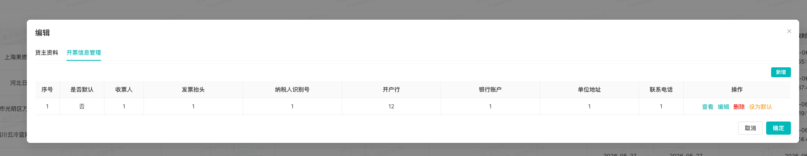
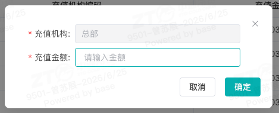

# 网络货运司机端运输操作手册

## 一、适用场景

本文适用于司机在**中通冷运网络货运平台**承运运输任务时，使用司机端 APP 完成装货打卡、装货完成、卸货打卡、卸货完成及等待结算等操作。

## 二、前置条件

- **司机**：指在**中通冷运网络货运平台**上的承运方。
- **网络货运平台**：即**中通冷运网络货运平台**，是专为网点、省公司、生态圈以及 KA 客户等解决整车业务场景的网络货运承运平台。
- **账号与权限要求**：使用司机个人手机号码注册。
- **设备与网络要求**：准备一部安卓或 iOS 系统的智能手机，并确保网络连接正常（**4G/5G/Wi-Fi**）。
- **配套工具/链接**：
  - 🛠️ **核心组件下载**
  - 👉 [点击下载中通冷运司机端 APP （安卓）](https://zmas.zto.com/download/NTMS)
  - **下载鲸小宝 APP（IOS）**：敬请期待

## 三、操作入口

**登录 APP -> 订单中心 -> 运单详情页**

## 四、操作步骤

1. 到达装货地后，点击**【到达装货地】**，完成**装货地打卡**。

   如果因 **GPS 模糊**或**网络问题**导致无法打卡，可上传**水印相机图片**作为证明，完成打卡。

   

2. 货主装货完成后，上传以下 **2 张照片**，然后点击**【确定】**，完成**装货完成**操作。

   - **装货完成水印照片**
   - **人车合照（包含车牌）水印照片**

   

3. 到达卸货地后，点击**【到达卸货地】**，完成**卸货地打卡**。

   如果因 **GPS 模糊**或**网络问题**导致无法打卡，可上传**水印相机图片**作为证明，完成打卡。

   

4. 货主卸货完成后，上传以下 **3 张照片**，然后点击**【确定】**，完成**卸货完成**操作。

   - **卸货完成水印照片**
   - **人车合照（包含车牌）水印照片**
   - **货主收货证明单据照片**

   

5. 卸货完成后，进入**【我的】-【账户信息】**页面，维护银行卡信息。

   ::: danger 重点提醒
   司机需维护银行卡信息，否则无法结算运费。
   :::

   司机可提醒货主在系统确认完成。货主确认后，平台审核通过，运费会自动支付到司机维护的银行卡。

   

## 五、操作结果

完成以上操作后，司机端运输流程完成。货主在平台确认完成，且平台审核通过后，运费会自动支付到司机在**【我的】-【账户信息】**中维护的银行卡。

## 六、注意事项

::: warning 注意事项
- 打卡时请确保已到达对应打卡范围，并保持手机网络、GPS 状态正常。
- 如因 **GPS 模糊**或**网络问题**无法打卡，可按页面提示上传**水印相机图片**作为证明。
- 结算前请确认银行卡信息已在**【我的】-【账户信息】**中维护完成。
- 平台核实运输过程中没有失温、破损、轨迹偏离等异常情况后，才会审核通过并打款。
:::

## 七、常见异常与兜底方案

| 序号 | ❌ 异常现象 / 报错提示 | 常见原因 | 解决方案 |
|------|----------------------------------|------------|--------------|
| 1 | 无法打卡 | 1、未到打卡围栏范围；
2、手机网络或者GPS不稳定 | 1、到打卡范围打卡；
2、关闭再开启蓝牙或上传图片 |

## 八、常见问题

- **Q1：什么时候结运费？**

  **A**：在司机运输完成后，货主在平台确认完成，同时平台核实运输过程中没有失温、破损、轨迹偏离等异常情况，会审核通过，直接打款。