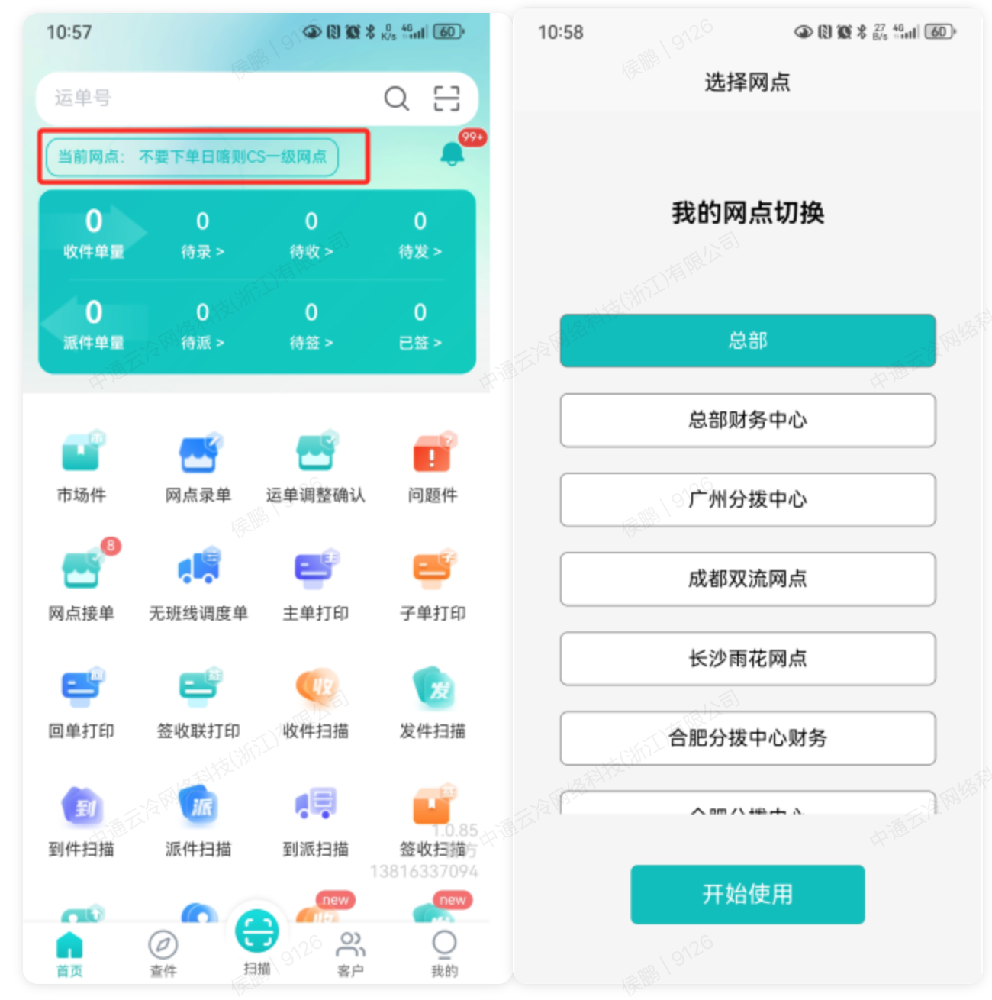

# 鲸小宝APP注册

## 一、适用场景

本文适用于网点负责人、网点客服、网点调度、网点司机使用 **鲸小宝 APP** 时，进行 APP 下载、安装、首次登录、作业网点/组织切换，以及修改或重置登录密码。

通过 **鲸小宝 APP**，可在移动端进行运单录入、无班线调度、运单打印、收派件扫描及多网点快速切换，提升网点日常物流作业效率。

## 二、前置条件

- **系统名称**：鲸小宝APP
- **适用终端**：APP（移动端）
- **面向对象**：网点负责人、网点客服、网点调度、网点司机
- **账号与权限要求**：权限角色需包含网点相应岗位权限（如网点老板、网点客服、网点调度、网点司机）。账号由中通冷链 PC 系统管理员统一开通。
- **设备与网络要求**：准备一部安卓或 iOS 系统的智能手机，并确保网络连接正常（**4G/5G/Wi-Fi**）。
- **打印设备要求**：如需现场打印，需配备便携式蓝牙热敏打印机。

### 2.1 核心名词解释

- **当前网点**：指当前登录账号正在进行作业的组织。用户可在拥有权限的多网点间自由切换。

## 三、操作入口

- **APP 下载入口（安卓）**：[点击下载鲸小宝 APP （安卓）](https://zmas.zto.com/download/com.app.ztocc.andriod)
- **APP 下载入口（IOS）**：请直接在 **App Store** 搜索 **【鲸小宝】**
- **首次登录入口**：点击下载链接 -> 安装客户端 -> 手机号登录
- **作业网点/组织切换入口**：登录APP -> 首页 -> 点击 **【当前网点】**
- **APP 端修改密码入口**：登录APP -> 我的 -> 设置（齿轮图标） -> 修改密码
- **PC 端重置密码入口**：财务/基础管理 -> 用户中心 -> 用户管理

## 四、操作步骤

### 4.1 APP 下载、安装与首次登录

1. 点击下载入口，下载 **鲸小宝 APP** 安装包并完成安装。
   - 安卓：点击 [点击下载鲸小宝 APP （安卓）](https://zmas.zto.com/download/com.app.ztocc.andriod)
   - IOS：在 **App Store** 搜索 **【鲸小宝】** 下载。
2. 打开 **鲸小宝 APP**。
3. 输入您的 **注册手机号** 与 **登录密码**。
   - 初始密码为 `123456`。
4. 勾选底部的 **“我已经阅读并同意《隐私政策》”**。
5. 点击 **【登录】** 按钮进入系统。

### 4.2 作业网点/组织切换

1. 登录 APP 后，进入首页。
2. 点击左上角红框标出的 **【当前网点：XXXXX】** 区域。
3. 在弹出的 **“选择网点”** 列表中，浏览或找到需要作业的网点。
   - 例如：总部财务中心、广州分拨中心、成都双流网点等。
4. 选中对应网点后，点击下方的 **【开始使用】** 按钮。
5. 系统将自动加载该网点的业务数据。

### 4.3 鲸小宝 APP 端自主修改密码

1. 登录 APP 后，点击底部导航栏的 **【我的】**，进入个人中心页面。
2. 点击右上角的 **【设置】（齿轮图标）**。
3. 在设置菜单列表中，点击 **【修改密码】**。
4. 在修改密码界面中，依次输入：
   - **【原密码】**
   - **【新密码】**
   - **【确认密码】**
5. 核对无误后，点击 **【保存】** 按钮，密码即可生效。

::: warning 注意事项
密码请设置为字母与数字的组合。
:::

### 4.4 PC 端重置鲸小宝 APP 登录密码

适用于用户忘记登录密码，或手机端无法登录、需要管理员协助重置密码的情况。

1. 管理员登录中通冷链 PC 端系统。
2. 进入 **【基础管理-用户中心-用户管理】** 界面。
3. 根据姓名或手机号查询对应用户。
4. 点击操作栏中的 **【重置密码】** 按钮。
5. 在弹出的重置密码窗口中填写信息：
   - **应用类型**：下拉菜单选择 **【鲸小宝APP】**
   - **新密码/确认密码**：输入全新的密码
6. 点击 **【确认】**，完成密码修改。
7. 用户使用新密码在手机端登录。

::: danger 重点提醒
重置鲸小宝 APP 登录密码时，**应用类型** 必须选择 **【鲸小宝APP】**。
:::

## 五、操作结果

- 完成 APP 下载和安装后，可在手机端打开 **鲸小宝 APP**。
- 使用注册手机号和密码登录成功后，可进入 APP 首页。
- 切换 **当前网点** 后，系统会加载所选网点的业务数据。
- APP 端修改密码并点击 **【保存】** 后，新密码生效。
- PC 端重置密码并点击 **【确认】** 后，用户可使用新密码在手机端登录。

## 六、注意事项

- 初始密码为 `123456`，如提示密码错误，可能已被本人或管理员修改。
- 如账号列表中没有目标网点，通常是账号未分配该网点的操作权限。
- 如 APP 扫描功能无法唤起摄像头，请检查手机系统是否已授予鲸小宝 APP 摄像头访问权限。
- 如需现场打印，请提前准备便携式蓝牙热敏打印机，并确保设备可正常连接。

## 七、常见问题

### 7.1 Q1：输入初始密码 `123456` 提示密码错误，怎么办？

可能原因：

1. 密码已被本人或管理员修改。
2. 账号存在异常。

处理方式：

1. 可参考 **“鲸小宝 APP 端自主修改密码”** 进行修改。
2. 如无法登录，请联系网点管理员，前往 PC 端 **【基础管理-用户中心-用户管理】** 进行密码重置。

### 7.2 Q2：点击“当前网点”后，列表中没有目标网点，怎么办？

可能原因：

- 账号未分配该网点的操作权限。

处理方式：

- 联系总部或网点管理员，在 PC 端权限管理系统中为该账号添加目标组织的权限绑定。

### 7.3 Q3：APP 内点击扫描功能无法唤起摄像头，怎么办？

可能原因：

- 手机系统未授予鲸小宝 APP 摄像头访问权限。

处理方式：

1. 前往手机系统的 **[设置 -> 应用管理 -> 鲸小宝 -> 权限管理]**。
2. 将 **“相机/摄像头”** 权限更改为 **“允许”**。

### 7.4 Q4：忘记登录密码，或者需要修改密码，应该怎么操作？

若在手机端无法登录或需要重置密码，目前需要通过中通冷链 PC 端后台进行重置。请联系所属网点的系统管理员协助处理。

管理员操作路径：

- **财务/基础管理 -> 用户中心 -> 用户管理**

管理员处理步骤：

1. 管理员进入 **【基础管理-用户中心-用户管理】**。
2. 根据姓名或手机号查询对应用户。
3. 点击 **【重置密码】**。
4. 在重置密码窗口中选择 **【鲸小宝APP】**，并输入 **新密码/确认密码**。
5. 点击 **【确认】** 完成重置。