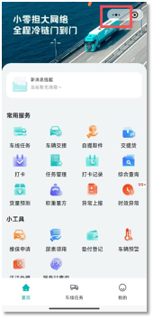
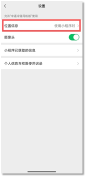
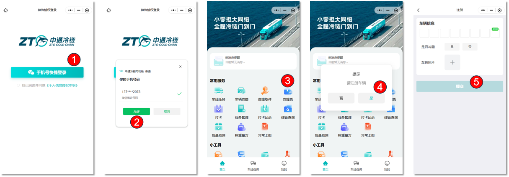
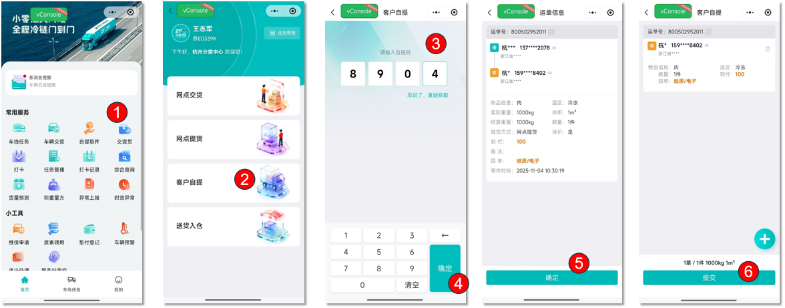
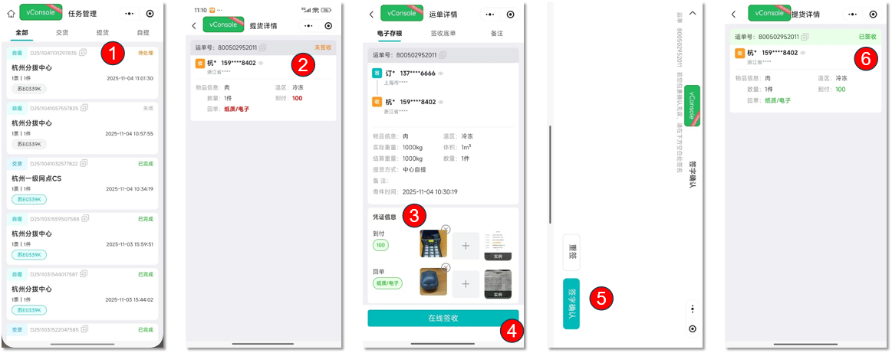

# 交提货

## 一、适用场景

本文适用于司机使用 **中通冷链司机版** 小程序，线上完成 **网点交货**、**网点提货** 的操作。

- **网点交货**：司机将货品运送至指定分拨/集配，线上提交交货申请，并完成交接确认。
- **网点提货**：司机前往指定分拨/集配提取货品，线上提交提货申请，并完成交接确认。
- **任务管理**：汇总展示交货、提货、自提等交接任务，可查看任务编号、网点、状态、时间等信息。

## 二、前置条件

1. 使用专属司机账号登录 **中通冷链司机版** 小程序。
2. 司机账号由网点统一分配；如无权限，请联系网点管理员。
3. 使用智能手机操作，并确保网络正常。

::: danger 重点提醒
使用该功能前，**必须开启小程序定位权限**，否则可能无法展示 **网点交货**、**网点提货** 入口。
:::

## 三、操作入口

- 官方入口：微信搜索并打开 **中通冷链司机版** 小程序。
- 系统路径：**中通冷链司机版小程序首页 → 常用服务 → 交提货**。

## 四、操作步骤

### 4.1 网点交货

操作路径：**中通冷链司机版小程序首页 → 常用服务 → 交提货 → 网点交货**

1. 进入 **中通冷链司机版** 小程序首页。
2. 在首页找到并点击 **交提货**。
3. 在交提货页面选择 **网点交货**。
4. 阅读完整交货须知，确认后点击 **我同意**。
5. 在任务列表中选择对应的交货任务，点击 **提交**。
6. 提交成功后，系统自动跳转至 **任务管理** 列表，可查看任务进度与状态。

### 4.2 网点提货

操作路径：**中通冷链司机版小程序首页 → 常用服务 → 交提货 → 网点提货**

1. 进入 **中通冷链司机版** 小程序首页。
2. 在首页点击 **交提货**。
3. 选择 **网点提货**，进入提货页面。
4. 阅读提货须知，确认无误后点击 **我同意**。
5. 勾选需要执行的提货任务，点击 **提货** 提交申请。
6. 提交完成后，系统跳转至 **任务管理** 页面，可查看提货任务状态。

## 五、操作结果

- **网点交货**：提交成功后，任务进入 **任务管理** 列表，可查看交货任务进度与状态。
- **网点提货**：提交完成后，任务进入 **任务管理** 页面，可查看提货任务状态。
- 在 **任务管理** 中，可切换交货、提货、自提分类，查看待处理、已完成、关闭等任务状态。

## 六、注意事项

::: warning 注意事项
如果进入 **交提货** 后没有看到 **网点交货**、**网点提货** 入口，请先检查小程序定位权限是否开启。
:::

::: warning 注意事项
冷藏货品表面温度要求 **0-10℃**，冷冻货品表面温度要求 **低于-15℃**。

货品温度不达标、包装破损、无法核验内件等情况引发的货物问题，承运方不承担相关责任。
:::

## 七、常见问题

### 7.1 交提货任务提交后，在哪里查看进度？

任务提交后会自动跳转至 **任务管理** 页面。可切换交货、提货、自提分类，查看待处理、已完成、关闭等任务状态。

### 7.2 冷链货物收货温度标准是什么？

冷藏货品表面温度要求 **0-10℃**，冷冻货品表面温度要求 **低于-15℃**。货品温度不达标、包装破损、无法核验内件等情况引发的货物问题，承运方不承担相关责任。

### 7.3 打开交提货后，没有网点交货、网点提货入口怎么办？

通常是小程序未开启定位权限，可按以下方式处理：

1. 点击小程序右上角 **「···」**。
2. 进入设置页面。
3. 开启 **位置信息**，选择使用小程序时允许。
4. 重新进入小程序查看入口。

### 7.4 进入交货/提货页面后，任务列表为空怎么办？

常见原因是网点未创建无班线调度单。请联系网点工作人员创建调度单，刷新页面后再查看任务。

### 7.5 提交任务失败怎么办？

可按以下方式处理：

1. 切换至稳定网络后重试。
2. 彻底关闭小程序后台，重新打开后再操作。

## 八、常见异常与兜底方案

| 序号 | 异常现象 / 报错提示 | 常见原因 | 解决方案 |
|------|---------------------------|------------|------------|
| 1 | 打开交提货，无网点交货、网点提货入口 | 小程序未开启定位权限 | 1. 点击小程序右上角 **「···」**，进入设置页面；
2. 开启 **位置信息**（使用小程序时允许）；
3. 重新进入小程序。

 |
| 2 | 进入交货/提货页面，任务列表为空 | 网点未创建无班线调度单 | 联系网点工作人员创建调度单，刷新页面即可显示任务。 |
| 3 | 提交任务失败 | 网络异常、小程序缓存出错 | 1. 切换至稳定网络后重试；
2. 彻底关闭小程序后台，重新打开操作。 |