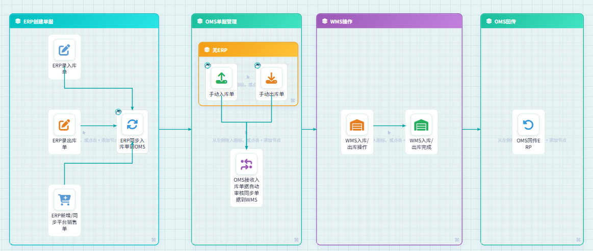

# 基础数据仓库管理

## 一、适用场景

省公司发起开仓流程、需要开启新仓时，可通过本文配置新仓库信息。

## 二、前置条件

1. 使用专属工号登录 **鲸天系统-冷链云仓**。
2. 账号需开通 **基础数据管理全模块权限**；如无权限，请联系系统管理员配置。
3. 准备好新增仓库所需信息，包括：**仓库编码**、**仓库名称**、**是否直营**、**仓库容积**、**仓库联系人**、**仓库联系人电话**、**启用报价确认**、**开启库存管理**、**钉钉token**、**钉钉secret** 等。

::: danger 重点提醒
带 **\*** 的字段为必填项。
:::

## 三、操作入口

- **系统功能路径**：`登录系统` -> `进入左侧菜单栏` -> `[OMS订单中心]` -> `[基础数据]` -> `[仓库管理]`
- **快捷直达链接**：👉 [https://wms.ztocc.com/app/#/base/warehouse](https://wms.ztocc.com/app/#/base/warehouse)

## 四、操作步骤

1. 登录 **鲸天系统-冷链云仓**，进入 **仓库管理** 页面。
2. 点击页面上方的 **新增** 按钮。
3. 按页面要求填写仓库信息：
   - **仓库编码**：以 **ZTO+省缩写** 开头。
   - **仓库名称**
   - **是否直营**
   - **仓库容积**
   - **仓库联系人**
   - **仓库联系人电话**
   - **启用报价确认**
   - **开启库存管理**
   - **钉钉token**
   - **钉钉secret**
4. 根据实际业务选择特殊字段：
   - **启用报价确认**：需要仓库对网点报价时开启；不需要时关闭。
   - **开启库存管理**：仓库需要开启库存管理时开启；不需要时关闭。开启后，系统会接收出入库单单据，并在回传时锁定及增减库存。
   - **钉钉token、钉钉secret**：配置后，接收或回传等单据报错时，会推送钉钉消息到钉钉群。
5. 确认信息填写无误后，按页面提示完成新增操作。

## 五、操作结果

新增完成后，仓库信息会在 **仓库管理** 中生成。后续可根据配置结果，用于报价确认、库存管理、单据接收和回传等业务。

## 六、注意事项

::: warning 注意事项
- **仓库编码**需按要求填写，以 **ZTO+省缩写** 开头。
- **启用报价确认**仅在需要仓库对网点报价时开启。
- **开启库存管理**后，出入库完成后 **OMS** 会根据 **WMS** 实际出入库商品信息更新 **OMS库存**。
- 配置 **钉钉token**、**钉钉secret** 后，接收或回传等单据报错会推送钉钉消息到钉钉群。
:::

## 七、常见异常与兜底方案

| 序号 | ❌ 异常现象 / 报错提示 | 🔍 常见原因 | 🛠️ 解决方案 |
|------|-------------------------------|-----------------|--------------------|

## 八、常见问题

- **Q1：新增仓库后如何管理库存？**

  **A**：在 **仓库管理** 的基础配置中开启 **库存管理**。出入库完成之后，**OMS** 会根据 **WMS** 实际出入库商品信息更新 **OMS库存**；当 **OMS库存不足** 时，出库单状态会更新成 **缺货**，且不推送单据到 **WMS**。