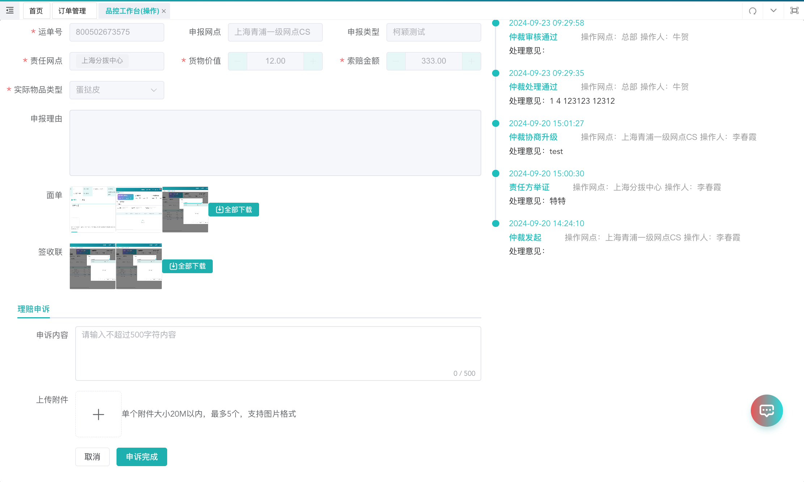
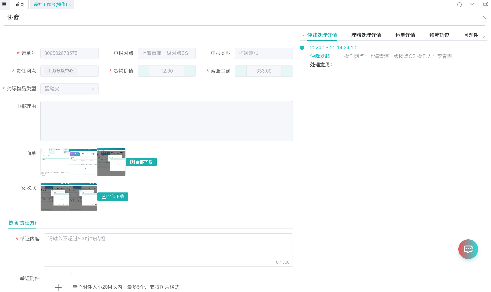

# 仲裁如何申报、申诉？

## 一、适用场景

本文适用于网点在系统中进行**仲裁申报**、**理赔单据新增**、**协商处理**、**仲裁申诉**等操作。

流程调整点如下：

1. 新增仲裁后，增加了**协商**节点。发起方可选择**升级总部**，由总部处理。
2. 如线下已沟通好理赔事宜，无需总部介入，发起方可**撤销仲裁**。
3. 在**待处理**节点，新增**处理不通过**，可打回发起方修改仲裁单据。

## 二、前置条件

1. 已具备对应系统账号，并拥有**服务质量**或**品控工作台**相关操作权限。
2. 流程节点人员可在**【操作】**中处理数据。
3. 非流程节点人员可在**【查询】**中查看数据。
4. 申报仲裁/理赔前，请准备好运单号、责任网点、申报理由及相关附件材料。

## 三、操作入口

**操作入口**：**服务质量**

网点可操作权限：**品控工作台 > 操作**

可操作功能包括：

1. **新增**：新增仲裁/理赔单据。
2. **协商**：发起网点、责任网点可进行协商。
3. **申诉**：发起网点、责任网点可进行申诉。

## 四、操作步骤

### 4.1 仲裁发布

用户可在此页面进行**仲裁申报**和**申诉处理**。

1. 点击**【发布】**，发起仲裁/理赔申报。
2. 选择责任网点，并提交相关材料。
3. 如对仲裁单有歧义，可点击**【申诉】**进行申诉。

### 4.2 发布仲裁/理赔单据

1. 点击**【发布】**后，先选择**申报类型**。

2. 选择申报类型后，进入内容填写页面。

3. 按页面要求填写以下信息：
   - **运单号**：输入运单号后，系统会带出对应的运单、轨迹信息；允许一级代二级网点进行上报。
   - **责任网点**：用户自行搜索并选择责任网点，支持多选。
   - **申报理由**：填写本次申报理由。
   - **附件**：根据页面下方描述上传对应附件。

### 4.3 仲裁协商处理

#### (1) 发起方协商

1. 申报网点可在列表中进行**协商**操作。

2. 点击**【协商】**按钮，进入详情页（发起方协商）。

3. 根据实际情况选择处理方式：
   - **撤销仲裁**：发起方可进行撤销操作；撤销后，该单据完结。
   - **升级总部**：发起方可直接升级总部；升级总部后，该单据转至总部处理。
   - **协商结果**：发起方填写相关协商结果。

::: warning 注意事项
如 **48H** 内未升级总部，系统会自动升级总部。
:::

#### (2) 责任方协商

1. 点击**【协商】**按钮，进入详情页（责任方协商）。

2. 填写或上传相关举证信息：
   - **举证内容**：责任方可提交自己无责的相关举证内容。
   - **提交举证**：提交后，相关填写内容会保存。

::: warning 注意事项
责任方提交举证后，不会造成流程节点变更。
:::

### 4.4 仲裁申诉

1. 当单据处于**待申诉**状态时，发起方、责任方可进行**申诉**操作。

2. 填写**申诉内容**，并上传**申诉附件**。
3. 点击**申诉完成**。

::: tip 补充说明
发起方、责任方有 **120H** 申诉时间。

在 **120H** 内，如有任意一方申诉，或双方均完成申诉，单据会转为**待申诉处理**。

如无任意一方申诉，单据会转为**完结**。

如存在理赔场景，当进行仲裁或理赔申诉时，若对应的理赔/仲裁状态未完结，会将其置为**待申诉处理**状态。
:::

## 五、操作结果

根据不同操作，系统会产生以下结果：

1. **发布仲裁/理赔单据**后，生成对应仲裁/理赔单据，并进入后续流程。
2. **撤销仲裁**后，该单据完结。
3. **升级总部**后，该单据转至总部处理。
4. **责任方提交举证**后，举证内容保存，但流程节点不变。
5. **申诉完成**后，单据按申诉规则流转至对应状态。

## 六、注意事项

1. 流程节点人员在**【操作】**中处理数据；非流程节点人员在**【查询】**中查看数据。
2. 发起方可在协商节点进行**撤销仲裁**或**升级总部**。
3. 如发起方在 **48H** 内未升级总部，系统会自动升级总部。
4. 发起方、责任方有 **120H** 申诉时间。
5. 待处理节点支持**处理不通过**，可打回发起方修改仲裁单据。

## 七、常见问题

### 7.1 哪些场景会有仲裁消息提醒？

以下场景会提醒处理网点（鲸天）：

1. **新增仲裁单据**
2. **总部审核节点**
3. **申诉节点**
4. **仲裁申诉处理节点**
5. **仲裁处理-处理不通过**

