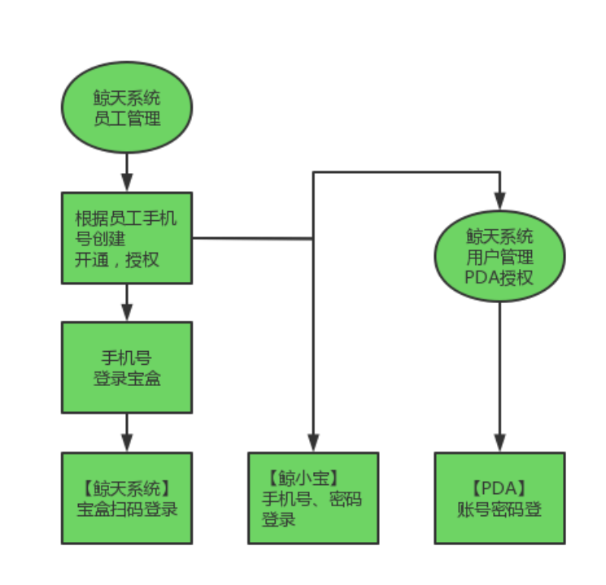

# 一. 系统账号开通及权限配置

1、<strong>若鲸天系统中添加账号，系统会自动创建鲸天系统账号及对应的宝盒账号。</strong>
2、省区网点管理员账号，由总部网管添加。
3、一级网点网点管理员账号，由省区网管添加。
4、一级网点员工及下属二级网点网点管理员账号，由一级网点网点管理员添加。
5、二级网点员工账号，由二级网点网点管理员添加或一级网点网点管理员添加。

## 1.1 如何添加员工账号？

【菜单路径】菜单搜索“员工管理”，或者，基础配置-用户中心-员工管理

【功能说明】网点或者下属网点创建新员工

【注意事项】

若需要查看录单成本，则选择“是”，若不需要查看则选择“否”。目前默认是“空白”，所以网点管理员给本网点创建员工时，必须注意此填写。

## 1.2 如何给员工授权？

【功能说明】员工账号可以看到哪些组织的数据

【注意事项】即是该员工属于哪个机构（网点）比如，该员工同时负责 A、B 网点的网点客服岗位，那么“选择组织”，就需要同时勾选 A 网点和 B 网点。

【注意事项】

1. 授权后，员工账号用户状态才是“已开通”，才可以登录系统，否则无权限。

1. “角色类型”，“选择角色”，什么岗位就选择哪些权限

1. “授权组织”，该员工属于哪个网点就选择哪个组织。

## 1.3 系统现在有哪些预制基本角色？

网点配置的角色：

ZTO 网点管理员、ZTO 网点客服

ZTO 网点操作员、ZTO 代理点业务员

ZTO 一级网点财务/ZTO 二级网点财务

省区配置的角色：

ZTO 省区网管 、ZTO 代理点业务员

ZTO 网点管理员、ZTO 网点客服、ZTO 网点操作员

ZTO 一级网点财务/ZTO 二级网点财务

## 1.4 用户如何开通鲸小宝、PDA等账号？

【<strong>菜单路径</strong>】系统管理/用户中心/用户管理。

【<strong>功能说明</strong>】编辑删除员工，重置密码，重置 PDA 密码，启用 PDA 用户。

【注意事项】

若需要开通鲸小宝、PDA 等账号，点击此处重置密码，直接用密码登录即可。

## 1.5 员工管理和用户管理分别是干什么的？

<strong>员工管理</strong>：新增员工、设置登录账号、密码、授权组织、授权角色、编辑基础信息

<strong>用户管理</strong>：编辑登录手机、重置鲸小宝 APP 密码、重置 PDA 密码

⚠️ 注意：员工离职，在【员工管理】删除即可，宝盒就无法正常登录。
