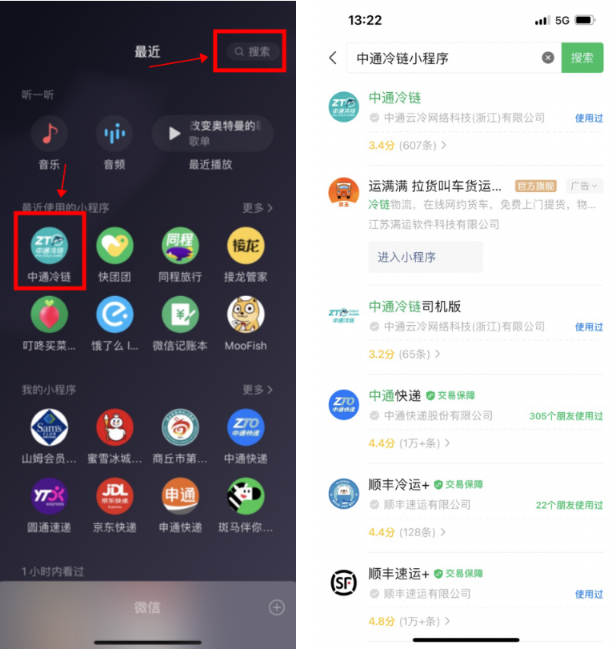

# 宝盒是什么？如何下载？

中通宝盒主要用于鲸天系统登录鉴权，登录鲸天系统都需要宝盒账号。

方式 1：浏览器直接访问下载

[宝盒-中通安全协作平台](https://baohe.zto.com/)

方式 2：手机扫描下载宝盒

登录的前提条件，确保上级已按手机号开通鲸天系统的账号

1. 若未添加，直接登录，则会出现左侧“未办理入职”提示。需联系对应上级人员开通账号。

1. 鲸天系统添加员工账号号后，会根据手机号，自动同步入职信息到宝盒，同步完成，才可登录，排查办法见 1.7

## 鲸天系统如何访问？

[鲸天系统](https://platform.ztocc.com/#/)

推荐使用谷歌浏览器访问

[下载谷歌浏览器](https://www.google.cn/intl/zh-CN/chrome/?www.dgcms.cn)

## 鲸小宝如何下载？

## 司机端小程序如何登录？

微信扫描司机小程序二维码

或者微信小程序搜索【中通冷链司机小程序】

**中通冷链司机版**

**搜索方式如下：**

或直接扫描下面二维码👇👇

