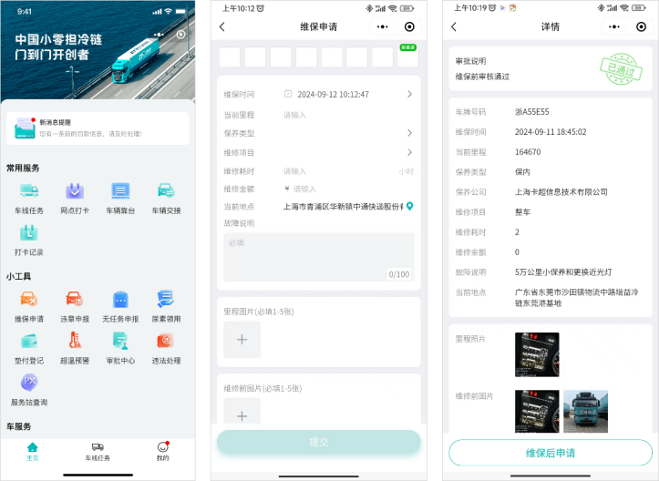
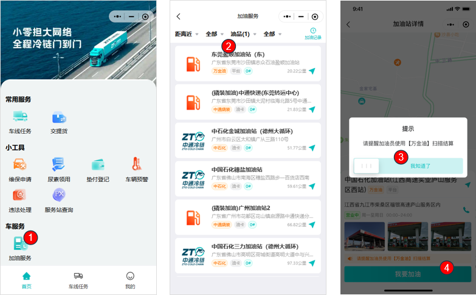
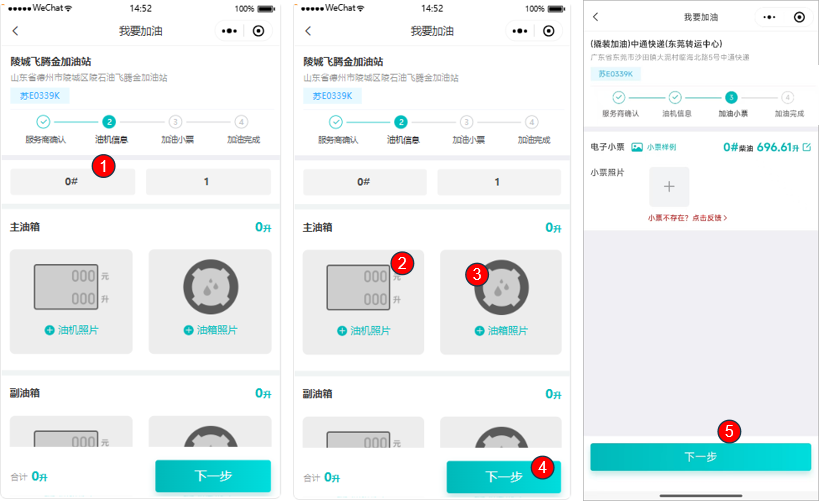

# 自主加油

## 一、适用场景

本文适用于冷链运输司机使用 **中通冷链司机版微信小程序** 的 **加油服务** 功能，完成合作加油站查询、线上选站、拍照留证、小票上传、线上结算等自主加油操作。

司机外出运营途中，可通过小程序查询合规合作加油站，按系统流程完成自主加油，实现加油业务线上化管理、统一平台结算、数据留痕和加油标准规范化。

## 二、前置条件

1. **账号与权限**
   - 使用个人微信登录 **中通冷链司机版** 小程序。
   - 司机账号需具备 **加油服务** 权限；如无法进入功能，请联系网点管理员核查配置。

2. **设备与网络**
   - 准备智能手机，确保网络正常。
   - 手机需可正常拍照，照片需清晰可识别。

3. **车辆与现场**
   - 车辆需正常停靠至加油站指定区域。
   - 加油过程中按页面要求拍摄现场凭证照片。

4. **小程序入口**
   - 微信搜索并进入 **中通冷链司机版** 小程序。

## 三、操作入口

系统路径：**中通冷链司机版小程序首页 → 常用服务 → 加油服务**

## 四、操作步骤

### 4.1 选择加油站并确认服务商

1. 打开 **中通冷链司机版** 小程序首页。
2. 在 **常用服务** 栏点击 **加油服务** 图标，进入加油列表页面。
3. 在列表中查看合作加油站信息，包括站点名称、地址、油品类型、距离、结算方式。
4. 根据行驶路线和距离选择目标加油站，核对站点地址无误后点击进入。
5. 页面弹出提示框，提醒加油员使用 **万金油** 平台结算。
6. 滑动并点击 **我知道了**，关闭弹窗。
7. 点击页面底部 **我要加油**，进入加油信息填报页面。

::: tip 核心名词说明
- **加油服务**：小程序内置功能入口，用于查询合作加油站、发起线上加油结算。
- **高灯驿能/万金油**：平台指定结算工具，加油员需使用该工具完成线下扫码结算。
- **撬装加油**：园区内部专用加油站点，仅对内部车辆提供加油服务。
:::

### 4.2 选择油品、油机并拍摄现场照片

1. 在加油信息页面，选择对应 **油品类型**、**油枪编号**。
2. 根据实际加油情况，区分 **主油箱**、**副油箱**。
3. 点击 **油机照片**，现场拍摄加油机实景及读数照片，并完成上传。
4. 点击 **油箱照片**，拍摄车辆油箱、加油口实景照片，并完成上传。
5. 现场完成加油作业后，点击页面 **下一步**。

::: tip 凭证说明
- **加油机照片**：在加油过程中对加油机表盘、油枪编号拍摄的留存照片。
- **油箱照片**：对车辆油箱及加油口拍摄的现场凭证照片。
:::

### 4.3 上传加油小票并核对数据

1. 跳转至加油小票页面后，点击 **小票照片**。
2. 拍摄加油站纸质/电子加油小票，并上传至系统。
3. 系统会自动识别小票中的加油升数、金额。
4. 如识别数据与实际加油数据不一致，请手动修改，并核对至准确数值。
5. 信息确认无误后，再次点击 **下一步**，进入支付环节。

::: tip 补充说明
如无实体小票，可点击页面 **小票不存在?点击反馈** 提交问题。
:::

::: tip 凭证说明
**加油小票**：加油站出具的消费凭证，需拍照上传至系统，用于数据核对与对账。
:::

### 4.4 线上确认支付并完成加油

1. 页面展示本次加油合计升数与金额。
2. 核对信息无误后，点击 **确认支付**。
3. 在弹出的确认窗口中，再次点击 **确认**，完成线上支付。
4. 支付成功后，页面展示加油订单号、交易时间、油品、升数、金额等信息。
5. 将支付成功页面出示给现场加油工作人员查看，完成自主加油流程。

## 五、操作结果

完成支付后，系统会生成本次加油记录，并展示加油订单号、交易时间、油品、升数、金额等信息。司机将支付成功页面出示给现场工作人员核对后，本次自主加油流程结束。

## 六、注意事项

::: danger 重点提醒
- **油机照片**、**油箱照片**、**加油小票**为加油凭证，请按页面要求清晰拍摄并上传。
- 小票识别出的升数、金额如与实际不一致，需手动修改，确保与小票信息一致后再提交。
- 加油统一通过 **万金油** 工具线下核销、线上结算；如使用其他方式结算，可能影响订单录入和后续对账。
:::

::: warning 注意事项
- 如小程序找不到 **加油服务** 入口，请先确认账号权限，或关闭小程序后台后重新进入。
- 如加油站列表加载空白，请检查手机网络，切换 **4G/稳定WiFi** 后刷新页面。
- 如无法拍摄或上传照片，请检查小程序相机权限，并重新拍摄清晰照片后上传。
- 如点击 **确认支付** 无反应或支付失败，请检查网络后重试；仍无法处理时，联系平台客服核查账户状态。
:::

## 七、常见问题

### 7.1 Q1：小程序找不到【加油服务】入口怎么办？

可能是账号权限未开通，或小程序缓存异常。

处理方式：

1. 联系网点管理员开通 **加油服务** 权限。
2. 关闭小程序后台，重新进入后刷新页面。

### 7.2 Q2：加油站列表加载空白、无法查看站点怎么办？

通常与手机网络信号有关。请切换 **4G/稳定WiFi**，然后刷新 **加油服务** 页面。

### 7.3 Q3：无法拍摄或上传照片怎么办？

可能是小程序未开启相机权限，或图片过大。

处理方式：

1. 进入小程序设置，开启相机权限。
2. 重新拍摄清晰照片，控制图片大小后上传。

### 7.4 Q4：系统识别小票升数、金额与实际不符怎么办？

可能是小票拍摄模糊，或系统识别存在误差。请手动修改数据，确保与纸质小票信息完全一致后再提交。

### 7.5 Q5：现场没有加油纸质小票怎么办？

如站点未出具小票，请点击页面 **小票不存在?点击反馈**，按指引提交情况说明。

### 7.6 Q6：点击确认支付无反应或支付失败怎么办？

可能是网络中断或账户状态异常。

处理方式：

1. 检查网络后重试。
2. 联系平台客服核查账户状态。

### 7.7 Q7：加油员不会使用万金油平台结算怎么办？

请出示小程序提示内容，引导加油员使用指定工具完成线下结算。

### 7.8 Q8：加油前为什么要提醒加油员使用万金油结算？

本平台加油统一通过 **万金油** 工具线下核销、线上结算。如使用其他方式结算，订单无法正常录入系统，影响后续对账。

### 7.9 Q9：油机照片、油箱照片、加油小票是否必须上传？

需要上传。以上凭证用于加油台账、财务对账、费用核销。

### 7.10 Q10：主油箱和副油箱加油需要分开填写吗？

需要。请根据实际加油情况，分别填写主、副油箱加油升数与金额，保证数据真实准确。

### 7.11 Q11：加油完成后，支付页面需要给加油员查看吗？

需要。支付成功界面作为结算凭证，需出示给现场工作人员核对，完成双方交接。

### 7.12 Q12：选错加油站可以重新更换吗？

未进入拍照环节时，可直接返回列表重新选择；已上传照片时，需取消当前订单后重新发起加油流程。

### 7.13 Q13：撬装加油站和普通中石化/中石油站点操作有区别吗？

操作流程一致，仅结算标识、站点属性不同，按统一步骤完成操作即可。