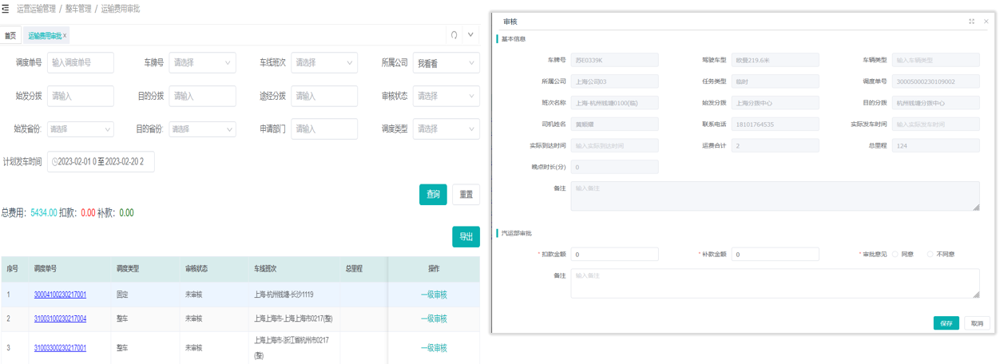
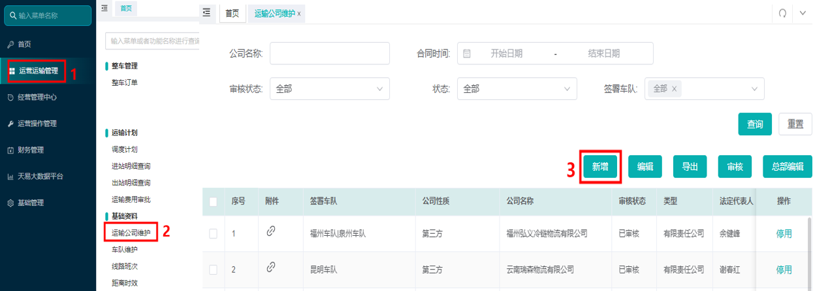
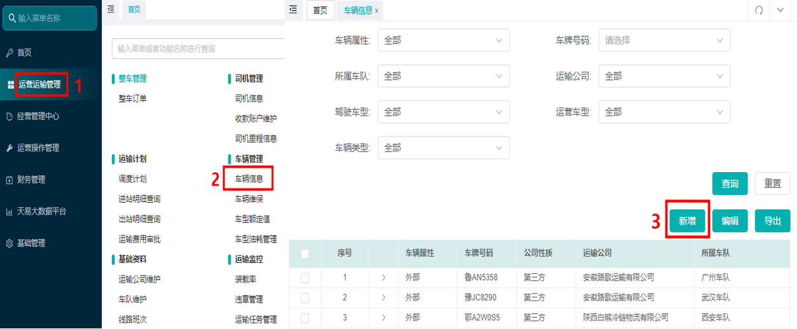
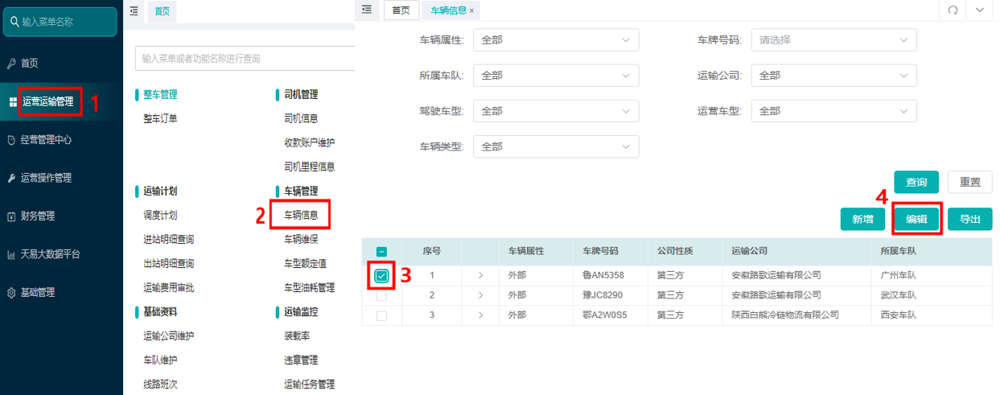
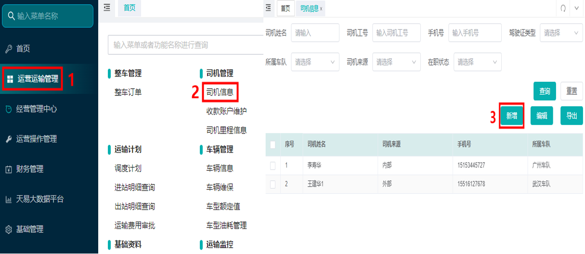
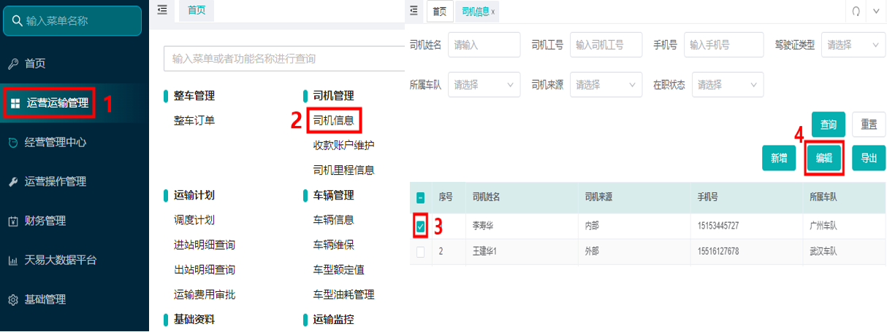
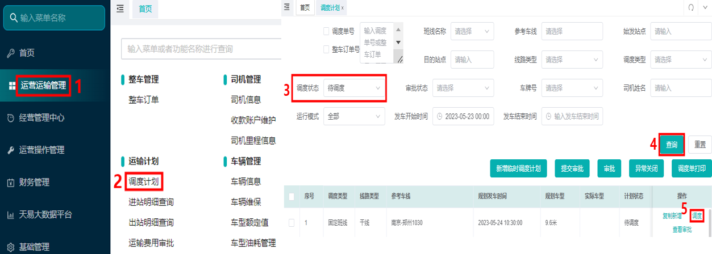
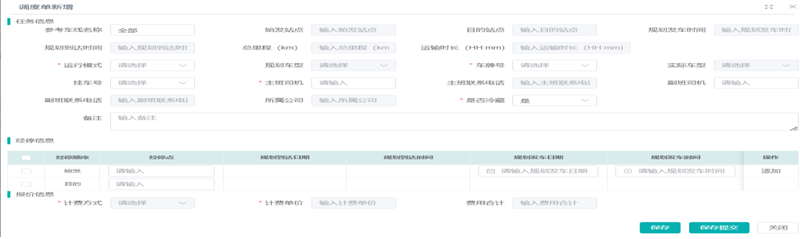
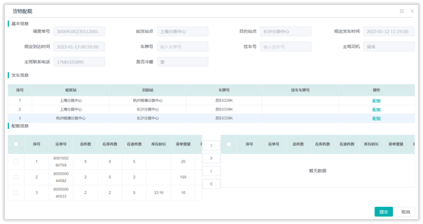
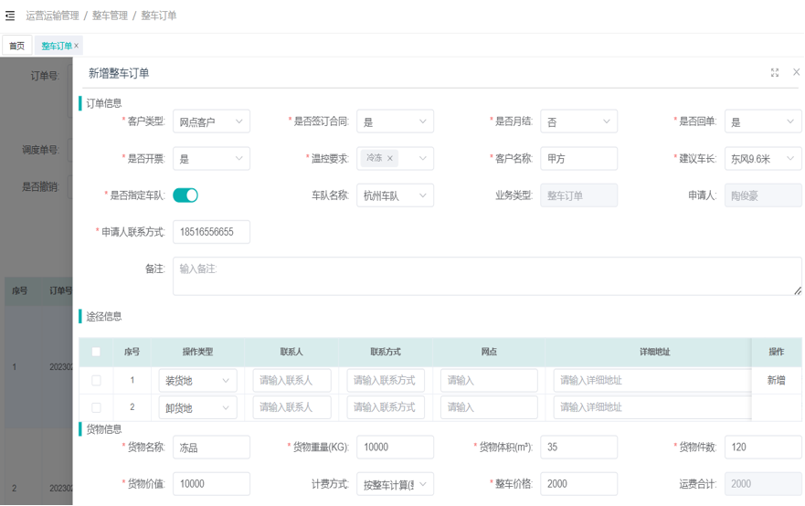

# 调度任务

## 一、适用场景
本手册适用于运输调度岗位人员，基于**鲸天系统**完成运输基础数据维护、班线/整车调度计划创建、车辆司机派单、运单配载、任务跟踪、费用审批等全流程调度工作，同时配套司机端小程序任务协同，实现冷链运输线上化、标准化管控。

### 1.1 核心名词解释
- **基础数据**：包含运输公司、车辆、司机三大基础档案，是开展调度派单的前置数据源。
- **固定班线**：常态化运行的固定线路班次，系统自动生成调度计划，直接安排车辆与司机即可。
- **临时班线**：非常规临时线路、加班车，需手动新增调度计划，提交总部值班调度审核后生效。
- **预配载**：调度根据库存、在途运单提前完成货物分配，指导现场PDA装车作业。
- **整车订单**：客户整车运输需求单据，需完成录入、编辑、审批、派车全流程操作。
- **运输任务管理**：集中查看所有调度单、子任务、发车及运单明细，跟踪运输全流程状态。
- **运输费用审批**：对已完结调度任务的运费、补扣款进行审核，数据同步至天玑系统。

## 二、前置条件
1. **账号与权限**：使用专属工号登录**鲸天系统**，调度岗位需开通运营运输管理全模块权限；若无权限请联系系统管理员配置。
2. **设备与环境**：使用办公电脑，保证网络稳定；如需打印调度单，提前连接打印机。
3. **配套入口**：官方系统入口为鲸天系统后台（内网访问）。

## 三、操作入口
所有功能路径如无特殊说明，均通过鲸天系统后台内网访问。请以系统实际菜单路径为准。

## 四、操作步骤

### 4.1 场景一：基础数据配置（调度前置必备）

#### (1) 新增运输公司
1. 进入系统路径：**鲸天系统 → 运营运输管理 → 基础资料 → 运输公司维护**。
2. 点击上方**新增**按钮。
3. 填写信息：公司名称填写全称、选择对应签署车队、完善联系电话、地址、资质证件等，带\*为必填项；备注栏填写主营线路。
4. 上传法人身份证、营业执照、道路运输许可证等资质附件，完成后点击**保存**。
5. 提交后联系**总部运输部纪宗君**完成审核。未审核公司无法正常选用，已审核信息修改同样联系总部处理。

::: danger 重点提醒
新增运输公司后必须等待总部审核通过，否则无法在调度、订单模块选择使用。
:::

#### (2) 新增车辆信息
1. 进入系统路径：**鲸天系统 → 运营运输管理 → 车辆管理 → 车辆信息**。
2. 点击列表上方**新增**按钮。
3. 填写车辆信息：区分**内部/外部**车辆属性，选择所属车队、运输公司、车型、额定载重/体积等必填项；按需设置分配车队、填写挂车号牌。
4. 信息核对无误后点击**保存**，车辆信息无需审核。
5. 若调度时无法选择该车辆，等待5分钟后退出账号重新登录即可。

#### (3) 修改车辆信息
1. 进入系统路径：**鲸天系统 → 运营运输管理 → 车辆管理 → 车辆信息**。
2. 在列表中勾选目标车辆。
3. 点击**编辑**，修改对应内容。
4. 编辑完成点击**保存**提交。

::: warning 注意事项
仅车辆**所属车队**管理员可编辑车辆信息。
:::

#### (4) 新增司机信息
1. 进入系统路径：**鲸天系统 → 运营运输管理 → 司机管理 → 司机信息**。
2. 点击**新增**按钮。
3. 填写司机姓名、手机号、身份证、驾驶证、从业资格证等资料，区分内部/外部/平台司机来源，选择所属车队，上传各类证件图片。
4. 核对信息后点击**保存**，司机信息无需审核。
5. 调度无法选中司机时，退出账号重新登录即可。

#### (5) 修改司机信息
1. 进入系统路径：**鲸天系统 → 运营运输管理 → 司机管理 → 司机信息**。
2. 勾选需要编辑的司机条目。
3. 点击**编辑**，修改内容后点击**保存**。

::: warning 注意事项
仅司机**所属车队**管理员可编辑司机信息。
:::

### 4.2 场景二：班线车辆调度

#### (1) 固定班线调度
1. 进入系统路径：**鲸天系统 → 运营运输管理 → 运输计划 → 调度计划**。
2. 筛选调度状态为**待调度**，点击**查询**加载对应班次。
3. 选中目标车线，点击**调度**按钮。
4. 依次选择车牌号、挂车号、运输公司、主/副班司机，勾选是否冷藏，填写计费方式、运费价格。
5. 信息确认无误后点击**确认**，完成调度。

::: tip 补充说明
- 车辆、司机无法选择时，先完成基础数据录入。
- 换车、换司机可执行**重新调度**；增减经停点选择**更改经停**，以上操作均需总部值班调度审核。
:::

#### (2) 临时班线/加班车调度
1. 进入系统路径：**鲸天系统 → 运营运输管理 → 运输计划 → 调度计划**。
2. 点击页面**新增临时调度计划**。
3. 填写始发站点、目的站点、规划发车/到达时间、总里程等基础信息；有多经停点可点击**添加**补充。
4. 选择车牌号、挂车号、司机、运输公司，设置是否冷藏，填写报价及计费信息。
5. 点击**保存提交**，随后联系**总部值班调度**完成审核，审核通过司机方可接收任务。

#### (3) 调度单预配载
1. 进入系统路径：**鲸天系统 → 运营运输管理 → 运输计划 → 调度计划**。
2. 选中对应调度单号，点击操作列**货物配载**。
3. 选择发车信息，点击**配载**加载在库、在途运单，勾选运单加入配载列表。
4. 确认后点击**提交**保存数据。

::: warning 注意事项
已发车站点不支持预配载，配载结果用于指导现场PDA装车。
:::

#### (4) 调度单打印
1. 进入系统路径：**鲸天系统 → 运营运输管理 → 运输计划 → 调度计划**。
2. 勾选一条或多条需要打印的调度单。
3. 点击**调度单打印**，即可输出单据。单据包含调度单号、车辆、司机、途经站点、时间等信息，用于装卸车扫码使用。

### 4.3 场景三：整车订单全流程操作

#### (1) 新增整车订单
1. 进入系统路径：**鲸天系统 → 运营运输管理 → 整车管理 → 整车订单**。
2. 点击**新增整车订单**。
3. 填写订单信息：客户类型、温控要求、指定车队、申请人及联系方式；完善装/卸货地址、联系人等途径信息。
4. 录入货物名称、重量、体积、件数、货物价值；按要求选择计费方式、填写整车价格。
5. 全部信息核对完成后点击**保存**。

::: tip 填写说明
货物价值按实际填写，保险费按货值千分之三收取。若不需要投保，货物价值填写 **0.01**。
:::

#### (2) 编辑整车订单
1. 在订单列表中选中单据，点击**编辑**。
2. 修改订单、途径、货物、费用等内容，补充装卸时间要求。
3. 确认后点击**保存**。

#### (3) 订单提交审批
1. 选中草稿状态订单，点击**提交审批**。
2. 弹窗确认后，订单状态变更为**待审核**。

#### (4) 订单审批
1. 选中待审核订单，点击**订单审批**。
2. 选择审批意见（通过/不通过）、选定对应车队，填写审批说明。
3. 点击**确认**完成审批。

#### (5) 整车订单派车
1. 进入系统路径：**鲸天系统 → 运营运输管理 → 运输计划 → 调度计划**。
2. 检索找到整车订单对应的调度单号，点击**调度**完成车辆、司机安排。
3. 勾选该调度单，点击**提交审批**，联系总部值班调度审核。

#### (6) 整车订单费用追加
1. 选中目标订单，点击**追加账款**。
2. 选择追加项目（押车费、高速费、停车费等），填写费用金额与追加说明。
3. 点击**确认**提交。

### 4.4 场景四：运输任务管理
1. 进入系统路径：**鲸天系统 → 运营运输管理 → 运输监控 → 运输任务管理**。
2. 通过调度单号、车牌号、发车时间、站点等条件筛选数据，点击**查询**。
3. 选中调度单，向右滑动或双击查看明细：
   - **调度列表**：查看运输计划、费用、经停站点。
   - **运输子任务**：查看分段运输、封签、装卸图片。
   - **发车信息**：查看货量、票数、体积、重量。
   - **运单列表**：查看每笔运单详细资料。

### 4.5 场景五：运输费用审批
1. 进入系统路径：**鲸天系统 → 运营运输管理 → 整车管理 → 运输费用审批**。
2. 按车牌、调度单号、时间筛选待审核单据，点击**审核**。
3. 查看车辆、司机、线路、里程、时效等基础信息，按需填写补款/扣款金额。
4. 选择审批意见（同意/不同意），填写备注，点击**保存**提交。

::: tip 说明
- 审批结果实时同步至天玑系统。
- 审批驳回将退回上一环节。
:::

## 五、操作结果
- **基础数据配置完成后**：运输公司、车辆、司机档案创建成功，在调度选择时可见。
- **班线调度完成后**：调度单生成，司机可在小程序端接单（固定班线直接可用，临时班线需审核）。
- **整车订单操作完成后**：订单流转至相应状态（草稿→待审核→已审核等），派车后生成调度单。
- **运输任务管理**：可查看调度单各维度明细，跟踪运输状态。
- **运输费用审批完成后**：费用数据同步至天玑系统，司机端可见结算信息。

## 六、注意事项
1. **基础数据**：运输公司必须审核通过；车辆/司机数据录入后若未生效，等待5分钟或重新登录。
2. **临时调度计划**：提交后必须联系总部值班调度审核，否则司机收不到任务。
3. **车辆/司机信息修改**：仅所属车队管理员可编辑。
4. **预配载**：仅可在发车前操作，已发车站点不支持。
5. **整车订单费用追加**：订单状态需为已完结或可追加状态，请以系统实际限制为准。
6. **运输费用审批**：仅已完结调度单可进行费用审批；网络卡顿或状态异常时请重试。

## 七、常见问题

### 7.1 Q1：新增运输公司后，为什么不能直接选用？
A：新增完成后，必须联系总部运输部纪宗君**审核通过**才可在调度、订单模块正常选择使用。

### 7.2 Q2：固定班线和临时班线调度有什么区别？
A：固定班线为常态化线路，系统自动生成计划，直接调度即可；临时班线/加班车需要手动新增计划，且必须经总部值班调度审核。

### 7.3 Q3：车辆故障需要更换车辆，如何操作？
A：在对应调度计划页面点击**重新调度**，更换新车辆及司机，操作完成后提交总部值班调度审核。

### 7.4 Q4：整车订单里的货物价值该如何填写？
A：按货物实际价值填写，保险费按货值千分之三计收；若不需要投保，货物价值填写 **0.01**。

### 7.5 Q5：运输途中司机上报异常，调度需要做什么？
A：及时查看司机提交的异常类型、文字说明及图片凭证，根据实际情况审核处理，同步更新运输任务状态。

### 7.6 Q6：调度单什么时候可以打印？
A：完成车辆、司机调度安排后即可打印，单据用于现场装卸、扫码交接使用。

### 7.7 Q7：运输费用审批完成后，数据会同步到哪里？
A：审批结果会**实时同步至天玑系统**，无需二次录入。

### 7.8 常见异常与兜底方案
| 序号 | 异常现象 / 报错提示 | 常见原因 | 解决方案 |
|------|---------------------------|------------|------------|
| 1 | 新增调度时，无法选择车辆/司机 | 未提前录入车辆、司机基础数据；数据录入后未生效 | 1. 前往车辆/司机信息模块补充档案；2. 退出系统重新登录，或等待5分钟再操作。 |
| 2 | 临时调度计划提交后，司机收不到任务 | 未联系总部值班调度完成审核 | 提交计划后第一时间对接总部值班调度审核。 |
| 3 | 车辆/司机信息无法编辑 | 当前登录账号无对应车队编辑权限 | 联系对应车队管理员进行信息修改。 |
| 4 | 整车订单提交审批后状态无变化 | 审批人员未处理、系统缓存异常 | 1. 提醒对应审批人处理单据；2. 刷新页面或重新登录系统。 |
| 5 | 调度单预配载功能无法操作 | 该班次车辆已发车 | 已发车站点不支持配载，仅可在发车前操作。 |
| 6 | 运输费用审批提交失败 | 网络卡顿、单据状态异常 | 1. 切换稳定网络重试；2. 核对调度单状态，完结单据才可进行费用审批。 |
| 7 | 司机小程序看不到调度下发任务 | 调度单未审核、手机号绑定错误、小程序无定位权限 | 1. 确认调度单已完成总部审核；2. 核对司机绑定手机号与系统一致；3. 指导司机开启小程序定位权限。 |