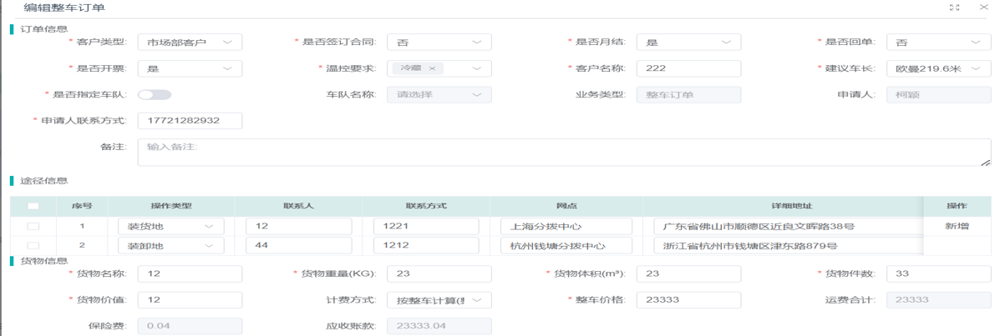
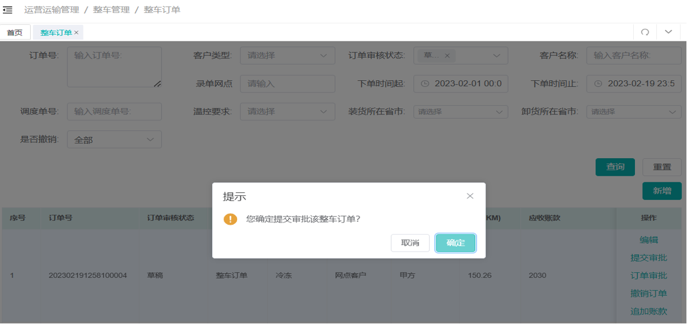
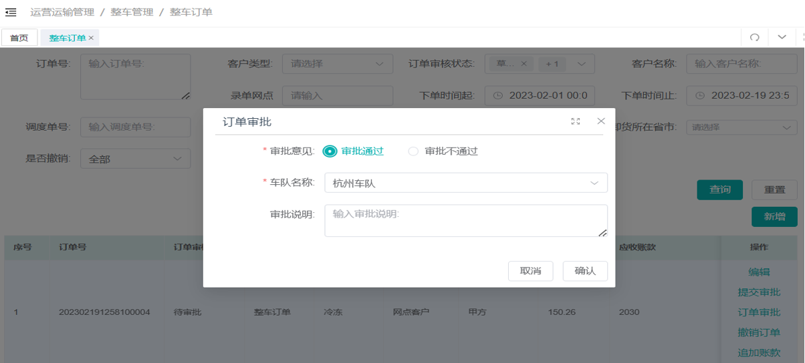
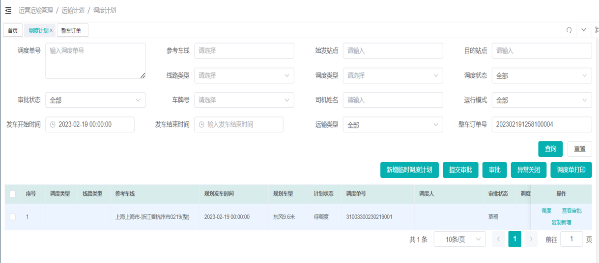
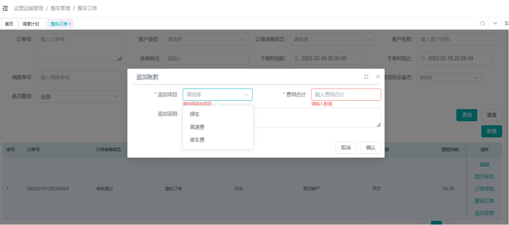
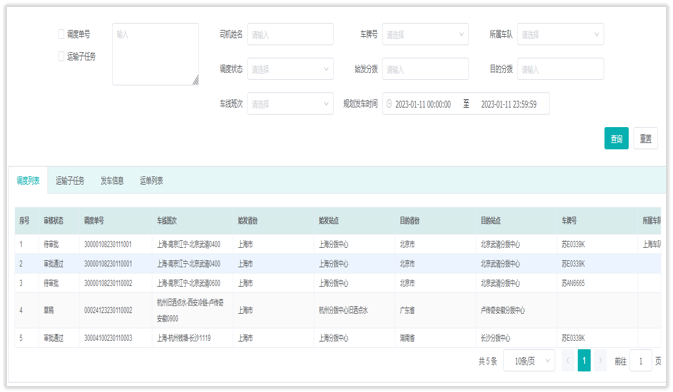

# 车辆交接

## 一、业务场景与名词解释

### 1.1 业务场景

本手册适用于总部调度、省区调度、交车司机、接车司机，分为PC鲸天调度后台创建交接任务、中通冷链司机小程序线上交/接车两大操作端。主要用于<strong>司机换人交接、月末加油交接</strong>两类场景，完成车辆燃油、里程、冷机工时、外观车况核验、线上提交确认、异常上报、人员转交全流程闭环，实现车辆交接数据线上留痕、权责清晰划分，规避车辆损耗、油费纠纷。

### 1.2 核心名词解释

- <strong>换人交接</strong>：司机班组更换、车辆移交其他驾驶员，需要完整核验车辆全部车况、里程、冷机数据的交接类型。
- <strong>月末加油交接</strong>：月度固定满油交接，仅需完成满油核验与交车提交，无接车确认环节。
- <strong>交车司机</strong>：当前持有车辆、发起交车操作的在岗驾驶员。
- <strong>接车司机</strong>：接收车辆、核验车况并完成接车确认的新驾驶员。
- <strong>ENG小时/SON小时</strong>：车辆两套冷机运行累计工时，由车载设备自动同步至小程序。
- <strong>车辆交接照片</strong>：交接必填影像凭证，包含车头、左右两侧、车尾、工具箱、撑杆隔温板、仪表盘码表。
- <strong>转交功能</strong>：交接任务中途更换对接人员，仅支持中心/集配人员线上转交，司机更换需在PC后台修改。
- <strong>抄送提醒</strong>：车辆交接完成后，钉钉鲸天审批中心推送流程抄送通知，管理人员可查看完整交接记录。
- <strong>车辆状态</strong>：分为启用（司机在运营）、闲置（停放在分拨/集配，无司机使用）。

## 二、前置准备与环境配置

1. <strong>账号权限</strong>

- PC端：鲸天系统账号，开通【运营运输管理-车辆管理-车辆交接】调度权限；
- 移动端：司机微信登录<strong>中通冷链司机版</strong>，账号已绑定对应车辆，自动开放车线任务-车辆交接功能。

2. <strong>设备权限</strong> 手机需开启小程序<strong>定位、相机、相册</strong>，用于拍摄车辆交接照片；车载冷机设备保持通电，保证工时数据正常读取。
3. <strong>配套入口</strong>

- PC后台：鲸天系统 → 运营运输管理 → 车辆管理 → 车辆交接；
- 小程序：中通冷链司机版 → 底部【车线任务】。

## 三、场景化标准操作步骤

### 3.1 场景一：PC调度后台 创建车辆交接任务

- 系统路径：鲸天系统 → 运营运输管理 → 车辆管理 → 车辆交接

1. 选择<strong>车辆号码</strong>，系统自动带出该车绑定调度单号、班次、原有主副驾信息；
2. 选择<strong>任务类型</strong>：换人交接/月末加油交接；
3. 填写接车主驾、接车副驾人员信息；
4. 选定<strong>交接地点</strong>（分拨/途径站点，系统校验交接位置合规性）；
5. 填写期望<strong>交接日期</strong>，系统用于校验后续运输任务冲突；
6. 全部信息填写完成后提交，任务下发至对应司机小程序【车线任务】列表。

### 3.2 场景二：交车司机小程序提交交车（换人/加油交接通用）

- 系统路径：中通冷链司机版 → 底部【车线任务】→ 车辆交接卡片

1. 进入车线任务页面，找到待交接车辆卡片，向右滑动【交车】滑块进入交车详情；
2. 系统自动读取仪表盘码表里程、ENG/SON冷机工时、加油时间；若识别里程错误，手动修改数值；冷机工时读取失败，检查冷机供电后刷新页面；
3. 拍摄并上传全套车辆照片：车头、车辆左侧、车辆右侧、车尾、工具箱、撑杆与隔温板、码表截图；
4. 核对接车人员、交接地点、各项数据无误；如需更换对接人，点击【转交】，搜索并选择目标人员确认；
5. 确认无车辆问题后，点击【提交】完成交车操作；

- 月末加油交接：交车提交后流程直接完结，无需接车确认；
- 换人交接：交车提交完成，等待接车司机核验确认。

### 3.3 场景三：接车司机小程序核验并确认接车（仅换人交接）

- 系统路径：中通冷链司机版 → 底部【车线任务】→ 车辆交接卡片

1. 在任务列表滑动【接车】滑块，进入车辆交接详情页；
2. 逐项核对：车辆总里程、ENG冷机工时、SON冷机工时、加油记录、全套车辆照片；
3. <strong>无车辆异常</strong>：直接点击【提交】，接车确认完成，整单车辆交接闭环；
4. <strong>发现车辆破损、设备故障、油量异常等问题</strong>：

① 点击页面【异常上报】；

② 选择异常分类，拍摄故障实拍图片，填写100字内异常描述；

③ 提交异常记录后再完成接车确认，异常数据同步后台存档。

### 3.4 场景四：交接任务人员转交操作

1. 交车/接车详情页面底部点击【转交】按钮；
2. 在人员搜索框输入姓名/手机号，筛选交接地点所属调度、集配工作人员；
3. 选中目标转交人员，点击【确认】完成线上转交；

备注：司机之间更换交接人，不可小程序转交，必须前往PC鲸天后台修改交接人员。

### 3.5 场景五：管理人员查看抄送交接流程（钉钉鲸天审批中心）

1. 钉钉接收流程抄送推送消息，点击【查看详情】；
2. 进入审批中心车辆交接页面，查看交车提交时间、接车提交时间、参与人员、车辆牌照、交接类型；
3. 可查看完整交接影像、里程工时、异常上报记录，用于对账、责任追溯。

### 3.6 场景六：PC后台车辆状态查询

- 系统路径：鲸天系统 → 车辆管理 → 车辆信息

1. 筛选条件：车牌、车队、车辆状态（闲置/启用）、证件有效期；
2. 列表字段说明：

- 启用：车辆分配司机，处于运营状态；
- 闲置：车辆停放在指定分拨/集配，无在岗司机；
- 停靠地点：闲置车辆固定停放园区；

3. 支持车辆信息编辑、导出台账、年审/运输证过期预警查看。

## 四、常见异常与兜底方案

| 序号 | 异常现象 / 报错提示 | 常见原因 | 解决方案 |
|------|---------------------------|------------|------------|
| 1 | 小程序看不到车辆交接任务 | 调度未在PC后台下发、车辆未绑定本人账号、定位异常 | 1. 联系调度重新下发交接任务；2. 核对车辆绑定司机手机号；3. 开启小程序定位权限，刷新车线任务。 |
| 2 | 冷机ENG/SON工时读取为空 | 冷机设备断电、车载终端离线 | 1. 检查冷机供电开关，通电等待5分钟；2. 退出页面重新进入同步数据。 |
| 3 | 码表里程识别错误 | 照片模糊反光 | 手动修改正确里程数值，重新拍摄清晰仪表盘照片备用。 |
| 4 | 无法上传车辆交接照片 | 小程序无相机权限 | 小程序设置中开启相机、相册权限，重新拍摄上传。 |
| 5 | 转交功能找不到目标司机 | 转交仅支持中心/集配人员，司机不可线上转交 | 前往鲸天PC后台车辆交接页面，手动更换接车/交车司机。 |
| 6 | 接车无法提交，提示存在未上报车况 | 车辆存在破损未走异常上报流程 | 先完成异常图片+文字报备，再提交接车确认。 |
| 7 | 月末加油交接提交后仍显示待处理 | 任务类型选错（选为换人交接） | 联系调度撤回任务，重新创建「月末加油交接」任务。 |
| 8 | 钉钉收不到交接抄送通知 | 审批权限未分配、消息屏蔽 | 联系后台管理员开通流程抄送查看权限，解除消息拦截。 |

## 五、高频常见问题（FAQ）

### 5.1 Q1 换人交接和月末加油交接流程区别是什么？

A：月末加油交接只需交车司机满油拍照提交，流程直接结束，不需要接车司机确认；换人交接必须交车提交 + 接车核验确认两步才算完成。

### 5.2 Q2 交接拍照最少需要拍摄哪些部位？

A：车头、车身左侧、车身右侧、车尾、工具箱、撑杆隔温板、仪表盘码表，全部缺一不可，缺项无法提交。

### 5.3 Q3 车辆外观刮擦、冷机故障一定要上报吗？

A：必须在接车前走【异常上报】上传照片说明，未报备直接确认接车，后续故障损耗由接车司机承担。

### 5.4 Q4 中途更换司机，小程序转交能用吗？

A：不能，转交功能仅针对中心管理人员切换；司机换人交接，由调度在PC鲸天后台修改接车人。

### 5.5 Q5 车辆状态“闲置”代表什么？

A：车辆没有分配在岗司机，停放在对应分拨/集配中心，闲置车辆如需启用，调度创建交接任务分配司机即可。

### 5.6 Q6 交接完成后去哪里查历史交接记录？

A：管理人员可在钉钉审批中心抄送消息查看；司机可在车线任务【已完成】分类查看全部交接台账。

### 5.7 Q7 冷机工时一直不更新怎么办？

A：检查冷机电源是否正常通电，断电重启冷机，等待5分钟后重新进入交接页面同步数据。

### 5.8 Q8 交车忘记拍码表照片可以事后补传吗？

A：不可以，交车提交后无法二次修改照片，必须重新发起交接任务补齐凭证。
