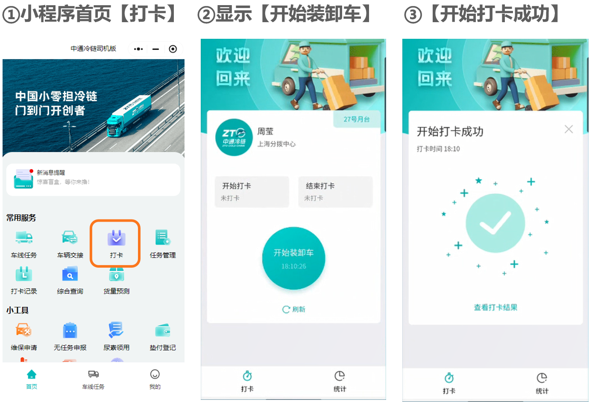
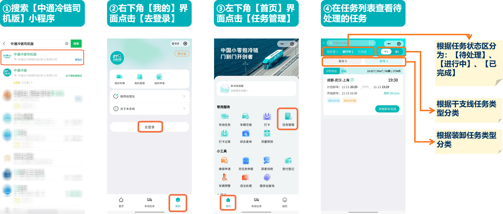

# 装卸任务

## 一、适用场景

本文适用于中通冷链分拨中心现场管理人员、装卸人员、扫描员、叉车工等岗位，依托**中通冷链司机版微信小程序**与**PDA手持设备**，规范车辆到港后**卸车、装车**全流程标准化作业。通过任务线上查看、人员打卡、封签核验、测温拍照、扫码分拣、现场验收等环节闭环管理，保障冷链货物温区合规、作业安全、数据可追溯，提升分拨中心装卸作业效率与管控能力。

### 1.1 核心名词解释

- **卸车任务**：运输车辆抵达分拨月台后，按流程完成单据交接、测温、分拣、入库的作业任务。
- **装车任务**：根据调度计划，完成货物集托、扫码、装车、封签、月台交接的出库作业任务。
- **封签**：用于锁定车厢、保障货物运输安全的铅封，卸车前必须核验封签完整性。
- **冷链测温标准**：冷藏货物温度标准 **2℃~8℃**，冷冻货物温度标准 **≤-15℃**。
- **集托**：将同流向、同温区货物码放至统一托盘，便于批量扫描、转运与装卸。
- **问题件**：作业中发现的破损件、有单无货、有货无单、无头件等异常货物。
- **劳务打卡**：装卸人员通过小程序完成上班打卡、单任务打卡，记录作业工时。
- **月台**：分拨中心车辆停靠、装卸货的专用作业区域。

## 二、前置条件

1. **账号与权限**：所有现场作业人员使用个人微信登录 **中通冷链司机版** 小程序；PDA设备使用专属工号登录。无账号或操作权限，请联系分拨中心管理员配置。
2. **设备与工具准备**：智能手机（用于小程序打卡、任务查看、拍照测温）、PDA手持终端、测温枪、三角木、托盘、封签、拍照设备、月台二维码。
3. **网络要求**：作业区域保证无线网络/移动信号稳定，PDA与小程序需联网同步数据。
4. **配套入口**：
   - 微信搜索进入：**中通冷链司机版** 小程序
   - 现场终端：分拨专用PDA设备

## 三、操作步骤

### 3.1 场景一：通用前置操作（任务信息查看 + 人员上班打卡）

系统功能路径：微信 → 中通冷链司机版小程序 → 我的 → 登录 → 首页 → 任务管理

1. 微信搜索 **中通冷链司机版**，点击右下角 **【我的】** → **【去登录】**，完成账号登录。
2. 进入小程序首页，点击 **【任务管理】**，查看 **待处理、进行中、已完成** 装卸任务。
3. 查看任务详情：核对车辆信息、预计到达时间、货量、温层、票件数，规划作业时长及对应月台。
4. 装卸人员提前完成上班打卡：首页点击 **【打卡】**，扫描分拨中心二维码，完成上班签到。

---

### 3.2 场景二：卸车全流程操作

完整流程：确认卸车信息 → 单据交接 → 引导车辆靠台 → 拍照测温 → 劳务任务打卡 → 现场卸车 → 清扫车厢 → 关闭月台门 → 卸车任务验收

#### (1) 确认卸车信息

1. 在 **【任务管理】** 筛选 **卸车** 类任务，按车辆预计到达时间排序查看。
2. 查看货量明细、流向、冷冻/冷藏温区、重量、体积、票件数量，提前规划月台与人力。
3. **时间标红**表示车辆晚于规划时间到达，需重点跟进超时车辆。

#### (2) 单据交接

1. 车辆抵达分拨中心，任务状态显示 **待靠台**。
2. 点击任务内车牌号，获取司机联系方式，对接完成纸质/电子单据核对交接。

#### (3) 引导车辆靠台

1. 现场人员引导车辆驶入指定月台规范停靠。
2. 司机在小程序提交 **靠台** 操作，页面状态更新为 **已靠台待卸车**，现场方可开展作业。

#### (4) 拍照测温（冷链必做）

1. 进入卸车编辑页面，填写 **封签号、月台号**，选择对应装卸工、扫描工、叉车工。
2. **封签拍照**：拍摄车辆尾部完整封签照片，确认封签完好无破损、无撬动痕迹。
3. 车轮前后垫放 **三角木**，做好安全防护，再打开车厢门。
4. **车厢拍照**：拍摄车厢内货物全景照片留存。
5. **货物测温**：将车门/隔温板开启缝隙，使用测温枪检测货物表面温度：
   - 冷藏标准：**2℃~8℃**
   - 冷冻标准：**≤-15℃**
   - 温度达标方可正常卸车；温度不达标，等待温度恢复标准后再作业。
6. 将测温结果、现场照片依次上传至小程序。

#### (5) 劳务任务打卡

1. 装卸人员在小程序首页点击 **【打卡】**，扫描当前 **月台二维码**。
2. 点击 **【开始装卸车】**，提示打卡成功，仅限本任务分配人员打卡。

#### (6) 现场卸车（PDA操作 + 现场作业）

1. 打开PDA设备，进入 **【卸车任务】**，选择对应月台任务，点击 **【集托】** 开始作业。
2. 规范码托要求：
   - 严禁不同温区货物混放；
   - 遵循 **重不压轻、大不压小** 原则；
   - 禁止踩踏货物；
   - 所有货物 **100% 上托盘**，不得直接接触地面；
   - 同票货物同位摆放。
3. 逐票扫描：使用PDA对所有货物100%逐票扫描；带托货物使用临时托盘转运。
4. **异常处理**：发现破损件、有单无货、有货无单、无头件，立即在PDA **【问题件登记】** 上报，并现场处理。
5. **移动入库**：扫描完成后，根据流向将货物转运至对应库区，扫描库区二维码完成入库；货物穿堂停留时长不得超过 **30 分钟**，严禁单票多库区混放。

#### (7) 清扫车厢

整车货物完全卸出后，及时清理车厢内杂物、垃圾、残留货物，保证车厢整洁。

#### (8) 关闭月台门

车厢清理完毕、车辆准备离场后，现场关闭月台门。

#### (9) 卸车任务验收

1. 在小程序/PDA查看卸车数据，区分 **完成卸车并入库、完成卸车未入库、未卸出货物、运单差异** 四类状态。
2. 核对实际货量、票数、件数与系统数据，存在差异及时登记上报。
3. 全部核对无误后，确认任务完成，系统更新为 **已完成**。

---

### 3.3 场景三：装车全流程操作

完整流程：接收装车任务 → 核对装车单据 → 货物集托分拣 → 劳务任务打卡 → 现场装车 → 封签核验 → 拍照留存 → 车辆离场 → 装车任务验收

#### (1) 接收装车任务

1. 小程序 **【任务管理】** 筛选 **装车** 任务，查看调度线路、目的站点、货量、温层、车辆、月台信息。
2. 核对装车单据、运单明细，确认货物流向、票件、温区与任务一致。

#### (2) 货物集托分拣

1. 根据装车线路、温区对货物分类集托，严格区分冷冻、冷藏货物，禁止混托。
2. 按照 **重下轻上、大下小上** 规范码托，易碎、易损货物单独摆放防护。
3. 使用PDA逐票扫描待装车货物，核对运单信息，异常件提前登记隔离。

#### (3) 劳务任务打卡

装卸、扫描、叉车人员扫描月台二维码，完成 **装车任务打卡**。

#### (4) 现场装车

1. 引导车辆停靠指定月台，车轮垫放三角木，做好安全防护。
2. 按照装车顺序、流向依次装车，合理规划车厢空间，货物摆放稳固，防止运输倾倒、破损。
3. 装车过程全程使用PDA扫码复核，确保票、货、单三者一致。

#### (5) 封签与拍照留存

1. 货物全部装车完毕，关闭车厢门，现场施加新封签，记录封签编号。
2. 拍摄 **车厢全貌、封签特写** 照片，上传至小程序存档。
3. 核对车厢温度，确认符合冷链运输标准。

#### (6) 车辆离场

1. 再次核对单据、货物、封签无误后，司机办理交接手续。
2. 现场移除三角木，引导车辆驶离月台。

#### (7) 装车任务验收

1. 操作人员在小程序/PDA内提交装车完成，核对装车总量、票数、件数。
2. 存在货差、破损、漏装等问题，立即上报管理人员并登记异常。
3. 任务状态更新为 **已完成**，整项装车作业结束。

## 四、操作结果

- **卸车任务**：系统更新为 **已完成**，数据区分为完成卸车并入库、完成卸车未入库、未卸出货物、运单差异四类，实际货量、票数、件数与系统一致。
- **装车任务**：系统更新为 **已完成**，装车总量、票数、件数与单据一致，不存在货差、破损、漏装等异常。

## 五、注意事项

::: danger 重点提醒

- **测温不达标禁止卸车**：冷链货物温度未达到标准（冷藏2℃~8℃，冷冻≤-15℃）时，禁止开门装卸，需等待温度恢复。
- **封签异常立即停止作业**：发现封签破损、缺失、撬动痕迹，第一时间多角度拍照留存，停止作业并上报现场负责人。
- **禁止货物直接接触地面**：所有货物必须100%上托盘，严禁直接放在地面上。
- **严禁不同温区混放**：冷冻、冷藏货物必须严格区分码托、集托和装车。
- **严禁单票多库区混放**：卸车入库时，一票货物只能放到一个库区。
- **货物穿堂停留不得超过30分钟**：卸车后需及时转运至对应库区。
:::

::: warning 注意事项

- **任务时间标红**表示车辆晚于规划时间到达，需重点跟进超时车辆。
- **劳务打卡**：参与装卸任务的所有人员均需扫描月台码完成任务打卡，用于工时与作业人员追溯。
- **照片上传要求**：封签、车厢、测温照片均需按要求上传至小程序，作为作业凭证与追溯依据。
- **异常处理**：作业中发现问题件（破损件、有单无货、有货无单、无头件），立即在PDA【问题件登记】上报并隔离存放，禁止继续装车/入库。
- **码托原则**：遵循重不压轻、大不压小；易碎、易损货物单独摆放防护。
:::

## 六、常见问题

### 6.1 常见异常与兜底方案

| 序号 | 异常现象 / 报错提示 | 常见原因 | 解决方案 |
|------|---------------------------|------------|------------|
| 1 | 小程序无法查看装卸任务 | 账号无权限、网络中断、未登录账号 | 1. 确认账号已正常登录；2. 切换稳定网络，刷新页面；3. 联系管理员开通任务查看权限。 |
| 2 | PDA无法扫描、数据不同步 | PDA断网、设备卡顿、任务未下发 | 1. 检查PDA网络，重启设备；2. 刷新任务列表，等待后台数据同步；3. 联系调度重新下发任务。 |
| 3 | 货物测温不达标（温度超标） | 车厢预冷不足、货物脱温 | 暂停装卸作业，等待车厢降温至标准区间；溯源货物转运环节，登记异常上报。 |
| 4 | 封签破损、缺失、被撬动 | 运输途中异常、封签人为损坏 | 立即拍照留证，登记异常问题件，同步上报分拨负责人与对应调度。 |
| 5 | 有货无单/有单无货、票件不符 | 分拣错误、漏扫、单据异常 | 停止作业，使用PDA登记问题件，逐票复盘核对，补齐单据或找回漏货。 |
| 6 | 人员无法完成劳务打卡 | 二维码失效、不在任务人员名单、定位异常 | 1. 重新刷新月台二维码；2. 联系管理员添加作业人员名单；3. 开启小程序定位权限。 |
| 7 | 货物混温区、码放不规范 | 作业人员操作不规范 | 立即重新分拣、重新码托，严格按照冷冻/冷藏分区作业，现场管理人员现场督导。 |
| 8 | 任务列表为空 | 调度未下发装卸任务、筛选条件错误 | 1. 取消筛选，重新查询；2. 联系调度确认是否已下发对应任务。 |

### 6.2 高频FAQ

**Q1：冷链货物测温标准是多少？温度不达标可以直接作业吗？**
A：冷藏货物标准 **2℃~8℃**，冷冻货物标准 **≤-15℃**；温度不达标禁止开门装卸，需等待温度恢复至标准范围。

**Q2：封签核验有问题该怎么处理？**
A：发现封签破损、缺失、撬动痕迹，第一时间多角度拍照留存，停止作业并上报现场负责人，按异常件流程登记处理。

**Q3：装卸作业发现破损货、无头件如何操作？**
A：立即使用PDA进入 **【问题件登记】** 模块上报，单独隔离存放，禁止继续装车/入库，同步告知管理人员。

**Q4：劳务打卡必须每一个装卸人员都打卡吗？**
A：是的，参与本次装卸任务的所有人员均需扫描月台码完成任务打卡，用于工时与作业人员追溯。

**Q5：货物可以直接放在地面上吗？**
A：不可以，所有货物必须100%上托盘，严禁直接接触地面，同时遵循重不压轻、大不压小原则。

**Q6：货物入库后在穿堂区域最长能停留多久？**
A：货物穿堂停留时间不得超过30分钟，需及时转运至对应库区。

**Q7：装车、卸车照片、测温记录需要上传吗？**
A：需要，封签、车厢、测温照片均需按要求上传至小程序，作为作业凭证与追溯依据。

**Q8：任务显示数据和实际货量不一致怎么办？**
A：暂停收尾验收，逐票扫码复盘核对，查找差异原因，登记异常并上报管理人员处理。