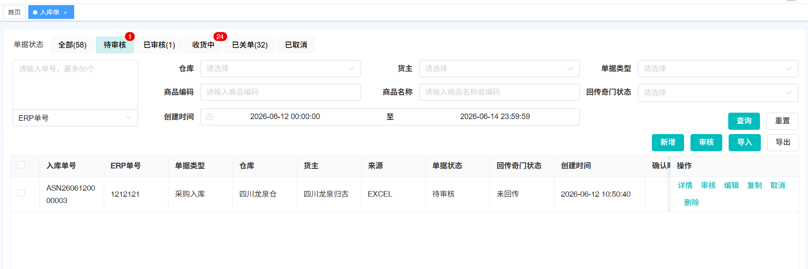

# 单据出库单(2B)

## 一、适用场景

本文适用于在 OMS 中处理 **出库单(2B)** 的业务场景：

- **ERP客户**：ERP 完成对接后，在 ERP 创建 **出库单(2B)**，并同步到 OMS。
- **非ERP客户**：直接在 OMS 手动创建或导入 **出库单(2B)**。

### 1.1 单据业务流程图

## 二、前置条件

操作前请确认：

1. 已具备鲸天系统登录账号。
2. 已开通 **OMS订单中心 > 出库管理 > 出库单(2B)** 相关菜单权限。
3. ERP 客户需已完成 ERP 与 OMS 的对接。
4. 非 ERP 客户需提前准备出库单创建或导入所需信息。

## 三、操作入口

- **系统功能路径**：`登录系统` -> `进入左侧菜单栏` -> `[OMS订单中心]` -> `[出库管理]` -> `[出库单(2B)]`
- **快捷直达链接**：👉 [[出库单（2B)-鲸天系统](https://wms.ztocc.com/app/#/send/issue)]

## 四、操作步骤

### 4.1 ERP客户处理出库单(2B)

1. 在 **ERP** 中创建 **出库单(2B)**，系统会将出库单同步到 **OMS**。

   

2. **OMS** 接收出库单后，系统会自动同步到 **WMS**。

3. **WMS** 出库单出库完成后，系统会自动回传出库信息到 **OMS**，再由 **OMS** 回传出库信息到 **ERP**。

### 4.2 非ERP客户处理出库单(2B)

1. 进入 **出库单(2B)** 页面，点击 **新增** 或 **导入**。

2. 按要求填写出库单信息。

   **头表信息**包括：

   - **货主**
   - **仓库**
   - **单据类型**
   - **外部单号**
   - **物流公司**
   - **物流单号**
   - **备注**
   - **联系人**
   - **联系电话**
   - **收件省**
   - **收件市**
   - **收件区**
   - **详细地址**
   - **详细地址明细信息**

   **明细信息**包括：

   - **商品**
   - **商家系统编码**
   - **商家商品编码**
   - **总数量**
   - **二级单位**
   - **最小单位**

3. 新增或导入文件中的必填信息填写完成后，点击保存，返回 **出库单(2B)** 列表。

   

4. 在列表中点击 **审核**。审核后，OMS 接收 **出库单(2B)**，并自动同步到 **WMS**。

   

5. 如需调整出库单信息，点击 **编辑**，重新编辑 **出库单(2B)** 信息。

6. 如需创建相同类型的订单，可点击 **复制**。复制后支持重新编辑 **出库单(2B)** 信息。

7. 如创建的出库单有问题，可点击 **取消**，取消该 **出库单(2B)**。

8. **WMS** 出库单出库完成后，系统会自动回传出库信息到 **OMS**，再由 **OMS** 回传出库信息到 **ERP**。

## 五、操作结果

完成以上操作后：

- ERP 客户创建的 **出库单(2B)** 会同步到 **OMS**，并自动同步到 **WMS**。
- 非 ERP 客户在 OMS 新增或导入的 **出库单(2B)**，审核后会自动同步到 **WMS**。
- WMS 出库完成后，出库信息会自动回传到 **OMS**，再由 **OMS** 回传到 **ERP**。

## 六、注意事项

::: danger 重点提醒
- **OMS仓库开启库存管理**后，OMS 接单或审核时会校验 **可用库存** 是否足够。
- 库存校验看的是 **可用库存**，不是 **总库存**。
- 若可用库存不足，单据状态会更新为 **缺货**，且不会推送到 WMS。
:::

::: warning 注意事项
- 若新增或导入后发现信息有误，可使用 **编辑** 调整。
- 若需要创建相同类型订单，可使用 **复制** 后再编辑。
- 若出库单创建有问题，可使用 **取消** 取消单据。
- 若单据状态为 **待仓库确认报价**，且实际不需要仓库报价，需取消单据后，由 ERP 重新推单或重新新增。
:::

## 七、常见异常与兜底方案

| 序号 | ❌ 异常现象 / 报错提示 | 🔍 常见原因 | 🛠️ 解决方案 |
|------|-------------------------------|-----------------|--------------------|

## 八、常见问题

**Q1：导入时提示商品二级单位未维护，怎么办？**

A：需要在 WMS 中维护商品单位。维护后商品单位会自动同步到 OMS，可重新导入入库单。

**Q2：导入时提示单据【xxx】已存在，怎么办？**

A：当前导入的货主单据号已存在，不能重复导入。需要更新单据号后重新导入。

**Q3：导入时提示商品【xxx】不属于货主【xxx】，怎么办？**

A：导入的商品明细中的商品不是该货主的商品。请检查导入数据信息，更新后重新导入。

**Q4：ERP 下发单据或新增单据审核后，为什么 OMS 单据状态是缺货，但 OMS 中库存看起来足够？**

A：OMS 仓库开启库存管理后，在 OMS 接单或审核后会校验可用库存是否足够。若不足，单据状态会更新为 **缺货**，且不会推送 WMS。校验 OMS 库存是否足够时，校验的是 **可用库存**，不是 **总库存**。

**Q5：缺货状态下的单据如何处理？**

A：需要与客户确认是否继续出货：

1. 若继续出货：通知客户补货后重新审核，单据可同步到 WMS 继续出货。
2. 若不继续出货：取消单据。

**Q6：什么情况下单据状态会是待仓库确认报价？如果不需要仓库报价，要如何处理？**

A：在 OMS 的 **仓库管理** 及 **货主管理** 中同时开启报价确认时，ERP 推单或新增审核后，单据状态会变为 **待仓库报价**。若发现不需要仓库报价，需取消单据后，由 ERP 重新推单或重新新增。