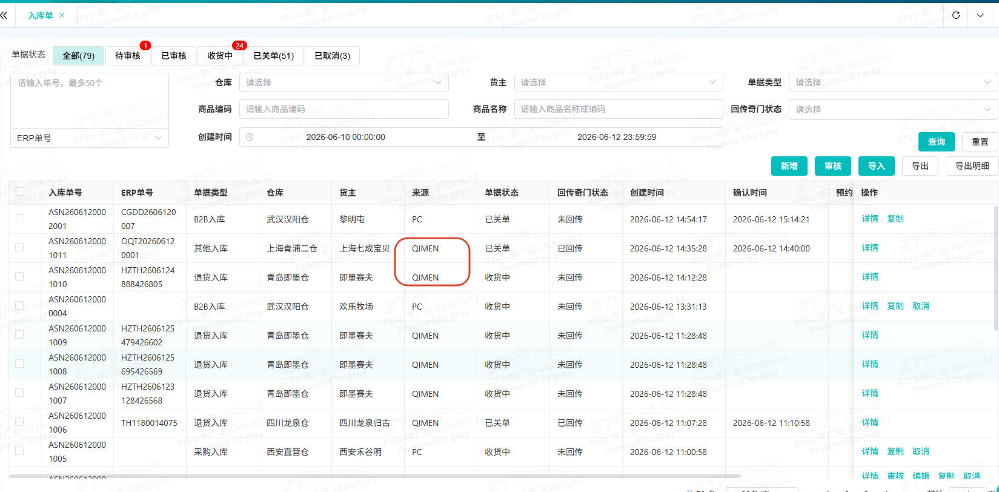

# \[基础数据/客户管理\] 操作说明书

**📌 文档基本信息**

---

## 业务场景与名词解释

### 业务场景（为什么用？）

- 仓库发起客户入参流程需要配置新的货主信息时新增

### 核心名词解释（不迷路）

---

## 前置准备与环境配置

- **配套工具/链接**：
- 🌐 官方系统登录入口：👉 \[[https://wms.ztocc.com/app/#/base/customer](https://wms.ztocc.com/app/#/base/customer)\]

---

## 场景化标准操作步骤（怎么用？）

### 场景一：\[新增货主\]

- **系统功能路径**：`登录系统` -\> `进入左侧菜单栏` -\> `[OMS订单中心]` -\> `[基础数据]` -\> `[客户管理]`
- **快捷直达链接**：👉 \[[https://wms.ztocc.com/app/#/base/customer](https://wms.ztocc.com/app/#/base/customer)\]

#### 核心操作步骤：

1. **\[新增货主\]** 1.1，进入页面后，点击上方**新增**按钮1.2，按照要求填写信息：仓库，货主编码，货主名称，销售负责人，行业，货主类型，货主种类，企业类型，默认物流公司，合伙人/网点，erp编码，erp类型，启用报价确认等**特殊字段说明：**仓库：货主需要把商品存的仓库，可多选erp编码：erp对接时与erp约定的对接编码开启报价确认：若是需要仓库对网点报价时开启，若是不需要则关闭
2. **\[WMS对接\]**OMS创建货主保存-\>自动同步货主信息到WMS中
3. **\[ERP对接\]**

若是需要ERP对接，创建货主后-\>点击详情-\>获取对接参数-\>把对接信息给到ERP请求对接

---

---

## 常见异常与兜底方案（卡住了怎么办？）

| 序号 | ❌ 异常现象 / 报错提示 | 🔍 常见原因 | 🛠️ 解决方案 |
|------|-------------------------------|-----------------|--------------------|

---

## 高频常见问题（FAQ）

- **Q1：\[问题1\]**
- **A**：\[回答1\]
- **Q2：\[问题2\]**
- **A**：\[回答2\]