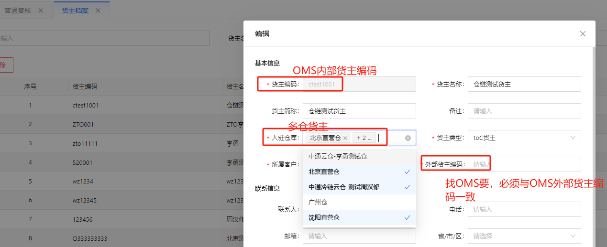
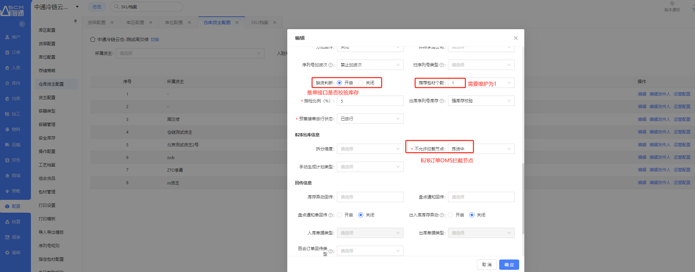
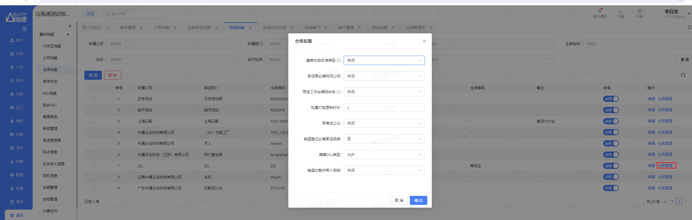
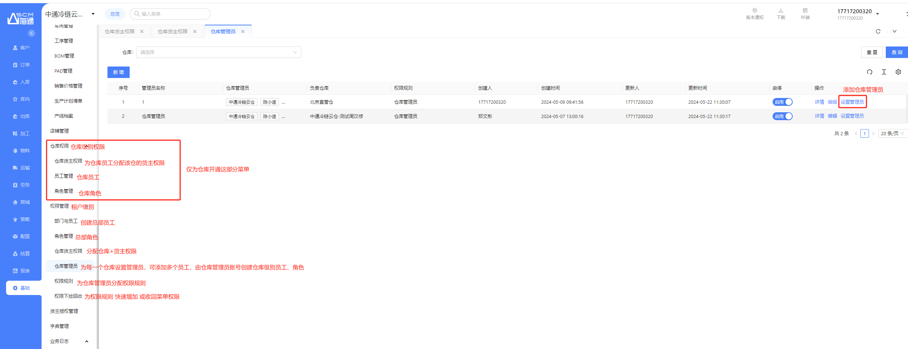
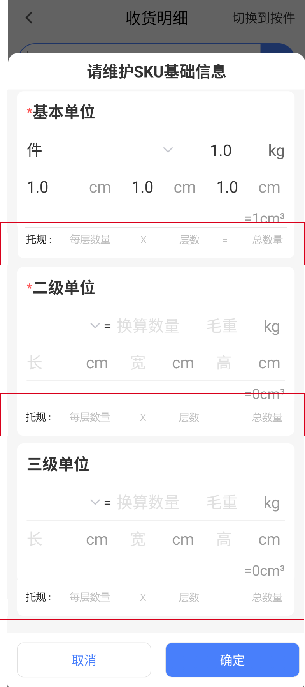
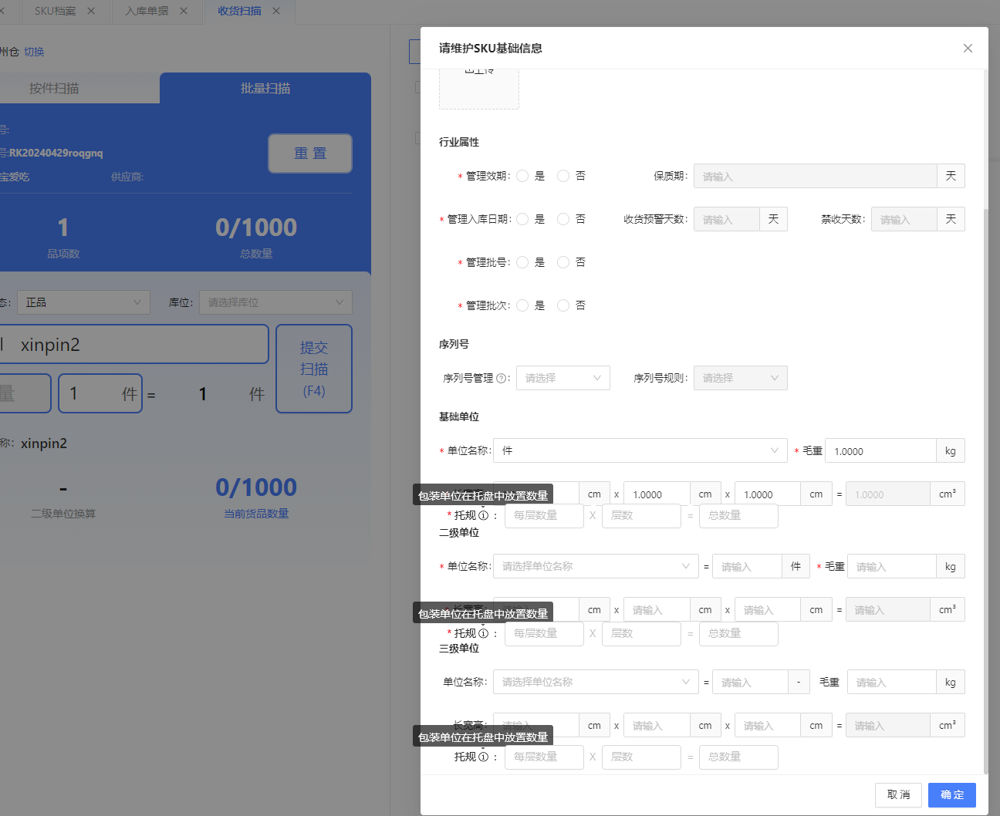
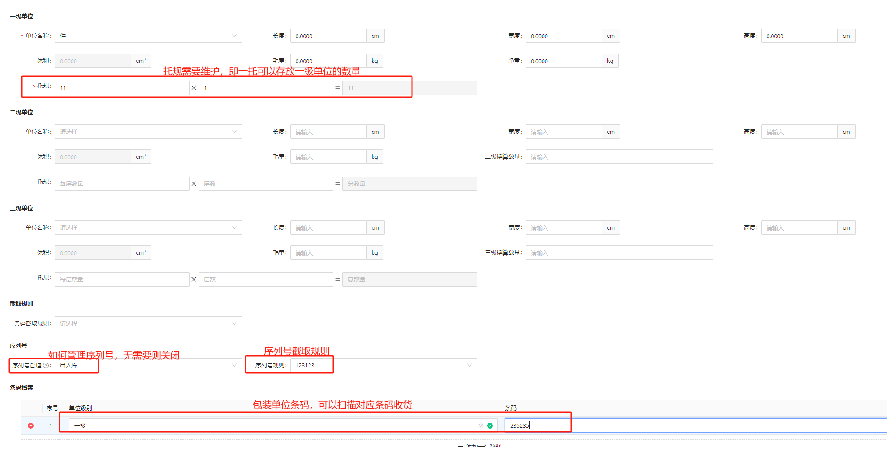
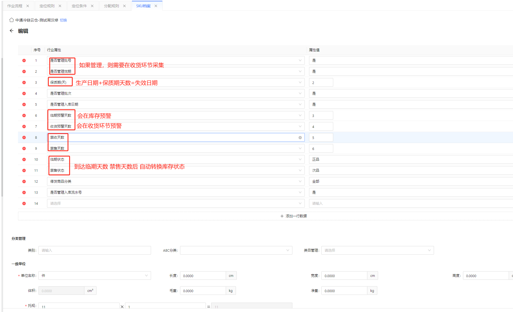
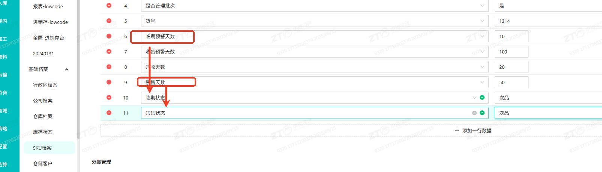

# 2C出库作业\_操作说明书

📌 **文档基本信息**

本文档仅覆盖B2C出库流程，包括出库订单（上游推单/手动建单）→ 出库包裹 → 加入波次 → 拣货 → 复核 → 称重 → 发运 的完整链路。

## 业务场景与名词解释

### 业务场景（为什么用？）

1. B2C出库是WMS最核心的出库流程，覆盖从上游订单下达到最终发运的全链路。操作人员需要在PC端和PDA端协同完成出库包裹处理、波次组单、拣货、复核、称重等环节。
2. 出库效率直接影响发货时效和客户体验，正确理解各环节配置和操作规则至关重要。

### 核心名词解释（不迷路）

- **出库包裹：**上游推送出库订单后，系统自动生成出库包裹，是出库操作的基本单位。
- **加入波次：**将出库包裹按预设的波次规则组波，生成拣货任务，是拣货前的必要步骤。
- **波次：**订单批量处理的组波单元。批量波次（订单结构一致的订单）和散单波次（无规律订单），不同类型拉动不同出库流程。
- **拣货任务：**波次释放后生成的拣货工作指令，可在PDA端领取执行。
- **复核：**出库包裹打包前的最终校验环节，扫描货品确认出库正确性。分为普通复核、批量复核、货找单复核、播种复核四种模式。
- **称重：**复核打包后的称重校验环节，验证实际重量与理论重量差异。
- **发运：**出库包裹完成所有流程节点后自动触发发运，将状态回传上游。
- **拦截：**上游通过接口拦截出库包裹的功能，不同节点拦截后的处理方式不同。
- **回库：**已下架的出库包裹作废后，货品需返回库位的操作。
- **补货分析：**对比包裹需求数量与拣选区可用数量，缺货时创建从存储区到拣选区的补货任务。

## 前置准备与环境配置

- **系统配置要求**：已完成作业流程、操作配置、波次规则、承运方案等策略配置。
- **设备要求**：PC端操作（波次管理、打印）\+ PDA端操作（拣货、复核、称重）。
- **硬件要求**：PDA设备、蓝牙秤（称重环节）、打印机（面单/拣货单/发货单）。
- **前置条件**：上游已完成出库订单推送，出库包裹状态为"待处理"。

## 场景化标准操作步骤（怎么用？）

### 场景一：出库包裹处理

1. **系统功能路径**：出库 -\> 出库包裹

#### 1\. 系统自动预处理：

出库包裹生成后，系统按以下顺序自动预处理：

2. 根据预设规则自动拆合包（查询拆包规则）
3. 查询并确定作业流程，即后续需要执行的出库流程（复核、打包、称重）
4. 分配承运公司（根据承运方案分配）
5. 自动取单（查询承运商配置取号）
6. 自动获取推荐包装方案（上游指定/指定货品结构/推荐惯用/最新包装方案多种逻辑）
7. 定义时效产品（查询时效产品管理）

#### 2\. 手动可选操作：

- 手动拆合包、变更承运公司/产品类型/增值服务、变更作业流程
- 重新获取面单、获取推荐包装方案、指定包装方案
- **补货分析**：对比包裹需求数量与拣选区可用数量，缺货时可手动创建从存储区到拣选区的补货任务
- 如不需要取号或已有可用单号，可编辑录入单号（自提单手动录入自提单号用于交接扫描）

**完成取号且库存充足后即可加入波次。**

**作废**：卡单后可作废。配置节点允许在复核后作废，直接返架。

### 场景二：加入波次

8. **系统功能路径**：出库 -\> 加入波次

#### 操作步骤：

9. **筛选订单加入波次**

在出库包裹页面筛选待处理的包裹，点击"加入波次"。

10. **包裹汇单，选择波次规则，组波**

选择波次规则，可使用预分配功能根据库区区域汇波。

11. **波次汇单 — 所见即所得**

波次汇单页面可看到创建波次结果，所见即所得。波次会自动运行：分配 → 分组 → 创建拣货任务。

12. **释放波次**

波次默认处于锁定状态，此时仍可审单、拦截。确认无误后，需要释放波次，才可执行对应拣选任务。

波次管理页可打印拣货单/快递单/发货单，释放任务。

### 场景三：拣货任务执行

13. **系统功能路径**：出库 -\> 拣货任务 或 PDA-散单拣货

#### 方式一：纸质单拣货

打印拣货单，线下完成拣货后，回到电脑端确认拣货任务。

#### 方式二：PDA拣货（推荐）

操作流程：散单拣货 → 领取拣货任务 → 扫描库位、货品编码（不区分大小写）→ 提交 → 继续未完成任务明细，直到全部完成。

可以分配给某人，也可在PDA自由领取任务。

**PDA操作规则**：可在【配置-操作配置-拣货】设置是否校验库位、货品编码、数量，以及是否首件扫描、逐件扫描。

#### 散单拣货实操演示步骤：

PDA需要手动输入：输入数量、如货品没有贴条码则手动输入货品条码回车、提交按钮。

| **序号** | **描述** | **备注** | **截图** |
|----------|----------|----------|----------|
| 1 | 领取面单 | 3楼打单送到4楼，仅3个货主试运行新系统 |  |
| 2 | 根据面单序号分配到拣选车框 | 需要核对面单序号和框编号 |  |
| 3 | 打开散单拣货 | |  |
| 4 | 扫描运单号 | 扫描运单号可查询拣货任务 |  |
| 5 | 领取拣货任务 | 先领取 |  |
| 6 | 扫描库位 | 边拣边分，按照拣货顺序先引导到第一个拣货库位 |  |
| 7 | 扫描货品 | 当有货品没有条码需手动输入；存在多个条码认准69码 | |
| 8 | 逐件扫或输入数量 | | |
| 9 | 拣选足够数量，并分播到每个拣选框 | | |
| 10 | 提交 | | |
| 11 | 扫描下一个库位 | | |
| 12 | 扫描货品 | | |
| 13 | 逐件扫或输入数量 | | |
| 14 | 拣选足够数量，并分播到每个拣选框 | | |
| 15 | 提交 | | |
| 16 | 直到完成拣选 | |  |

批量单为订单一样的波次，拣货比较简单，不需要二次分拣，可以走批拣、批量复核、批量称重。

### 场景四：复核

14. **系统功能路径**：PC 端散单复核

#### 前置操作：扫描工作台号

工作台号来源：容器类型-基本类型-工作台（使用环节-出库）；工作台配置。

#### 四种复核模式：

- **普通复核：**散单波次边拣边分后的复核，最常用模式。
- **批量复核：**批量单波次复核，仅订单结构一致的波次可用。
- **货找单复核：**单品单件波次复核，配合后置打单使用，扫描一件货品即打出一个面单。
- **播种复核：**总拣后需要二次分拣的场景使用播种复核。

#### 复核作业流程：

| **序号** | **流程** | **说明** | **页面截图** |
|----------|----------|----------|----------------|
| 1 | 打开普通复核扫描容器进入复核页面 | |  |
| 2 | 关联打包员 | |  |
| 3 | 扫描面单（后置打单可扫任务号/容器/波次号/包裹号）定位某一包裹 | |  |
| 4 | 逐件扫描货品 | |  |
| 5 | 扫描箱型 | |  |
| 6 | 自动完成该单复核（后置打单则自动打印面单） | | |
| 7 | 操作打包 | |  |
| 8 | 贴单 | | |

### 场景五：称重

15. **系统功能路径**：PC端称重模块

#### 散单称重操作：

连接蓝牙，选择称重设备，自动读取称重。扫描包裹面单则自动提交。

#### 批量称重

仅针对批量波次，称重一单后整个波次完成。

### 场景六：发运

根据作业流程配置，在发运的上一个节点（通常为称重）完成后，系统会自动发运，无需人工操作。

## 常见异常与兜底方案（卡住了怎么办？）

#### 场景一：订单拦截

订单拦截后会进入异常单管理列表，异常确认后会取消拦截单。

| **拦截节点** | **拦截后操作** |
|----------------|-------------------|
| 加入波次前 | 直接拦截成功 |
| 待拣货 | PDA拣货提醒异常单，确认后踢出 |
| 待复核 | 复核触发，创建异常单；异常单确认后创建回库明细，回库后确认回库明细 |
| 待称重 | 称重触发，创建异常单；异常单确认后创建回库明细，回库后确认回库明细 |

#### 场景二：回库

如包裹已下架（即已完成拣货），作废后会进入回库明细列表。在回库明细中确认回库，将货品返回库位。

| **序号** | **异常现象** | **常见原因** | **解决方案** |
|----------|----------------|----------------|----------------|
| 1 | 包裹无法加入波次 | 未取号或库存不足 | 先完成取号；执行补货分析补充拣选区库存 |
| 2 | 出库包裹无法更新状态 | 作业流程未配置或关联失败 | 检查【配置-作业流程】是否正确配置 |
| 3 | 复核时无法扫描货品 | 操作配置中校验规则未正确配置 | 检查【配置-操作配置-复核】中校验开关 |

| 序号 | 异常场景 | 原因 | 解决方案 |
|------|------------|------|------------|
| 1 | 取号失败 | 仓链网点预扣费账户余额不足 | BMS账户余额不足，请充值 |
| 2 | 取号失败 | 服务不可达/
网点停发/

收货地址超区原因：停业整改/

超出物流商服务范围/

三段码停发/

超出中通快递服务范围/

停业整改/

网点履约服务质量较差/

未匹配到网点/

政府介入要求前端拦截

区停发

省停发—尊敬的客户，受当地政策或其他原因影响，暂缓快件收取

受【异常天气】影响，当前【寄件地】暂时无法提供寄递服务

当前流向暂时无法提供此产品寄递服务，带来不便请您理解。(BPS1131)【可联系物流商咨询详情或更换其他物流商打单发货】

受自然灾害影响，服务不可达

网点履约服务质量较差

总部设置为停发

派方超范围

收件地址在盲区，未匹配到派件网点

因物流商不可达取号失败

当前收件地址暂未开通服务 | 超出物流服务范围，联系客户 |

| 3 | 取号失败 | 获取面单路由信息失败，未获取到收件网点 | 获取面单路由信息失败，联系云冷 |
| 4 | 取号失败 | 电子面单余额不足/
账户余额不足/

发起面单共享店铺面单余额为0/

商户库存余额不足！

月结编码失效

月结卡号已经被冻结

电子面单账户余额为0

账户余额不足

微信视频类型库存不足，请联系合作韵达网点充值 | 电子面单余额不足，请联系快递网点充值！ |

| 5 | 取号失败 | 获取电子面单配置承运商配置为空 | 配置承运方案，重新获取
通过指定承运商改派

承运商配置中设置默认承运商发件网点 |

| 6 | 取号失败 | 【承运商配置】选错标准模板
传入模版url有误，请传入当前品牌code下的模版

传入模版url有误，当前传入了旧模版URL，新链路请传入顺丰新模版url | 务必选择包含“快递/速运/一联单/76\*130的模板”

已出错包裹可通过取消波次拣货任务，退回待加入波次，重新取号，如加入波次已反馈发货，在反馈上游新运单号

如包裹已出库则通过【快递单补打】补发面单功能获取新运单号 |

| 7 | 取号失败 | 未支付、已关闭订单无需取单 | 客户未付款，无需取面单 |
| 8 | 取号失败 | accessToken不能为空/公共参数错误:access\_token/传入http参数中必需包含session字段
accessToken expired

请求的appId和token的appId不相符

签名校验失败

请求微信视频号创建B店铺token失败

请使用最新的access\_token访问

请求微信视频号创建B店铺token失败appid missing rid | 店铺授权失败，请联系技术支持 |

| 9 | 取号失败 | 收方地址不详细，请填写更为详细的地址后重新下单。 | 收方地址不详细，联系客户 |
| 10 | 取号失败 | 业务服务错误:非法的增值服务 | 增值服务未开通，请联系网点开通服务后重试 |
| 11 | 取号失败 | 未获取到三段码信息 | 下单云冷未获取到三段码，地址超区，联系云冷或在云冷下单 |
| 12 | 取号失败 | 微信视频号代发下单调用失败:账号编码错误 | 网点信息错误，联系技术支持 |
| 13 | 取号失败 | 未知错误
发货地址非法

发货地址没有匹配的电子面单服务

找不到发货地址对应的订购信息 | 当前发货地址未开通电子面单服务，请检查【承运商配置】使用“获取地址”更新地址 |

| 14 | 取号失败 | 订单不是抖音电商平台的订单/售后单，不可发起取号。请使用抖音电商平台的订单/售后单进行取号 | 订单不是抖音电商平台的订单/售后单，不可发起取号。请使用抖音电商平台的订单/售后单进行取号 |
| 15 | 取号失败 | 调用查询商户列表接口失败，原因：商户不存在！！ | 调用查询商户列表接口失败，原因：商户不存在！！请联系中通冷链提供正确的商家ID商家密钥 |
| 16 | 取号失败 | 面单账号未创建或账号状态异常 | 面单账号未创建或账号状态异常 |
| 17 | 取号失败 | 调用京东平台下单异常:SCM\_EXPRESS\_JD\_0004
固话和手机只能包含数字

收件人手机号格式错误，请检查修改后重试

调用菜鸟平台下单异常:unclosed.str.lit

调用菜鸟平台下单异常:syntax error

不支持虚拟手机号取号,只支持用明文手机号或密文手机号 | 包裹收件人的电话、手机不能都为空，存在不支持的特殊字符/-\* 等！【出库包裹-变更信息-修改发家人信息】修改 |

| 18 | 取号失败 | 未知的月结卡号，请检查是否录入正确或请先在订购关系中添加 | 请在店铺后台绑定该月结卡号 |
| 19 | 取号失败 | 增值服务与原单增值服务不一致 | 请作废包裹后重新取号 |
| 20 | 取号失败 | 订单号不能为空
商家名称为空

到方电话或手机不合法 | 使用【出库包裹-变更信息-修改收件人信息】修改 |

| 21 | 取号失败 | 不支持你指定的业务场景和主产品组合
69314ae8-02f8db39-08434c89:其他逻辑错误

客户面单账号未开通产品增值服务,请在中通CRM系统中检查产品增值开通情况

该商家没有订购过ZTO的SVC-TIMING-STANDARD服务

增值服务订购记录不存在

非法的增值服务

支付方式错误、支付方式为空

承运商服务类型,增值服务,产品类型翻译失败,请检查承运商参数配置.

SVC-CHILL属性value取值非法 | 承运商配置错误，请检查【承运商配置】的产品类型、增值服务、付费方式！前往店铺后台检查产品增值是否开通 |

| 22 | 取号失败 | 获取电子面单发件人信息为空 | 请在【仓库货主配置】页面维护发件人信息 |
| 23 | 取号失败 | 查询BMS报价失败 | 缺失报价，请维护！ |
| 24 | 取号失败 | 获取电子面单失败:请维护【SKU档案】一级单位(最小发货单位)-毛重! | 请维护【SKU档案】一级单位(最小发货单位)-毛重 |
| 25 | 取号失败 | 面单已经被揽收,签收或回收 | 取消电子面单失败，面单已经被揽收、签收或回收 |
| 26 | 取号失败 | 订单不存在 | 取消电子面单失败，订单不存在 |
| 27 | 取号失败 | 收货地址详细地址信息过长
收货地址长度太长

收货人姓名长度超过限制

收货地址省份信息过长

双重目的地 | 收货详细地址过长、收件地址信息不合规、双重地址等，使用【出库包裹-变更信息-修改收件人信息】修改 |

| 28 | 取号失败 | 传入的订单信息不存在 | 平台单号不存在，需变更取号渠道，请联系技术支持 |
| 29 | 取号失败 | 要求上门取件时间必须大于当前时间 | 要求上门取件时间必须大于当前时间，联系技术支持 |
| 30 | 取号失败 | 揽收后且派送前的单子才可拦截 | 取消运单号失败：揽收后且派送前的单子才可拦截 |
| 31 | 取号失败 | 旧版已下线，请使用新版电子面单（旧版剩余面单辛苦联系快递网点进行迁移） | 旧版已下线，请使用新版电子面单（旧版剩余面单辛苦联系快递网点进行迁移） |
| 32 | 取号失败 | 青龙业主号风控限制,尊敬的商家您好，目前您的工商基础信息已为注吊销状态，已对您进行下单关停，如需继续合作请联系您的对接销售进行换签，感谢您的理解与配合！ | 联系客户 |
| 33 | 取号错误 | 加入波次即反馈发货后，再改变其运单 | 根据系统提示通知客户 |
| 34 | 取号错误 | 出库完成后需要变更承运公司重新取号 | 联系IT |
| 35 | 未自动取号 | 未配置承运方案、关闭了自动取号开关、未找到承运商配置 | 【仓库货主配置】关闭了自动改派和取号，联系技术支持开启 |
| 36 | 推荐包装失败 | 推荐包装方案失败 | 【仓库货主配置】推荐包装个数\>0
需要配置【包装方案】【推荐包装方案】

已无需货主需要包材耗材库存 |

| 37 | 拆包太慢 | 手动拆包太慢，不能循环拆 | 【仓库货主配置】开启自动拆包
配置【拆包规则】【组合货品】后，点击获取信息-自动拆包，按照预设组合货品自动拆包！

使用【包裹汇单-批量拆包】批量拆 |

| 38 | 打印失败 | WCS未开启 | 开启WCS后重新打印 |
| 39 | 打印失败 | 平台打印组件未开启 | 开启打印组件后重新打印 |
| 40 | 打印失败 | 开启多个组件 | 关闭并卸载全部组件，然后仅从WCS开启 |
| 41 | 打印失败 | 打印机未开启 | 开启打印机后重新打印 |
| 42 | 打印失败 | 卡纸、空白页、纸用完了、纸热敏部分脱落、面单放置不当 | 中断也无妨，矫正后继续打印，然后挑出断点处缺失面单位置号，使用【快递单补打】搜索波次号，补打缺失位置号面单 |
| 43 | 打印失败 | 插件打印面单不出单问题 | 【WCS】重启，则可以重启打印组件 |
| 44 | 打印失败 | 出单慢 | 电脑环境清理，卸载全部卫士、杀毒、安全管家等软件，退出不常用的程序，然后重启电脑 |
| 45 | 打印失败 | 贴坏面单，面单损毁 | 补打该位置号面单即可，不必全量重打，每次打印控制在一张面单 |
| 46 | 打印失败 | 面单打印位置偏移 | 通过各平台打印组件打印首选项校正偏移 |
| 47 | 打印失败 | 打印找不到模板 | 是否存在打印设置，如否则配置
如无对应打印模板，则联系IT（打印模板命名规则：平台快递，如菜鸟中通） |

| 48 | 打印失败 | 本地打印模板尺寸不对，表格行数不对等 | 联系IT编辑打印模板 |
| 49 | 打印失败 | 不明原因取号失败、调整库存失败、找不到库存等 | 可能是SKU被误删了，联系IT |
| 50 | | 出单少于提交数量 | 开启按单打印，打印变慢但如存在部分平台打印失败会全部失败
WCS已杜绝发生这种情况 |

| 51 | 打印失败 | 出库完成未扣减包材耗材库存 | 检查【包装方案】是否开启扣减库存
【操作配置】是否开启验证包装

【作业流程】是否开启复核环节 |

| 52 | 打印失败 | 取号后，授权店铺关店，打印失败 | 取消波次，包裹退回到待加入波次，重新取号，再次加入波次即可
如已不能取消，联系IT |

| 53 | 库存不足 | 发现库存不足，但实际仓库有库存 | 【拦截单管理】检查是否有拦截包裹未确认拦截
【调整单据】是否存在待确认 |

| 54 | 库存不足 | 库存状态不对非正品次品，导致分配失败 | 通过调整单调整库存状态 |
| 55 | 分配错误 | 出库包裹已分配的库位库存错误，需要重新分配 | 【库位库存】点击分配数量弹出分配明细、出库包裹详情中点开拣货任务明细即分配详情，发现存在库存分配错误
检查【分配规则】，调整为正确的分配规则

检查【库位库存】，如存在效期错误，通过调整功能调整

然后将出库包裹所在波次拣货任务取消，然后重新加入波次即可 |

| 56 | 拣货问题 | 拣货明细中建议拣货库位的实物库存不足 | PDA换托功能，扫描其他托盘替换
纸质单拣货则无需拣货，复核环节会踢出包裹进入异常处理 |

| 57 | 拣货问题 | 复核发现少拣 | 复核-缺货打印-补拣单 |
| 58 | 拣货问题 | 拣错数量/sku种类 | 复核-差异提报 |
| 59 | 称重失败 | 称重校验不通过 | 录入实际称重与理论重量差异太大，仓库货主配置-【运营配置】修改重量校验 |
| 60 | 称重失败 | 出库后发现称重环节录错了重量 | 【仓库货主配置】开启称重重量限制，避免再出错
已录错的包裹联系业务处理 |

| 61 | 导出失败 | 导出包裹数量不足 | 【出库包裹】导出限制在 2000 每次，可以移步【报表】-【出库包裹明细】导出 |
| 62 | 导出失败 | 导出包裹报表，出现一包裹多行 | 新建一个出库包裹导出模板，去掉货品明细那几行，就是一个快递单号一行了。 |
| 63 | 权限不足 | 看不到货主 | 修改自己的仓库货主权限，改成全仓或者勾选该货主即可 |
| 64 | 反馈发货 | 未及时反馈发货 | 【仓库货主配置】设置反馈发货节点 |
| 65 | 拦截单错发 | 拦截单错发 | 系统多处提醒拦截，收到提醒后撕单、追回包裹；
如已流入快递，则等待快递退回，并在【拦截单管理】管理拦截包裹

如非中通快递，如京东、顺丰，线下联系拦截 |

## 高频常见问题（FAQ）

16. **Q1：批量波次和散单波次有什么区别？**

**A：**批量波次适用于货品结构一致的订单，可批量拣货、批量复核、批量称重，效率更高。散单波次适用于无规律的订单，需要逐单复核称重。

17. **Q2：为什么波次已生成但PDA看不到拣货任务？**

**A：**波次生成后默认处于锁定状态，需要在波次管理页点击"释放波次"，释放后PDA端才能看到拣货任务。

18. **Q3：复核有哪几种模式，如何选择？**

**A：**普通复核适用于散单波次；批量复核适用于批量波次；货找单复核适用于单品单件波次（配合后置打单）；播种复核适用于总拣后需二次分拣的场景。

**Q4：多波次总拣是什么？**

A：将多个波次合并到一起拣选，拣选批量更大，更高效，适用于贴单即发场景。

**Q5：前置打单和后置打单有什么区别？**

A：适用于不同的作业流程与货品结构。如边拣边分，需要面单分拣，是拣货作业的必须条件，那可以设置前置打单。

后置打单常用于理论包裹数不明确，复核时才能明确包裹数，或者复核过程完成分拣，比如单品单件混品波次，货找单复核。