# WMS操作手册V1（面向仓库）

📌 **文档基本信息**

本文档面向仓库操作人员，覆盖WMS仓库管理系统V1版本的全流程操作：库位创建 → SKU维护 → 入库收货上架 → 出库2C拣货复核称重发运 → 规则配置（承运方案/拆包规则/包装方案等）→ WCS打印客户端配置 → PDA-APP安装。文档以场景化步骤展示，配合界面截图，帮助仓库人员快速上手。

## 业务场景与名词解释

### 业务场景（为什么用？）

1. WMS仓库管理系统是仓库日常作业的核心平台。本文档覆盖从库位/货架搭建、SKU档案维护，到入库收货上架、出库拣选复核称重发运的完整业务闭环。仓库人员通过本文档可快速掌握系统PC端和PDA端的标准操作方法。
2. 文档同时涵盖规则配置（承运方案、拆包规则、包装方案等）、WCS打印客户端配置、PDA-APP安装等辅助操作，确保仓库人员能够独立完成系统的基础配置和日常运行。

### 核心名词解释（不迷路）

- **库位：**仓库中用于存放货物的最小物理位置单元。每个库位有唯一编码，可通过导入或手动创建。库位属性包括：库位类型、库存种类、巷道编码、存储策略、动线号、绑定货主/SKU等。
- **货架/库区：**多个库位组成的物理区域。库区是库位的上一级单位，用于仓库的区域划分和管理。创建库位前需先创建货架和库区。
- **SKU（库存单位）：**Stock Keeping Unit，即库存进出计量的最小单位。每个SKU有唯一的编码和属性（尺寸、重量、条码、批次效期要求等）。SKU档案在系统中通过接口同步或手动创建维护。
- **入库单：**入库操作的源头单据，由上游OMS推送或仓库手动创建。包含入库明细行：SKU、数量、库存状态、批次/效期等信息。
- **收货扫描：**将实物与入库单明细进行核对并记录的过程。分为PC端扫描和PDA端扫描两种方式，支持按件扫描和批量扫描模式。
- **收货记录：**收货后系统根据库存属性（批次/批号/效期/托规）自动拆分生成的记录。每条收货记录对应一条上架任务明细和一条库位库存明细。
- **上架任务：**将收到的货物放入指定库位的操作任务。系统根据定位规则和定位条件自动匹配上架库位并创建任务。支持PC端任务确认和PDA端直接上架。
- **波次管理：**将多个出库订单按规则组合成一个波次，统一进行拣货、复核、称重等操作的作业方式。分为批量波次（货品结构一致）和散单波次（货品结构无规律）。
- **复核：**出库过程中对拣货结果进行核对确认的环节。包括普通复核（逐单）、批量复核（批量单）、货找单复核（单品单件）、播种复核（总拣后二次分拣）四种方式。
- **承运方案：**配置包裹分配的承运商、物流产品、增值服务等规则。系统根据承运方案自动为包裹匹配承运公司和物流产品。
- **包装方案：**定义包裹使用的包材、耗材组合。系统可根据指定包装方案或历史操作习惯自动推荐，也可手动指定。
- **拦截：**出库流程中对异常订单进行阻止继续操作的机制。不同节点（加入波次前/待拣货/待复核/待称重）均可触发拦截，拦截后订单进入异常单管理流程。
- **WCS打印客户端：**Warehouse Control System打印客户端，连接打印机后用于打印面单、拣选单、上架单、盘点单等。需安装并保持"已连接"状态。
- **定位规则：**定义入库货物应上架到哪个库位的匹配规则。系统结合库位配置（区域/货主/SKU绑定等）自动匹配上架库位。
- **PDA：**手持终端设备，安装WMS的PDA-APP后用于移动收货、上架、拣货、复核、称重等操作。

## 前置准备与环境配置

- **权限要求**：需拥有仓库操作员权限，能够访问入库、出库、基础配置、规则配置等WMS相关菜单。
- **系统配置**：已完成定位规则、定位条件、上架策略等入库策略配置；已完成承运方案、拆包规则、包装方案等出库策略配置；已完成库位/货架/库区创建。
- **硬件设备**：PC端用于系统配置和任务管理；PDA手持终端用于移动作业；条码打印机用于打印面单和单据；蓝牙秤用于称重环节。
- **软件环境**：WCS打印客户端已安装并连接打印机；PDA-APP已下载安装并登录账号；浏览器建议使用Chrome最新版本。
- **前置数据**：SKU档案已维护完整（条码、效期/批次属性等）；库位/货架/库区已创建；承运商账号已配置。

## 场景化标准操作步骤（怎么用？）

### 创建库位

#### 创建货架、库区

**系统功能路径：**基础 → 库位管理

在创建库位之前，需要先创建货架和库区。货架是库区的上一级组织单位，库区是库位的容器。操作步骤：进入"基础-库位管理"页面，先创建货架（填写货架编号和名称），再在对应货架下创建库区（填写库区编码和名称）。库区创建完成后，即可在该库区下导入或手动创建库位。

#### 导入库位

如果仓库已有库位编码体系，推荐使用导入方式批量导入。操作步骤：在库位管理页面点击"导入"按钮，下载导入模板，按模板格式填写库位信息后上传。模板内容包括：库位编码、所属库区、库位类型、巷道编码、动线号等字段。

**查看导入结果：**导入完成后系统会显示导入结果汇总，包含成功条数和失败条数。如存在失败记录，可下载失败明细查看具体原因（常见原因：库位编码重复、库区不存在、必填字段为空等），修正后重新导入。

**导入库位模板**：请至钉钉文档查看附件《库位配置导入.xlsx》。更新库位模板：请至钉钉文档查看附件《库位配置更新模版.xlsx》。

#### 手动创建库位

手动创建库位适用于开新仓场景，系统会自动为库位编码。操作步骤：进入库位管理页面 → 点击"手动创建" → 选择所属库区 → 设置库位数量 → 系统自动生成连续编号的库位。创建完成后可在库位列表中查看和编辑每个库位的详细参数。

#### 库位相关参数意义

| **库位参数** | **意义** |
|----------------|----------|
| 库位类型 | 统一选择"库存"，目前入库出库只分配库存类型库位 |
| 库存种类 | 用于限制库位允许的作业类型。如腾空库位，则设置为可出不进 |
| 忽略容量 | 忽略容量后，就不会在入库定位时因库位剩余容量不足而跳过该库位 |
| 巷道编码 | 填了巷道编码可以应用在包裹汇单筛选包裹（前提是包裹前置分配库存），波次规则按巷道分配 |
| 存储策略 | 库位配置关联存储策略后，可限制库位可存入货品属性（效期、品类等） |
| 上架动线号
拣货动线号

盘点动线号 | 动线号用于在任务明细中排序库位动线，优化行走路径 |

| 绑定货主
绑定SKU | 绑定货主、SKU后，会在定位、分配环节优先分配 |

### 创建SKU

**系统功能路径：**基础 → SKU档案

SKU档案是WMS系统的基础数据。创建SKU有两种方式：①上游系统通过接口同步SKU到WMS（推荐方式，保证数据一致性）；②在SKU档案页面手动创建（适用于未对接系统的货主）。

#### 接口同步SKU（推荐）

上游系统（如OMS）通过标准接口将SKU数据同步到WMS。同步内容包括：SKU编码、名称、条码、尺寸重量、行业属性（批次/效期要求）、ABC分类等。同步后SKU自动进入SKU档案列表。

#### 首次入库新品维护

在【仓库货主配置】中开启"收货提醒"后，首次入库的SKU会触发新品维护流程，系统强制要求补充SKU完整信息后才能继续收货。操作步骤：进入收货页面 → 系统弹窗提醒新品需要维护 → 点击维护按钮 → 填写SKU属性信息（尺寸、重量、条码、行业属性等） → 保存后继续收货。

#### SKU档案中需要注意的配置

在SKU档案编辑页面中，以下配置项需要重点关注：行业属性（决定收货时是否需要采集批次/效期）、ABC分类（影响库位定位匹配）、单位尺寸和重量（用于推荐包材和校验库位容量）、托规（决定上架时的托盘拆分）、包装单位条码（支持多级条码收货）。

#### SKU相关参数意义

| **SKU属性参数** | **意义** |
|-------------------|----------|
| SKU档案-行业属性 | 设置收货需要采集的信息（批次/批号/效期等），决定收货扫描时的必填字段 |
| 类别、ABC分类 | 可用于定位库位时与库位属性匹配。A类高周转、B类中周转、C类低周转 |
| 单位-长宽高体积毛重净重 | 用于推荐包材、校验库位可存储商品数量时的计算 |
| 托规 | 根据SKU托规上架为多个托盘，只看一级单位托规 |
| 包装单位条码 | 扫描包装单位条码也可以收货（多级包装单位） |

### 入库收货与上架

#### 上游系统推单至WMS

**系统功能路径：**入库 → 入库单据

上游OMS系统通过标准接口推送入库单据到WMS。入库单会自动进入"入库-入库单据"列表，可查看所有待收货的入库单（单据号、货主、预计到货时间、SKU明细等）。

#### PC-收货扫描

**系统功能路径：**入库 → 入库单据 或 收货扫描

两种进入收货扫描页面的方式：①点击入库单据列表中对应单据的"开始收货"按钮；②打印入库单后，打开"收货扫描"页面扫描入库单号，开始收货。

**收货扫描功能说明：**

- **按件扫描**：扫一次添加1件已扫描明细，适用于逐件核对的高精度收货。
- **批量扫描**：扫描商品条码后手动输入数量，提交后一次性记录多件，适用于大批量收货。
- **批量完成扫描**：勾选入库单明细行，点击批量完成扫描，则所有勾选行全部加入已扫描明细并提交收货，适用于整单快速收货。

#### PDA-普通收货

**系统功能路径：**PDA端 → 普通收货

**PDA收货功能说明：**

- **按件模式**：切换到"按件"，逐件扫描，扫描一次添加已扫描明细1件。
- **批量模式**：切换到"批量"，扫描一件商品后手动输入数量，一次性记录多件。
- **全选批量完成**：全选明细行批量完成扫描。注意：如果SKU需要采集批次/效期属性，则不允许批量完成扫描，需逐条录入。

**快速上架功能：**PDA收货后立即进入上架环节，扫描或选择推荐库位立即完成上架，省去先收货再领取上架任务的两步操作，大幅提升效率。

#### 收货记录与自动定位

**系统功能路径：**入库 → 收货记录

收货完成后系统自动执行以下三步处理：

1. **拆分收货记录**：根据库存属性（批次、批号、效期）和SKU档案的一级单位托规自动拆分为多条收货记录。每条收货记录对应一条上架任务明细和一条库位库存明细。
2. **自动定位上架库位**：调用定位条件和定位规则，结合库位配置（区域绑定货主优先、空库位优先/补满库位优先），确定每条收货记录的上架目标库位。
3. **创建上架任务**：依据定位结果自动创建上架任务，任务出现在"入库-上架任务"列表中。

#### PC-上架任务管理

**系统功能路径：**入库 → 上架任务

**上架任务功能说明：**

- **分配**：指定PDA用户执行，则其他用户不能领取。不分配则PDA自由领取。
- **任务确认**：纸质单作业完成后，根据记录的实际上架库位和数量，在电脑端确认并完成上架。
- **取消分配**：取消后用户可在PDA自由领取任务或重新分配。
- **取消任务**：取消后关联收货明细重置为待定位状态，可重新定位并创建任务。

#### 两种完成上架任务的方式

**方式一——纸质单上架（小型仓库）**

4. **打印纸质单**：在上架任务页面打印上架任务单

5. 仓库人员凭纸质单线下完成上架任务，如有调整库位或数量记录在单上。
6. **任务确认**：回到电脑端，点击任务确认，根据纸质单记录的实际作业结果完成系统上架。

**方式二——PDA上架（大型仓库）**

任务可分配给指定员工，或由员工在PDA自由领取"待上架"任务。在PDA上扫描库位编码和货品编码，输入数量，提交完成。PDA上架支持实时库位校验，减少出错率。

### 出库2C订单处理

#### 上游推单至WMS - 订单分流

**系统功能路径：**出库 → 出库订单

WMS收到上游推送的出库订单后，根据订单类型（2B/2C）自动分流到不同页面：2C类型订单流入"出库-出库包裹"；2B类型订单流入"出库计划"。本文档重点讲解2C出库流程。

#### 出库包裹处理

**系统功能路径：**出库 → 出库包裹

对于2C订单，系统在出库包裹页面自动进行以下预处理：

- **自动拆包**：根据拆包规则（重量/体积/组合货品）自动拆分包裹。
- **自动匹配作业流程**：支持自定义流程，可免复核、免打包、免称重。
- **分配承运公司**：根据承运方案自动匹配承运商、物流产品、增值服务。
- **自动取号**：查询承运商配置自动获取面单号（有开关控制）。
- **自动推荐包装方案**：根据指定包装方案、历史操作习惯自动推荐。
- **定义时效产品**：查询时效产品管理，按时效要求出库。

**出库包裹页面很重要，要重点关注！！**所有自动操作功能也可以手动重置。

#### 出库包裹手动变更功能

- **手动拆合包**：手动对包裹进行拆分或合并。
- **指定承运商**：变更承运公司、产品类型、增值服务。
- **变更作业流程**：更改包裹的作业流程（添/取消复核、打包、称重）。
- **重新获取面单**：获取推荐包装方案、指定包装方案。手动指定后系统会记录供后续推荐使用。
- **补货分析**：对比包裹需求与拣选区库存，缺货可创建补货任务。
- **编辑录入单号**：对不需要取号的场景手动录入单号用于交接。

#### 加入波次

完成取号且库存充足的包裹可加入波次。波次是出库作业的核心组织单位，将多个订单按规则组合后统一进行拣货、复核、称重。

**波次分为两种类型：**

- **批量波次**：仅货品结构一致的订单可加入。可批量拣选、批量复核、批量称重，处理一单则整波完成。
- **散单波次**：货品结构无规律，需先拣后分/边拣边分，逐单复核称重。

操作建议：先筛选批量订单加入批量波次，剩余散单加入散单波次，最大化批量处理优势。

#### 加入波次的多种方式

**方式一：出库包裹-加入波次**

在出库包裹页面筛选符合条件的包裹，点击"加入波次"按钮。

**方式二：包裹汇单-加入波次**

包裹汇单支持多维度筛选汇总：按承运公司、货主、收件省等维度汇总包裹，便于批量打单（不同承运公司指向不同打印机）、便于不同承运公司包裹分堆存放与交接。支持批量拆包、批量指定包装方案。

**汇单操作流程：**

7. 批量单先加入批量波次（货品结构一致，批量拣货/复核/称重提升效率）。
8. 剩余散单加入散单波次（边拣边分后逐单复核）。
9. 选择波次规则，组波。

可使用"分配库位"预分配功能提前占库，根据分配库区区域筛选包裹汇波。可将每次筛选条件保存便于下次引用。

波次单会自动运行：分配库存 → 分组 → 创建拣货任务。波次默认锁定，此时仍可审单、拦截。确认无误后需释放波次才可执行拣选任务。

#### 波次管理

**系统功能路径：**出库 → 波次管理

波次管理页面可执行：打印拣货单/快递单/发货单 → 释放任务。如加入前置打单波次，需打单后才可释放。波次释放后才会生成拣货任务供PDA或PC执行。

#### 拣货任务

**系统功能路径：**出库 → 拣货任务

拣选是仓库最高频操作。为提升效率、减少出错，在"加入波次"环节将订单分类后加入批量波次/散单波次，相应创建批量单/散单拣选任务。

**完成拣货任务的两种方式：**

10. **PC-任务确认**：打印纸质拣货单 → 线下完成拣货 → 回到PC端任务确认。
11. **PDA拣货**：批量单使用PDA-批量单拣货；散单使用PDA-散单拣货。

#### 拣选方式总览

#### 纸质单拣货

打印拣货单 → 线下完成拣货 → 回到电脑端确认任务。目前必须从分配库位拣货。

#### PDA拣货

PDA操作流程：PDA-散单拣货/批量单拣货 → 领取拣货任务 → 扫描库位、货品编码 → 输入数量 → 提交 → 所有明细完成后任务完成。

任务分配：可在PC-拣货任务将任务分配给某人，则其他人无法领取。未分配的任务员工可在PDA自由领取。

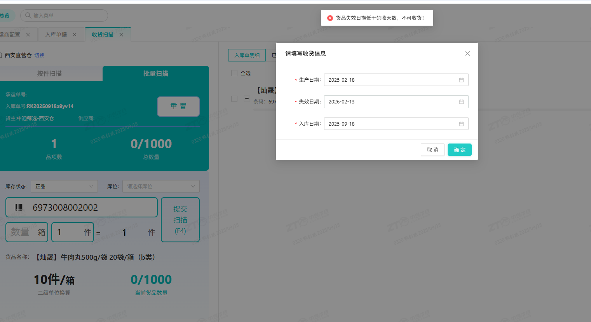

PDA拣货操作规则：可在"配置-操作配置-拣货"中设置是否校验库位/货品编码/数量，以及首件扫描、逐件扫描等。

PDA需手动输入：①拣货货品数量；②客户货品无条码时手动输入条码回车；③最后点击提交按钮。

**效率提示**：批量单（货品结构一致）在加入波次时先加入批量波次，后续可批量拣选/复核/称重，无需二次分拣。

#### 复核

**复核前准备：**扫描工作台号（如：工作台编码1）。工作台来自：容器类型 → 基本类型-工作台 → 使用环节-出库 → 工作台配置。

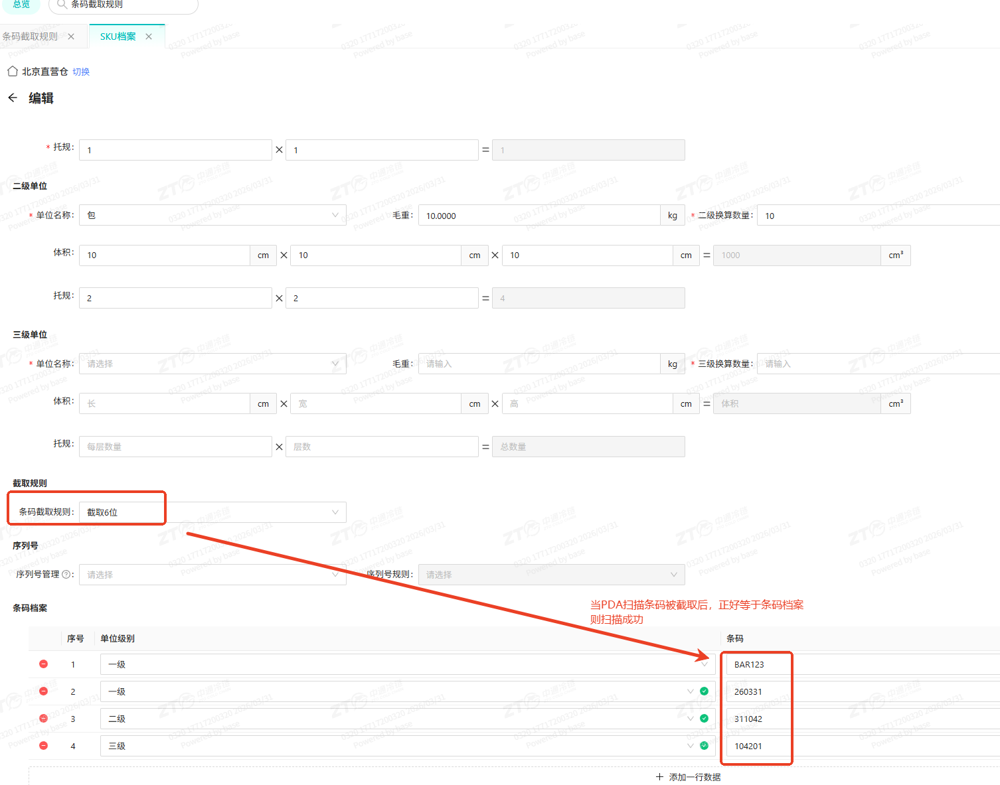

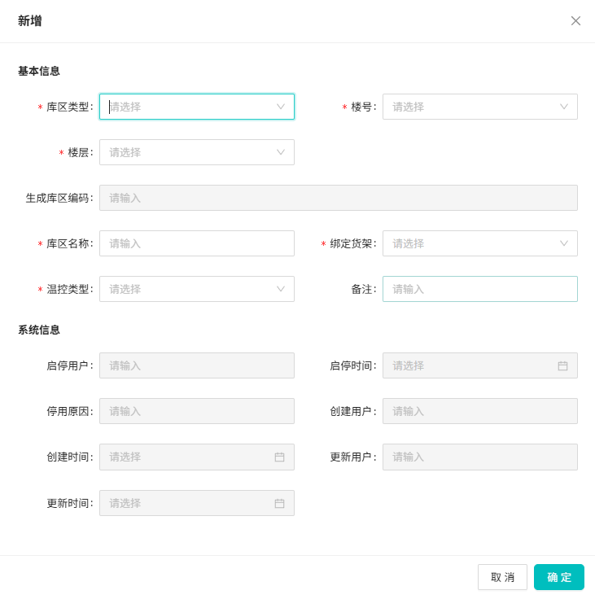

**复核的四种方式：**

- **普通复核**：散单波次边拣边分后复核，逐单复核。
- **批量复核**：批量单波次复核。与普通复核差别：①拦截订单需确认踢出；②完成一单后自动完成同波其他订单；③不能拆包。
- **货找单复核**：单品单件混品散单\+后置打单复核。扫描货品出对应面单。
- **播种复核**：总拣后需二次分拣时使用。

**批量复核**：与普通复核的主要差别——有拦截订单需确认并踢出；完成一单后自动完成同波其他订单；不能拆包。

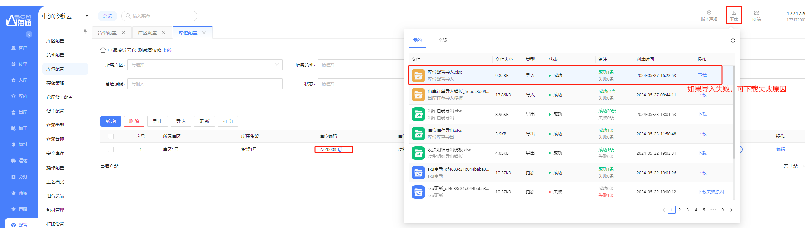

如果开启了"复核并称重"参数，则在复核结束后立即进入称重环节。

#### 复核详细流程表

| **序号** | **流程** | **页面** |
|----------|----------|----------|
| 1 | 打开普通复核，扫描复核台编码1，进入复核页面 | 复核页面 |
| 2 | 关联打包员，输入打包员账号（非必须操作） | |
| 3 | 扫描单据：后置打单可扫任务号/容器/波次号/包裹号（需在波次管理打印面单） | |
| 4 | 逐件扫描货品：如需拆包则扫描后点击拆包；如缺货则点击缺货打印；如货品错误则换货 | |
| 5 | 扫描包装方案/包材/耗材：扫描包裹后带出推荐方案，可扫描指定方案或包材耗材 | |
| 6 | 可在复核环节点击"更换"来更换首末仓包装方案 | |
| 7 | 复核环节右上角功能键操作 | |
| 8 | 如复核环节有被拦截订单需返架，弹窗提示根据要求操作 | |
| 9 | 如开启了复核并称重，则自动进入称重环节 | 称重页面 |
| 10 | 如后置打单则自动打印面单 | |
| 11 | 操作打包 | |
| 12 | 贴单，结束 | |

#### 称重

连接蓝牙称重设备，选择称重设备自动读取重量数据。扫描包裹面单自动提交称重结果。

**批量称重**：仅针对批量波次，称重一单后整个波次完成。

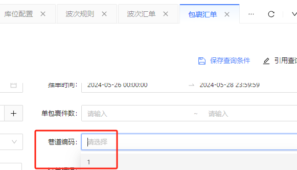

#### 发运

根据作业流程配置，称重完成后自动发运。发运后包裹状态变为已发运，完成出库闭环。

#### 拦截

拦截单系统确认有两种方式：系统操作触发确认。订单拦截后进入异常单管理列表，异常确认后取消订单；如已下架则进入回库明细列表，回库后确认。

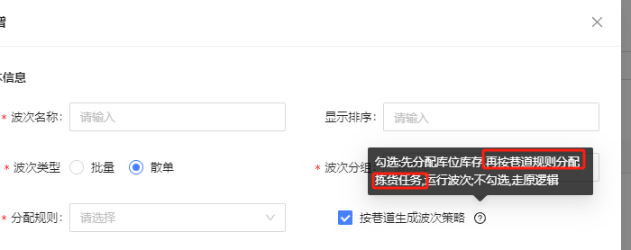

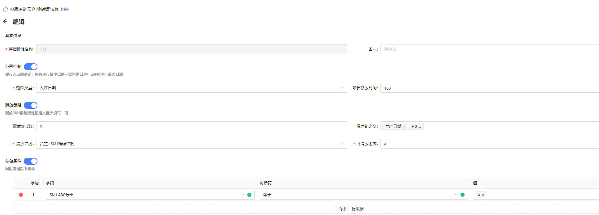

#### 拦截节点说明

| **拦截节点** | **拦截后操作** |
|----------------|-------------------|
| 加入波次前 | 直接拦截成功，订单不会进入波次 |
| 待拣货 | PDA拣货时提醒异常单，确认后踢出；PC拣货确认后触发确认异常单，确认后回库 |
| 待复核 | 复核触发，创建异常单→异常单确认→创建回库明细→回库确认→库存返架 |
| 待称重 | 称重触发，创建异常单→异常单确认→创建回库明细→回库确认→库存返架 |

以下为出库环节补充截图：

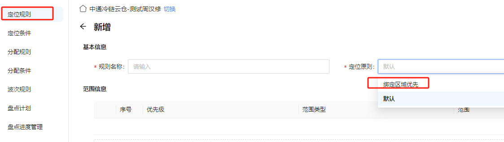

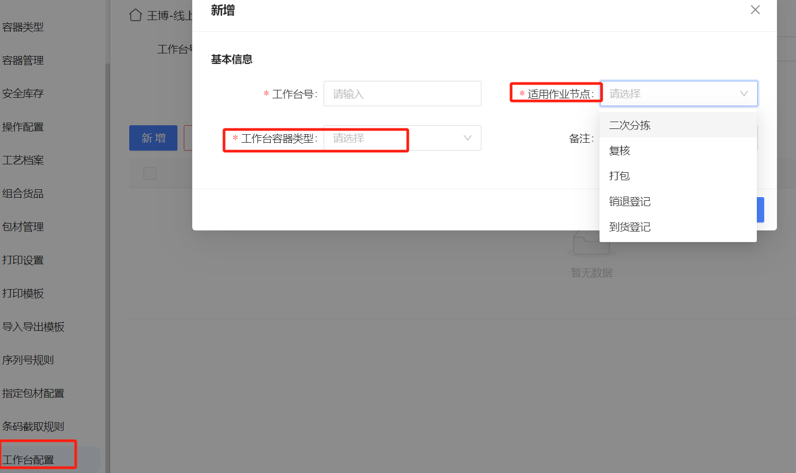

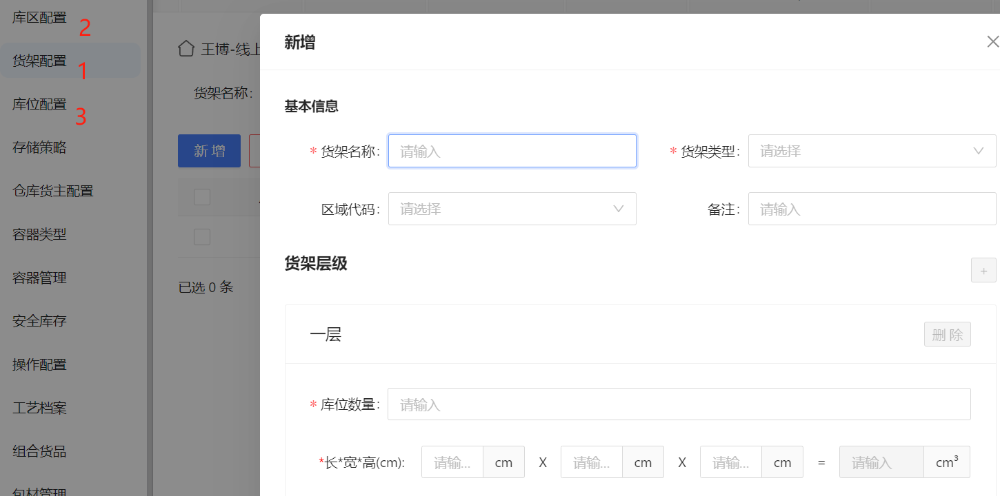

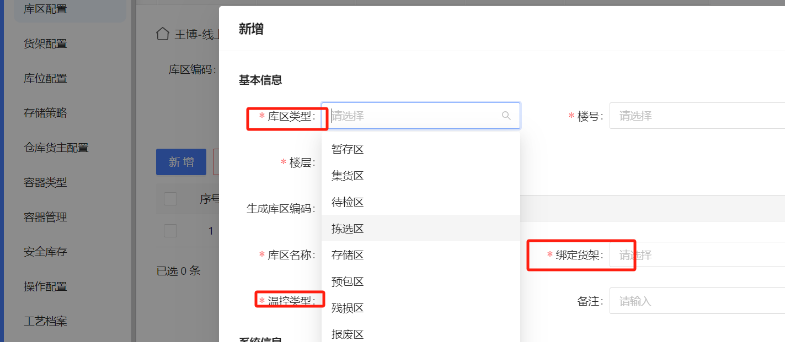

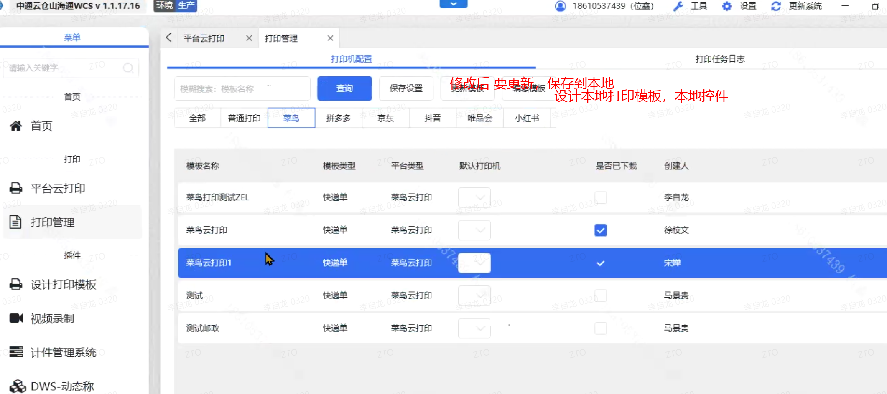

### 规则配置

#### 承运方案

**系统功能路径：**配置 → 承运方案

承运方案定义包裹应分配到哪个承运公司、使用哪个账号、哪种物流产品类型、哪些增值服务。选中包裹后系统根据承运方案配置规则自动匹配承运公司\+账号\+产品类型\+增值服务。

#### 拆包规则

**系统功能路径：**配置 → 拆包规则

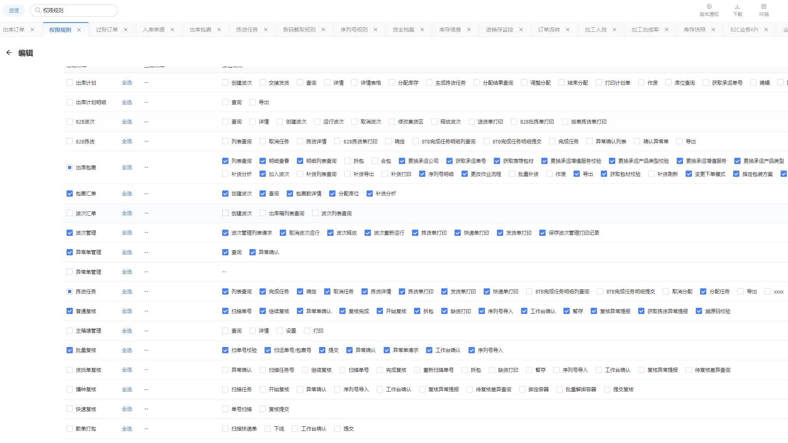

拆包规则定义包裹自动拆分的条件：①按重量（超出设定重量自动拆包）；②按体积（超出设定体积自动拆包）；③按组合货品（需在"组合货品"中配置，包含货品组合则自动拆出为新包裹）。

#### 组合货品

**系统功能路径：**配置 → 组合货品

组合货品定义哪些货品组合在一起应作为一个独立包裹出库。配置组合货品后，拆包规则中"按组合货品"拆包才会生效。每个货主可配置多个组合货品方案。

#### 包装方案

**系统功能路径：**配置 → 包装方案

包装方案定义包裹使用的包材和耗材组合：

- **所属货主**：选择"仓库货主（共用）"，目前所有包材耗材库存挂在其下。
- **包材**：选择主包材（最外层包材，不含耗材）。
- **填充率、最大承重**：用于推荐箱型，目前功能未上线，填1、1000即可。
- **辅助包材、耗材**：除主包材外所需的其他材料。
- **是否自动扣减库存**：需扣库存选"是"。
- **可用货主**：选择全部货主/自定义货主/所属货主。

#### 指定包装方案

**系统功能路径：**配置 → 指定包装方案

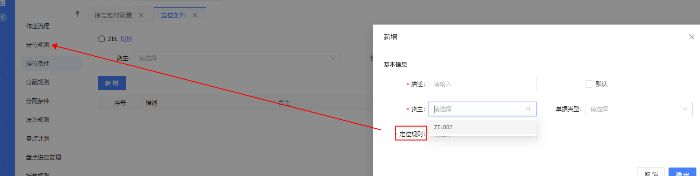

为特定货品组合推荐指定包装方案。包裹包含该货品组合时，系统优先推荐此处指定的方案，而非推荐策略计算的结果。

#### 推荐包装方案策略

**系统功能路径：**配置 → 推荐包装方案策略

定义满足条件的包裹应使用哪些包装方案。拆包策略：按重量（大于该值则拆出直到不能再拆）；按组合货品（需配合"组合货品"使用）。

### WCS打印配置

WCS（Warehouse Control System）是WMS的打印客户端软件，用于打印面单、拣选单、上架单、盘点单等各类作业单据。

#### 下载安装WCS客户端

下载安装WCS客户端程序 → 安装插件 → 双击桌面图标启动。确保右上角显示"已连接"标识，才可正常打印面单。

#### 打印管理

首次使用WCS配置：①下载打印模板（PC端更新后需下载到WCS）；②将模板指向打印机并保存设置（不指向则每次弹窗手动选择打印机）。

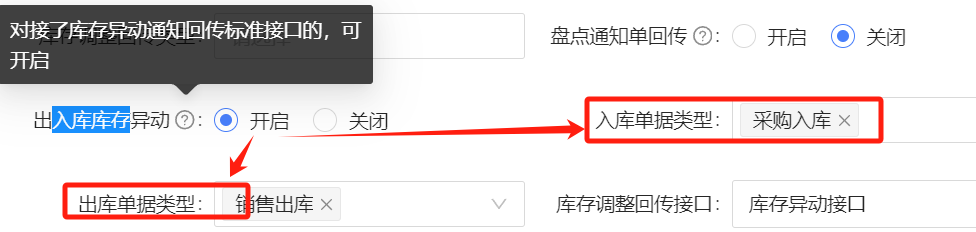

### PDA-APP安装

PDA-APP是WMS手持终端应用程序，用于移动收货、上架、拣货、复核、称重等操作。

#### PDA-APP安装步骤

12. 在PDA上打开浏览器，光标定位到浏览器输入框。
13. 扫描PC端显示的下载二维码，开始下载APP安装包。
14. 安装完成后，使用创建账户时短信中的账号密码登录APP。

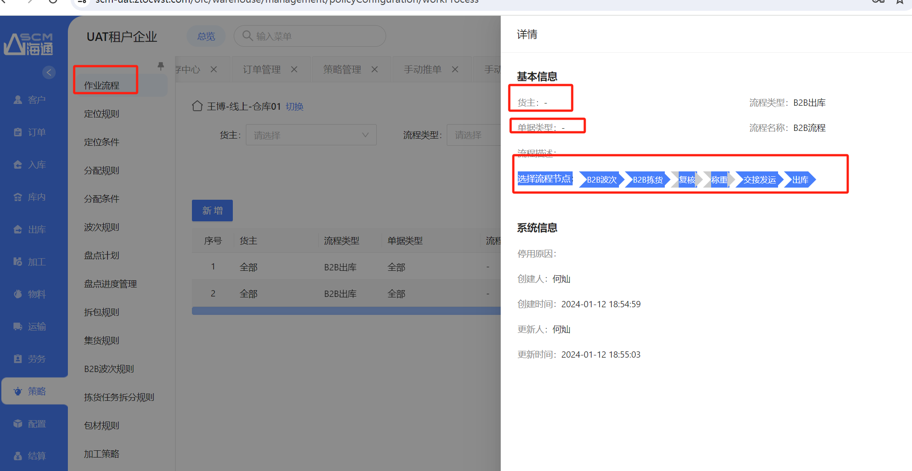

#### 创建自定义导出模板

仓库如需自定义导出模板，通过"配置-导入导出模板"新建属于自己的模板。可自定义导出的字段、格式和排序方式。

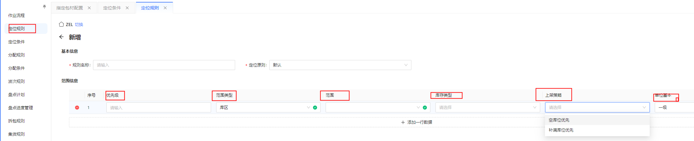

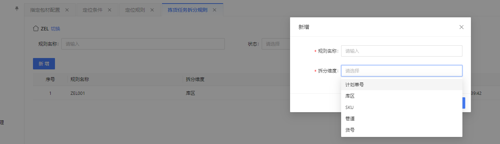

### 操作视频

为帮助仓库人员更直观地理解系统操作，提供了视频教程：

[仓库WMS实操培训.mp4](https://alidocs2.oss-cn-zhangjiakou.aliyuncs.com/res/1wvqrebRp41genak/att/f632d7f7-0550-4b1e-8379-db8800496506.mp4?Expires=1782721697&OSSAccessKeyId=LTAI5tKTjg4Kq1HCdBJ8qpSp&Signature=bi0xSd%2FYskuy9%2B%2BorPI7b91J8%2Fg%3D)

相同视频的优酷地址：[中通冷链WMS实操培训](https://v.youku.com/v_show/id_XNjQ0Njc3NTc0OA==.html)

建议仓库新员工先观看视频教程，再结合本文档进行实际操作练习。视频涵盖创建库位、创建SKU、入库收货上架、出库拣货复核称重发运全流程演示。

以下为操作视频及补充截图：

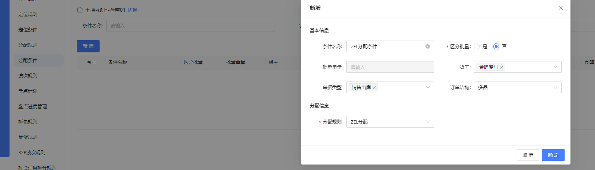

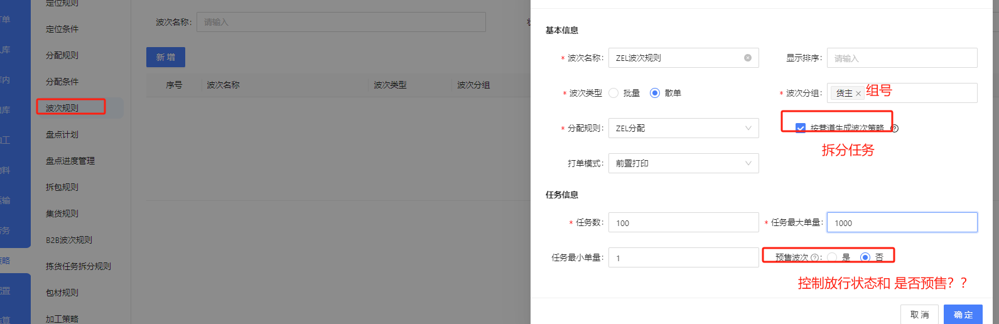

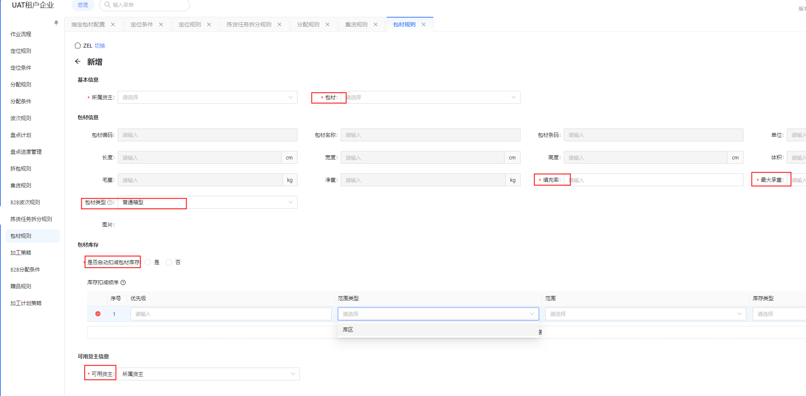

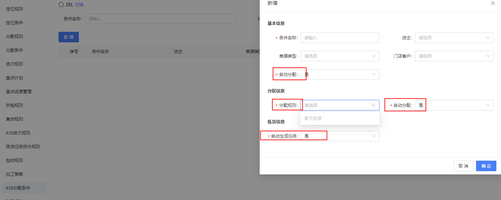

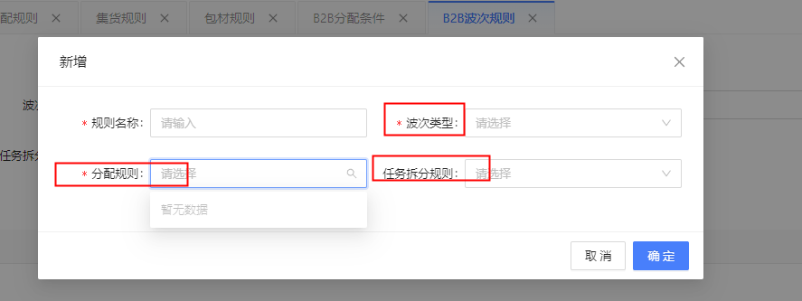

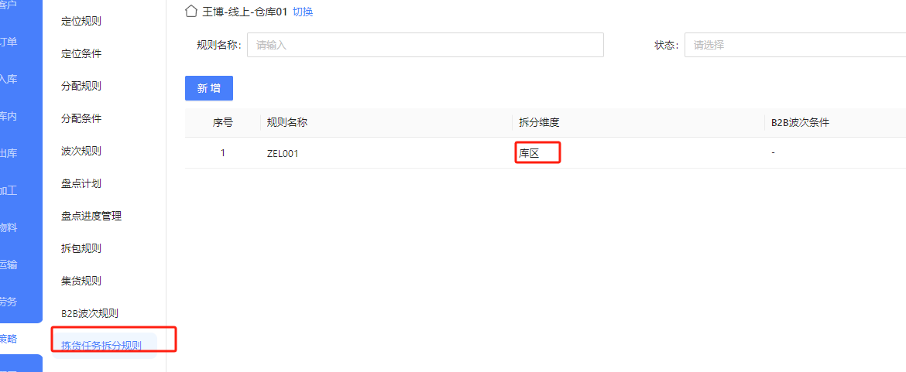

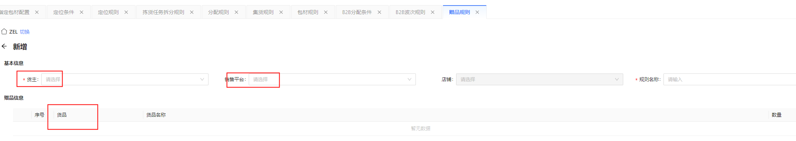

## 常见异常与兜底方案（卡住了怎么办？）

| **序号** | **异常现象** | **常见原因** | **解决方案** |
|----------|----------------|----------------|----------------|
| 1 | 收货时无法扫描货品条码 | SKU档案中未维护条码 / 操作配置中校验开关限制 | 检查SKU档案中条码字段；检查【配置-操作配置-收货】中扫描校验设置 |
| 2 | 收货后没有生成上架任务 | 定位规则未配置或定位条件未关联 | 检查【配置-定位规则】和【配置-定位条件】，确保入库单据类型关联了定位规则 |
| 3 | 上架任务无法领取 | 任务已被分配给其他用户 | 在PC端取消任务分配，或由已分配用户执行。也可取消任务后重新创建 |
| 4 | PDA收货无法批量完成扫描 | SKU需要采集批次/效期属性 | 需采集属性的SKU不允许批量完成扫描，需逐条录入属性信息后提交 |
| 5 | 上架时库位不足 | 库位容量已满且未开启忽略容量 | 在库位管理中开启"忽略容量"选项，或手动将库位类型切换为"库存"类型 |
| 6 | 出库包裹取号失败 | 承运商配置未生效 / 账号余额不足 / 物流产品未开通 | 在【包裹汇单】页面筛选取号失败原因，检查承运商配置后一键重新取号 |
| 7 | 波次无法释放 | 波次中订单状态异常 / 前置打单未完成 | 检查波次详情确认所有订单状态正常；如为前置打单波次需先完成打单 |
| 8 | 复核时无法扫描包裹 | 复核台未配置或状态异常 / 容器类型未关联工作台 | 检查容器类型→基本类型→工作台→使用环节→出库配置 |
| 9 | 称重读数不准确或无法读取 | 蓝牙秤未正确连接 / 称重设备未选择 | 重新连接蓝牙设备，在称重页面确认选择了正确的称重设备 |
| 10 | WCS打印客户端显示未连接 | WCS服务未启动 / 网络连接问题 | 重启WCS客户端，检查网络连接，确保防火墙未拦截WCS端口 |

## 高频常见问题（FAQ）

15. **Q1：PC收货扫描和PDA普通收货有什么区别？**

**A：**功能上基本一致，都支持按件/批量扫描。差异在于：PC端适合仓库办公桌旁的集中收货场景；PDA端适合移动收货，支持快速上架（收货后立即上架）。大仓库推荐PDA操作，小仓库PC端即可满足需求。

16. **Q2：什么时候使用上游推单，什么时候手动建单？**

**A：**上游OMS已对接的情况下统一使用接口推单，保证数据一致性和可追溯性。手动建单仅用于客户未对接系统的应急场景。

17. **Q3：收货记录为什么会拆分成多条？**

**A：**系统根据库存属性（批次、批号、效期）和SKU档案的一级单位托规自动拆分。同一SKU不同批次会拆成多条记录，对应多条上架任务和库位库存明细，保证库存维度精确。

18. **Q4：取消上架任务后会怎样？**

**A：**取消任务后，关联的收货明细被重置为"待定位"状态。可在"入库-收货记录"页面手动重新定位库位并创建上架任务。

19. **Q5：批量波次和散单波次应该怎么选择？**

**A：**先筛选货品结构一致的订单加入批量波次，可享受批量拣货/批量复核/批量称重的效率优势。剩余货品结构无规律的订单加入散单波次，走边拣边分流程。

20. **Q6：什么情况下使用货找单复核？**

**A：**适用于单品单件混品的散单波次 \+ 后置打单场景。每个包裹只有一品一件但SKU不同，扫描一件货品即出一个对应的面单。

21. **Q7：出库包裹页面系统自动处理不准确怎么办？**

**A：**所有自动操作均支持手动重置和变更：手动拆合包、指定承运商、变更作业流程、重新获取面单、指定包装方案。系统会记录手动指定的包装方案供后续推荐使用。

22. **Q8：WCS打印配置中模板不指向打印机会怎样？**

**A：**每次打印时会弹窗预览让用户手动选择打印机，影响效率。建议将所有使用的模板指向对应打印机并保存设置，实现一键打印。

23. **Q9：PDA拣货时如何提升效率？**

**A：**①在加入波次环节将批量单加入批量波次；②在PC端提前分配拣货任务给特定员工；③在"操作配置-拣货"中合理设置校验规则，避免不必要的校验步骤。

24. **Q10：拦截后订单怎么处理？**

**A：**拦截后订单进入异常单管理列表。异常确认后取消订单；如已下架（待复核/待称重拦截），则创建回库明细，回库确认后库存返架。