# WMS操作手册V1（面向仓库）

## 一、适用场景
本文档面向仓库操作人员，覆盖WMS仓库管理系统V1版本的全流程操作：库位创建 → SKU维护 → 入库收货上架 → 出库2C拣货复核称重发运 → 规则配置（承运方案/拆包规则/包装方案等）→ WCS打印客户端配置 → PDA-APP安装。文档以场景化步骤展示，配合界面截图，帮助仓库人员快速上手。

## 二、前置条件
- **权限要求**：需拥有仓库操作员权限，能够访问入库、出库、基础配置、规则配置等WMS相关菜单。
- **系统配置**：已完成定位规则、定位条件、上架策略等入库策略配置；已完成承运方案、拆包规则、包装方案等出库策略配置；已完成库位/货架/库区创建。
- **硬件设备**：PC端用于系统配置和任务管理；PDA手持终端用于移动作业；条码打印机用于打印面单和单据；蓝牙秤用于称重环节。
- **软件环境**：WCS打印客户端已安装并连接打印机；PDA-APP已下载安装并登录账号；浏览器建议使用Chrome最新版本。
- **前置数据**：SKU档案已维护完整（条码、效期/批次属性等）；库位/货架/库区已创建；承运商账号已配置。

## 三、业务场景与名词解释

### 3.1 业务场景（为什么用？）
WMS仓库管理系统是仓库日常作业的核心平台。本文档覆盖从库位/货架搭建、SKU档案维护，到入库收货上架、出库拣选复核称重发运的完整业务闭环。仓库人员通过本文档可快速掌握系统PC端和PDA端的标准操作方法。同时涵盖规则配置（承运方案、拆包规则、包装方案等）、WCS打印客户端配置、PDA-APP安装等辅助操作，确保仓库人员能够独立完成系统的基础配置和日常运行。

### 3.2 核心名词解释（不迷路）
- **库位**：仓库中用于存放货物的最小物理位置单元。每个库位有唯一编码，可通过导入或手动创建。库位属性包括：库位类型、库存种类、巷道编码、存储策略、动线号、绑定货主/SKU等。
- **货架/库区**：多个库位组成的物理区域。库区是库位的上一级单位，用于仓库的区域划分和管理。创建库位前需先创建货架和库区。
- **SKU（库存单位）**：Stock Keeping Unit，即库存进出计量的最小单位。每个SKU有唯一的编码和属性（尺寸、重量、条码、批次效期要求等）。SKU档案在系统中通过接口同步或手动创建维护。
- **入库单**：入库操作的源头单据，由上游OMS推送或仓库手动创建。包含入库明细行：SKU、数量、库存状态、批次/效期等信息。
- **收货扫描**：将实物与入库单明细进行核对并记录的过程。分为PC端扫描和PDA端扫描两种方式，支持按件扫描和批量扫描模式。
- **收货记录**：收货后系统根据库存属性（批次/批号/效期/托规）自动拆分生成的记录。每条收货记录对应一条上架任务明细和一条库位库存明细。
- **上架任务**：将收到的货物放入指定库位的操作任务。系统根据定位规则和定位条件自动匹配上架库位并创建任务。支持PC端任务确认和PDA端直接上架。
- **波次管理**：将多个出库订单按规则组合成一个波次，统一进行拣货、复核、称重等操作的作业方式。分为批量波次（货品结构一致）和散单波次（货品结构无规律）。
- **复核**：出库过程中对拣货结果进行核对确认的环节。包括普通复核（逐单）、批量复核（批量单）、货找单复核（单品单件）、播种复核（总拣后二次分拣）四种方式。
- **承运方案**：配置包裹分配的承运商、物流产品、增值服务等规则。系统根据承运方案自动为包裹匹配承运公司和物流产品。
- **包装方案**：定义包裹使用的包材、耗材组合。系统可根据指定包装方案或历史操作习惯自动推荐，也可手动指定。
- **拦截**：出库流程中对异常订单进行阻止继续操作的机制。不同节点（加入波次前/待拣货/待复核/待称重）均可触发拦截，拦截后订单进入异常单管理流程。
- **WCS打印客户端**：Warehouse Control System打印客户端，连接打印机后用于打印面单、拣选单、上架单、盘点单等。需安装并保持"已连接"状态。
- **定位规则**：定义入库货物应上架到哪个库位的匹配规则。系统结合库位配置（区域/货主/SKU绑定等）自动匹配上架库位。
- **PDA**：手持终端设备，安装WMS的PDA-APP后用于移动收货、上架、拣货、复核、称重等操作。

## 四、场景化标准操作步骤

### 4.1 创建库位

#### (1) 创建货架、库区
**系统功能路径**：**基础** → **库位管理**

在创建库位之前，需要先创建货架和库区。货架是库区的上一级组织单位，库区是库位的容器。操作步骤：
1. 进入"基础-库位管理"页面，先创建货架（填写货架编号和名称），再在对应货架下创建库区（填写库区编码和名称）。
2. 库区创建完成后，即可在该库区下导入或手动创建库位。

#### (2) 导入库位
如果仓库已有库位编码体系，推荐使用导入方式批量导入。
1. 在库位管理页面点击 **导入** 按钮，下载导入模板。
2. 按模板格式填写库位信息后上传。模板内容包括：库位编码、所属库区、库位类型、巷道编码、动线号等字段。

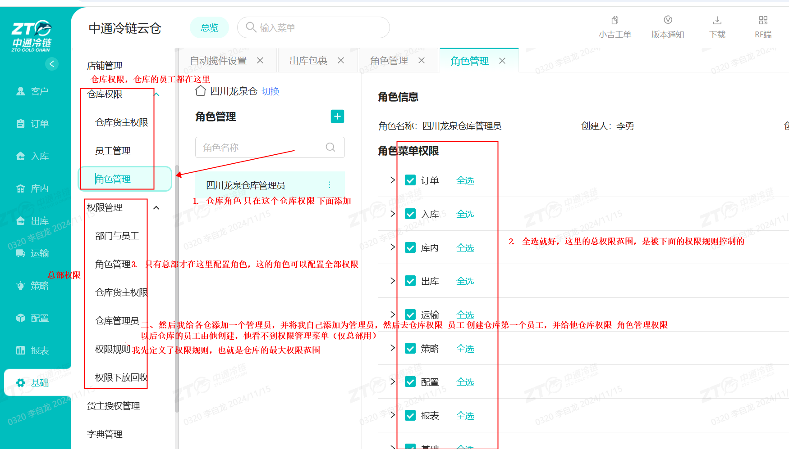

**查看导入结果**：导入完成后系统会显示导入结果汇总，包含成功条数和失败条数。如存在失败记录，可下载失败明细查看具体原因（常见原因：库位编码重复、库区不存在、必填字段为空等），修正后重新导入。

::: tip 导入模板
请至钉钉文档查看附件《库位配置导入.xlsx》。更新库位模板请至钉钉文档查看附件《库位配置更新模版.xlsx》。
:::

#### (3) 手动创建库位
手动创建库位适用于开新仓场景，系统会自动为库位编码。
1. 进入库位管理页面。
2. 点击 **手动创建**。
3. 选择所属库区，设置库位数量。
4. 系统自动生成连续编号的库位。创建完成后可在库位列表中查看和编辑每个库位的详细参数。

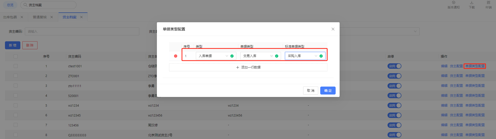

#### (4) 库位相关参数意义

| **库位参数** | **意义** |
|----------------|----------|
| 库位类型 | 统一选择"库存"，目前入库出库只分配库存类型库位 |
| 库存种类 | 用于限制库位允许的作业类型。如腾空库位，则设置为可出不进 |
| 忽略容量 | 忽略容量后，就不会在入库定位时因库位剩余容量不足而跳过该库位 |
| 巷道编码 | 填了巷道编码可以应用在包裹汇单筛选包裹（前提是包裹前置分配库存），波次规则按巷道分配 |
| 存储策略 | 库位配置关联存储策略后，可限制库位可存入货品属性（效期、品类等） |
| 上架动线号、拣货动线号、盘点动线号 | 动线号用于在任务明细中排序库位动线，优化行走路径 |
| 绑定货主、绑定SKU | 绑定货主、SKU后，会在定位、分配环节优先分配 |

### 4.2 创建SKU

**系统功能路径**：**基础** → **SKU档案**

SKU档案是WMS系统的基础数据。创建SKU有两种方式：上游系统通过接口同步SKU到WMS（推荐方式，保证数据一致性）；在SKU档案页面手动创建（适用于未对接系统的货主）。

#### (1) 接口同步SKU（推荐）
上游系统（如OMS）通过标准接口将SKU数据同步到WMS。同步内容包括：SKU编码、名称、条码、尺寸重量、行业属性（批次/效期要求）、ABC分类等。同步后SKU自动进入SKU档案列表。

#### (2) 首次入库新品维护
在【仓库货主配置】中开启"收货提醒"后，首次入库的SKU会触发新品维护流程，系统强制要求补充SKU完整信息后才能继续收货。
1. 进入收货页面。
2. 系统弹窗提醒新品需要维护，点击 **维护** 按钮。
3. 填写SKU属性信息（尺寸、重量、条码、行业属性等），保存后继续收货。

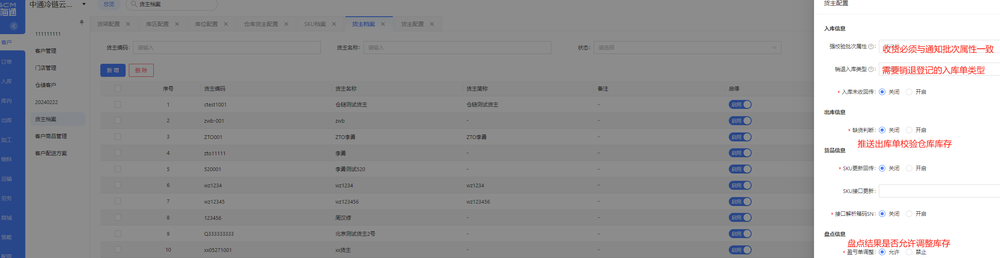

#### (3) SKU档案中需要注意的配置
在SKU档案编辑页面中，以下配置项需要重点关注：
- **行业属性**：决定收货时是否需要采集批次/效期。
- **ABC分类**：影响库位定位匹配。
- **单位尺寸和重量**：用于推荐包材和校验库位容量。
- **托规**：决定上架时的托盘拆分。
- **包装单位条码**：支持多级条码收货。

#### (4) SKU相关参数意义

| **SKU属性参数** | **意义** |
|-------------------|----------|
| SKU档案-行业属性 | 设置收货需要采集的信息（批次/批号/效期等），决定收货扫描时的必填字段 |
| 类别、ABC分类 | 可用于定位库位时与库位属性匹配。A类高周转、B类中周转、C类低周转 |
| 单位-长宽高体积毛重净重 | 用于推荐包材、校验库位可存储商品数量时的计算 |
| 托规 | 根据SKU托规上架为多个托盘，只看一级单位托规 |
| 包装单位条码 | 扫描包装单位条码也可以收货（多级包装单位） |

### 4.3 入库收货与上架

#### (1) 上游系统推单至WMS

**系统功能路径**：**入库** → **入库单据**

上游OMS系统通过标准接口推送入库单据到WMS。入库单会自动进入"入库-入库单据"列表，可查看所有待收货的入库单（单据号、货主、预计到货时间、SKU明细等）。

#### (2) PC收货扫描

**系统功能路径**：**入库** → **入库单据** 或 **收货扫描**

两种进入收货扫描页面的方式：
1. 点击入库单据列表中对应单据的 **开始收货** 按钮。
2. 打印入库单后，打开"收货扫描"页面扫描入库单号，开始收货。

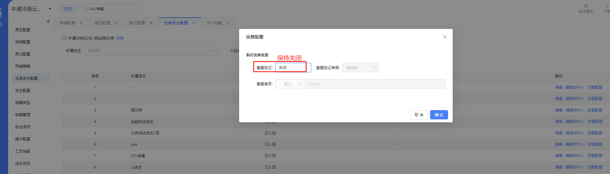

**收货扫描功能说明**：
- **按件扫描**：扫一次添加1件已扫描明细，适用于逐件核对的高精度收货。
- **批量扫描**：扫描商品条码后手动输入数量，提交后一次性记录多件，适用于大批量收货。
- **批量完成扫描**：勾选入库单明细行，点击 **批量完成扫描**，则所有勾选行全部加入已扫描明细并提交收货，适用于整单快速收货。

#### (3) PDA普通收货

**系统功能路径**：PDA端 → **普通收货**

**PDA收货功能说明**：
- **按件模式**：切换到"按件"，逐件扫描，扫描一次添加已扫描明细1件。
- **批量模式**：切换到"批量"，扫描一件商品后手动输入数量，一次性记录多件。
- **全选批量完成**：全选明细行批量完成扫描。

::: danger 重点提醒
如果SKU需要采集批次/效期属性，则不允许批量完成扫描，需逐条录入。
:::

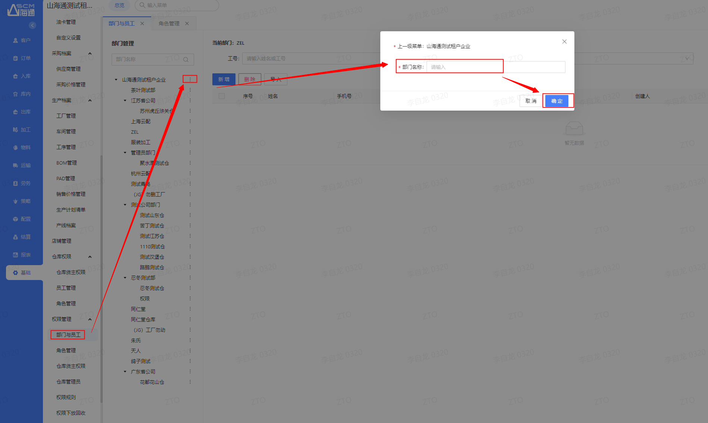

**快速上架功能**：PDA收货后立即进入上架环节，扫描或选择推荐库位立即完成上架，省去先收货再领取上架任务的两步操作，大幅提升效率。

#### (4) 收货记录与自动定位

**系统功能路径**：**入库** → **收货记录**

收货完成后系统自动执行以下三步处理：
1. **拆分收货记录**：根据库存属性（批次、批号、效期）和SKU档案的一级单位托规自动拆分为多条收货记录。每条收货记录对应一条上架任务明细和一条库位库存明细。
2. **自动定位上架库位**：调用定位条件和定位规则，结合库位配置（区域绑定货主优先、空库位优先/补满库位优先），确定每条收货记录的上架目标库位。
3. **创建上架任务**：依据定位结果自动创建上架任务，任务出现在"入库-上架任务"列表中。

#### (5) PC上架任务管理

**系统功能路径**：**入库** → **上架任务**

**上架任务功能说明**：
- **分配**：指定PDA用户执行，则其他用户不能领取。不分配则PDA自由领取。
- **任务确认**：纸质单作业完成后，根据记录的实际上架库位和数量，在电脑端确认并完成上架。
- **取消分配**：取消后用户可在PDA自由领取任务或重新分配。
- **取消任务**：取消后关联收货明细重置为待定位状态，可重新定位并创建任务。

#### (6) 两种完成上架任务的方式

**方式一——纸质单上架（小型仓库）**
1. **打印纸质单**：在上架任务页面打印上架任务单。
   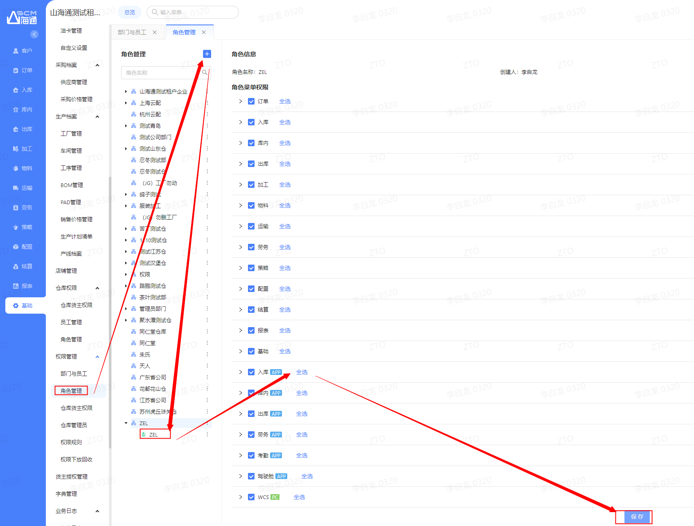
2. 仓库人员凭纸质单线下完成上架任务，如有调整库位或数量记录在单上。
3. **任务确认**：回到电脑端，点击 **任务确认**，根据纸质单记录的实际作业结果完成系统上架。

**方式二——PDA上架（大型仓库）**
- 任务可分配给指定员工，或由员工在PDA自由领取"待上架"任务。
- 在PDA上扫描库位编码和货品编码，输入数量，提交完成。PDA上架支持实时库位校验，减少出错率。

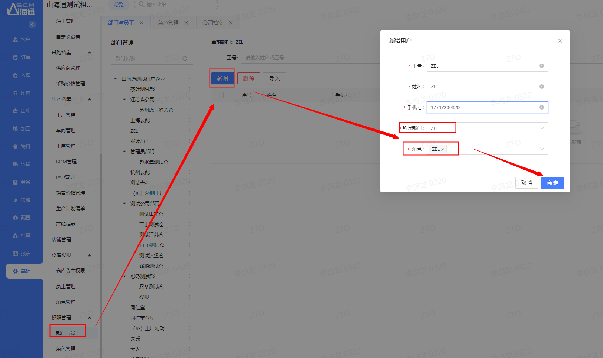

### 4.4 出库2C订单处理

#### (1) 上游推单至WMS 订单分流

**系统功能路径**：**出库** → **出库订单**

WMS收到上游推送的出库订单后，根据订单类型（2B/2C）自动分流到不同页面：2C类型订单流入"出库-出库包裹"；2B类型订单流入"出库计划"。本文档重点讲解2C出库流程。

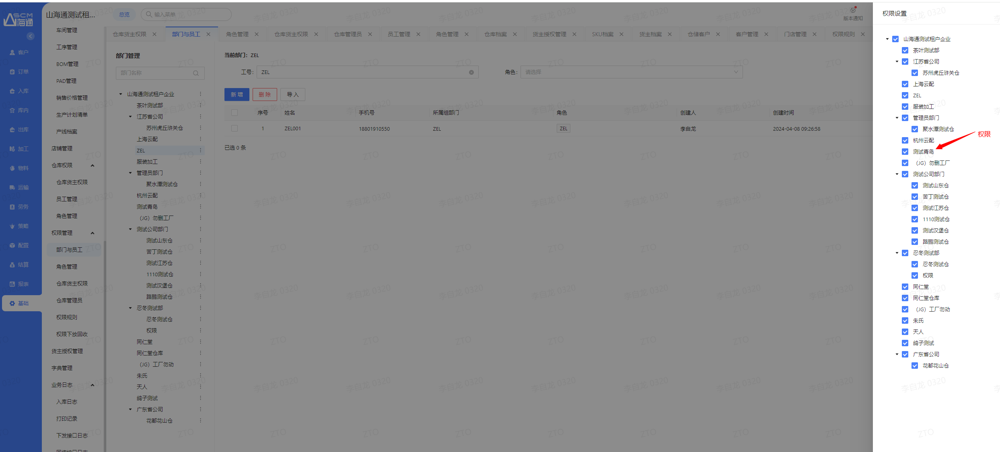

#### (2) 出库包裹处理

**系统功能路径**：**出库** → **出库包裹**

对于2C订单，系统在出库包裹页面自动进行以下预处理：
- **自动拆包**：根据拆包规则（重量/体积/组合货品）自动拆分包裹。
- **自动匹配作业流程**：支持自定义流程，可免复核、免打包、免称重。
- **分配承运公司**：根据承运方案自动匹配承运商、物流产品、增值服务。
- **自动取号**：查询承运商配置自动获取面单号（有开关控制）。
- **自动推荐包装方案**：根据指定包装方案、历史操作习惯自动推荐。
- **定义时效产品**：查询时效产品管理，按时效要求出库。

::: tip 重点关注
出库包裹页面很重要，所有自动操作功能也可以手动重置。
:::

#### (3) 出库包裹手动变更功能
- **手动拆合包**：手动对包裹进行拆分或合并。
- **指定承运商**：变更承运公司、产品类型、增值服务。
- **变更作业流程**：更改包裹的作业流程（添/取消复核、打包、称重）。
- **重新获取面单**：获取推荐包装方案、指定包装方案。手动指定后系统会记录供后续推荐使用。
- **补货分析**：对比包裹需求与拣选区库存，缺货可创建补货任务。
- **编辑录入单号**：对不需要取号的场景手动录入单号用于交接。

#### (4) 加入波次
完成取号且库存充足的包裹可加入波次。波次是出库作业的核心组织单位，将多个订单按规则组合后统一进行拣货、复核、称重。

**波次分为两种类型**：
- **批量波次**：仅货品结构一致的订单可加入。可批量拣选、批量复核、批量称重，处理一单则整波完成。
- **散单波次**：货品结构无规律，需先拣后分/边拣边分，逐单复核称重。

操作建议：先筛选批量订单加入批量波次，剩余散单加入散单波次，最大化批量处理优势。

#### (5) 加入波次的多种方式

**方式一：出库包裹-加入波次**
在出库包裹页面筛选符合条件的包裹，点击 **加入波次** 按钮。

**方式二：包裹汇单-加入波次**
包裹汇单支持多维度筛选汇总：按承运公司、货主、收件省等维度汇总包裹，便于批量打单（不同承运公司指向不同打印机）、便于不同承运公司包裹分堆存放与交接。支持批量拆包、批量指定包装方案。

**汇单操作流程**：
1. 批量单先加入批量波次（货品结构一致，批量拣货/复核/称重提升效率）。
2. 剩余散单加入散单波次（边拣边分后逐单复核）。
3. 选择波次规则，组波。

可使用 **分配库位** 预分配功能提前占库，根据分配库区区域筛选包裹汇波。可将每次筛选条件保存便于下次引用。

波次单会自动运行：分配库存 → 分组 → 创建拣货任务。波次默认锁定，此时仍可审单、拦截。确认无误后需释放波次才可执行拣选任务。

#### (6) 波次管理

**系统功能路径**：**出库** → **波次管理**

波次管理页面可执行：打印拣货单/快递单/发货单 → 释放任务。如加入前置打单波次，需打单后才可释放。波次释放后才会生成拣货任务供PDA或PC执行。

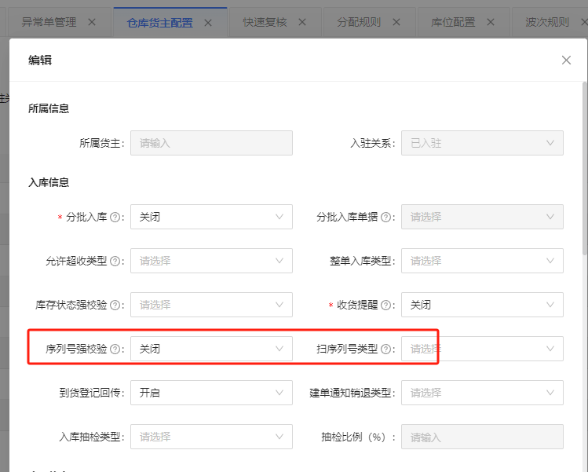
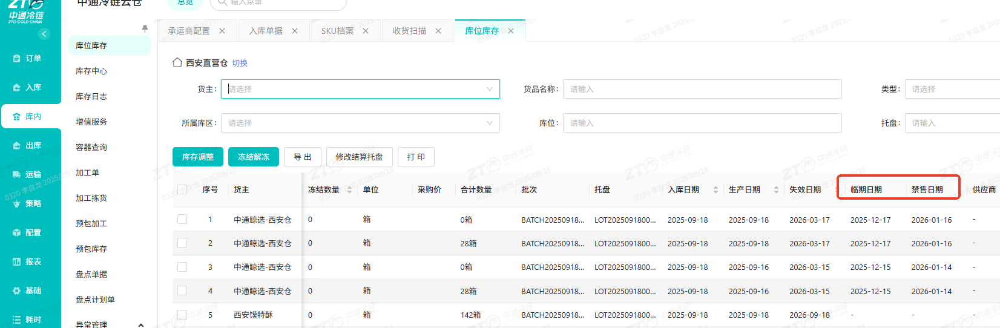

#### (7) 拣货任务

**系统功能路径**：**出库** → **拣货任务**

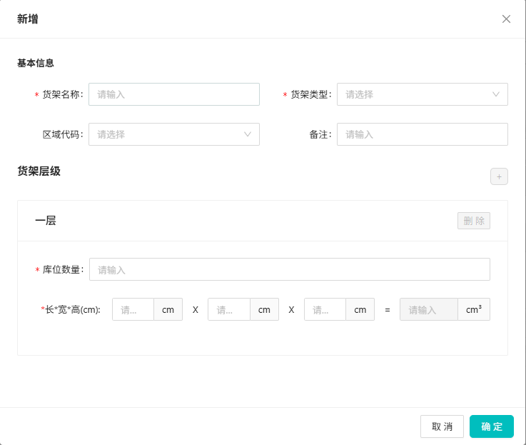

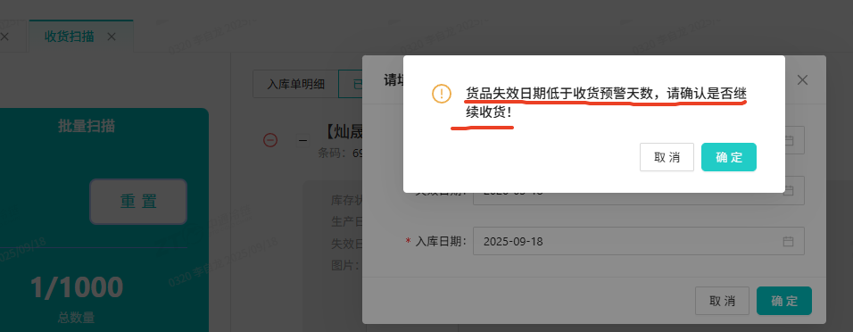
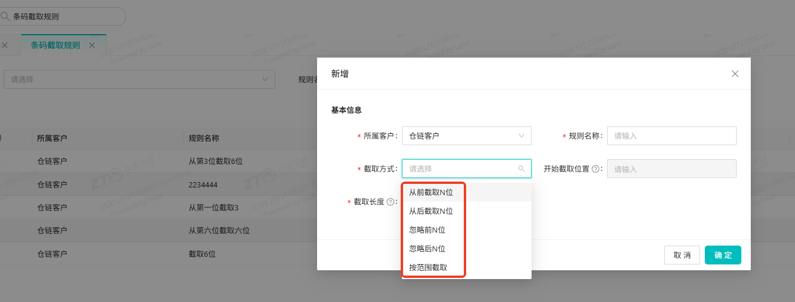

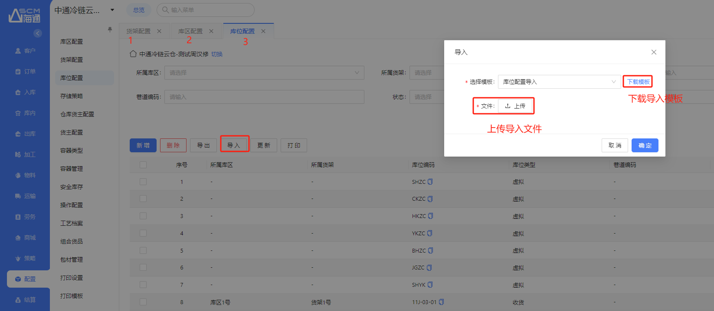

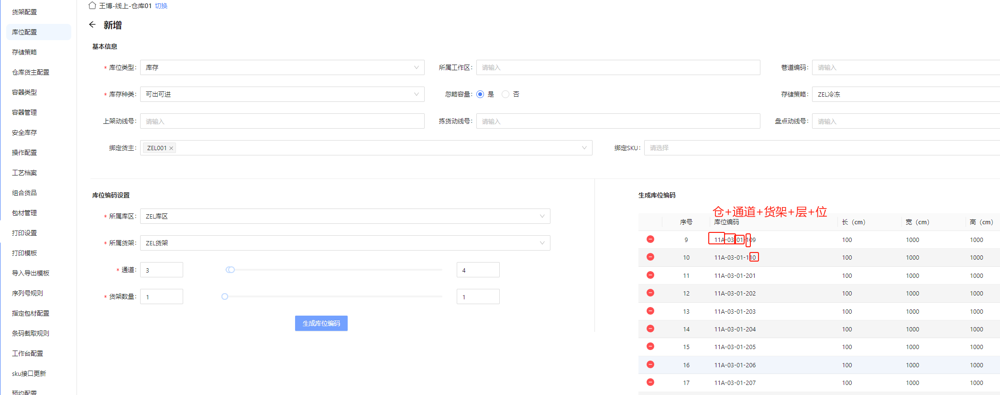

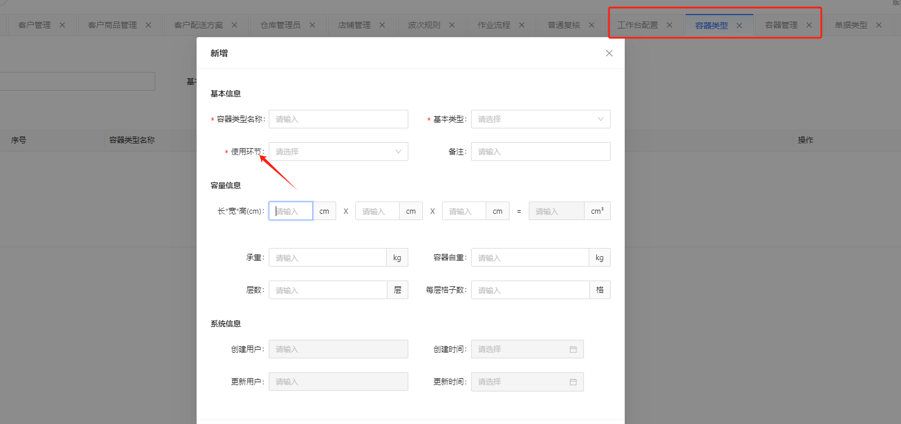

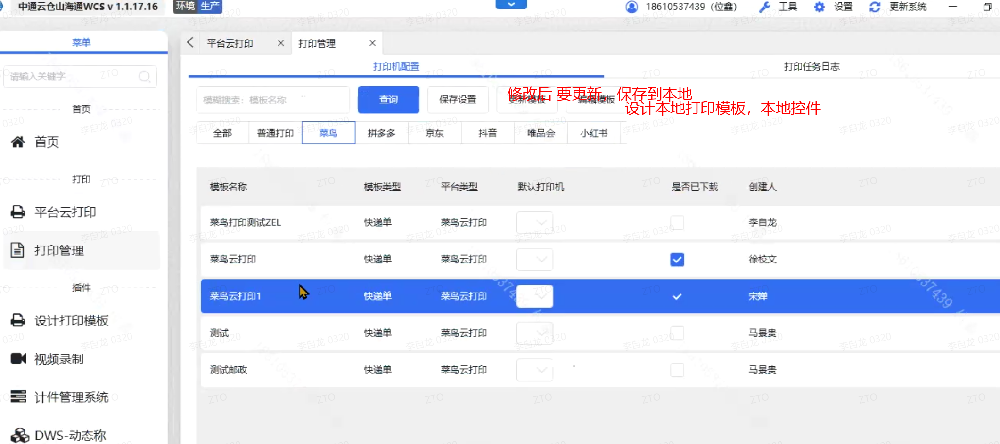

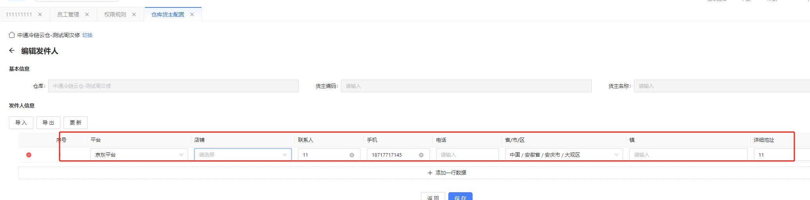
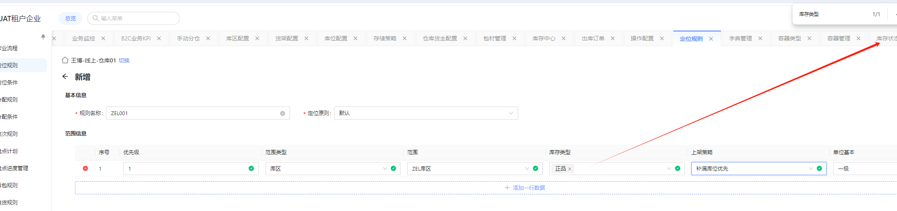

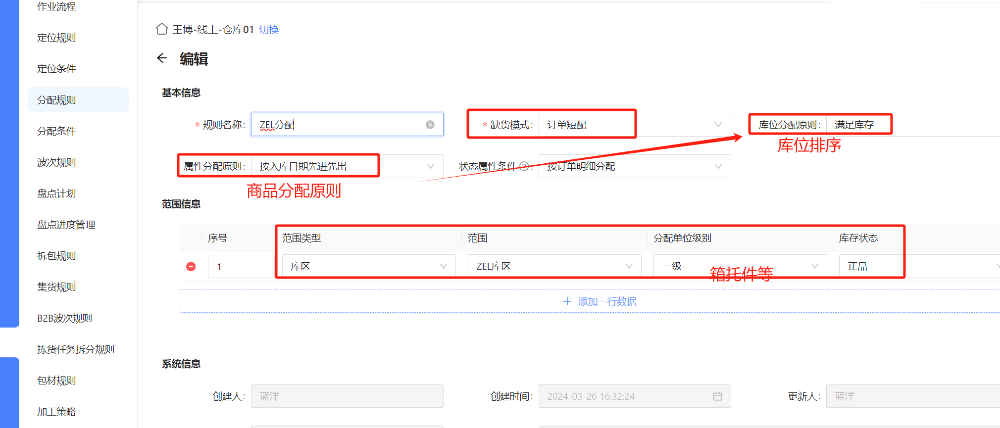
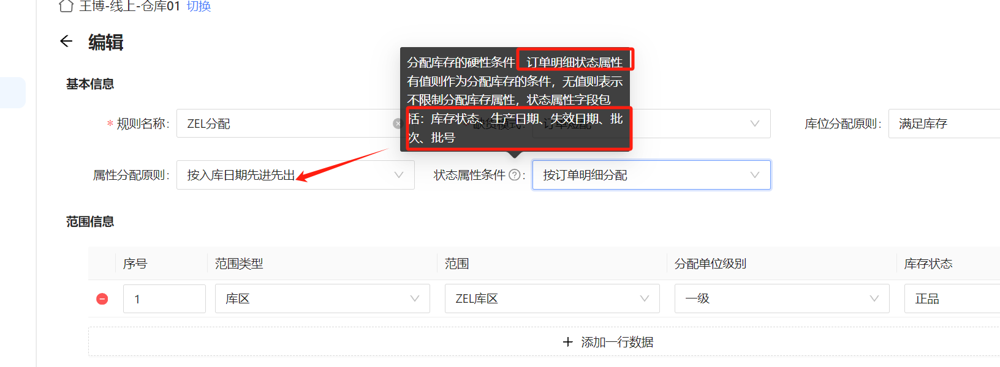
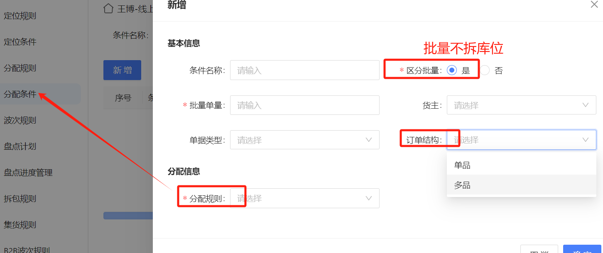
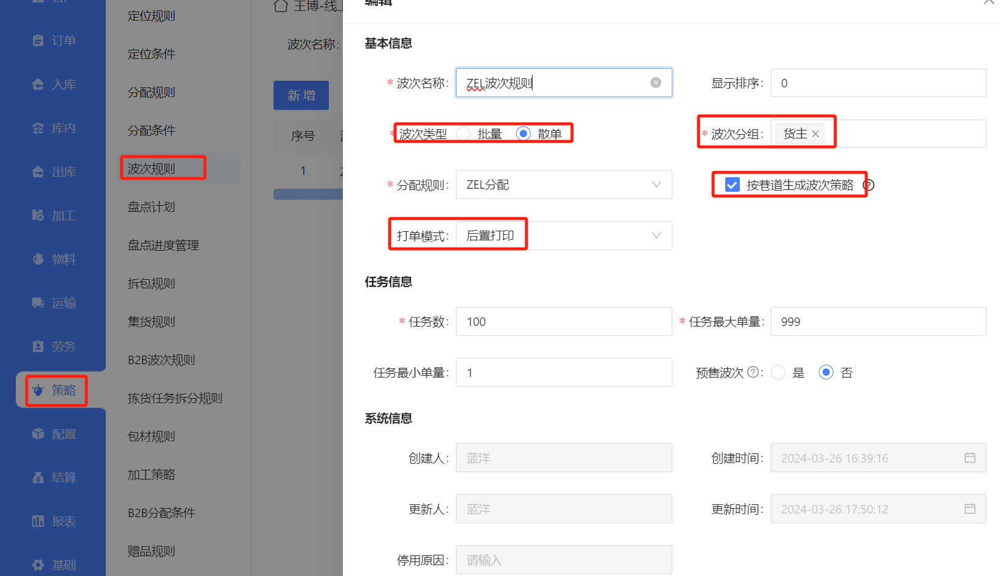
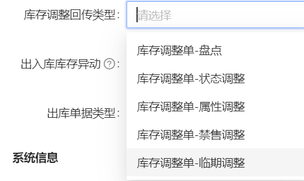

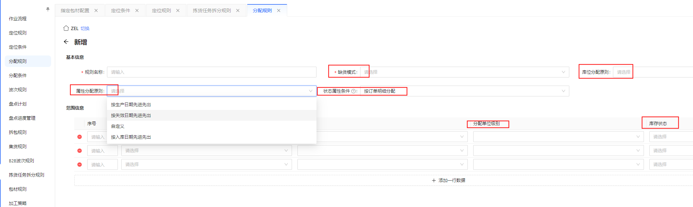

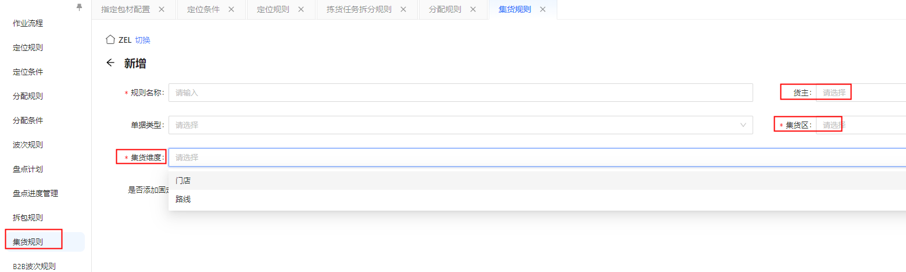
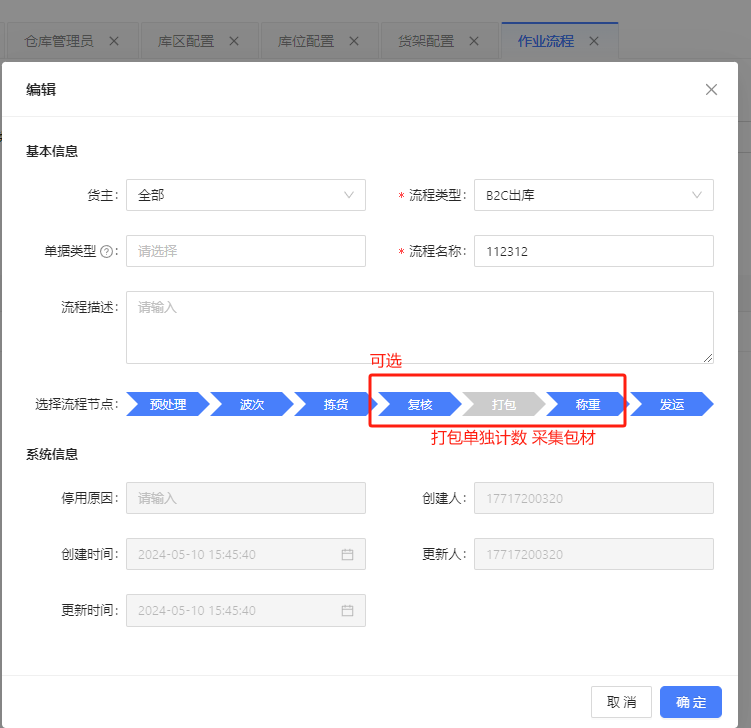

