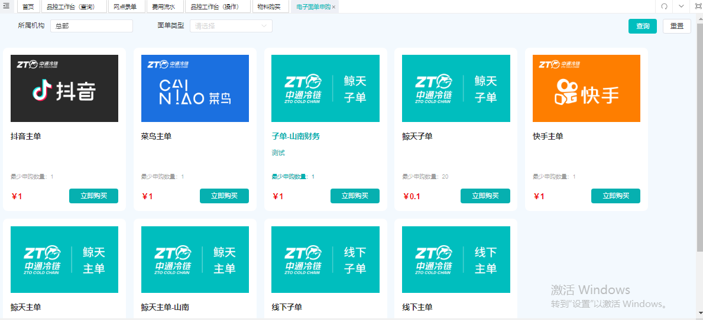
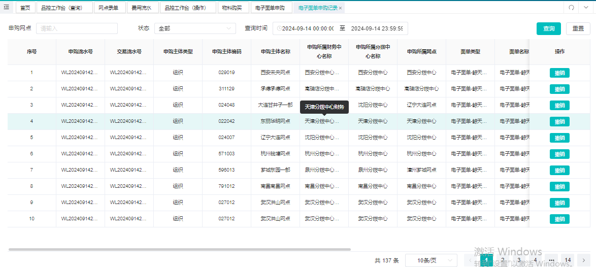
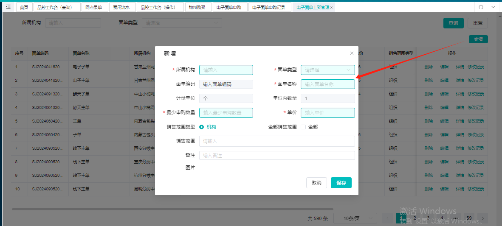
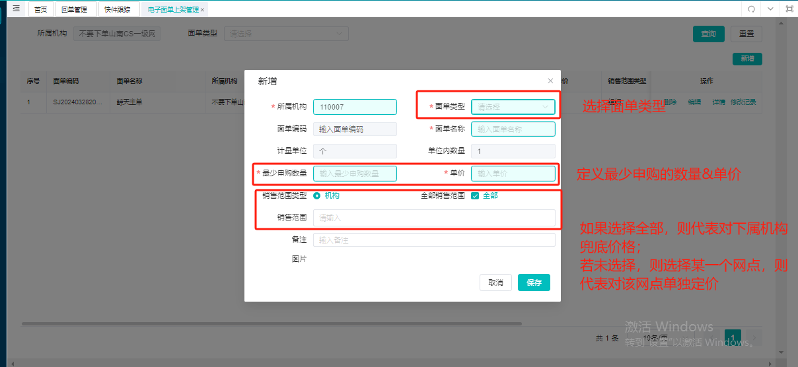

# 物料购买与充值

## 一、适用场景
- 你需要购买电子面单（鲸天主单、鲸天子单或电商渠道面单）用于日常录单或给客户充值。
- 你需要购买包装耗材、设备等物料。

## 二、前置条件
- 登录账号具有 **经营管理中心 > 电子面单** 或 **鲸天经营管理中心 > 物料商城** 的相关菜单权限。
- 购买面单时，当前网点的 **账户可用余额** 充足（扣除购买金额后不低于锁机金额）。
- 向上级申购时，上级的 **面单库存余额** 需要满足购买数量。
- 购买物料时，收件地址需在商品的限售区域内（若有限售）。

---

## 三、电子面单申购

### 3.1 面单类型说明
- **鲸天主单**：网点在鲸天系统内录单使用，扣减主单。
- **鲸天子单**：网点在鲸天系统内录单使用，扣减子单。
- **快手主单**：为快手渠道客户充值使用。
- **抖音主单**：为抖音渠道客户充值使用。
- **菜鸟主单**：为淘宝渠道客户充值使用。
- **客户主单**：为自行开展的其他客户在商家平台打单时充值使用。

### 3.2 购买面单
#### (1) 操作入口
**经营管理中心 > 电子面单 > 电子面单申购**

#### (2) 操作步骤
1. 进入 **电子面单申购** 页面。
2. 选择需要购买的面单类型（如鲸天主单）。
3. 输入购买数量。
4. 系统自动校验 **上级库存余额** 和 **当前网点账户余额**：
   - 如果上级库存不足或余额不足，则提示无法购买。
5. 确认购买，完成支付。

::: danger 重点提醒
- 一级网点向所属财务中心申购，二级网点向所属一级网点申购。上级库存不足时无法购买。
- 账户可用余额扣除购买金额后，**不得低于锁机金额**，否则购买失败。
:::

### 3.3 查询申购记录
#### (1) 操作入口
**经营管理中心 > 电子面单 > 电子面单申购记录**

#### (2) 操作结果
可以看到所有申购记录，包括面单类型、数量、金额、状态等。

### 3.4 撤销购买
#### (1) 限制条件
- 仅允许 **当天** 撤销，超过当天不可撤销。
- 撤销数量 **不可大于** 当前面单库存剩余数量。

::: tip 示例
那曲一级网点早上9点购买100个鲸天主单，下午19点库存只剩10个。此时撤销100个会提示库存不足。
:::

#### (2) 撤销结果
- 撤销成功后，系统会扣减网点面单库存，返还相应金额。
- 上级的面单库存增加，账户余额扣减（返还给下级）。

### 3.5 上级对下级单独定价（面单上架）
#### (1) 操作入口
**经营管理中心 > 电子面单 > 电子面单上架**

#### (2) 操作步骤
1. 进入 **电子面单上架** 页面。
2. 设置面单类型、价格、起订量。
3. 选择定价范围：
   - **指定下级机构**：仅对该机构生效。
   - **全部下级**：对所有下级生效。
4. 保存上架。

::: tip 示例
西藏财务中心上架鲸天主单，指定那曲一级网点价格为1元，其余全部网点价格为2元。则那曲一级网点申购时价格为1元，其他网点为2元。
:::

#### (3) 权限说明
- 财务中心可对下属一级网点定价。
- 一级网点可对下属二级网点定价。

---

## 四、物料购买（包装耗材、设备等）

### 4.1 操作入口
**鲸天经营管理中心 > 物料商城 > 物料购买**

::: danger 重点提醒
**加盟网点不允许购买**，需联系省公司进行购买。
:::

### 4.2 操作步骤
1. 进入 **物料购买** 页面，选择所需商品。
2. 输入收件地址。
3. 系统校验收件地址是否在 **限售区域** 内。
   - 若不在限售区域，则提示不可购买。
4. 确认订单并支付。

### 4.3 查询物料订单
#### (1) 操作入口
**经营管理中心 > 物料商城 > 我的订单**

#### (2) 操作功能
- **撤销购买**：在商家未发货前可撤销。
- **收货完成**：收到货物后点击确认收货。若未操作，签收轨迹后7天自动收货完成。
- **物流轨迹**：商家发货后可查看物流进度。

---

## 五、常见问题
**Q：为什么购买面单时提示“上级库存不足”？**
A：因为上级（财务中心或一级网点）的对应面单库存不足以满足你本次购买的数量，请减少购买数量或联系上级补充库存。

**Q：购买物料时提示“限售区域不可购买”怎么办？**
A：请确认收件地址是否在商品的限售区域内。若无法更改，可联系省公司代购。

**Q：撤销购买后，余额和库存何时返还？**
A：撤销成功后实时返还。