# 第一步：客户在电商平台订购 中通冷链，选择需要合作的网点

找到平台 交易（订单）——物流服务——电子面单 板块，

进入到物流公司选择页面，找到 中通冷链，点击申请合作；

::: warning 注意事项
此处注意，需要和商家约定发货地址，部分电商平台的网点选择会根据发货地址过滤网点；例如上海青浦网点 地址为 上海-上海-青浦区，那么客户的发货地址也需为 上海-上海-青浦区 XX路XX号，否则可能会出现选择不到您对应的网点

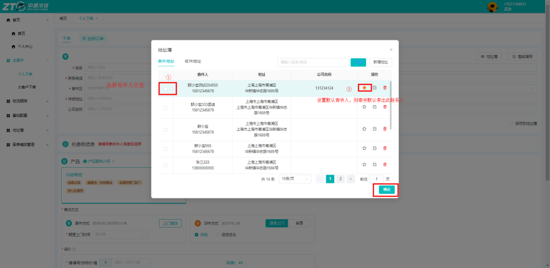

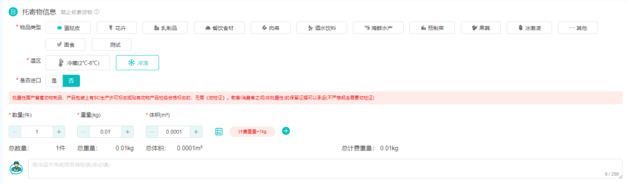

:::

## 第二步：网点在中通冷链系统对商家进行审核/充值

**①商家审核**

入口：经营管理中心——商户电子面单账户管理——审核

点击审核即可

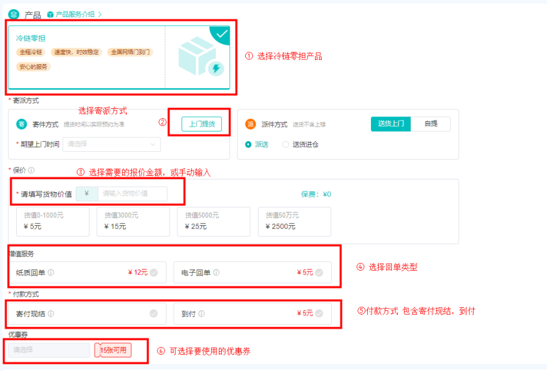

**②商家充值**

入口：经营管理中心——商户电子面单账户管理——充值（审核后才有充值按钮）

若输入为正整数，则会给商家充值；ps：此处注意，网点给商家充值前，数量需小于网点用户的面单余额

若输入为负整数，则会将商家电子面单余额扣减，同时将扣减的数量返还至网点对应渠道的电子面单账户； ps：此处注意，如商家有100个面单余额，则最多允许输入-100；

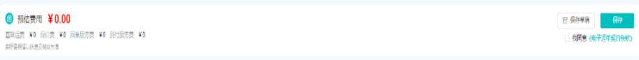

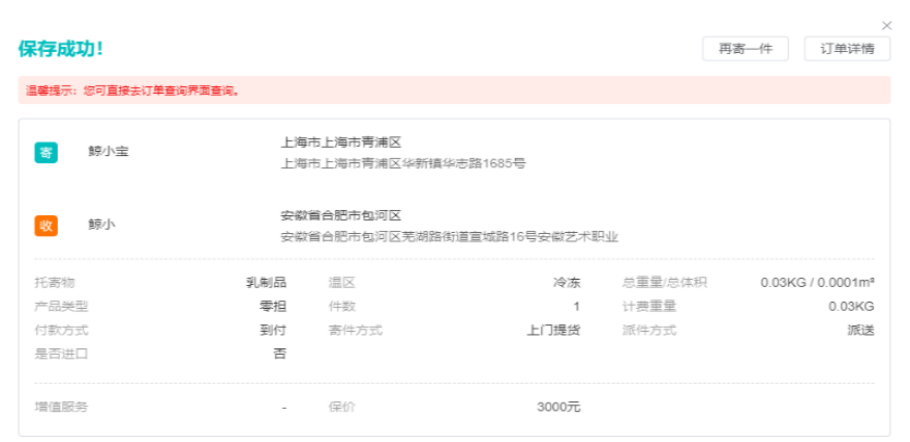

**③网点购买对应渠道面单**

入口：经营管理中心——电子面单申购

目前中通冷链已对接的平台有 淘宝（不含1688）、~~抖音~~、快手

若对接了不同渠道的商家，则需要购买不同平台的面单；例如商家为淘宝商家，则需要购买 菜鸟电子面单

### 注意事项

⚠️ 注意：若在此处未有对应渠道的电子面单，则需要联系省区财务 上架对应渠道的面单，同时需要省区先向总部申购后，网点才可以申购；

抖音暂不支持。

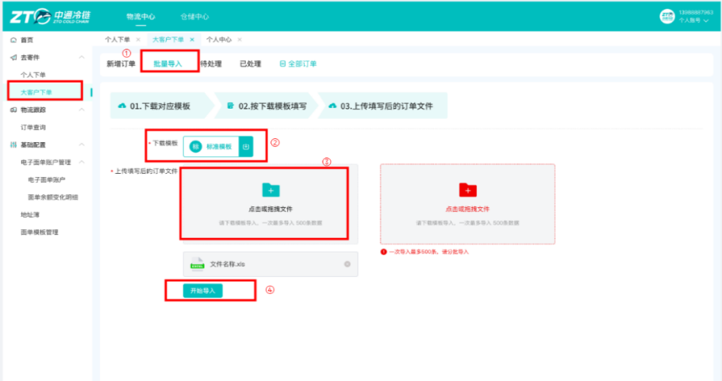

## 第三步：商家在打单软件配置打印模版

**①在平台订购对应的打单软件服务**

若商家有在使用的打单软件/erp则无需该步骤

⚠️ 注意：目前各打单软件并非全部支持中通冷链，可以先点击适用版，免费适用看是否有支持中通冷链；

目前主流的erp、打单软件均支持，例如旺店通、管家婆、快递管家、我打、快递助手等

若不支持，需要商家侧与对应的 软件服务商 售前支持人员反馈，软件服务商其对接后即可使用打单功能

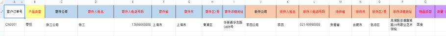

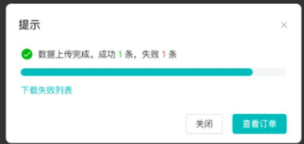

②配置打印模版

在面单模版维护入口，选择对应电商渠道，选择中通冷链

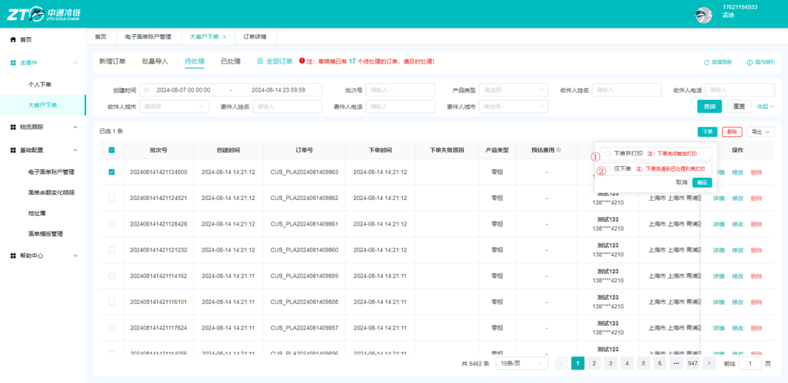

维护温区、产品类型、付款方式等信息

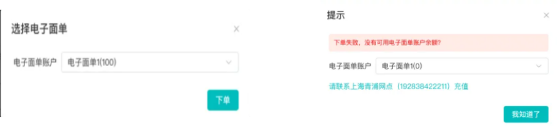

## 4.第四步：客户在打单软件取号打印面单

选择对应的订单，选择配置的电子面单模版进行打印即可

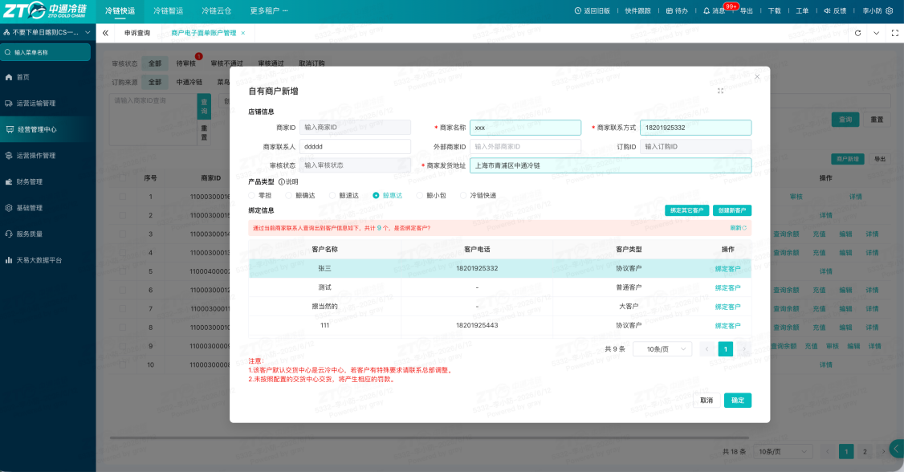**特殊说明：**

**目前客户在电商平台上下单，选择任意产品，目前均会转换为零担产品至鲸天系统内**

## 5.第五步：客户在平台直接下单，会推送到鲸天【订单管理中】，请及时接单！

该步骤与现有的订单操作相同，正常的转运单等操作即可

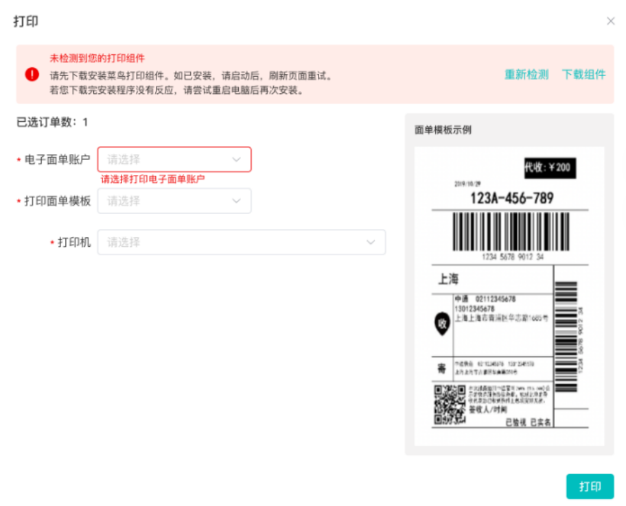

## 补充说明：

1. 若客户自有系统，支持对接物流公司取号，可直接通过此【**电子面单**】方式下单。
2. 若客户有其他自研系统，不支持物流公司直接取号，对方也有研发能力，可通过接口对接**【****中通冷链开放平台****】**的方式下单。详情联系@侯鹏