# 订单功能操作说明书

📌 文档基本信息

文档名称：中通冷链订单功能操作说明书

### 适用对象

总部、省区、分拨中心、各级网点工作人员

使用系统：鲸天系统、鲸小宝APP

---

## 业务场景与名词解释

### 业务场景（为什么用？）

对接菜鸟，抖音，满帮，快手，拼多多等平台订单，实现订单自动接入、智能分配网点、多渠道消息提醒、时效考核、转单、撤销及费用核算全流程管理，规范接单时效，保障订单流转效率，同时支持各级机构分层查询、处理下级订单。

### 核心名词解释（不迷路）

- **满帮订单**：来源于满帮货运平台的外部接入订单，订单编号前缀统一为MB。
- **接单超时**：满帮订单要求下单后**10分钟内完成接单**，超时则触发考核罚款与自动升级流转。
- **自动升级**：网点接单超时后，订单逐级向上流转，二级网点→一级网点→分拨中心→总部。
- **转单**：当前接单机构将订单转交至其他合规网点/机构处理的操作，不同层级机构转单范围不同。
- **定金返还**：订单转运单、签收卸货后，系统按规则判定定金是否返还或直接抵扣费用。

---

## 前置准备与环境配置

### 账号与权限要求

需持有鲸天系统、鲸小宝APP对应操作权限，包含**订单查询、接单、转单、撤销、费用流水查看**权限；无权限请联系系统管理员开通。

### 物理/环境准备

设备正常联网，可正常接收站内信、钉钉、短信消息提醒；电脑端正常登录鲸天系统，移动端安装并登录鲸小宝APP。

### 配套工具/链接

- 🛠️ 鲸小宝APP：移动端接单、查单、转单工具
- 🌐 鲸天系统登录入口：中通冷链官方运营后台

---

## 场景化标准操作步骤（怎么用？）

### 场景一：特殊场景-满帮订单自动分配规则

**系统功能路径**：鲸天系统自动执行，无需手动操作

1. 系统优先解析订单内指定网点，直接分配至该网点，不再二次解析省市区；
2. 未解析到指定网点时，通过GIS解析寄件省市区，若区域在黑名单内则直接拦截订单；
3. 非黑名单区域，匹配同省份营业分拨中心：仅1个分拨则直接分配，多个分拨则选择直线距离最近的；无匹配分拨则统一分配至总部。

📷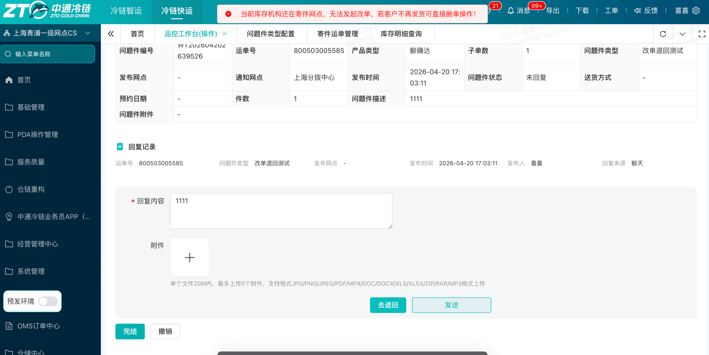

### 场景二：订单查询与筛选

**系统功能路径**：鲸天系统 → 订单管理 → 全部订单

1. 筛选条件新增**订单归属**：默认「全部」，可切换为「我的订单」（仅查看当前机构订单）、「下级订单」（查看下属机构订单）；
2. 订单来源查询条件，可精准筛选满帮订单；
3. 支持按订单时间、接单网点、订单状态等条件组合查询。

📷 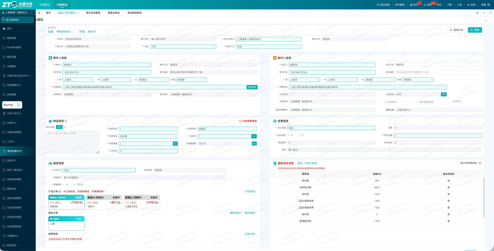

### 场景三：订单接单与消息提醒

**系统功能路径**：鲸天系统/鲸小宝APP → 订单管理 → 待接单

1. 订单下发后，特殊订单来源=满帮时 同步推送**站内信、钉钉、短信**三类提醒至对应接单人员，同时通知所属上级分拨中心监管。其他订单来源 仅会推送站内信。
2. 时效提醒：接单倒计时5-1分钟持续钉钉弹窗/站内信消息提醒，倒计时剩余2分钟额外发送短信预警；

非满帮订单 接单时效为60分钟。

3. 工作人员查看提醒消息，进入待接单列表选中订单，点击【预约接单】完成接单操作。

📷

站内信：

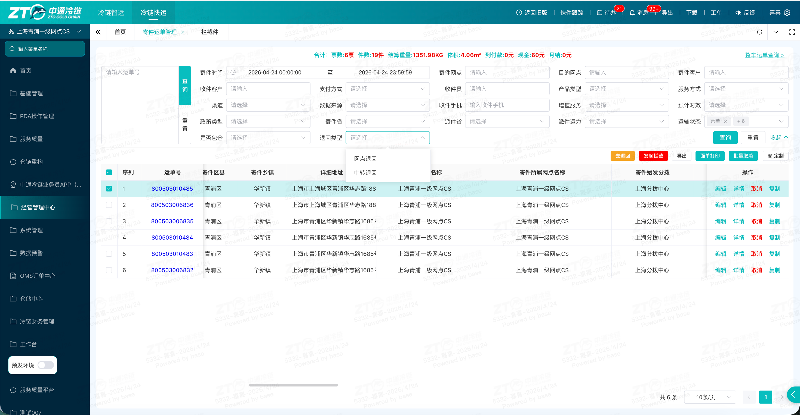

钉钉： 短信：

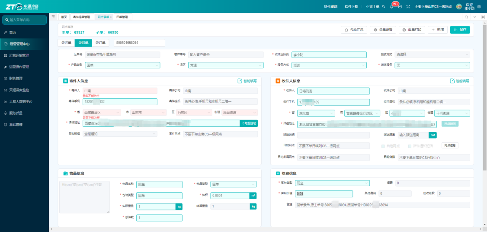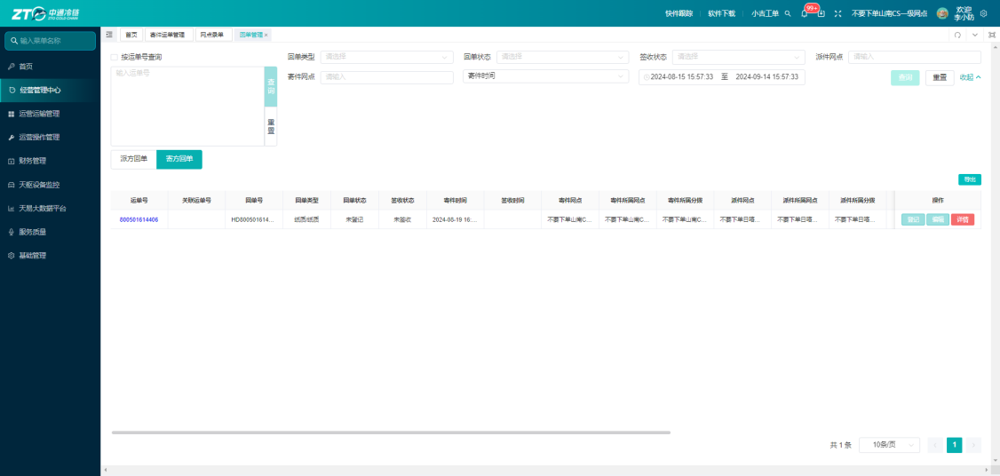

预约接单：

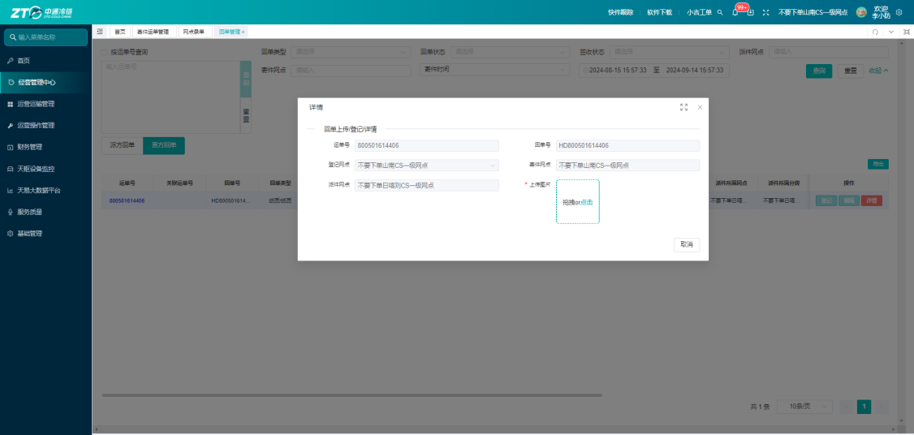

### 场景四：接单超时与自动升级处理

**系统功能路径**：鲸天系统 → 订单管理 → 接单超时列表

1. 时效规则：满帮订单接单时效为10分钟，超时一次罚款200元；其他订单来源 时效为60分钟，超时一次罚款100元。
2. 升级规则：满帮订单 二级网点超时→升级至一级网点，一级网点超时→升级至分拨中心，分拨中心超时→升级至总部，总部不参与考核；

其他订单来源 超时不升级，直接罚款 订单仍在原寄件网点。

3. 超时后系统自动生成**超时记录、升级处理记录**，可在订单详情内查看。

📷

### 场景五：订单转单操作

#### 鲸天系统端

**系统功能路径**：订单管理 → 待接单 → 选中订单 →【转单】

订单来源=满帮

1. 二级网点：无转单权限；
2. 一级网点：可转单至自身下级网点；
3. 分拨中心：可转单至下属一级、二级网点；
4. 总部：可转单至全国所有有效网点及各级分拨中心；
5. 转单完成后，订单详情会记录转单类型与操作记录。

订单来源=其他

仅总部可转单：可转单至全国所有有效网点及各级分拨中心；

#### 鲸小宝APP端

**系统功能路径**：鲸小宝 → 待接单/待下级接单 → 订单列表 →【转单】

1. APP新增**待下级接单**入口，可单独查看下属机构订单；
2. 转单权限规则与PC端一致，同时支持按订单来源、产品类型筛选订单。

📷 \[此处插入：鲸小宝待下级接单、转单界面截图\]

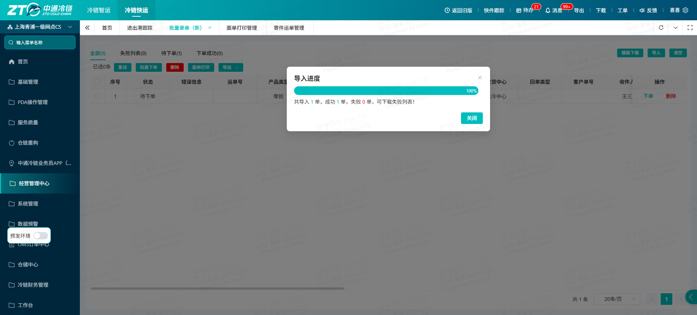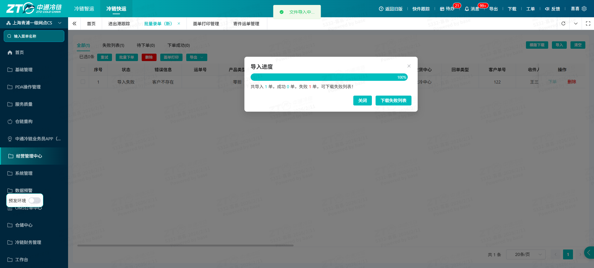

### 场景六：订单撤销跟进

**系统功能路径**：鲸天系统 → 订单管理 → 撤销跟进

1. 页面新增**总部撤销、省区撤销**分类标签，可区分撤销发起主体；
2. 可查询撤销状态、撤销原因、登记人及时间，支持申诉、导出数据。

📷 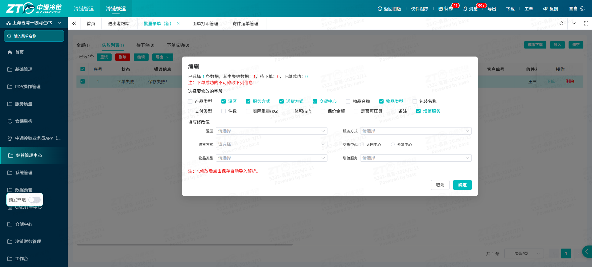

### 场景七：费用流水与定金管理

#### 1\. 超时罚款查询

**系统功能路径**：鲸天系统 → 订单管理 → 费用流水

筛选流水类型为订单，可查询订单超时罚款金额、收支主体、结算状态等信息。

#### 2\. 定金返还规则

**系统功能路径**：订单管理 → 订单详情

1. 订单转为运单后，系统自动扣除定金与服务费，并同步告知满帮平台；
2. 订单签收回调、完成卸货后，按「定金是否返还」标识处理：选择**不返还**则直接抵扣财务款项，选择**返还**则正常扣费、不做抵扣。

📷 \[此处插入：费用流水、定金标识界面截图\]

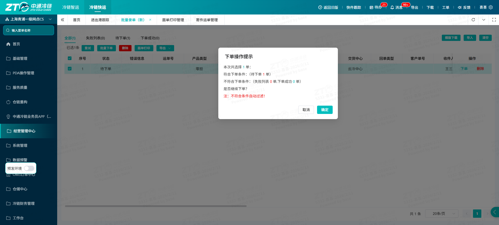

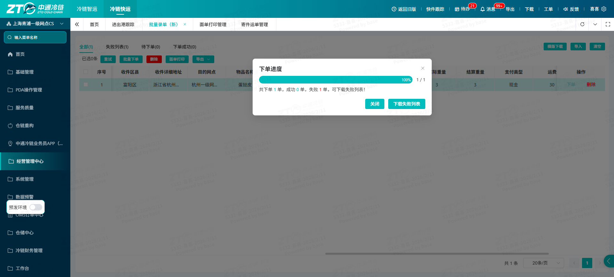

---

## 常见异常与兜底方案（卡住了怎么办？）

| 序号 | ❌ 异常现象 / 报错提示 | 🔍 常见原因 | 🛠️ 解决方案 |
|------|-------------------------------|-----------------|--------------------|
| 1 | 收不到满帮订单接单提醒 | 账号消息权限关闭、系统缓存异常、手机号配置错误 | 1\. 检查站内信、钉钉、短信通知权限；2. 刷新页面/重启APP；3. 联系管理员核对预留联系手机号 |
| 2 | 找不到下级机构的满帮订单 | 未切换「订单归属-下级订单」或未进入鲸小宝「待下级接单」 | 切换对应查询入口，重新筛选订单 |
| 3 | 账号无转单按钮/转单失败 | 当前机构层级无转单权限，或目标网点状态异常 | 对照转单权限规则操作，更换合规接收网点 |
| 4 | 查询不到超时罚款流水 | 筛选条件错误、数据未完成结算 | 调整筛选维度，等待系统结算完成后再次查询 |
| 5 | 订单被系统拦截无法接单 | 寄件省市区命中平台黑名单 | 核对寄件地址，按要求调整后重新下单 |

---

## 高频常见问题（FAQ）

### ● Q1：满帮订单标准接单时效是多久，超时如何处罚？

○ A：接单时效为10分钟，超时单次罚款200元，同时订单会逐级自动升级至上级机构。

### ● Q2：不同层级机构的转单范围有什么区别？

○ A：二级网点不可转单；一级网点可转下级网点；分拨可转下属一、二级网点；总部可转全国所有网点与分拨。

### ● Q3：待接单和待下级接单有什么区别？

○ A：待接单仅查看当前登录机构订单；待下级接单可查看本机构下属所有网点的订单，支持统一处理。

### ● Q4：订单定金在什么情况下会抵扣费用？

○ A：订单详情标识为“定金不返还”时，完成签收卸货后定金直接抵扣财务款项；标识为“返还”则正常扣费。

### ● Q5：如何区分订单是网点、省区还是总部发起撤销？

○ A：在「撤销跟进」页面，通过撤销分类标签即可区分网点撤销、省区撤销、总部撤销。