# 订单管理

## 一、适用场景

本文适用于总部、省区、分拨中心、各级网点工作人员，使用**鲸天系统**或**鲸小宝APP**处理订单相关业务。

适用业务包括：对接菜鸟、抖音、满帮、快手、拼多多等平台订单，实现订单自动接入、智能分配网点、多渠道消息提醒、时效考核、转单、撤销及费用核算等流程管理。

## 二、前置条件

1. 已具备**鲸天系统**、**鲸小宝APP**对应账号。
2. 账号已开通以下操作权限：**订单查询、接单、转单、撤销、费用流水查看**。
3. 电脑端可正常登录**鲸天系统**，移动端已安装并登录**鲸小宝APP**。
4. 设备网络正常，可正常接收**站内信、钉钉、短信**消息提醒。
5. 如无权限，请联系系统管理员开通。

## 三、操作入口

- **鲸天系统登录入口**：中通冷链官方运营后台
- **鲸小宝APP**：移动端接单、查单、转单工具

常用菜单入口：

- **鲸天系统 → 订单管理 → 全部订单**
- **鲸天系统/鲸小宝APP → 订单管理 → 待接单**
- **鲸天系统 → 订单管理 → 接单超时列表**
- **订单管理 → 待接单 → 选中订单 →【转单】**
- **鲸小宝 → 待接单/待下级接单 → 订单列表 →【转单】**
- **鲸天系统 → 订单管理 → 撤销跟进**
- **鲸天系统 → 订单管理 → 费用流水**
- **订单管理 → 订单详情**

## 四、名词解释

- **满帮订单**：来源于满帮货运平台的外部接入订单，订单编号前缀统一为**MB**。
- **接单超时**：满帮订单要求下单后**10分钟内完成接单**，超时会触发考核罚款与自动升级流转。
- **自动升级**：网点接单超时后，订单逐级向上流转，流转路径为：**二级网点 → 一级网点 → 分拨中心 → 总部**。
- **转单**：当前接单机构将订单转交至其他合规网点/机构处理的操作，不同层级机构转单范围不同。
- **定金返还**：订单转运单、签收卸货后，系统按规则判定定金是否返还或直接抵扣费用。

## 五、操作步骤

### 5.1 满帮订单自动分配

**系统功能路径**：**鲸天系统自动执行，无需手动操作**

1. 系统优先解析订单内指定网点，直接分配至该网点，不再二次解析省市区。
2. 未解析到指定网点时，系统通过**GIS**解析寄件省市区；如果区域在黑名单内，系统直接拦截订单。
3. 非黑名单区域，系统匹配同省份营业分拨中心：
   - 仅有**1个分拨**：直接分配；
   - 有多个分拨：选择直线距离最近的分拨；
   - 无匹配分拨：统一分配至总部。

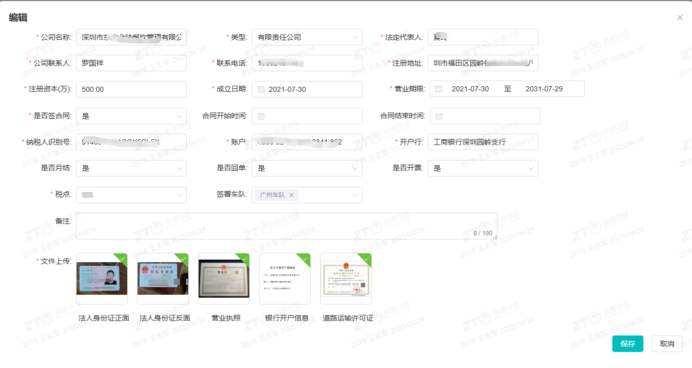

### 5.2 查询与筛选订单

**系统功能路径**：**鲸天系统 → 订单管理 → 全部订单**

1. 进入**全部订单**页面。
2. 使用筛选条件**订单归属**查询订单：
   - **全部**：默认选项；
   - **我的订单**：仅查看当前机构订单；
   - **下级订单**：查看下属机构订单。
3. 使用**订单来源**查询条件，可精准筛选满帮订单。
4. 可按**订单时间、接单网点、订单状态**等条件组合查询。

### 5.3 接单与查看消息提醒

**系统功能路径**：**鲸天系统/鲸小宝APP → 订单管理 → 待接单**

1. 订单下发后，按订单来源推送提醒：
   - **特殊订单来源=满帮**：同步推送**站内信、钉钉、短信**三类提醒至对应接单人员，同时通知所属上级分拨中心监管；
   - **其他订单来源**：仅推送**站内信**。
2. 查看接单倒计时提醒：
   - 倒计时**5-1分钟**：持续通过钉钉弹窗/站内信消息提醒；
   - 倒计时剩余**2分钟**：额外发送短信预警。
3. 工作人员根据提醒进入**待接单**列表。
4. 选中订单，点击**【预约接单】**完成接单。

::: warning 注意事项
**非满帮订单**接单时效为**60分钟**。
:::

站内信：

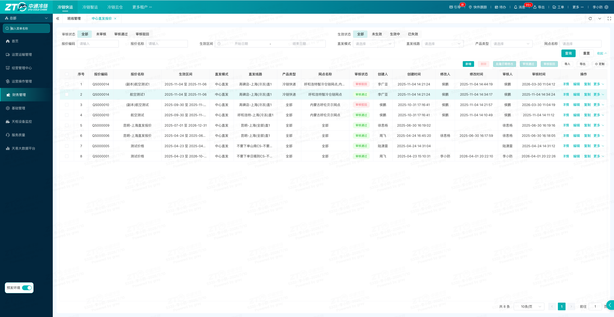

钉钉、短信：

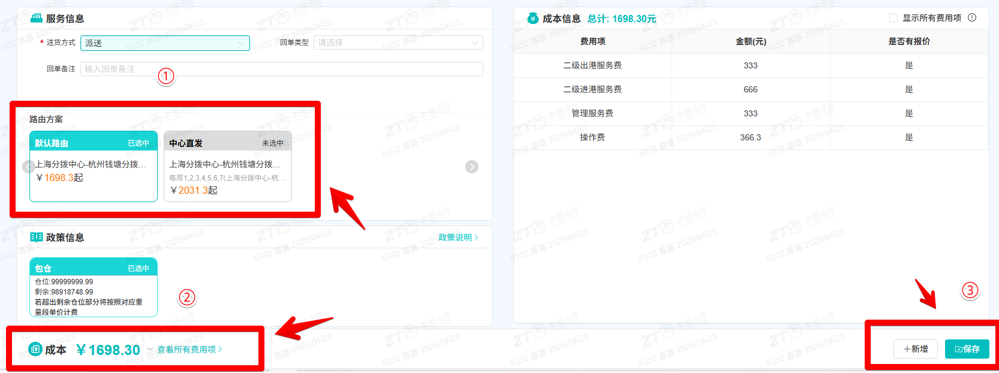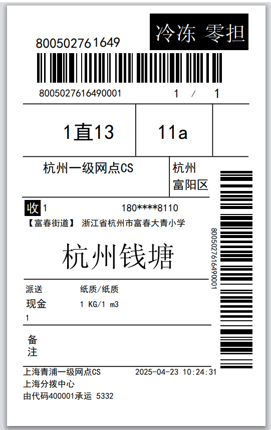

预约接单：

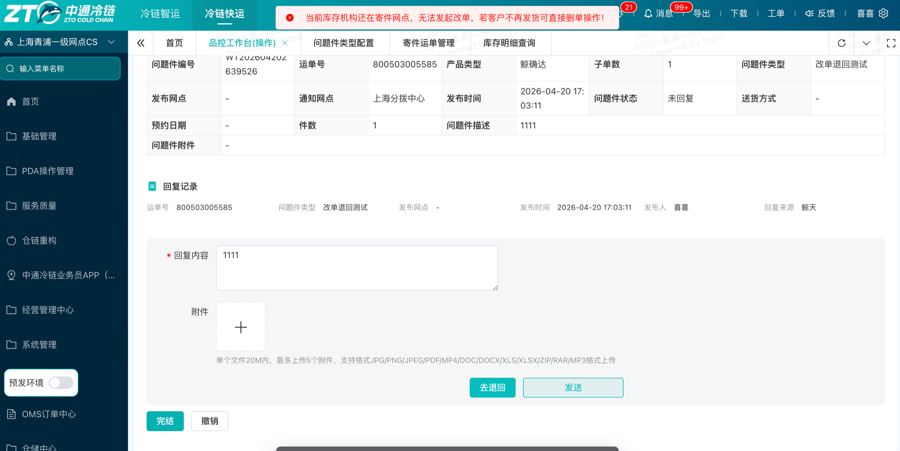

### 5.4 处理接单超时与自动升级

**系统功能路径**：**鲸天系统 → 订单管理 → 接单超时列表**

1. 查看接单时效规则：
   - **满帮订单**：接单时效为**10分钟**，超时一次罚款**200元**；
   - **其他订单来源**：接单时效为**60分钟**，超时一次罚款**100元**。
2. 查看升级规则：
   - **满帮订单**：**二级网点超时 → 升级至一级网点 → 一级网点超时 → 升级至分拨中心 → 分拨中心超时 → 升级至总部**；
   - **总部**不参与考核；
   - **其他订单来源**：超时不升级，直接罚款，订单仍在原寄件网点。
3. 超时后，系统自动生成**超时记录、升级处理记录**。
4. 进入订单详情，可查看对应记录。

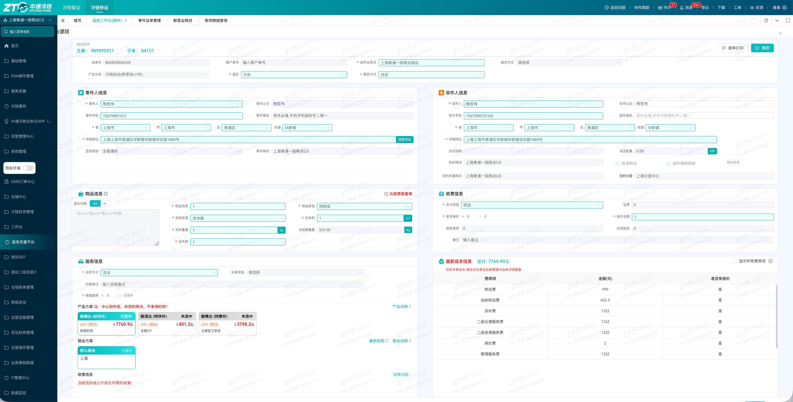

### 5.5 订单转单

#### (1) 鲸天系统端转单

**系统功能路径**：**订单管理 → 待接单 → 选中订单 →【转单】**

1. 进入**待接单**页面。
2. 选中需要转单的订单。
3. 点击**【转单】**。
4. 按订单来源和机构层级选择可转单范围。

**订单来源=满帮**时，转单权限如下：

| 机构层级 | 转单范围 |
|---|---|
| 二级网点 | 无转单权限 |
| 一级网点 | 可转单至自身下级网点 |
| 分拨中心 | 可转单至下属一级、二级网点 |
| 总部 | 可转单至全国所有有效网点及各级分拨中心 |

**订单来源=其他**时，转单权限如下：

| 机构层级 | 转单范围 |
|---|---|
| 总部 | 可转单至全国所有有效网点及各级分拨中心 |

5. 转单完成后，订单详情会记录**转单类型**与**操作记录**。

#### (2) 鲸小宝APP端转单

**系统功能路径**：**鲸小宝 → 待接单/待下级接单 → 订单列表 →【转单】**

1. 打开**鲸小宝APP**。
2. 进入**待接单**或**待下级接单**。
3. 在订单列表中选择需要处理的订单。
4. 点击**【转单】**。
5. 按与PC端一致的转单权限规则完成转单。
6. 可按**订单来源、产品类型**筛选订单。

::: tip 说明
APP新增**待下级接单**入口，可单独查看下属机构订单。
:::

📷 [此处插入：鲸小宝待下级接单、转单界面截图]

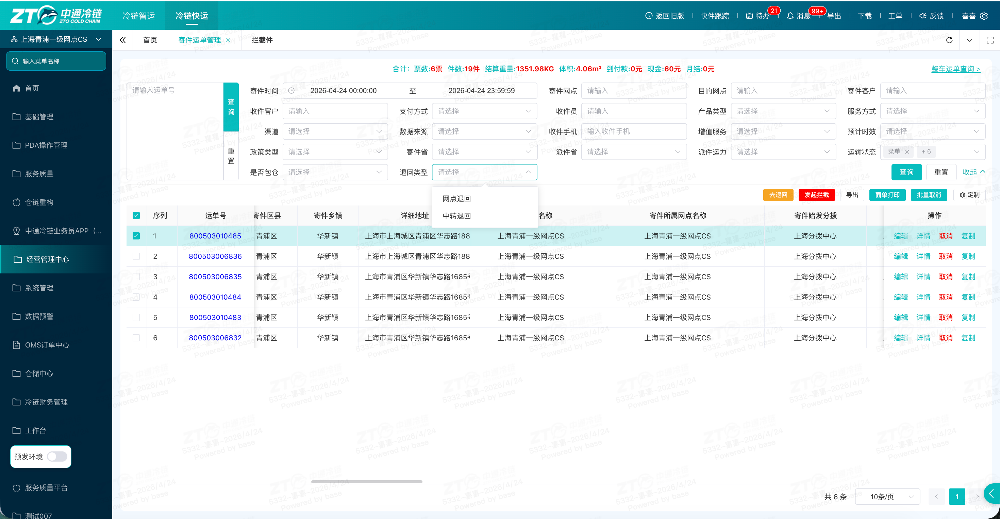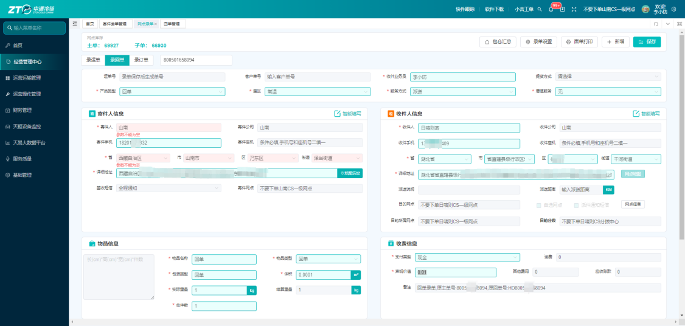

### 5.6 订单撤销跟进

**系统功能路径**：**鲸天系统 → 订单管理 → 撤销跟进**

1. 进入**撤销跟进**页面。
2. 通过**总部撤销、省区撤销**分类标签，区分撤销发起主体。
3. 查询**撤销状态、撤销原因、登记人及时间**。
4. 如需处理，可按页面功能进行**申诉、导出数据**。

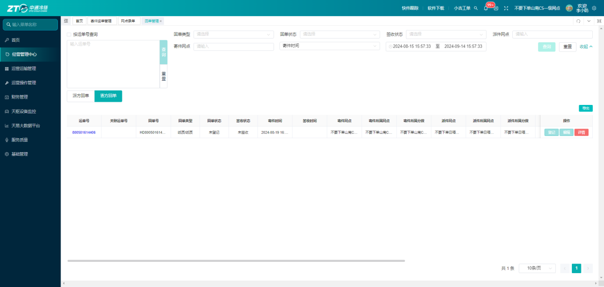

### 5.7 查询费用流水与定金管理

#### (1) 超时罚款查询

**系统功能路径**：**鲸天系统 → 订单管理 → 费用流水**

1. 进入**费用流水**页面。
2. 将流水类型筛选为**订单**。
3. 查询订单超时罚款金额、收支主体、结算状态等信息。

#### (2) 定金返还规则查看

**系统功能路径**：**订单管理 → 订单详情**

1. 订单转为运单后，系统自动扣除定金与服务费，并同步告知满帮平台。
2. 订单签收回调、完成卸货后，系统按**「定金是否返还」**标识处理：
   - 选择**不返还**：直接抵扣财务款项；
   - 选择**返还**：正常扣费，不做抵扣。

📷 [此处插入：费用流水、定金标识界面截图]

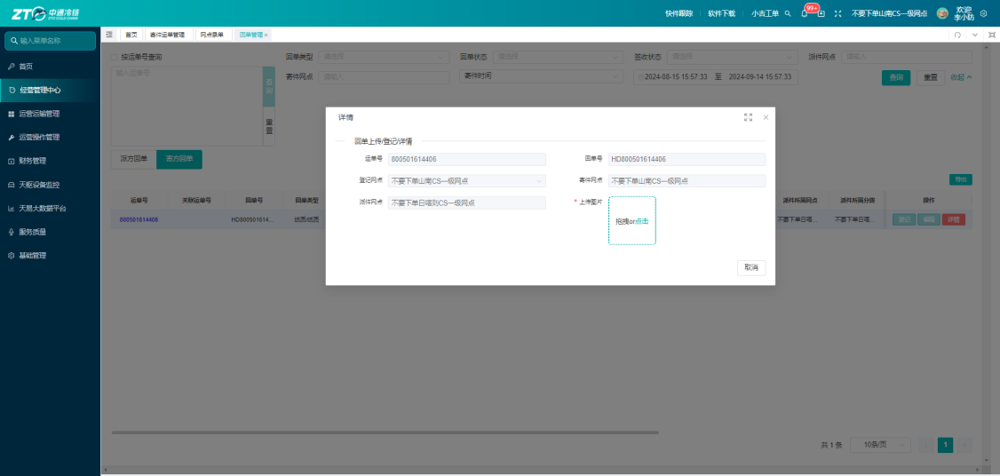

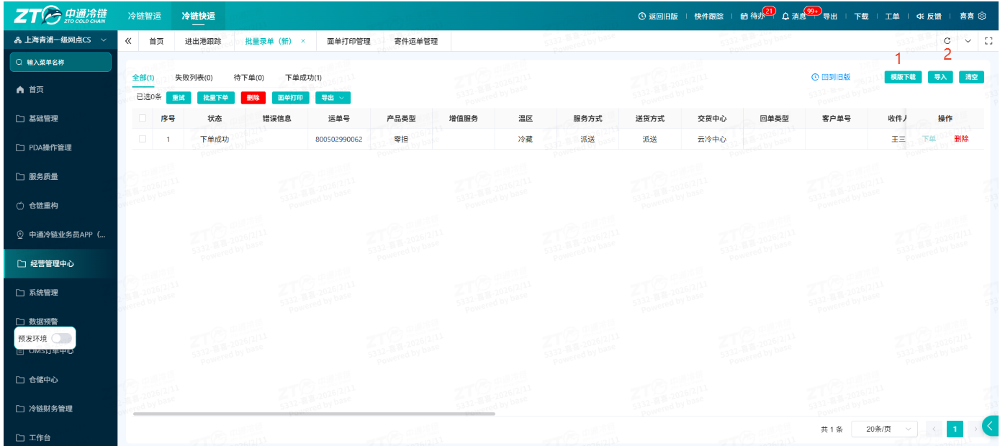

## 六、操作结果

完成对应操作后，可在系统中看到以下结果：

1. 订单可按规则自动分配至指定网点、分拨中心或总部。
2. 可在**全部订单**中按**订单归属、订单来源、订单时间、接单网点、订单状态**等条件查询订单。
3. 接单完成后，订单进入后续处理流程。
4. 超时后，系统生成**超时记录、升级处理记录**，并可在订单详情中查看。
5. 转单完成后，订单详情记录**转单类型**与**操作记录**。
6. 撤销跟进页面可查看撤销状态、撤销原因、登记人及时间。
7. 费用流水页面可查询订单超时罚款金额、收支主体、结算状态等信息。
8. 定金处理结果按订单详情中的**「定金是否返还」**标识执行。

## 七、注意事项

::: danger 重点提醒
- **满帮订单**接单时效为**10分钟**，超时一次罚款**200元**。
- **非满帮订单**接单时效为**60分钟**，超时一次罚款**100元**。
- **满帮订单**超时会按层级自动升级：**二级网点 → 一级网点 → 分拨中心 → 总部**。
- **其他订单来源**超时不升级，直接罚款，订单仍在原寄件网点。
- **二级网点**对满帮订单无转单权限。
- **其他订单来源**仅总部可转单，可转单至全国所有有效网点及各级分拨中心。
:::

::: warning 注意事项
- 如收不到提醒，请先检查站内信、钉钉、短信通知权限，以及预留手机号是否正确。
- 如找不到下级机构订单，请确认是否切换到**订单归属-下级订单**，或进入鲸小宝**待下级接单**。
- 如无**转单**按钮或转单失败，请核对当前机构层级是否具备转单权限，并确认目标网点状态是否正常。
- 如查询不到罚款流水，请确认筛选条件是否正确，或等待系统结算完成后再次查询。
- 如订单被系统拦截无法接单，请核对寄件省市区是否命中平台黑名单。
:::

## 八、常见问题

### 8.1 Q1：满帮订单标准接单时效是多久，超时如何处罚？

A：满帮订单接单时效为**10分钟**，超时单次罚款**200元**，同时订单会逐级自动升级至上级机构。

### 8.2 Q2：不同层级机构的转单范围有什么区别？

A：满帮订单转单范围如下：

- **二级网点**：不可转单；
- **一级网点**：可转下级网点；
- **分拨中心**：可转下属一级、二级网点；
- **总部**：可转全国所有网点与分拨。

其他订单来源仅**总部**可转单。

### 8.3 Q3：待接单和待下级接单有什么区别？

A：**待接单**仅查看当前登录机构订单；**待下级接单**可查看本机构下属所有网点的订单，支持统一处理。

### 8.4 Q4：订单定金在什么情况下会抵扣费用？

A：订单详情标识为**“定金不返还”**时，完成签收卸货后定金直接抵扣财务款项；标识为**“返还”**时正常扣费，不做抵扣。

### 8.5 Q5：如何区分订单是网点、省区还是总部发起撤销？

A：在**撤销跟进**页面，通过撤销分类标签即可区分网点撤销、省区撤销、总部撤销。

### 8.6 Q6：收不到满帮订单接单提醒怎么办？

A：可按以下方式排查：

1. 检查**站内信、钉钉、短信**通知权限；
2. 刷新页面或重启APP；
3. 联系管理员核对预留联系手机号。

### 8.7 Q7：找不到下级机构的满帮订单怎么办？

A：在鲸天系统中切换**订单归属-下级订单**，或在鲸小宝进入**待下级接单**后重新筛选订单。

### 8.8 Q8：账号没有转单按钮或转单失败怎么办？

A：请先对照转单权限规则确认当前机构是否有权限；如目标网点状态异常，请更换合规接收网点。

### 8.9 Q9：查询不到超时罚款流水怎么办？

A：请调整筛选维度后重新查询；如数据未完成结算，请等待系统结算完成后再次查询。

### 8.10 Q10：订单被系统拦截无法接单怎么办？

A：请核对寄件地址，确认寄件省市区是否命中平台黑名单，并按要求调整后重新下单。