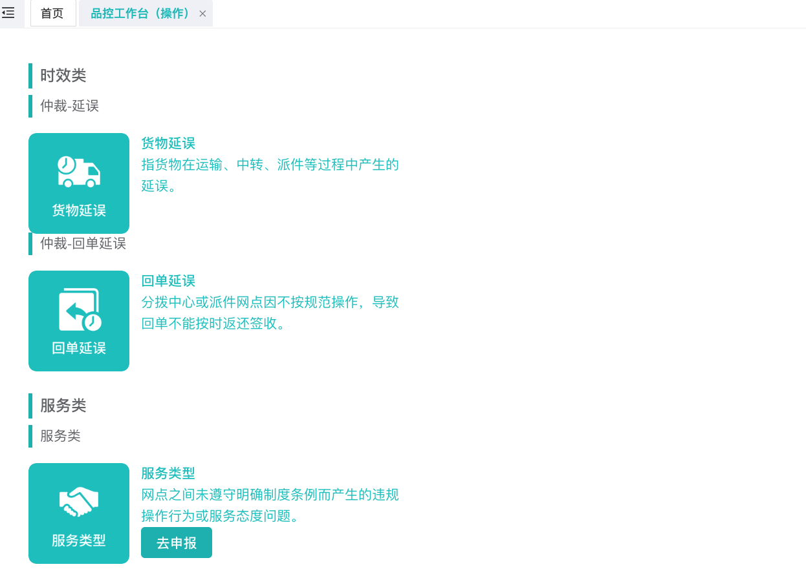
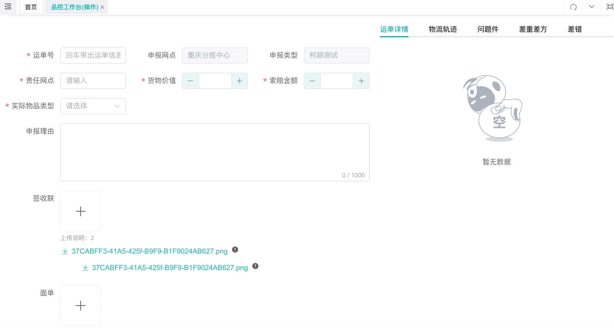
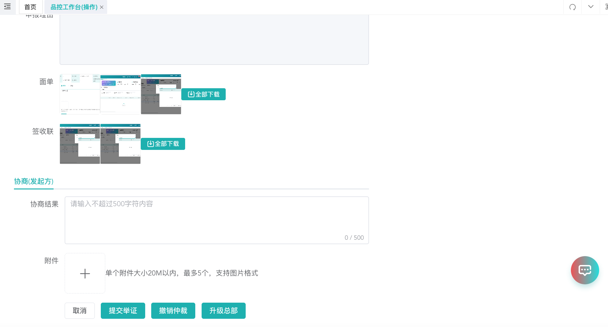
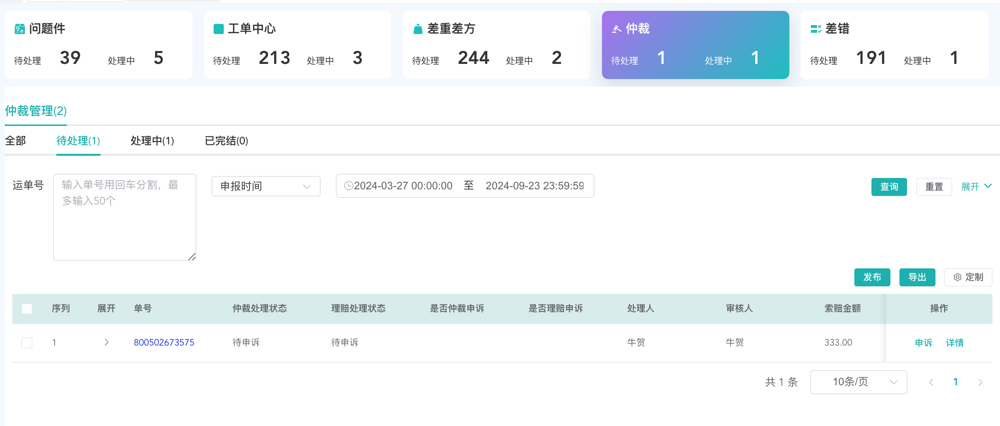

# 仲裁如何申报、申诉？

## 一、流程

1. 主要在调整点在新增仲裁后，新增了协商节点；发起方可进行升级总部 至总部处理；如线下沟通好理赔事宜，无需总部介入，可撤销仲裁；
2. 待处理节点时，新增处理不通过，打回发起方进行仲裁单据修改；

## 二、功能操作

### 2.1 菜单入口及预览

<strong>操作入口</strong>：服务质量，流程节点人员在【操作】处理查看数据，非流程节点【查询】查看数据

- 网点可操作权限（品控工作台 操作）

1. 新增：新增仲裁/理赔单据；
2. 协商：发起网点、责任网点可进行协商；
3. 申诉：发起网点、责任网点可进行申述；

### 2.2 仲裁发布

用户可在此页进行仲裁申报和申诉处理

1. 【发布】用户仲裁申报用户可在此发仲裁/理赔，用户需选择责任网点，并进行相关材料提交；
2. 【申诉】对有歧义仲裁单进行申报；

3. 发布操作：先选择申报类型

4. 发布操作：选择申报类型后，进入内容填写页

- 运单号：输入运单号，带出对应的运单、轨迹信息；允许一级代二级网点进行上报；
- 责任网点：用户自行搜索选择责任网点，支持多选；
- 申报理由：用户填写申报理由；
- 附件：根据下方的描述，用户进行附件上传；

### 2.3 仲裁协商处理

1. 申报网点可在此进行协商操作

2. 点击【协商】按钮，跳转详情页（发起方协商）

- 撤销仲裁：发起方有权利进行撤销操作；撤销后，则该单据完结；
- 升级总部：发起方可直接升级总部；升级总部后，则该单据转至总部处理； 如48H 未升级，则系统自动升级总部；
- 协商结果：发起方填写相关协商结果；

1. 点击【协商】按钮，跳转详情页（责任方协商）

- 举证内容：责任方可提交自己无则相关举证内容；
- 提交举证：提交后，则相关填写内容保存，责任方的举证并不回造成流程节点的变更；

### 2.4 仲裁申诉

1. 当为待申诉状态时，发起方、责任方可进行申诉操作

2. 申诉内容：发起方、责任方填写申诉内容，上传申诉附件；
3. 申诉完成：点击申诉完成；
4. 补充说明：发起方、责任方有 120H 申诉时间，若120 H 内，有任意一方申诉，或者均完成申诉，则会转待申诉处理； （若无任意一方申诉，则会转完结；若有理赔场景，当进行仲裁or理赔申诉时，若对应的理赔/仲裁状态未完结装填，会将其置为待申诉处理状态）；

### 2.5 仲裁消息提醒

以下场景会提醒处理网点（鲸天）

1. 新增仲裁单据；
2. 总部审核节点；
3. 申诉节点；
4. 仲裁申诉处理节点；
5. 仲裁处理-处理不通过

