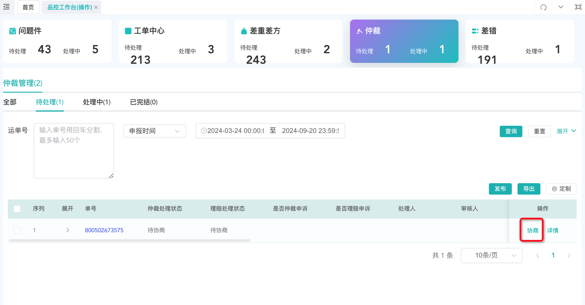

# 处理工单

## 菜单入口及预览

1. 品控工作台（操作）仅当前节点的人可处理（一级可帮二级处理）
2. 普通工单查询：处理（暂存/完结）
3. 工单申诉：72小时未申诉单申诉
4. 咨询工单：所有咨询工单查询(无需网点处理的工单)
5. 品控工作台（查询）所有人员可查询

## 网点处理工单

用户可在此页面进行工单发布、处理等操作

1. 待处理：为普通工单待处理\+普通工单申诉单待处理总和；
2. 处理方可点击【处理】按钮进行暂存或者完结的操作；

3. 通过点击处理，跳转处理详情页，网点可进行【暂存】【完结】操作

::: warning 注意事项
工单升级至上级，当前责任网点责无法处理，仅上级可处理

:::

## 网点申诉工单

网点可在规定时间内再次模块可进行工单申诉

1. 在普通工单申诉单模块，72小时内可进行申诉，点击操作列【处理】进行处理

2. 点击【处理】跳转详情页，进行申诉内容和附件填写，点击确认，提交申诉，该条申诉单即流转至总部，由总部进行审核裁定

## 录单/发短信（总部权限）

仅总部可在录单页面进行工单录入，短信发送，催单/转单操作

1. 【普通工单】可流转至处理网点进行后续处理；
2. 【咨询工单】仅记录，不做后续网点流转处理；
3. 【处理网点】自动带出运单轨迹机构，默选工单类型配置所对应的处理网点（寄件网点/目的网点，也可通过自选网点查询后进行推送处理；
4. 【工单处理记录】输入运单号后会自动带出该条运单的工单记录及物流轨迹，方便快速了解并处理问题；

5. 点击右下角【icon】支持自定义发送短信，目的网点为录单运单对应的目的和寄件网点

6. 处理中工单，可进行追加说明，处理网点可在处理记录中查看追加内容；
7. 处理中工单，可进行催单，处理网点可在普通工单列表中或处理记录了解催单次数，以便提高处理效率；

## 待办消息通知

以下场景会提醒处理网点

1. 新普通工单（新建/升级/转单）
2. 首响超时新申诉单
3. 完结超时新申诉单
4. 二次工单新申诉单
5. 超时升级新申诉单

