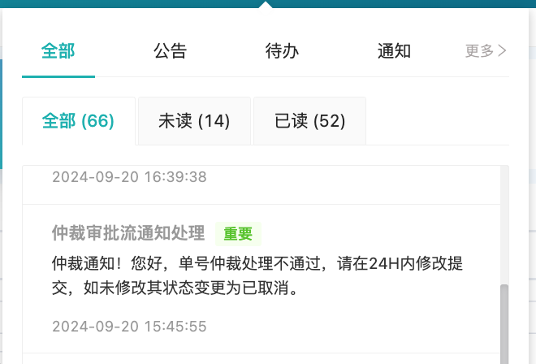
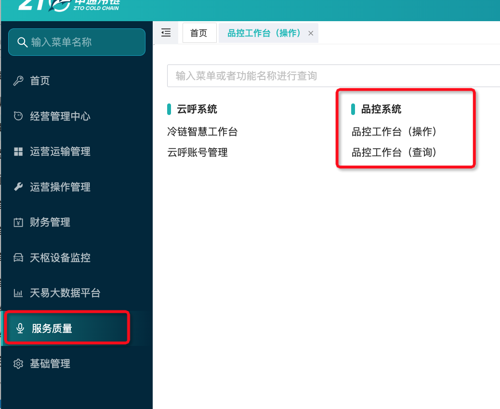

# 问题件如何有效回复

## 一、菜单入口及预览

<strong>操作入口</strong>：服务质量, 流程节点人员在【操作】处理查看数据, 非流程节点【查询】查看数据

网点可操作权限（品控工作台 操作）

1. 发布：发布问题件
2. 问题件查询：问题件查询、回复、举证、撤销
3. 举证申诉：申诉
4. 超时未回复申诉：申诉

## 二、发布/回复问题件

点击【发布】按钮后，在如下弹窗中输入发布内容，点击确认即可

1. 支持单条和批量发布2种模式

2. 【举证】①举证登记不规范、虚假问题件，必须是问题件被通知方才能举证，且必须在自问题件发布之日起的72小时内举证，超时不允许；②举证回复不规范，必须是问题件发布方才能举证，且必须在回复后的72小时之内，超时不允许
3. 【回复】- 发布时间为 T 0:00:00- 16:00:00-被通知网点当天23:59:59前回复， 发布时间为 T+0 16:00:00-T+0 23:59:59，被通知网点次日11点前回复
4. 【撤销】仅发布方可撤销

## 三、回复/发布问题件（鲸小宝）

1. 支持鲸小宝问题件进行回复/完结/撤销操作

