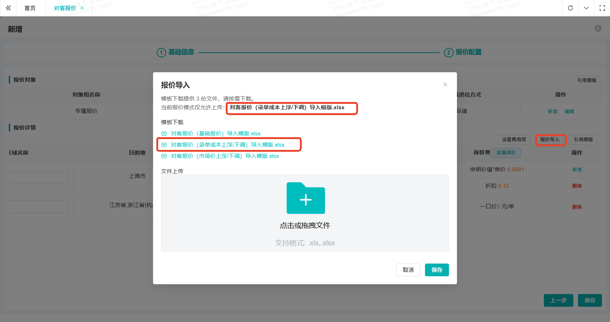
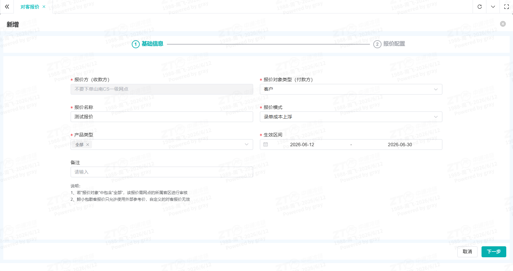
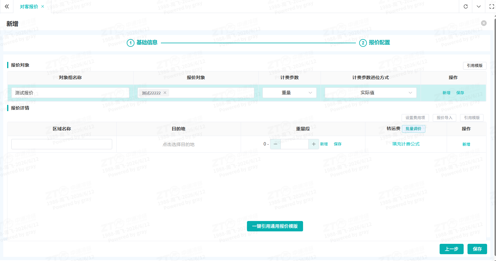
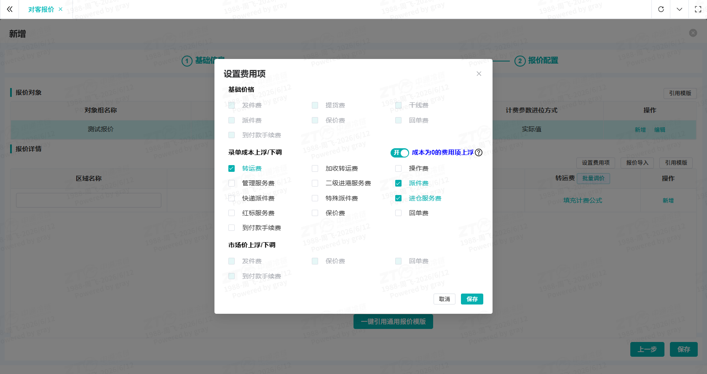

# 维护对客报价

## 一、适用场景

网点面向外部客户制定运费收费标准。
- **大客户**：使用对客报价维护约定价格，客户下单可看到成本，自动生成账单，减少沟通成本。
- **散客**：按市场价维护揽货价格，客户下单后减少运费争议。

::: tip 核心名词解释
- **对客报价**：网点面向外部客户制定的运输、派件、保价等服务收费标准，包含单价、计价规则、适用范围等，是生成对客账单的核心依据。
- **报价校验**：系统自动检测报价内容、配置是否合规，拦截异常数据。
- **报价模式**：报价计费的方式，可以自定义价格，也可以在现有成本基础上做加收。
- **报价对象**：可对不同客户区分定价。
- **计费参数**：通常客户使用重量计费，部分特殊客户可按件数、票数计费，选择对应的计费基础。
:::

## 二、前置条件

- **账号与权限**：权限角色需包含 `[ZTO网点管理员]`，若无权限请联系系统管理员。
- **物理/环境准备**：无。
- **配套工具/链接**：
  🌐 官方系统登录入口：👉 [[点击进入系统](https://jt.ztocc.com/dashboard)]

## 三、操作入口

- **系统功能路径**：登录系统 → 左侧菜单栏 → **财务管理** → **一级网点内部报价** → **对客报价**
- **快捷直达链接**：👉 [[点击一键直达该页面](https://jt.ztocc.com/app/#/phecda/quote/quote-maintenance)]

## 四、操作步骤

1. **打开表单**
   进入页面后，点击右上角 **新增** 按钮，填写报价名称，依次选择 **报价模式**、**产品类型**、**生效区间**，点击 **下一步**。
   

2. **填写客户基本信息**
   进入页面后，填写对象组名称，依次选择 **报价对象**、**计费参数**、**计费参数进位方式**，点击右上角操作列的 **保存**。

   ::: warning 注意事项
   仅支持对大客户、协议客户单独定价，报价对象只显示大客户、协议客户；维护对散客的报价时，报价对象选择“全部”维护兜底价格即可。
   :::

   

3. **选择报价对应的费用项**
   右上角点击 **设置费用项** 按钮，在弹框中勾选需要配置的结算费用项。若对成本为0的费用项也需要加收，可勾选 **加收** 开关后保存。
   

4. **设置目的地和重量段**
   - 点击列表中目的地下的空白区域，显示目的地维护弹框，勾选省市并填写合适的区域名称后保存。
   - 若维护多个目的地报价，可点击报价详情模块中操作列的 **新增**，按上述方法增加目的地。
   
   - 在重量段区域填写结束重量，若需维护多个重量段，填写结束重量后依次点击 **保存**、**新增**，按上述方法增加重量段。
   

5. **设置价格标准**
   点击费用项下方的 **填充计费公式**，选择合适的模版填写价格标准。若需设置最低、最高收费，可勾选对应开关后填写最低、最高收费标准。
   

6. **保存价格**
   所有费用项价格全部维护完成后，点击右下角的 **保存** 按钮。存在未勾选的费用项时，会弹出提醒，确认无需添加费用项后，点击 **确定**，完成价格维护。
   

7. **报价审核**
   勾选报价，点击右上角的 **审核** 按钮，审核通过后价格生效。
   

## 五、操作结果

报价审核通过后立即生效（若生效日期大于当天，则次日生效），客户下单时可按此报价计算费用并生成账单。历史已结算账单价格不会随之变动。

## 六、注意事项

- **报价对象限制**：仅支持对大客户、协议客户单独定价，散客报价需选择“全部”。
- **审核权限**：报价对象包含“全部”（散客兜底价）时，需上级省区审核，联系省区网管审核。
- **报价重复**：同条件下已存在报价时，系统禁止重复创建，请编辑原报价或作废后再新增。
- **生效时间**：生效日期 ≤ 当天时，审核通过后立刻生效；生效日期在次日及以后，需等到次日才可用。

## 七、常见问题

**Q1：客户价格需要按目的地和重量段细分，明细段很多，有没有更高效的维护方式？**
**A**：有。可使用 **报价导入** 功能。

点击“报价导入”，根据当前选择的报价模式选择对应的导入模版。

根据实际情况填写对应的价格标准，可参照下表示例：

| 区域名称 | 目的地 | 开始分段（>） | 结束分段（<=） | 转运费 | | | | | |
|----------|--------|---------------|----------------|---------|---------|--------|--------|--------|--------|
| | | | | 首重 | 首价 | 续价 | 折扣 | 最低收费 | 最高收费 |
| 上海 | 上海市 | 0 | 300 | | | | 0.11 | | |
| 上海 | 上海市 | 300 | 600 | | | 1.2 | | | |
| 江苏 | 江苏省，浙江省（杭州市） | 0 | 1200 | 100 | 50 | 0.3 | | | |

**Q2：新增报价后什么时候生效？**
**A**：根据报价的生效区间判断。生效日期小于等于当天，则审核通过后立刻生效，可应用于新订单；生效日期在次日及以后，需等到次日才可使用。历史已结算账单价格不会随之变动。