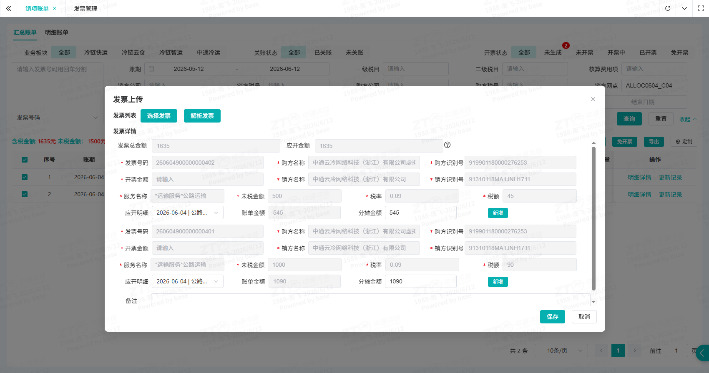
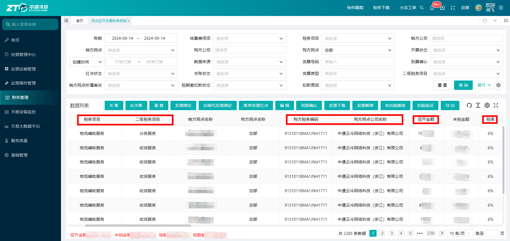
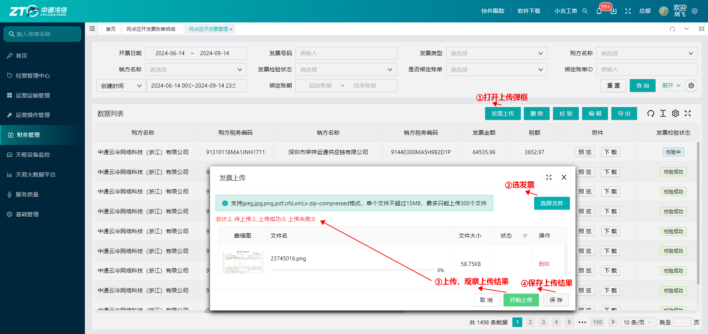
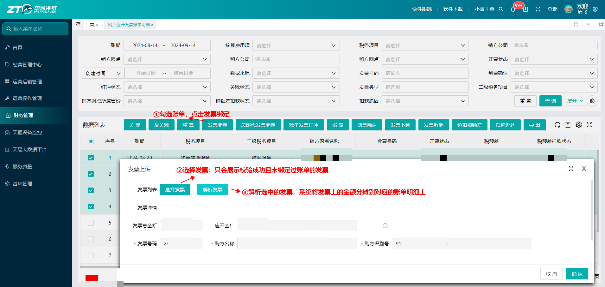
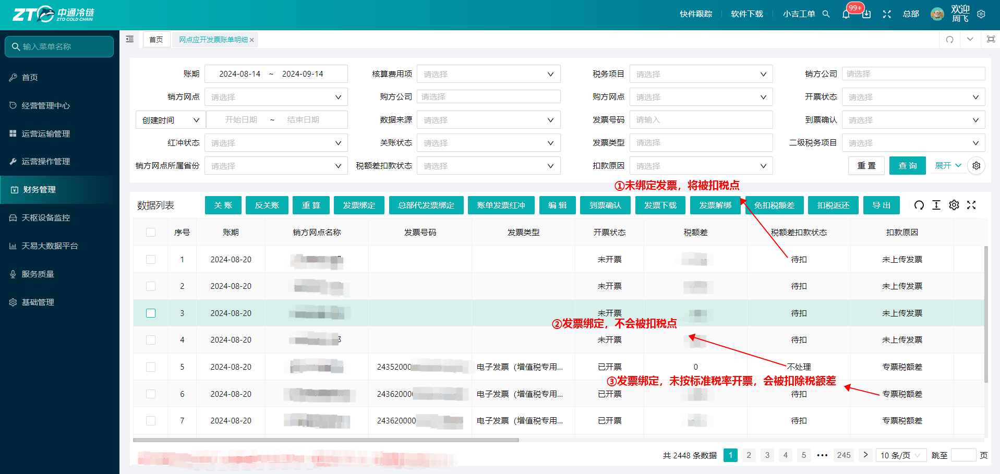
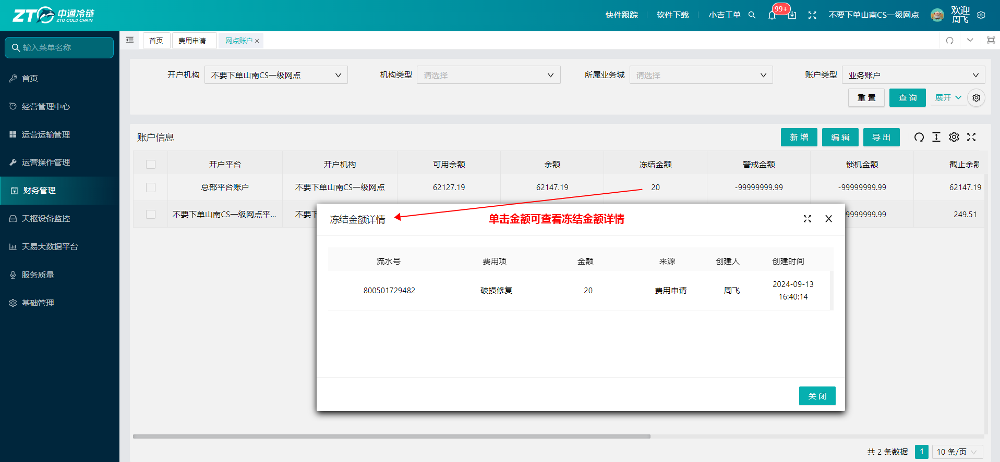

# \[冷链快运/对客报价\] 操作说明书

**📌 文档基本信息**

---

## 业务场景与名词解释

### 业务场景（为什么用？）

- 网点的客户大致分为两类，一类是大客户，网点可使用对客报价维护与大客户约定好的价格，客户下单可以直接看到成本，下单后生成对应的账单，减少沟通成本；另一类是散客，网点可提前按照市场价维护一份揽货价格，客户下单后减少对运费的扯皮。

### 核心名词解释（不迷路）

- **对客报价**：网点面向外部客户制定的运输、派件、保价等服务收费标准，包含单价、计价规则、适用范围等，是生成对客账单的核心依据。
- **报价校验**：系统自动检测报价内容、配置是否合规，拦截异常数据。
- **报价模式**：报价计费的方式，可以自定义价格，也可以在现有成本的基础上做加收
- **报价对象**：可以对不同的客户区分定价。
- **计费参数**：通常的客户都使用重量计费，部分特殊的客户可按件数、票数进行计费，选择对应的计费基础。

## 前置准备与环境配置

- **账号与权限要求**：权限角色需包含 `[ZTO网点管理员]`，若无权限请联系系统管理员。
- **物理/环境准备**：无
- **配套工具/链接**：
- 🌐 官方系统登录入口：👉 \[[点击进入系统](https://jt.ztocc.com/dashboard)\]

---

## 场景化标准操作步骤（怎么用？）

### 场景一：报价维护

- **系统功能路径**：`登录系统` -\> `进入左侧菜单栏` -\> `[财务管理]` -\> `[一级网点内部报价]`-\> `[对客报价]`
- **快捷直达链接**：👉 \[[点击一键直达该页面](https://jt.ztocc.com/app/#/phecda/quote/quote-maintenance)\]

#### 核心操作步骤：

1. **\[打开表单\]** 进入页面后，点击右上角【**新增**】按钮，打开新增表单，填写报价名称，依次选择报价模式、产品类型、生效区间后，点击【**下一步**】

2. **\[填写客户基本信息\]** 进入页面后，填写对象组名称，依次选择报价对象、计费参数、计费参数进位方式，点击右上角操作列的【**保存**】

⚠️ 注意：仅支持对大客户、协议客户单独定价，报价对象只显示大客户、协议客户；维护对散客的报价时，报价对象选择“全部”维护兜底价格即可。

3. **\[选择报价对应的费用项\]** 右上角点击【**设置费用项**】按钮，在弹框中勾选需要配置的结算费用项，若对成本为0的费用项也需要加收，可勾选加收开关后保存。

4. **\[设置目的和重量段\]** 点击列表中目的地下的空白区域，显示目的地维护弹框，在弹框中勾选省市，并填写合适的区域名称后保存；若维护多个目的地报价，可点击报价详情模块中操作列的【**新增**】，按照上述方法增加目的地。

在重量段区域，填写结束重量，若需维护多个重量段，填写结束重量后依次点击重量段后**【保存】【新增】**，按照上述方法增加重量段。

5. **\[设置价格标准\]** 点击费用项下方的【填充计费公式】，选择合适的模版填写价格标准，若需设置最低、最高收费，可勾选对应的开关后填写最低、最高收费标准。

6. **\[保存价格\]** 所有的费用项价格全部维护完成后，点击右下角的**\[保存\]**按钮**，**存在未勾选的费用项时，会弹出提醒，确认无需添加费用项后，点击**\[确定\]**按钮**，完成价格维护。**

7. **\[报价审核\]** 勾选报价，点击右上角的**\[审核\]**按钮**，**审核通过后价格生效**。**

---

## 常见异常与兜底方案（卡住了怎么办？）

| 序号 | ❌ 异常现象 / 报错提示 | 🔍 常见原因 | 🛠️ 解决方案 |
|------|-------------------------------|-----------------|--------------------|
| 1 | 保存报价提示报价重复 | 1\. 同条件下已存在报价，系统禁止重复创建 | 1\. 编辑报价更新内容，或作废旧报价后再重新新增 |
| 2 | 新增的报价无法审核 | 1\. 报价对象包含“全部“，为散客兜底价，需上级省区审核 | 1\. 联系省区网管审核 |

---

## 高频常见问题（FAQ）

**Q1：客户的价格需要按目的地和重量段细分，明细段很多，新增太麻烦了，有其它效率更高的维护方式吗？**

**A**：有的。价格明细维护可使用【**报价导入**】功能，

点击“报价导入”，根据当前选择的报价模式，选择对应的导入模版

根据实际情况填写对应的价格标准，可参照下图示例填写。

| **区域名称** | **目的地** | **开始分段（\>）** | **结束分段（\<=）** | **转运费** | | | | | |
|---------------------------------------------------------------------------|------------------------------------------------------------------------|-----------------------------------------------------------------------------------|------------------------------------------------------------------------------------|------------------------------------------------------------------------|---|---|---|---|---|
| | | | | 首重 | 首价 | 续价 | 折扣 | 最低收费 | 最高收费 |
| 上海 | 上海市 | 0 | 300 | | | | 0.11 | | |
| 上海 | 上海市 | 300 | 600 | | | 1.2 | | | |
| 江苏 | 江苏省，浙江省（杭州市） | 0 | 1200 | 100 | 50 | 0.3 | | | |

**Q2：新增报价后什么时候生效？**

**A**：根据报价的生效区间进行判断，生效日期小于等于当天，则审核通过后立刻生效，可应用于新订单，生效日期在次日及以后，需等次日才可使用，历史已结算账单价格不会随之变动。