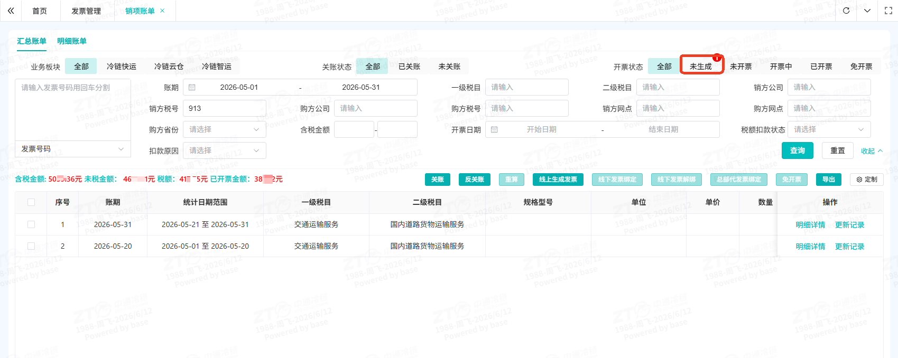

# 基础版账户理解

1. 登录鲸天系统，打开‘财务管理-账户管理-网点账户’
2. 查询条件填写开户机构、**账户类型（业务账户）**，查看开户平台为对应上级的明细余额

- 一级网点与总部签约，查看总部平台账户下的账户余额

- 二级网点与一级网点签约，查看一级网点平台账户下的账户余额

## 进阶版账户理解

### 通常每个网点会存在三个账户，如何区分该看哪一个账户呢？

这就需要了解账户的设计原理和对应的应用场景

- 一级网点与总部签约，预充费用后，用来发货，账户余额可查看总部平台账户下开设的账户①

若一级网点未开发二级网点， 只需关注账户①即可

- 二级网点与一级网点签约，二级网点的余额由一级网点线下收款后线上调整，线上为二级网点手工充值/手工提现的总金额可查看账户②
- 二级网点开单或者发生其它业务，一级网点对二级网点的收入，可查看账户**③**

### 二级网点开单，咋一级网点的余额一直在减少导致最终欠费？

一级网点的账户①与账户②/③之间是没有联系的，二级网点开单时，一级网点收取的费用在账户③中， 而一级网点支出的金额是从账户①中扣除，系统只校验账户①的余额

简易处理方式：一级网点线下收取二级网点充值费用后，需要做两件事情：

- 通过**‘手工充值’调整二级网点的账户余额**

- 将线下收到的费用， 通过**线上‘充值’，充入一级网点的账户中**