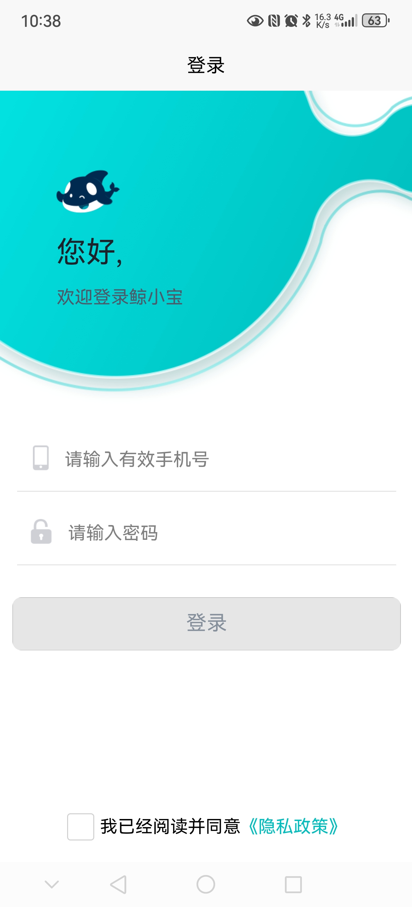
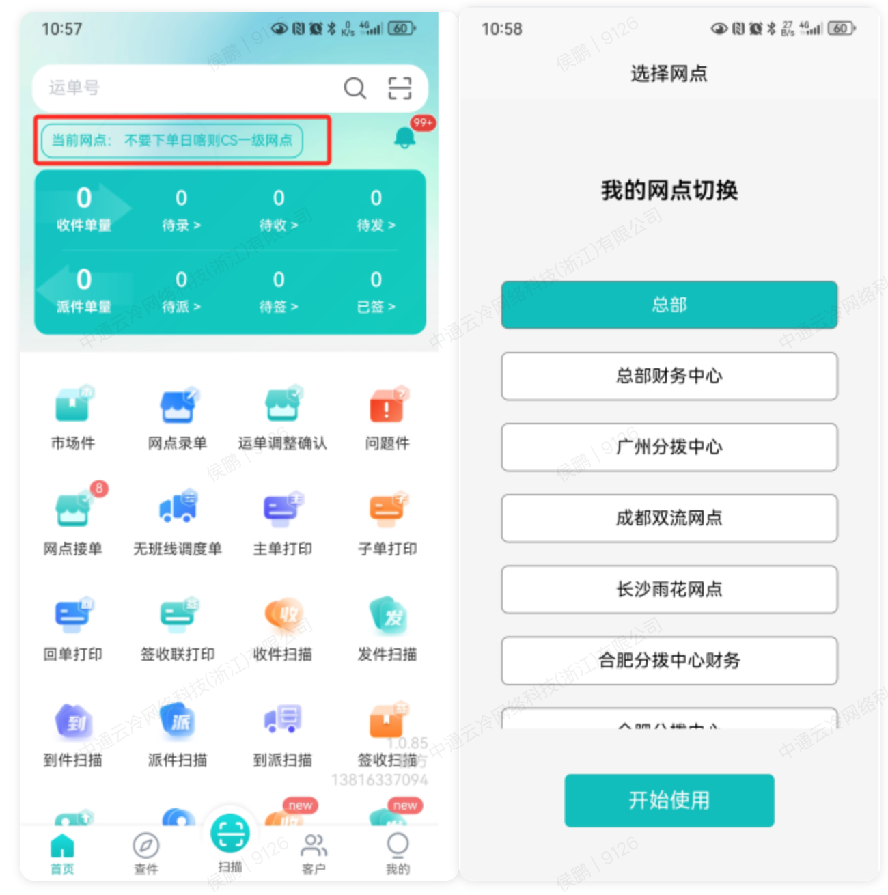
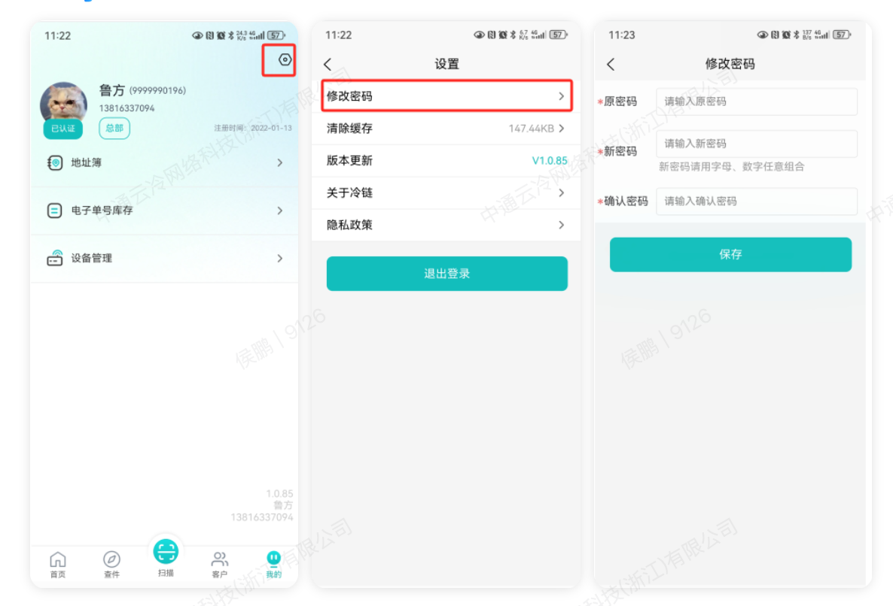
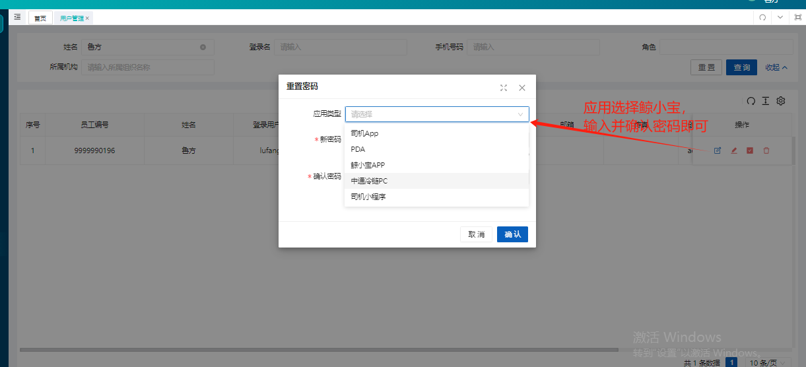

## 文档基本信息

- **系统名称**：鲸小宝APP
- **适用终端**：APP（移动端）
- **面向对象**：网点负责人、网点客服、网点调度、网点司机

## 业务场景与名词解释

### 业务场景

当网点老板、客服、调度及司机在日常工作中面临移动端办公不便、无法实时处理运单、移动扫描及收派件跟踪困难等痛点时，使用**鲸小宝 APP**可实现移动端的运单录入、无班线调度、运单打印、收派件扫描及多网点快速切换，大幅提升网点日常物流作业的灵活性与效率。

### 核心名词解释

- **当前网点**：指当前登录账号正在进行作业的组织。用户可在拥有权限的多网点间自由切换。

## 前置准备与环境配置

- **账号与权限要求**：权限角色需包含网点相应岗位权限（如网点老板、网点客服、网点调度、网点司机）。账号由中通冷链PC系统管理员统一开通。
- **物理/环境准备**：准备一部安卓或 iOS 系统的智能手机，确保网络连接正常（4G/5G/Wi-Fi）；如需现场打印，需配备便携式蓝牙热敏打印机。
- **配套工具/链接**：
- 🛠️ **核心组件下载**：
- 👉 [点击下载鲸小宝 APP （安卓）](https://zmas.zto.com/download/com.app.ztocc.andriod)
- 下载鲸小宝APP（IOS）请直接在App Store搜索【鲸小宝】

## 场景化标准操作步骤

### 场景一：APP 下载、安装与首次登录

- **系统功能路径**：点击下载链接 -\> 安装客户端 -\> 手机号登录
- **核心操作步骤**：

1. **\[下载安装\]** 点击配套工具中的下载链接，下载鲸小宝 APP 安装包并完成安装。
2. **\[输入凭证\]** 打开鲸小宝 APP，输入您的**注册手机号**与**登录密码**（初始密码为 `123456`）。
3. **\[勾选协议\]** 勾选底部的“我已经阅读并同意《隐私政策》”，点击 **【登录】** 按钮进入系统。

### 场景二：作业网点/组织切换

- **系统功能路径**：登录APP -\> 首页 -\> 点击 \[当前网点\]
- **核心操作步骤**：

1. **\[触发切换\]** 进入 APP 首页，点击左上角红框标出的 **【当前网点：XXXXX】** 区域。
2. **\[选择网点\]** 在弹出的“选择网点”列表中，浏览或找到您需要作业的网点（如：总部财务中心、广州分拨中心、成都双流网点等）。
3. **\[确认切换\]** 选中对应网点后，点击下方的 **【开始使用】** 按钮，系统将自动加载该网点的业务数据。

### 场景三：鲸小宝 APP 端自主修改密码

- **系统功能路径**：登录APP -\> 我的 -\> 设置（齿轮图标） -\> 修改密码
- **核心操作步骤**：

1. **\[进入设置\]** 登录 APP 后，点击底部导航栏的 **【我的】**，进入个人中心页面。点击右上角的 **【设置】（齿轮图标）**。
2. **\[选择修改\]** 在设置菜单列表中，点击 **【修改密码】** 选项。
3. **\[提交新密\]** 在修改密码界面中，依次输入您的 **【原密码】**、**【新密码】** 以及 **【确认密码】**（注：密码请设置为字母与数字的组合），核对无误后点击 **【保存】** 按钮即可生效。

## 常见异常与兜底方案

| **序号** | **❌ 异常现象 / 报错提示** | **🔍 常见原因** | **🛠️ 解决方案** |
|----------|-----------------------------------|---------------------|------------------------|
| 1 | 输入初始密码 `123456` 提示密码错误 | 1\. 密码已被本人或管理员修改。
2\. 账号存在异常。 | 请参考下方【场景三】或联系网点管理员，前往 PC 端【基础管理-用户中心-用户管理】进行密码重置。 |

| 2 | 点击“当前网点”后列表中没有目标网点 | 账号未分配该网点的操作权限。 | 联系总部或网点管理员，在 PC 端权限管理系统中为该账号添加目标组织的权限绑定。 |
| 3 | APP 内点击扫描功能无法唤起摄像头 | 手机系统未授予鲸小宝 APP 摄像头访问权限。 | 前往手机系统的 \[设置 -\> 应用管理 -\> 鲸小宝 -\> 权限管理\]，将“相机/摄像头”权限更改为“允许”。 |

## 五 & 场景三：高频常见问题（FAQ）

### Q1：我把登录密码忘记了，或者需要修改密码，应该怎么操作？

**A**：若在手机端无法登录或需要重置密码，**目前需要通过中通冷链 PC 端后台进行重置**。请联系您所属网点的系统管理员协助处理，具体操作步骤如下：

- **系统功能路径（PC端）**：财务/基础管理 -\> 用户中心 -\> 用户管理
- **管理端核心重置步骤**：

1. 管理员登录中通冷链 PC 端系统，进入 **【基础管理-用户中心-用户管理】** 界面。
2. 根据姓名或手机号查询到对应用户，点击操作栏中的 **【重置密码】** 按钮。
3. 在弹出的重置密码窗口中：

- **应用类型**：下拉菜单必须选择 **【鲸小宝APP】**。
- **新密码/确认密码**：输入全新的密码。

4. 点击 **【确认】** 即可完成修改。用户此时即可使用新密码在手机端登录。

