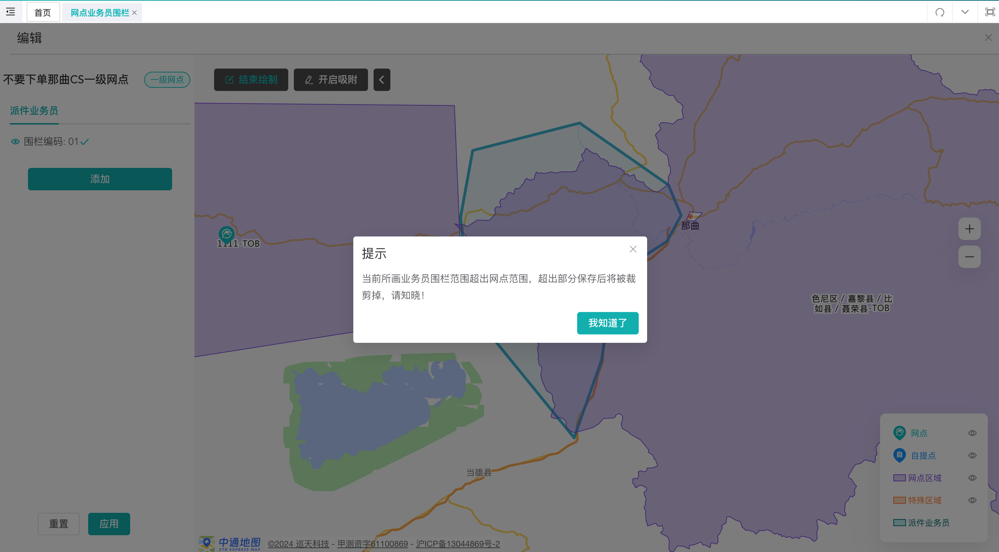
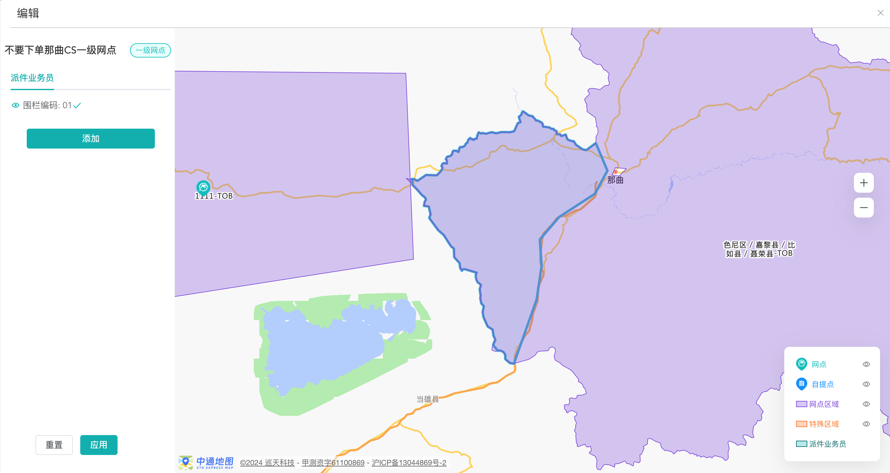
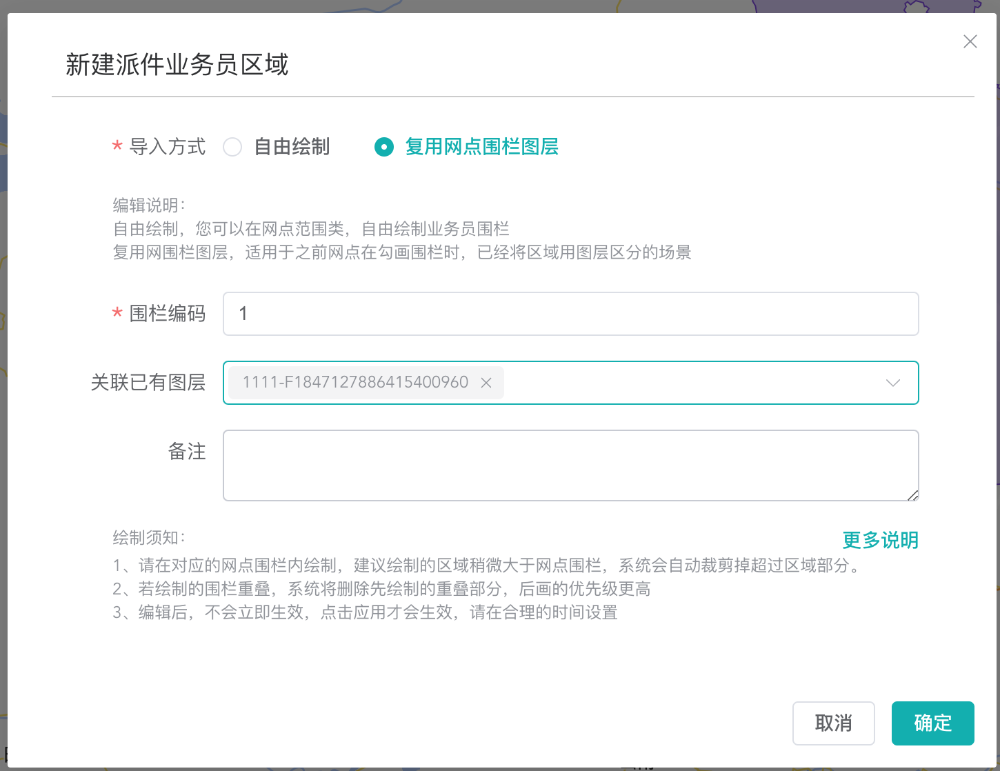
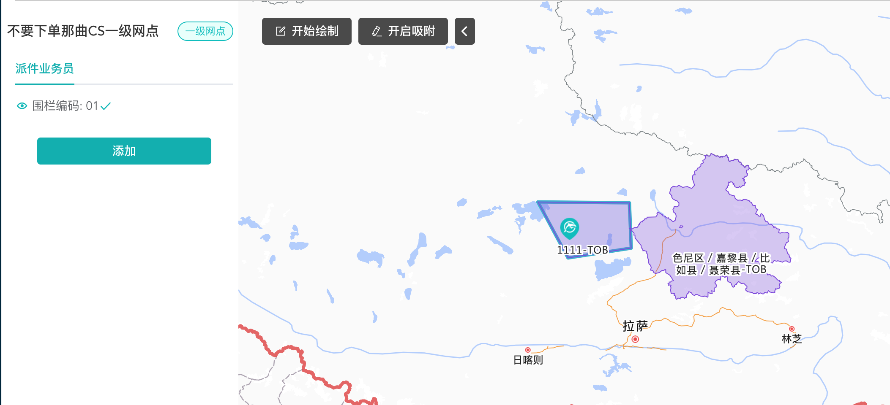
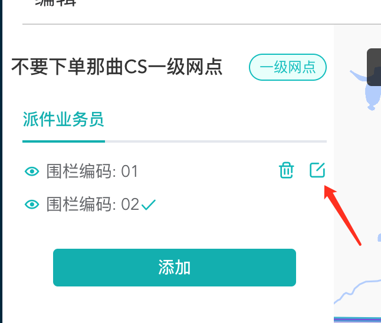
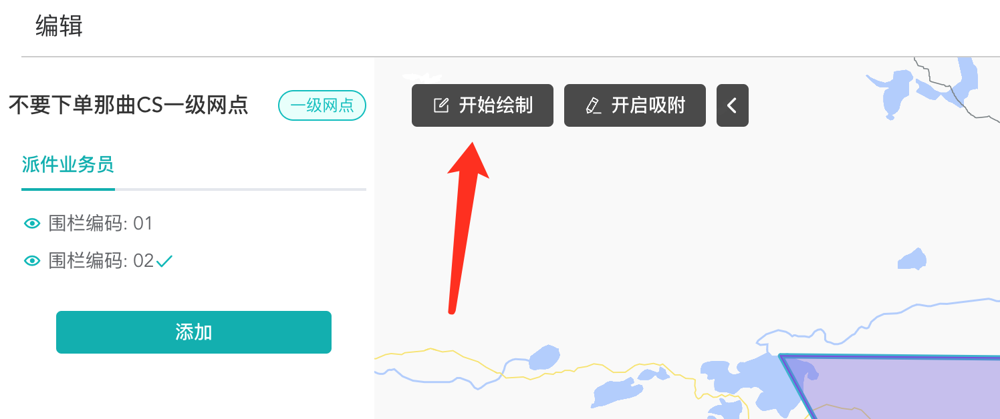
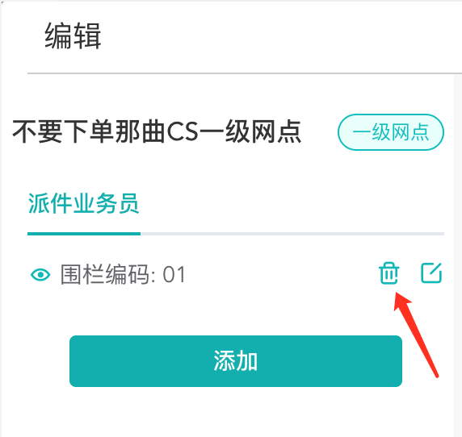

# 一. 业务员码设置

派件太多，司机派送如何区分是我派送的运单？#本期内容

货太多，司机怎么合理规划先后排线？#即将上线[暗中观察]

揽件太多，如何自动指派司机揽件？#即将上线[暗中观察]

✨ <strong>业务员编码在哪里看？</strong>✨

### 1.0.1 三段码最后1位

### 1.0.2 快件跟踪或者运单详情中

## 1.1 业务员编码怎么用？

重点：线下口头约定，对应编码对应的司机，如李四对应02

现在系统，业务员编码未和司机任务强关联，需线下判断，后续会结合司机任务，关联处理。

## 1.2 业务员编码怎么来的？

菜单：经营管理中心，地址管理，网点业务员围栏

第一步：<strong>点击网点业务员围栏</strong>，登录后可查看本网点及下属网点的围栏信息

图例说明

交互说明

第二步：点击勾画业务围栏的图标，进入围栏勾画页面

第三步：点击上面页面的添加按钮，进入派件业务员围栏初试界面

-

💪 重点！初始化围栏的方式

- 自由绘制：在网点范围内，自由绘制业务员围栏
- 复用网点围栏图层：复用网点围栏图层，适用于之前网点在勾画围栏时，已经将区域用图层区分的场景，如某些三方合作商。

网点按需选择初始化方式，也可以结合着用，前期建议，自由绘制。

绘制前，先思考自己的网点大概要分为几部分

若司机不固定，人数不固定，需要先把变动的区域的最小部分勾画出来。

比如：司机每日可约定配送不同编码的区域。

### 1.2.1 如何自由绘制？

[惊喜]业务员编码不允许重复，上面图片错误。

派件地址在此区域的订单，业务员编码为01

💪 重点！

- 点击应用后立即生效！点击重置，会回到上次应用时的状态！

### 1.2.2 如何复用网点围栏图层？

### 1.2.3 如何修改已有图层？

点击对应围栏编辑图标

点击开始绘制即可，补充此业务员的围栏（编辑只支持自由绘制）

### 1.2.4 如何修改编码？

点击应用后生效！

### 1.2.5 如何删除业务员围栏？

点击应用后生效！

### 1.2.6 画错了，或者不想改了怎么办？

前提是没有点应用，点击重置，会回到上次应用的数据

## 1.3 重点！勾画注意事项

- 1、请在对应的网点围栏内绘制，建议绘制的区域稍微大于网点围栏，系统会自动裁剪掉超过区域部分，无需关心画超出了，保证网点范围内都覆盖。2、若绘制的围栏重叠，系统将删除先绘制的重叠部分，<strong>后画的优先级更高！！</strong>3、编辑后，不会立即生效，<strong>点击应用才会生效</strong>，请在合理的时间设置

### 1.3.1 一二级网点之间的业务员围栏是什么关系？

- 相互独立，没有关系，也没有关联。网点的业务围栏，只和自己的网点围栏有关。

### 1.3.2 哪些情况不会打印业务员编码？

- 指定网点录单的

- 业务员围栏没有覆盖对应派件地址的

✨ <strong>业务员编码会不会存在错误的情况？</strong>✨

- 存在，由于地址解析错误或者地址不准确，99.96%，可能导致解析错误，但是概率不大，建议在业务员编码的基础上，核对地址二次确认。

- 对于多次错误的地址，可上报工单，校正处理。

### 1.3.3 不勾画业务员编围栏，我没有诉求，有什么问题么？

- 当前不影响，非强制配置

- 后续将关联司机任务和增加揽件业务员围栏

### 1.3.4 网点围栏有变化，我需要及时修改业务围栏么？

- 若网点围栏有新增，请及时修改业务员围栏；

- 网点围栏有删除，可不用修改，因为运单匹配不到！
