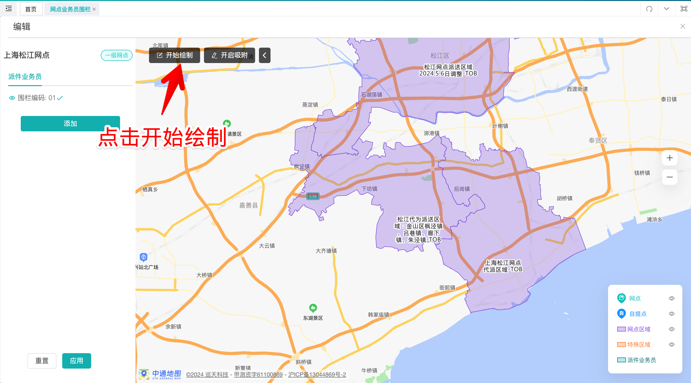

# 鲸准达相关配置说明

1. 仅针对零担，小件产品(不含自提, 派送专车/送货进仓-共配/送货进仓-专车 )
2. 派件网点开启鲸准达权限
3. 派件地址在鲸准达围栏内
4. 预计签收时间-开单截单时间\<=96小时
5. 开单时间在[0点：每日网点截单时间]内开的单（本次未生效）

同时满足以上3个条件，开的单才是鲸准达；条件4本次未生效，预计最迟下周上线。

改单说明：
1.首分拨中心发件后 修改了目的网点，或者修改地址导致目的网点变化，会取消鲸准达标记。
2.修改了路由方案从默认路由变成中心直发不匹配鲸准达时效。

## 一、新营业网点开启，鲸准达时效配置，添加鲸准达

## 二、省区勾画鲸准达围栏

和小件区域维护的逻辑类似，按省区勾画，会和有网点的区域自动裁剪。

## 三、编辑页面

⚠️ 注意：在编辑页面中，鲸准达图层和上次提交审核前的保持一致（按最新展示你的勾画且提交结果，简称A）

之前的逻辑是审核后会显示为最终的结果。

目的：

若勾画的区域，存在新增、删减网点零担。小件，鲸准达，围栏，可自动重新裁剪。但是仅限在A范围内。
