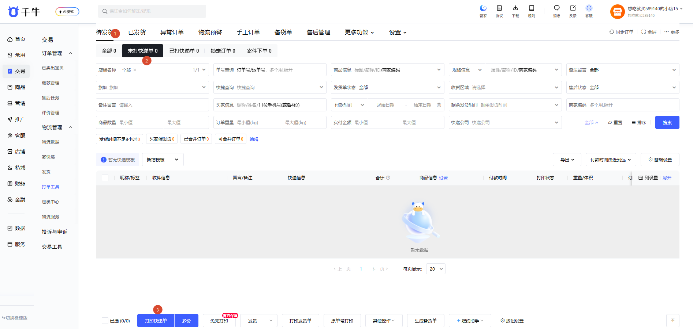
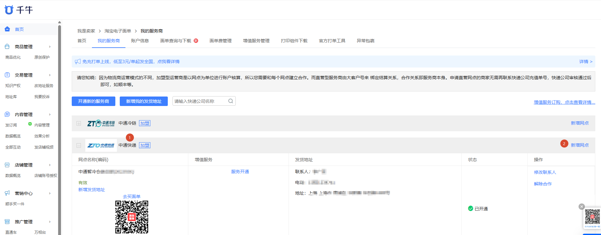
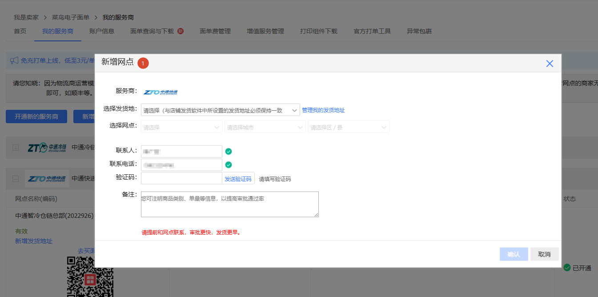
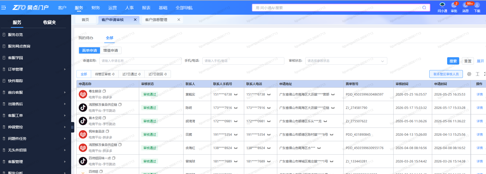
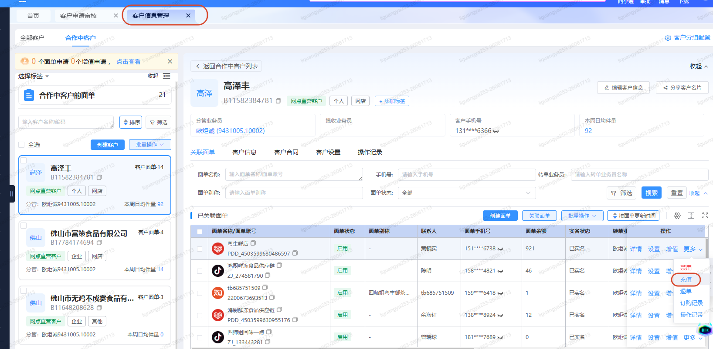
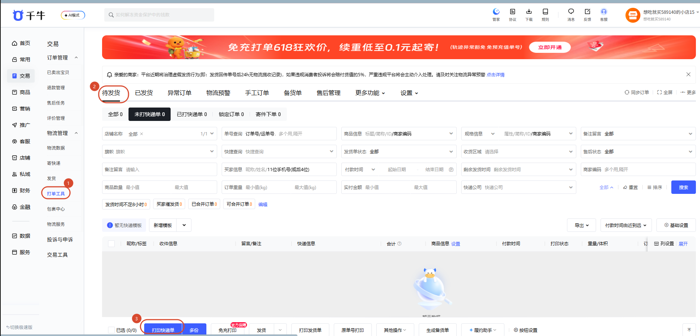
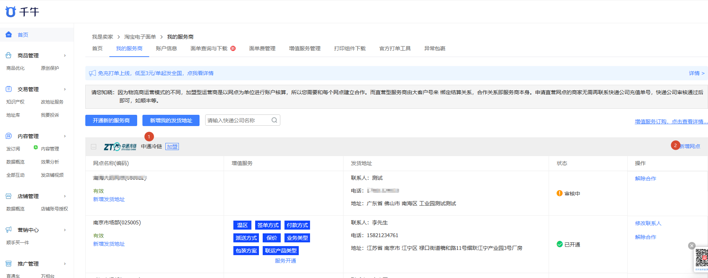
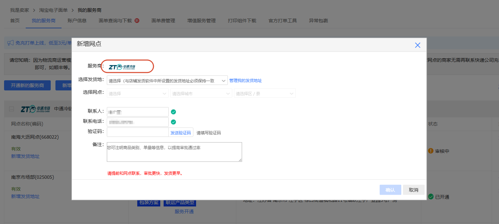
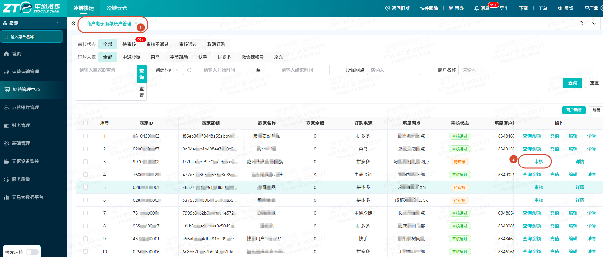
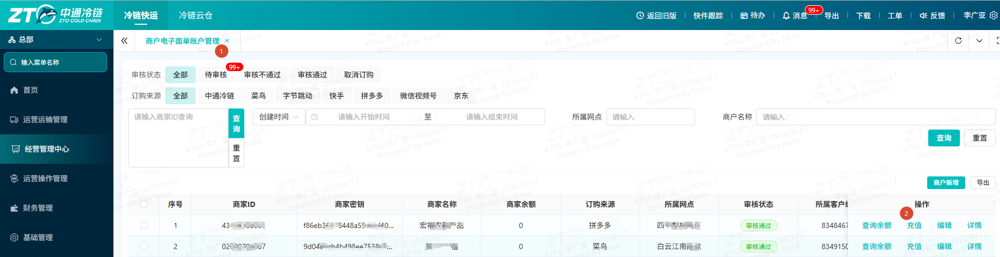

# 冷链快递

## 一、适用场景

冷链快递是中通冷链推出的“冷链段干线温控 + 快递段末端配送”混合模式产品。冷链段负责干线运输的温度保障，快递段由三方快递网络（中通/韵达/圆通/极兔等）负责末端时效配送。该模式填补了传统冷链零担无法触达末端、传统快递无法保障温控的市场空白。

根据运单号可区分三种模式：

| 模式 | 支持平台 | 客户订购快递公司 | 客户店铺后台展示单号 | 三方单号 |
| --- | --- | --- | --- | --- |
| 冷链快递1.0 | 全平台 | 中通快递 | 7开头单号（除742开头） | 无 |
| 冷链快递2.0 | 拼多多、快手、菜鸟 | 中通冷链 | 8开头单号 | 7开头单号 |
| 冷链快递3.0 | 快手、拼多多 | 中通冷链 | 742开头单号 | 742开头单号 |

**核心业务逻辑**：客户下单后，货物经冷链干线运输至末中心，在末中心完成冷-快交接后，由三方快递网络完成末端配送。

## 二、前置条件

### 2.1 账号与权限

| 系统 | 角色 | 所需权限 | 申请方式 |
| --- | --- | --- | --- |
| 鲸天系统（TMS） | 调度员/操作员 | 运单查询、调度、到货确认、交接确认 | 权限管理模块申请 |
| BMS | 结算员 | 费用查询、对账、结算确认 | 财务部统一开通 |
| 客户服务平台 | 客户/网点操作员 | 面单打印、运单查询 | 网点管理员分配 |

### 2.2 配套工具与链接

- 官方系统登录入口：<https://jt.ztocc.com/app/#/dashboard>

### 2.3 硬件与物料准备

| 类别 | 物品 | 用途 | 规格要求 |
| --- | --- | --- | --- |
| 面单 | 冷链快递面单 | 快递段配送标识 | 三方快递标准面单 |
| 包装 | 保温箱/泡沫箱 | 温控包装 | 根据温层（冷冻/冷藏/恒温）选用 |
| 包装 | 冰袋/干冰 | 冷媒 | 冷冻层干冰，冷藏层冰袋 |
| 设备 | 菜鸟云打印组件 | 面单打印 | 下载安装最新版 |
| 设备 | PDA手持终端 | 扫码操作 | 安装鲸天APP/移动端 |
| 设备 | 温度记录仪 | 干线温控 | 符合食品冷链运输标准 |

## 三、操作入口

- **客户服务平台（面单打印）**：<https://my.ztocc.com/#/login/Login>
- **中天系统（1.0网点审核/充值）**：<https://www.zt-express.com/e-home>
- **鲸天系统（2.0/3.0网点审核/充值、运单打印）**：<https://jt.ztocc.com/app/#/dashboard>
- **菜鸟云打印组件（取号/打印）**：需本地安装最新版

## 四、操作步骤

### 4.1 场景一：冷链快递1.0（以淘宝为例）

#### (1) 订购电子面单（客户操作）

1. 登录淘宝卖家中心 → **我的服务商** → **中通快递** → 点击 **新增网点（订购电子面单）**。
2. 填写发货地址、选择网点、联系人、联系电话、验证码 → 点击 **确认发起订购**。

#### (2) 网点审核订购电子面单（网点操作）

1. 网点登录中天系统 → **客户申请审核** → **审核订购电子面单**。

#### (3) 网点充值电子面单（网点操作）

1. 客户通知网点充值电子面单 → 网点在中天系统 **客户信息管理** → **充值电子面单**。

#### (4) 客户下冷链快递单并打印面单

1. 客户登录店铺后台，选择待发货订单（或使用其他打单软件）。
2. 打开菜鸟打印组件，打印快递单（下冷链快递单+打印面单）。

::: warning 注意事项
此时打印的快递单不包含云冷分拣码及温层，需手写云冷分拣码及温层。
:::

#### (5) 客户打印标准冷链快递面单

1. 客户登录中通冷链客户服务平台 → 打印冷链快递面单。

### 4.2 场景二：冷链快递2.0/3.0（以淘宝为例）

#### (1) 订购电子面单（客户操作）

1. 登录淘宝卖家中心 → **我的服务商** → **中通冷链** → 点击 **新增网点（订购电子面单）**。
2. 填写发货地址、选择网点、联系人、联系电话、验证码 → 点击 **确认发起订购**。

#### (2) 中通冷链网点审核订购电子面单（网点操作）

1. 网点登录鲸天系统 → **商户电子面单账户管理** → **审核订购电子面单**。

#### (3) 网点充值电子面单（网点操作）

1. 客户通知网点充值电子面单 → 网点在鲸天系统 **商户电子面单账户管理** → **充值电子面单**。

#### (4) 客户下冷链快递单（取号不打印）

1. 客户登录店铺后台，选择待发货订单（或使用其他打单软件）。
2. 打开菜鸟打印组件，**只取号不打印**（下冷链快递单）。

::: warning 注意事项
此时打印的快递单不可用，需到客户服务平台打印面单。
:::

#### (5) 客户打印标准冷链快递面单

1. 客户登录中通冷链客户服务平台 → 打印冷链快递面单。

## 五、操作结果

- 冷链快递1.0：货物通过中通快递末端配送，客户在店铺后台可查看7开头运单号。
- 冷链快递2.0/3.0：货物通过三方快递末端配送，客户可查看8开头或742开头主单号，以及对应的三方快递单号。
- 所有模式下，货物均完成冷链干线运输并交接给快递网络，客户可通过快递公司官网或客户服务平台查询物流轨迹。

## 六、注意事项

::: danger 重点提醒
- **冷链快递1.0**：打印的快递面单不含云冷分拣码及温层，必须手写补充。
- **冷链快递2.0/3.0**：菜鸟打印组件取号后不要打印，必须到客户服务平台打印标准面单；否则面单不可用。
- **面单余额不足**：网点需在系统中为对应电子面单账号充值，否则取号会报错。
- **路由配置**：若提示“目的中心匹配失败”，需通知总部运营配置冷链快递路由。
:::

::: warning 注意事项
- 不同平台（拼多多、快手、菜鸟）仅支持冷链快递2.0/3.0，请按平台要求选择对应模式。
- 硬件设备（如PDA、温度记录仪）需在操作前测试正常，避免影响干线温控记录。
- 三方快递超区时，可尝试更换快递公司发货。
:::

## 七、常见问题

### 7.1 Q1：如何快速区分冷链快递1.0/2.0/3.0？

通过运单号区分：

- **冷链快递1.0**：单号除742开头外的7开头运单。
- **冷链快递2.0**：运单号8开头，三方单号7开头。
- **冷链快递3.0**：运单号742开头，三方单号与运单号一致。

### 7.2 Q2：如何打印冷链快递面单？

| 打印途径 | 说明 |
| --- | --- |
| 客户服务平台 | 支持客户/网点操作打印冷链快递标准面单 |
| 鲸天系统 | 寄件运单管理支持打印冷链快递标准面单 |
| 其他（仅1.0） | 通过客户的打单软件打印出面单，需手写云冷流向码 |

### 7.3 Q3：调用三方快递取号报超区怎么办？

**原因**：收件地址在盲区，未匹配到派件网点。
**解决**：换快递公司发货。

### 7.4 Q4：调用三方快递取号报电子面单余额不足怎么办？

**原因**：三方快递电子面单余额不足。
**解决**：网点充值分配电子面单到具体的电子面单账号。

### 7.5 Q5：提示“目的中心匹配失败，请检查路由配置”怎么办？

**原因**：冷链快递路由未配置。
**解决**：通知总部运营配置冷链快递路由。

<!-- AI 优化遗漏的图片，已自动补回 -->

