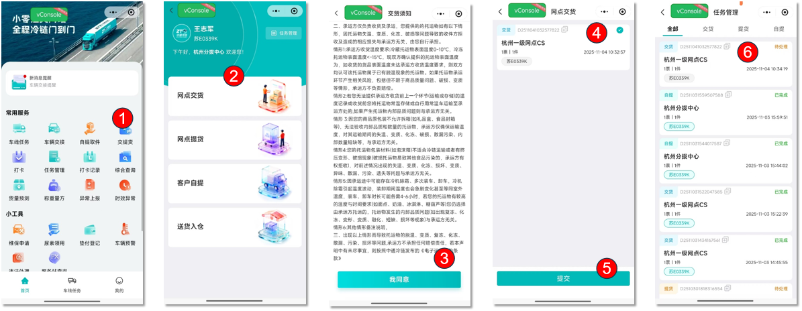
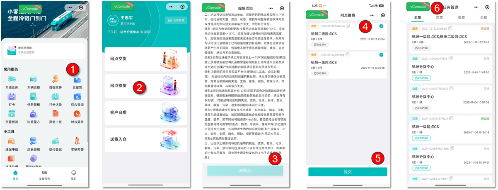
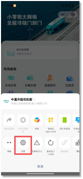

## 业务场景与名词解释

### 业务场景

本功能依托中通冷链司机版小程序，用于司机线上完成**网点交货、网点提货**全流程操作，实现货物交接线上化管控。该功能规范冷链货物交接标准，支持实时查看任务进度，提升网点货物交接整体效率。

### 核心名词解释

- **网点交货**：司机将货品运送至指定分拨/集配，线上提交交货申请、完成交接确认的流程。
- **网点提货**：司机前往指定分拨/集配提取货品，线上提交提货申请、完成交接确认的流程。
- **任务管理**：汇总展示交货、提货、自提等全部交接任务，可查看任务编号、网点、状态、时间等信息的管理模块。

## 前置准备与环境配置

1. **账号与权限**：使用专属司机账号登录**中通冷链司机版**小程序，账号由网点统一分配，无权限请联系网点管理员。
2. **设备与权限要求**：使用智能手机，**必须开启小程序定位权限**，否则功能入口无法展示。
3. **配套工具/入口**

- 官方入口：微信搜索并打开【中通冷链司机版】小程序

## 场景化标准操作步骤

### 场景一：网点交货

- 系统功能路径：中通冷链司机版小程序首页 → 常用服务 → 交提货 → 网点交货

1. 进入小程序首页，找到并点击【交提货】入口
2. 在交提货页面，选择【网点交货】选项
3. 阅读完整交货须知，确认内容后点击【我同意】
4. 在任务列表选中对应交货任务，点击【提交】
5. 提交成功后自动跳转至任务管理列表，查看任务进度与状态

---

### 场景二：网点提货

- 系统功能路径：中通冷链司机版小程序首页 → 常用服务 → 交提货 → 网点提货

1. 小程序首页点击【交提货】入口
2. 选择【网点提货】选项进入对应页面
3. 阅读提货须知，确认无误后点击【我同意】
4. 勾选需要执行的提货任务，点击【提货】提交申请
5. 提交完成后跳转至任务管理页面，查看提货任务状态

## 常见异常与兜底方案

| 序号 | 异常现象 / 报错提示 | 常见原因 | 解决方案 |
|------|---------------------------|------------|------------|
| 1 | 打开交提货，无网点交货、网点提货入口 | 小程序未开启定位权限 | 1\. 点击小程序右上角「···」，进入设置页面；
2\. 开启**位置信息**（使用小程序时允许）；

3\. 重新进入小程序。

 |

| 2 | 进入交货/提货页面，任务列表为空 | 网点未创建无班线调度单 | 联系网点工作人员创建调度单，刷新页面即可显示任务。 |
| 3 | 提交任务失败 | 网络异常、小程序缓存出错 | 1\. 切换至稳定网络后重试；2. 彻底关闭小程序后台，重新打开操作。 |

## 高频常见问题（FAQ）

### Q1：交提货任务提交后，在哪里查看进度？

A：任务提交后会自动跳转至**任务管理**页面，可切换交货、提货、自提分类，查看待处理、已完成、关闭等各类任务状态。

### Q：冷链货物收货温度标准是什么？

A：冷藏货品表面温度要求 **0-10℃**，冷冻货品表面温度要求 **低于-15℃**。货品温度不达标、包装破损、无法核验内件等情况引发的货物问题，承运方不承担相关责任。