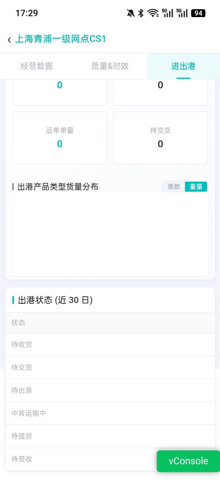

# 移动端怎么查看网点相关数据

## 一、适用场景

网点管理者在移动办公或非坐班场景下，无法随时操作 PC 端系统时，可通过 **鲸小宝 APP** 随时随地掌握网点的核心经营数据、质量考核指标及进出港物流状态，实现掌上移动管控与便捷跟单。

## 二、前置条件

- **账号与权限**：必须拥有 **鲸小宝 APP** 登录账号，且后台已配置对应的网点数据查看及下级网点管理权限。
- **物理/环境准备**：已安装最新版本的 **鲸小宝 APP**。

## 三、操作入口

打开并登录 **鲸小宝 APP** → 进入首页 → 点击 **【网点数据】** 图标。

## 四、操作步骤

### 4.1 查看经营数据（业务盘点与财务对账）

::: tip 说明
通过经营数据模块查看货量、二级占比及收支明细。
:::

1. 进入 **网点数据** 页面后，默认或切换至顶部 **【经营数据】** 标签页。
2. **查看货量与占比**：浏览本网点及下级网点的基础货量统计，通过 **二级占比** 评估各下级网点的业务产能。
3. **穿透收支明细**：在收支数据卡片中，直接点击 **收入** 或 **支出** 的数字，系统自动跳转至详细的流水账单页面，方便账目核对。

### 4.2 查看进出港数据（日常履约异常跟单）

::: tip 说明
根据运单流转状态分类展示，支持电话联络和跟踪处理。
:::

1. 切换至顶部 **【进出港】** 标签页。
2. 系统按运单不同流转状态（如：**待交货**、**待提货**、**待签收**等）进行分类展示。
3. 点击对应状态卡片查看运单列表，可直接根据运单号及网点信息进行**电话联络**和**及时跟踪处理**。

### 4.3 查看质量&时效数据（考核指标监控）

::: tip 说明
查看核心服务质量与时效考核指标大盘数据，实时掌握网点服务健康度。
:::

1. 切换至顶部 **【质量&时效】** 标签页。
2. 查看当前网点核心考核指标概览数字，如：**接单及时率**、**签收及时率**等。

::: warning 注意事项
当前该模块优先展示汇总指标数字，底层明细数据下钻功能正处于迭代升级计划中。
:::

## 五、操作结果

操作完成后，在系统页面确认数据展示、状态或处理结果是否符合预期。

## 六、注意事项

- 如页面展示、权限范围或业务规则与本文不一致，请以当前系统配置和最新业务规则为准。
- **二级占比**：下级（二级）网点产生的货量在当前主网点总货量中所占的业务比例，用于评估下级网点的业务贡献度。
- **同期对比**：当查询数据为某一天时，指的是与上周相同周期对比（如查看今天周三的数据，与上周三对比）；当查询数据为某段时间周期时，指的是与上月相同时间周期对比（如查看6月1日-5日汇总数据，与5月1日-5日对比）。

## 七、常见问题

暂无。后续可根据一线反馈补充高频问题。

<!-- AI 优化遗漏的图片，已自动补回 -->
