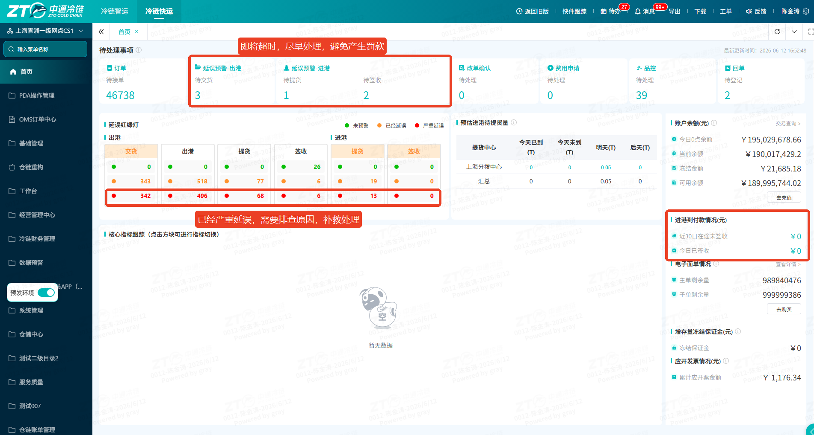
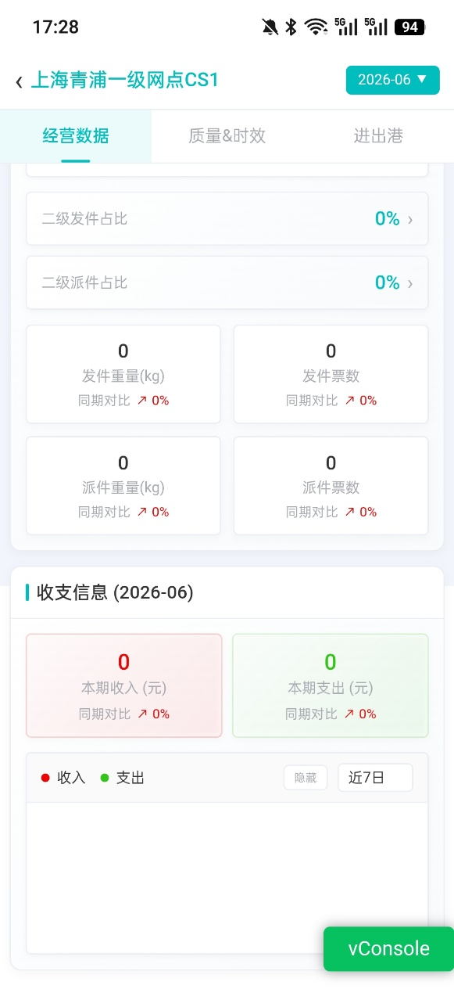
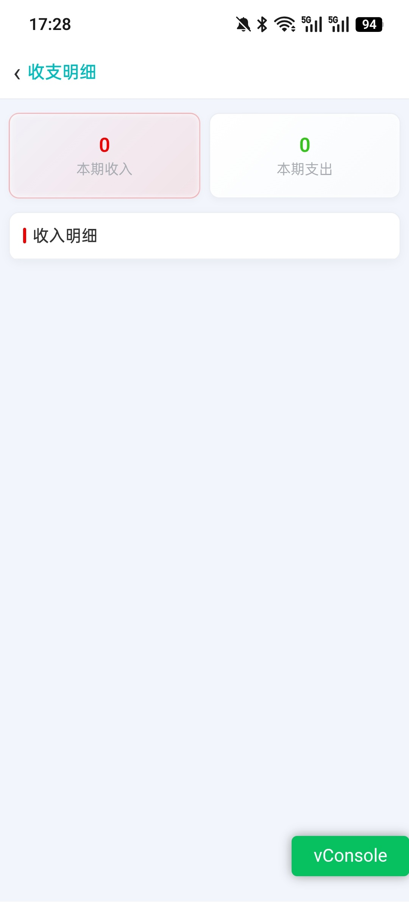

# 移动端怎么查看网点相关数据

## 一、适用场景

本文适用于网点管理者在移动办公或非坐班场景下，通过 **鲸小宝 APP** 查看网点相关数据。

当无法随时操作 PC 端系统时，可通过 **鲸小宝 APP** 随时查看网点核心经营数据、质量考核指标及进出港物流状态，实现移动端管控与跟单。

## 二、前置条件

1. 已拥有 **鲸小宝 APP** 登录账号。
2. 后台已配置对应的 **网点数据查看** 及 **下级网点管理** 权限。
3. 手机已安装最新版本的 **鲸小宝 APP**。
4. 已准备好需要查看的网点相关业务数据。

## 三、操作入口

打开并登录 **鲸小宝 APP**，进入首页，点击 **【网点数据】** 图标。

## 四、操作步骤

### 4.1 查看经营数据

适用于业务盘点、财务对账等场景。

1. 进入 **【网点数据】** 页面后，默认或切换至顶部 **【经营数据】** 标签页。
2. 查看本网点及下级网点的基础货量统计。
3. 通过查看 **二级占比**，评估各下级网点的业务产能。
4. 如需核对收支明细，在收支数据卡片中点击 **收入** 或 **支出** 模块的数字。
5. 系统会跳转至详细的流水账单页面，可在该页面进行账目核对。

### 4.2 查看进出港数据

适用于日常履约异常跟单。

1. 切换至顶部 **【进出港】** 标签页。
2. 根据日常进出港跟单需求，查看系统按运单不同流转状态展示的数据，例如：**待交货**、**待提货**、**待签收** 等。
3. 点击对应状态卡片，查看运单列表。
4. 根据运单号及网点信息进行电话联络和及时跟踪处理。

### 4.3 查看质量及时效数据

适用于监控网点考核指标。

1. 切换至顶部 **【质量&时效】** 标签页。
2. 查看当前网点核心服务质量与时效考核指标大盘数据，例如：**接单及时率**、**签收及时率** 等概览数字。
3. 根据页面展示的数据，掌握网点服务健康度。

::: tip 说明
当前 **【质量&时效】** 模块优先展示汇总指标数字，底层明细数据下钻功能正处于迭代升级计划中。
:::

## 五、操作结果

操作完成后，可在 **鲸小宝 APP** 的 **【网点数据】** 页面查看以下数据：

1. **经营数据**：本网点及下级网点货量、二级占比、收支数据及流水账单等。
2. **进出港数据**：按运单流转状态分类展示的进出港运单数据。
3. **质量&时效数据**：接单及时率、签收及时率等服务质量与时效考核指标。

## 六、注意事项

::: warning 注意事项
如页面展示、权限范围或业务规则与本文不一致，请以当前系统配置和最新业务规则为准。
:::

::: danger 重点提醒
查看网点相关数据前，账号必须具备对应的 **网点数据查看** 及 **下级网点管理** 权限。
:::

- **鲸小宝**：内部配套支持网点移动端协同办公 APP，支持业务数据移动化展示。
- **二级占比**：下级（二级）网点产生的货量在当前主网点总货量中所占的业务比例，用于评估下级网点的业务贡献度。
- **同期对比**：
  - 当查询数据为某一天时，指与上周相同周期对比。例如查看今天数据，今天是周三，则与上周三对比。
  - 当查询数据为某段时间周期时，指与上月相同时间周期对比。例如查看 **6月1日-6月5日** 汇总数据，则同期对比为 **5月1日-5月5日** 汇总数据。

## 七、常见问题

暂无。后续可根据一线反馈补充高频问题。