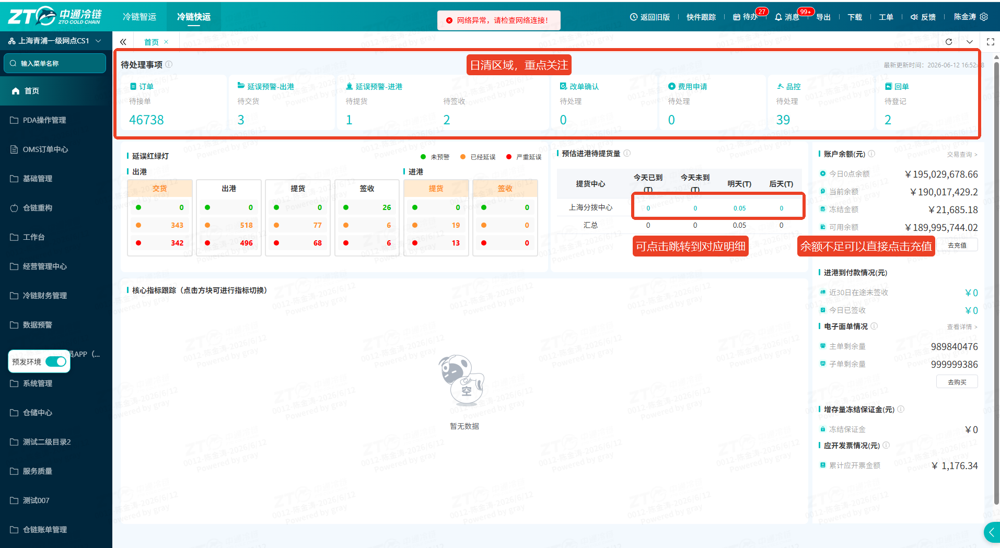

#### 业务场景与名词解释

**1.1 业务场景（为什么用？）**

在移动办公或非坐班场景下，网点管理者面临无法随时操作PC端系统痛点时，使用此功能即可通过“鲸小宝”APP随时随地掌握网点的核心经营数据、质量考核指标及进出港物流状态，实现掌上移动管控与便捷跟单。

**1.2 核心名词解释（不迷路）**

- **鲸小宝**：内部配套支持网点移动端协同办公APP，支持业务数据移动化展示。
- **二级占比**：下级（二级）网点产生的货量在当前主网点总货量中所占的业务比例，用于评估下级网点的业务贡献度；
- **同期对比：**当查询数据为某一天时，指的是与上周相同周期对比，如查看今天数据，今天是周三，与上周三的对比；当查询数据为某段时间周期时，指的是与上月相同时间周期对比，如查看6月1日-6月5日汇总数据，同期对比指的是与5月1日-5月5日汇总数据对比；

#### 前置准备与环境配置

- **账号与权限要求**：必须拥有鲸小宝APP登录账号，且后台已配置对应的网点数据查看及下级网点管理权限。
- **物理/环境准备**：已安装最新版本的【鲸小宝】APP。
- **快捷访问入口**：

📱 打开并登录鲸小宝APP -\> 进入首页 -\> 点击 **【网点数据】** 图标。

#### 场景化标准操作步骤（怎么用？）

**场景一：业务盘点与财务对账（经营数据模块）**

- **核心操作步骤**：

1. 进入页面后，默认或切换至顶部 **【经营数据】** 标签页。
2. **查看货量与占比**：浏览本网点及下级网点的基础货量统计，通过查看“二级占比”评估各下级网点的业务产能。
3. **穿透收支明细**：在收支数据卡片中，直接点击收入或者支出模块的数字时，系统会自动跳转至详细的流水账单页面，方便进行账目核对。

**场景二：日常履约异常跟单（进出港模块）**

- **核心操作步骤**：

1. 切换至顶部 **【进出港】** 标签页。
2. 根据日常进出港跟单需求，系统按运单不同流转状态（如：待交货、待提货、待签收等）进行分类展示。
3. 点击对应状态卡片查看运单列表，利用移动端的便捷性，可直接根据运单号及网点信息进行电话联络和及时跟踪处理。

**场景三：考核指标监控（质量&时效模块）**

- **核心操作步骤**：

1. 切换至顶部 **【质量&时效】** 标签页。
2. 查看当前网点核心的服务质量与时效考核指标大盘数据（如：接单及时率、签收及时率等概览数字），实时掌握网点服务健康度。

*(特殊说明：当前该模块优先展示汇总指标数字，底层明细数据下钻功能正处于迭代升级计划中。)*

