# 微信AI客服操作手册

## 一、适用场景

针对冷链零担业务，商家&网点通过微信群进行报价、超区、查件、下单等咨询。本手册帮助一线网点人员配置并使用微信AI客服机器人，在微信群内自动解答常见问题，减轻网点工作量。

## 二、前置条件

- 请确认账号已开通对应菜单权限，并已准备好操作所需的业务数据。
- 操作人员需注册企业微信账号，并加入中通冷链企业组织（需联系总部技术支持人员 @李勇、@赵强如 进行加入）。
- 企业微信下载地址：[https://work.weixin.qq.com/#indexDownload](https://work.weixin.qq.com/#indexDownload)

## 三、操作入口

请以系统实际菜单路径为准。

## 四、操作步骤

### 4.1 注册企业微信账号

- 联系总部技术支持人员加入中通冷链企业组织。
- 下载并安装企业微信客户端。
- 按提示完成注册。

### 4.2 （非必要）扫码添加企业微信机器人账号

- 在企业微信中搜索【AI客服1号】并添加好友。

::: tip 提示
后续视业务情况，机器人账号数量可能会增加。
:::

### 4.3 新建微信群

- 用企业微信拉入客户（**必须包含个人微信好友**，否则群为内部群）、企业微信机器人账号，创建微信群。
- 操作示意如下：

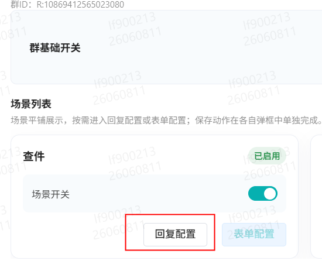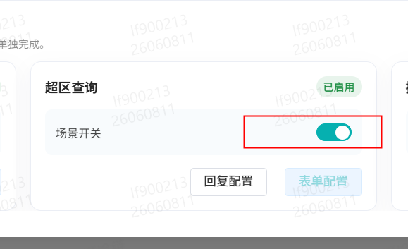

### 4.4 微信群内输入激活码激活机器人

- 在微信群中发送激活码，机器人自动响应。

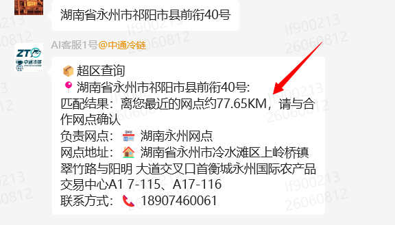

::: danger 重点提醒
- **激活码仅限使用一次**，新群需重新复制激活码。
- **激活码与网点绑定**，如省区网管代网点操作，需在鲸天系统切换至对应网点获取激活码。
- 该功能主要针对 **1/2级网点**，总部/省区/分拨/集配站/财务中心**请勿绑定**。
:::

### 4.5 配置业务功能

菜单路径：**机器人客服管理**（初期需由总部技术支持统一配置权限）

#### (1) 查件

- **基础功能，默认开启**。若客户群不需要，可自行关闭。
- 在微信群输入运单号即可查询轨迹。

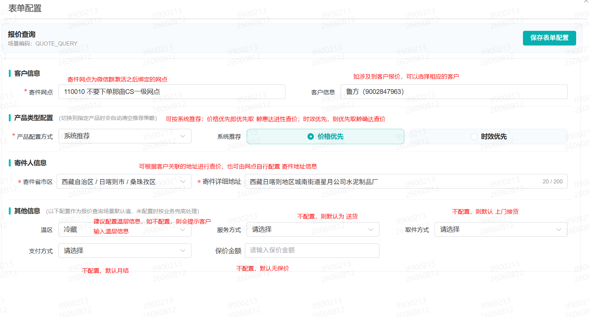

- **关闭/开启**：在后台管理对应开关。

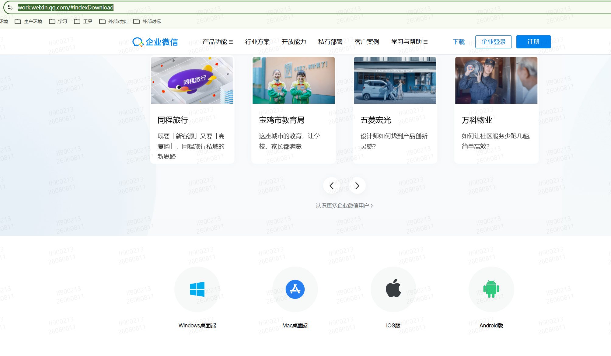

- **回复配置**：可配置是否展示预计时效（末网点预计签收时间，签收运单不显示）。默认关闭，网点可自行开启。

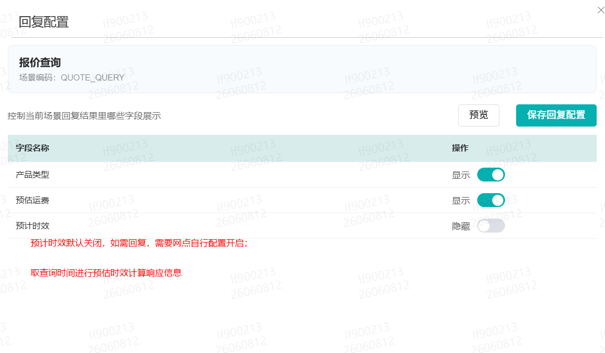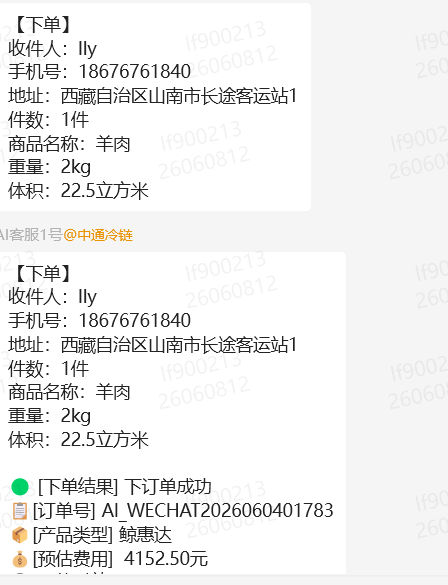

::: warning 注意事项
输入的运单号必须属于当前群绑定的机构，否则无法查询。
例如：群绑定北京网点，单号A的寄件网点上海、派件网点武汉，则在群内不可查询。
:::

#### (2) 超区查询

- **基础功能，默认开启**。在微信群输入详细地址，即可查询零担产品超区情况。

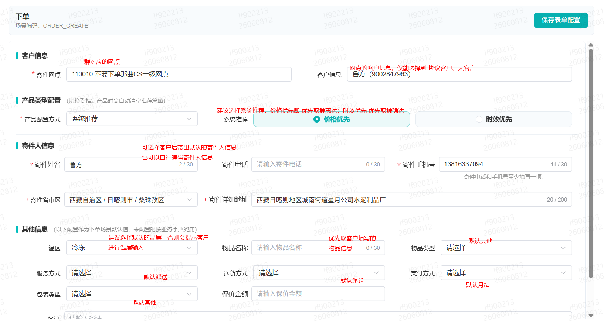

- **关闭/开启**：后台开关。

- **回复字段**：可由群对应网点自行编辑。

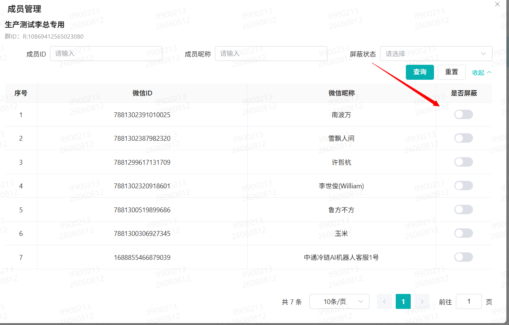

::: warning 注意事项
- 若收件地址为盲区，系统会查询附近 **100km** 内的网点信息兜底，需网点与客户自行协商是否发货。
- 若附近100km也无网点，则提示盲区。
:::

#### (3) 报价查询

- **默认关闭**，需网点自行配置表单信息后才能使用。
- 在微信群输入关键字 **报价**、收件地址、货物件数、重量/体积，即可查询。

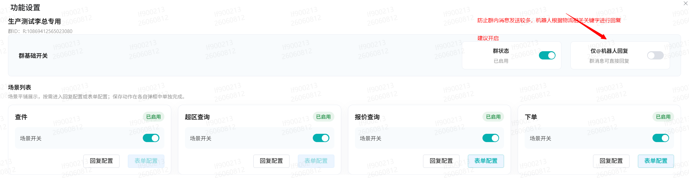

- **配置寄件地址表单**：

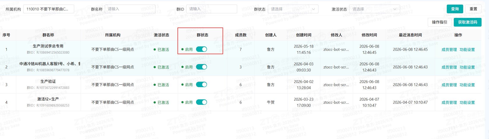

- **回复配置**：

::: tip 说明
- 若收件地址为盲区，则查询不到价格。
- 报价如配置了对客报价，优先取客户报价；未配置则取网点统一对外报价。
:::

#### (4) 下单

- **默认关闭**，需网点自行配置表单信息后才能使用。
- 在微信群输入关键字 **下单**、收件地址、收件人姓名/电话、货物件数、重量/体积，即可生成下单。

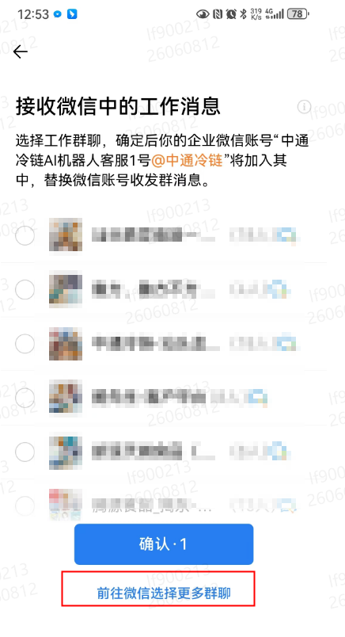

- **配置寄件地址表单**：

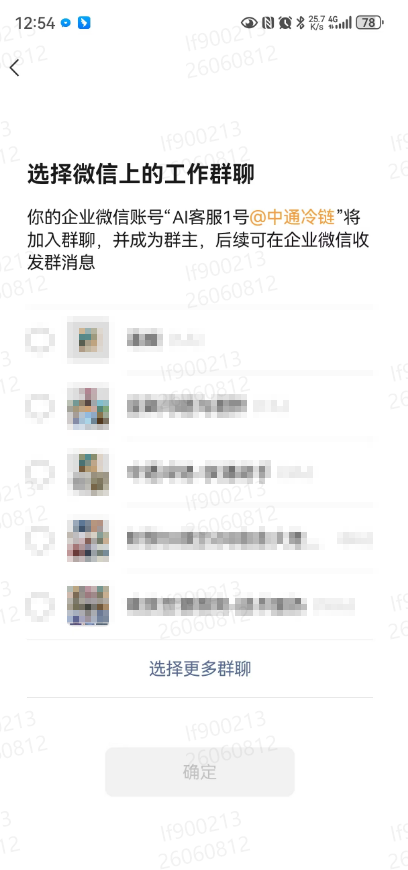

- **下单回复配置**：

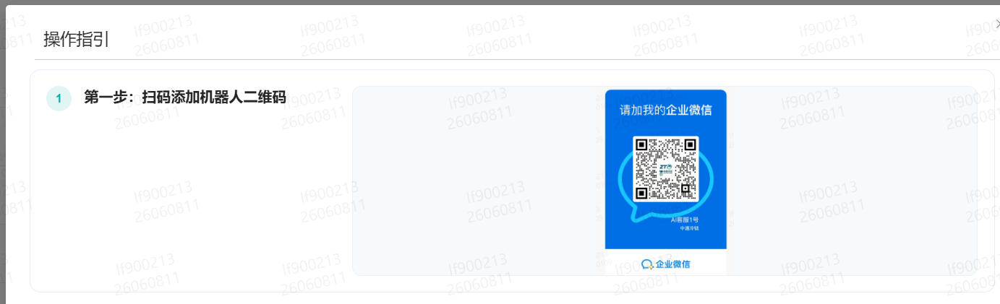

### 4.6 群功能使用

- **群成员管理**：支持对群内成员进行消息屏蔽。

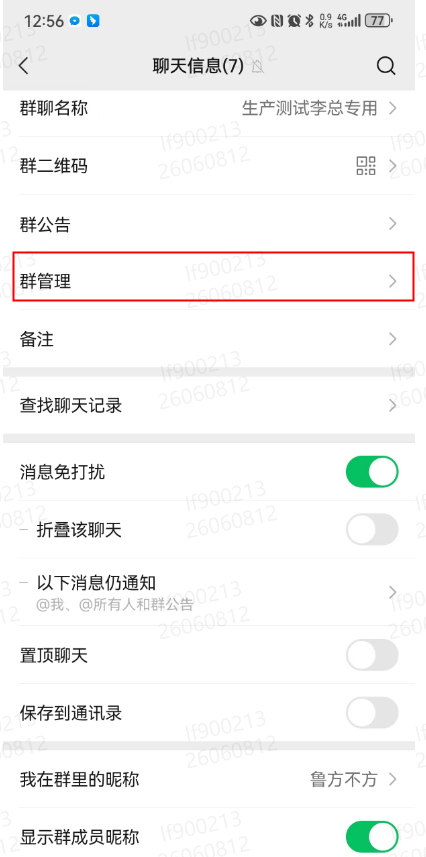

- **设置@机器人回复**：开启后，群内聊天需@机器人账号才回复。

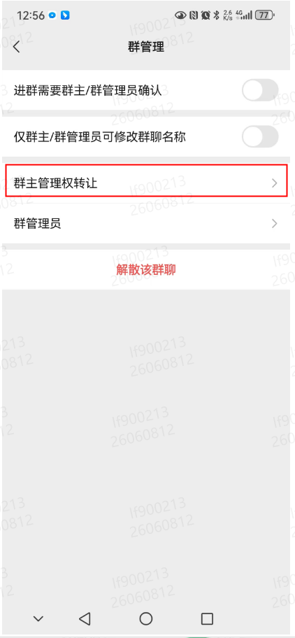

- **关闭群**：如客户不再合作，可进行群关闭操作。

### 4.7 存量微信群转企业微信群（省区网管/总部技术支持操作）

若已有客户微信群未使用企业微信，需转为企微群后方可拉入机器人。

1. 省区网管注册企业微信，并请总部技术支持将其账号变更为 **企业管理员**。
2. 网点将省区网管的企业微信拉入存量微信群。
3. 网点将微信群群主转交给省区网管。
4. 省区网管在手机端企业微信中执行 **转为企业微信群** 操作。

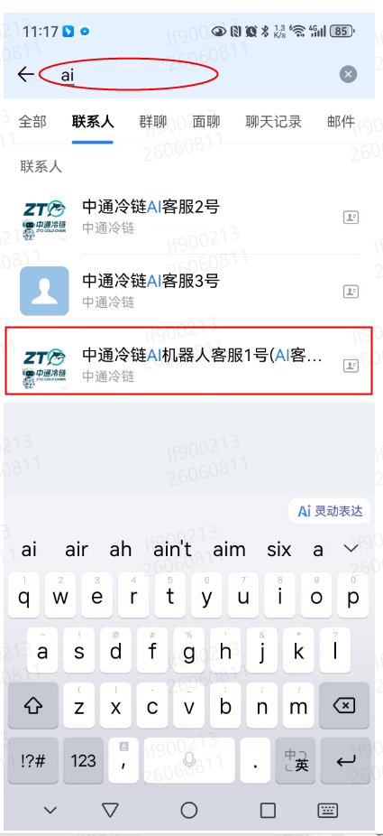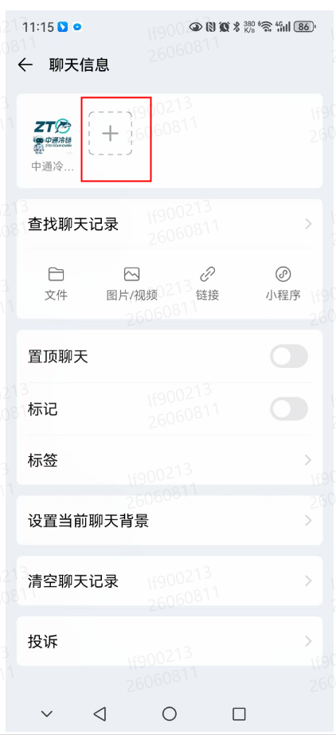

5. 转为企微群后，拉 **AI客服1号** 进群。
6. 对应网点在群内输入激活码即可使用（后续操作同上）。
7. 将群主转移回原网点人员。

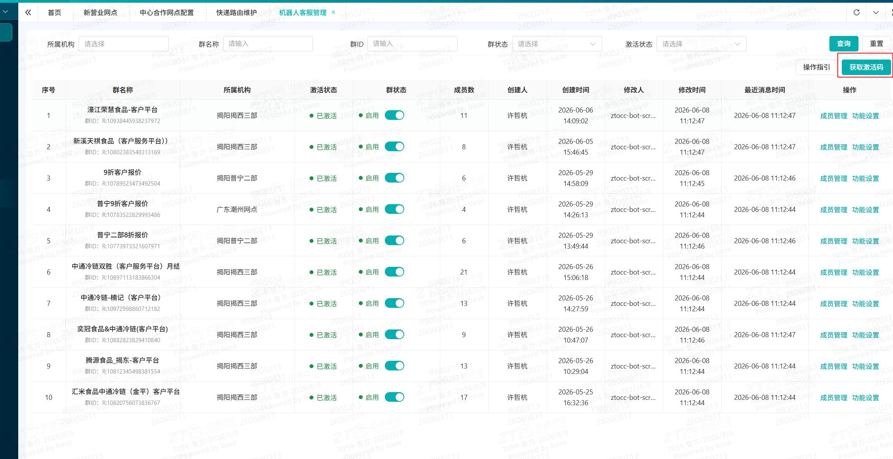

## 五、操作结果

操作完成后，在微信群发送对应指令即可获得机器人自动回复。可在系统后台查看机器人客服管理页面，确认群绑定、功能开关等配置生效。

## 六、注意事项

- 如页面展示、权限范围或业务规则与本文不一致，请以当前系统配置和最新业务规则为准。
- 激活码仅限使用一次，新群需重新获取。
- 机器人客服管理权限初期需总部技术支持统一配置。
- 超区查询有100km兜底逻辑，盲区时需商户自行协商。
- 查件时，运单号必须属于当前群绑定的机构。

## 七、常见问题

暂无。后续可根据一线反馈补充高频问题。

## 八、推广培训群

如有疑问或需要培训，可扫描下方二维码加入推广培训群（若二维码失效请联系总部技术支持）。

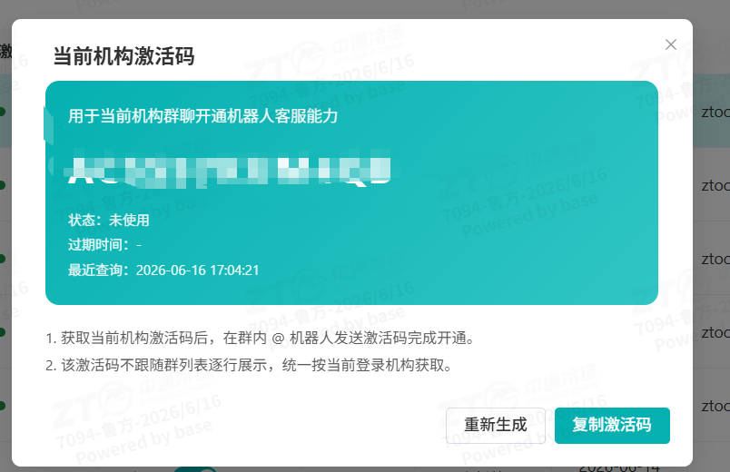