# 一、业务背景

针对冷链零担相关业务，商家&网点拉微信群，在微信群内进行报价、超区、查件、下单等相关咨询，为减轻一线网点工作量，实施微信AI客服功能；机器人账号可以在微信群内进行自主解答；

## 二、操作流程

### 1、网点相关人员注册企业微信账号，

注意需要联系总部技术支持人员@李勇(总部IT-李勇)@赵强如进行中通冷链企业微信的组织加入

下载地址：[https://work.weixin.qq.com/#indexDownload](https://work.weixin.qq.com/#indexDownload)

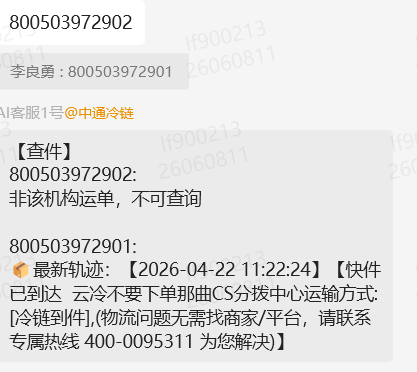

### 2、扫码添加企业微信机器人账号（非必要步骤）

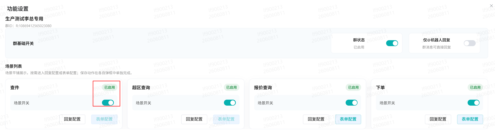

或者在企业微信加入 中通冷链 企业后，自行搜索 【AI客服1号】，

::: warning 注意事项
后续视业务情况，机器人账号会进行增加

:::

### 3、新微信群的操作方法：

在企业微信内，拉客户（注意这里一定需要有个人微信添加，否则这个群就是企业内部群，不能在添加你的个人微信好友，可以使用自己的企业微信添加自己的个人微信） & 企业微信机器人账号 创建微信群

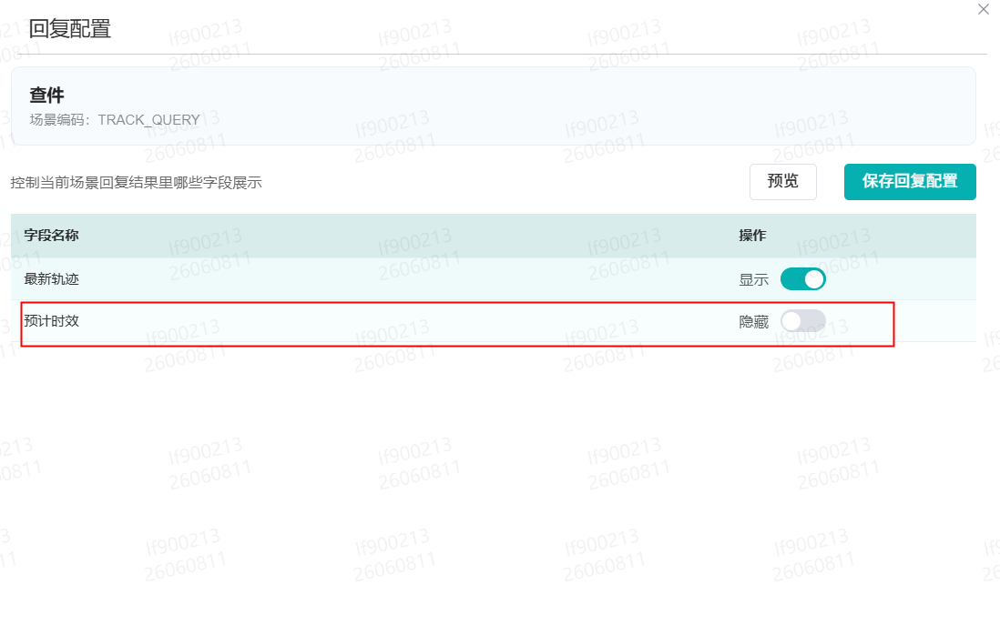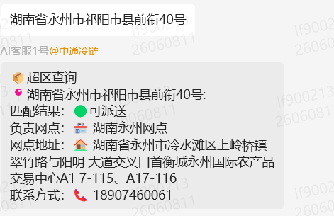

### 4、微信群内输入 激活码即可使用

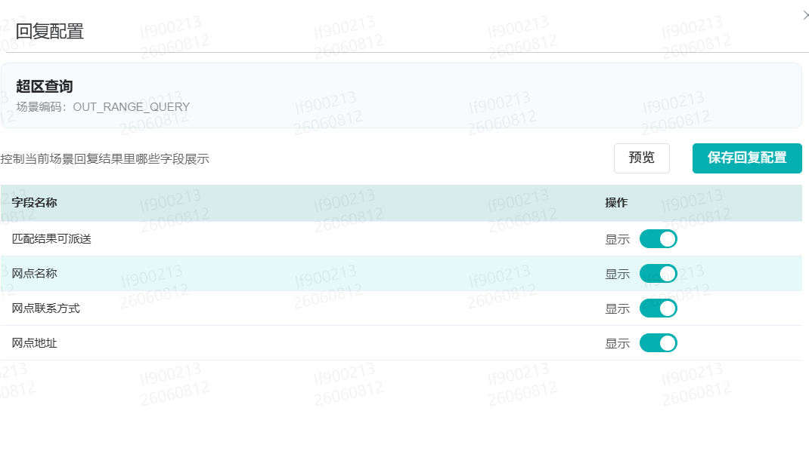

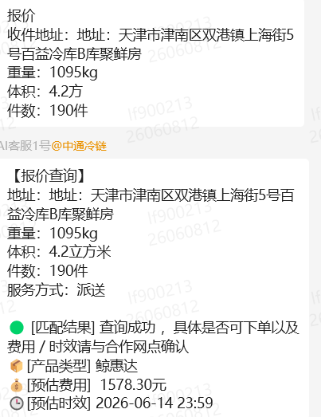

ps ：注意事项说明：

①每个激活码只能使用一次，新群需要重新复制激活码；

②激活码是和网点绑定的，如省区网管代网点操作时，注意在鲸天切换至对应的网点获取相应的激活码；

③该功能主要针对的是1/2级网点，总部/省区/分拨/集配站/财务中心请勿绑定

### 5、业务功能使用说明

菜单名称： 机器人客服管理

该权限在前期推广期间，需要先收集网点人员名单，由总部技术支持进行统一配置

#### ①查件

- 在微信群输入单号，即可进行相关运单的轨迹查询

- 查件为基础功能，默认开，如客户群内不需要，可以自#行关闭

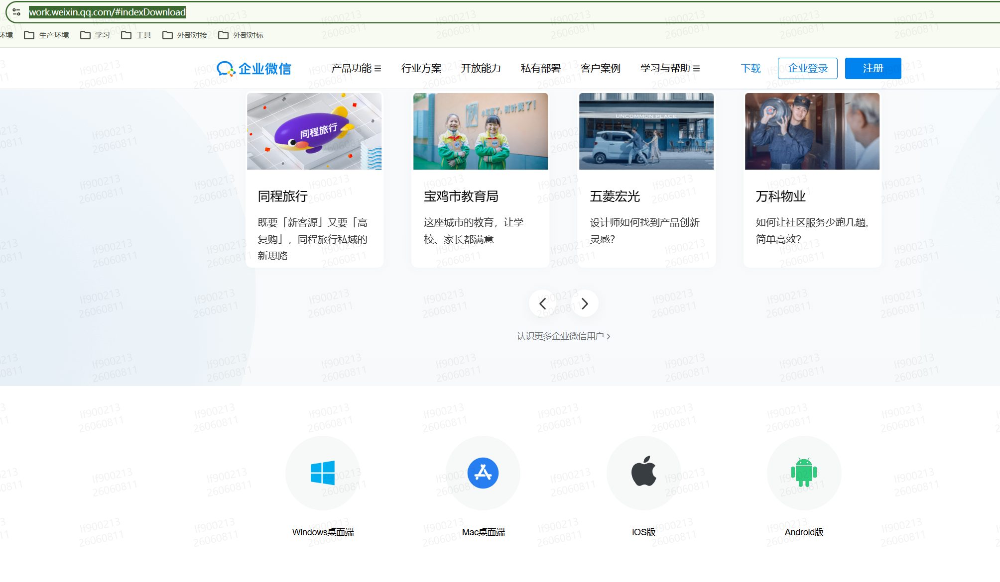

- 回复配置

快件查询内，会有预计时效的展示，默认关闭，可以网点自行配置开启，开启后就会展示预计时效（快件跟踪内 末网点预计签收时间），签收运单不会显示预计时效

- 说明：

输入的运单号需为 当前群绑定的机构，否则不可查询

例如微信群绑定的 北京网点，单号A 关联的寄件网点 上海，派件网点 武汉，则在 北京网点的微信群内不可进行轨迹查询；

#### ②超区查询

- 在微信群内输入相关详细地址信息，即可进行 零担产品的 超区查询

- 超区查询为基础功能，默认开启，如客服群内不需要，可自行关闭

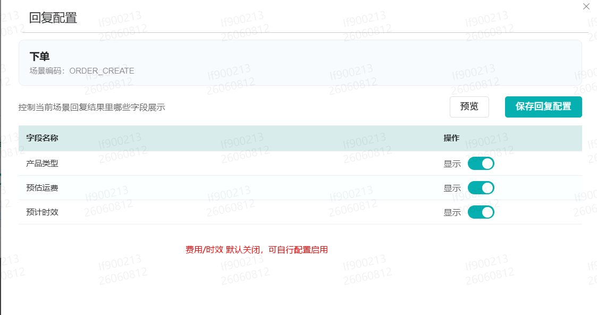

- 回复字段，可由群对应的网点自行编辑

- 特殊说明

该超区接口进行了兜底查询，如收件地址盲区，则会查询附近100km 内的网点信息进行兜底回复，需要网点与客户自行协商是否发货

如附近100km 也无网点，则会提示盲区

#### ③报价查询

- 在微信群内，输入关键字（报价）、收件地址信息、货物件数、重量体积 即可进行报价查询

- 报价查询需关联寄件地址信息，默认关闭，需要网点自行配置表单信息

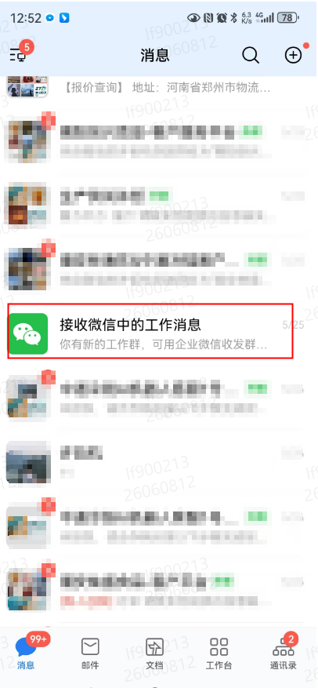

- 报价查询回复配置

- 特殊说明

①如收件地址盲区，则会查询不到价格

②报价如配置了对客报价，则会优先取客户的报价相关信息，如不配置，则会取网点统一的对外报价；

#### ④下单

- 在微信群内，输入关键字（下单）、收件地址信息、收件人姓名/电话信息、货物件数、重量体积 即可进行报价查询

- 下单需关联寄件地址信息，默认关闭，需要网点自行配置表单信息

- 下单回复配置

### 6、群功能使用说明

#### ①群成员管理 支持 对群内的 成员进行消息屏蔽，

#### ②支持进行群 内聊天需要@ 机器人账号才进行信息回复

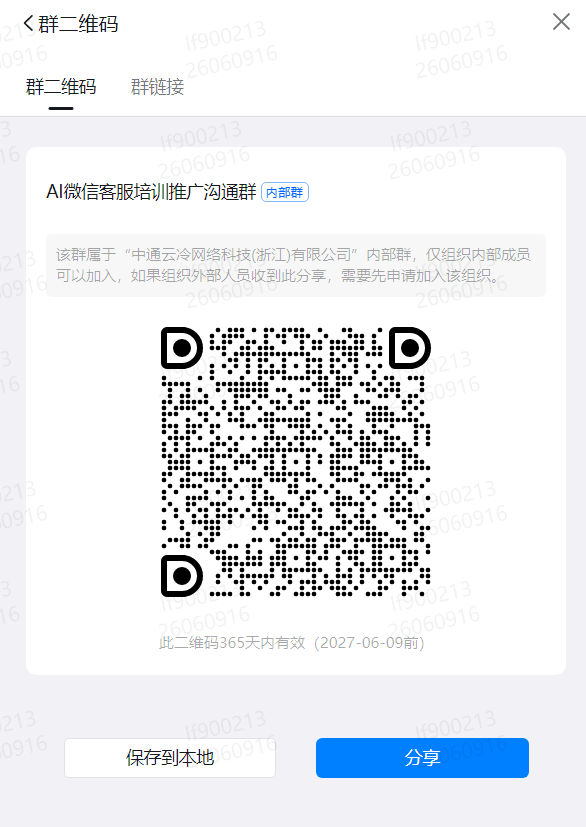

#### ③如群客户不在合作，可以进行群关闭操作

### 7、存量微信群如何使用（省区网管/总部技术支持人员）

已经存在的客户微信群需要将微信群转为企业微信，才能拉 企业微信 -AI客服1号 进微信群

具体操作步骤

①省区网管注册自己的企业微信，同时向总部技术支持人员将自己的企业微信账号变更为企业管理员

②网点客户群将相应的省区网管微信账号拉入微信群内

③网点将 微信群主转交给 省区网管

④省区网管打开手机端企业微信，进行转企业微信群操作

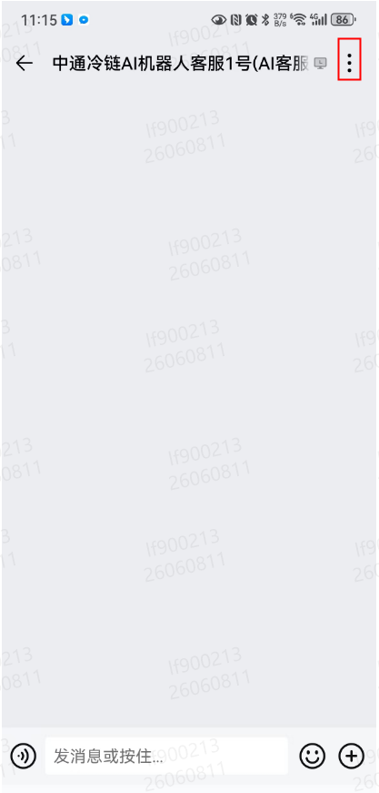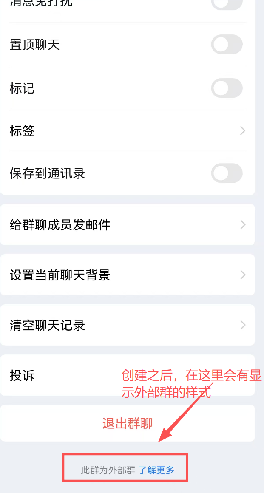

⑤转为企业微信群后，即可拉 AI客服1号 进入 企业微信群内

⑥ 由对应的网点自行输入激活码 即可，后续的操作见上操作步骤

⑦将群主转移给原网点人员

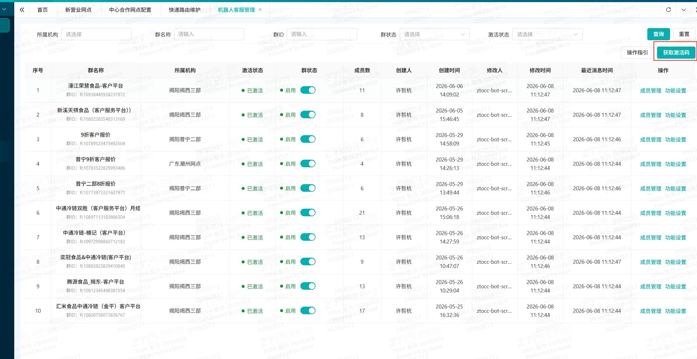

八、推广培训群

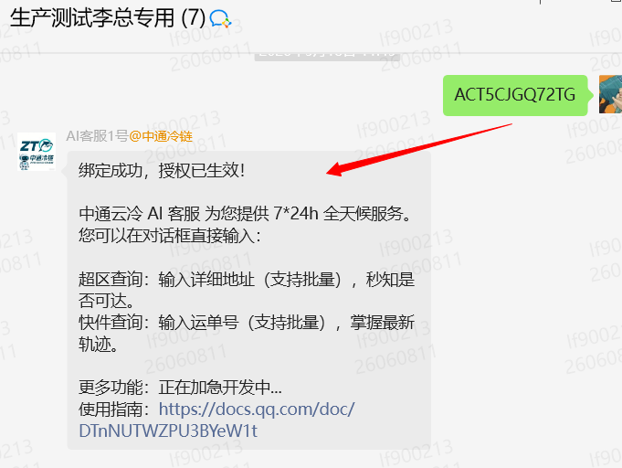