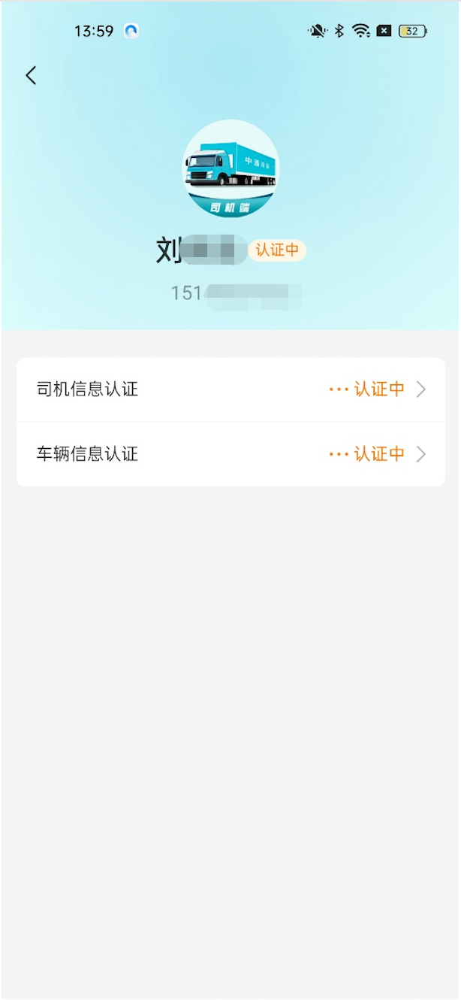
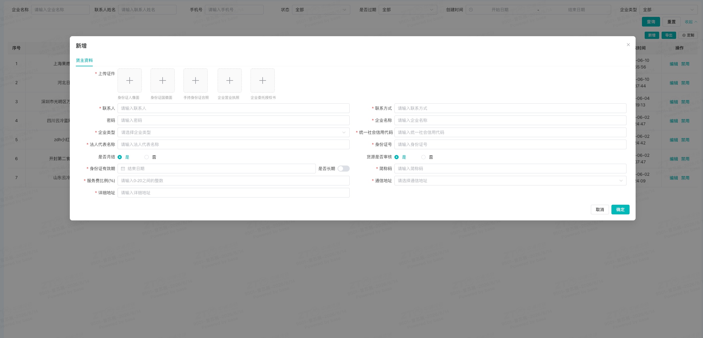
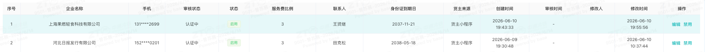
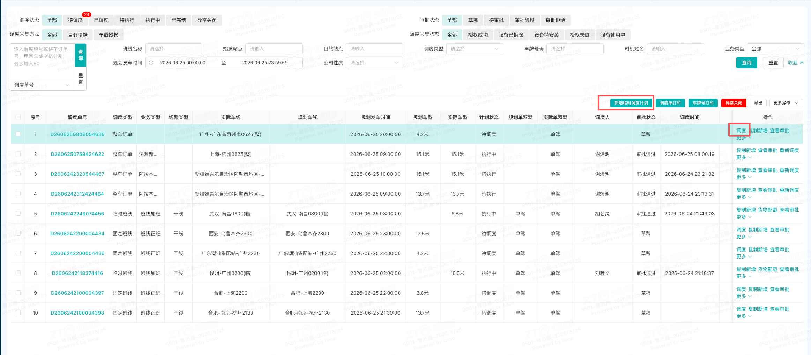

# 省公司三方车下单

## 一、适用场景

本文适用于省公司通过网络货运平台完成三方车下单的场景。

省公司临时三方车业务原先主要通过线下找车、再走调度计划操作。网络货运平台上线后，省公司可通过已在网络货运平台注册的司机，在调度计划中直接向网络货运平台下单，操作更便利。

## 二、前置条件

1. **账号与权限要求**：账号权限角色需包含**中通冷运租户权限**，例如：**网点/省公司**。若无权限，请联系系统管理员。
2. **设备与环境要求**：准备一台可联网的电脑，建议使用 **Chrome 浏览器**。
3. **系统登录入口**：[https://zc.ztocc.com/dashboard](https://zc.ztocc.com/dashboard)
4. **司机注册要求**：下单时选择的司机需已在**中通冷运网络货运平台**完成注册。具体注册方式请见：[司机端注册操作说明](https://alidocs.dingtalk.com/i/nodes/7NkDwLng8Zqv4nlzsNPRolamJKMEvZBY?doc_type=wiki_doc)

### 2.1 核心名词解释

- **货主**：指在中通冷运网络货运平台上的发货方。
- **网络货运平台**：即中通冷运网络货运平台，是专为网点、省公司、生态圈以及 KA 客户等解决整车业务场景的网络货运承运平台。

## 三、操作入口

### 3.1 省公司注册网络货运平台货主

**系统功能路径**：登录系统 -> 顶部 tab 切换至 **【中通冷运】** -> 左侧边栏 **【基础资料】** -> **【货主管理】** -> **【企业货主】**

### 3.2 省公司货主充值

**系统功能路径**：登录系统 -> 顶部 tab 切换至 **【中通冷运】** -> 左侧边栏 **【财务管理】** -> **【充值提现】** -> **【充值】**

### 3.3 省公司下单

**系统功能路径**：登录系统 -> 顶部 tab 切换至 **【冷链快运】** -> 左侧边栏 **【运营运输管理】** -> **【运输计划】** -> **【调度计划】**

## 四、操作步骤

### 4.1 注册网络货运平台货主

1. 进入 **【企业货主】** 页面后，点击列表右上角的 **【新增】** 按钮。

   系统跳转至新增货主资料页面后，按页面要求填写信息。

   

2. 提交资料后，等待平台审核。

   系统会自动同步资料给平台进行审核，请关注审核状态。平台会在 **3 个工作日内**完成审核。

   ::: warning 注意事项
   审核期间可以编辑修改资料；修改提交后，会重新提交审核。
   :::

   

3. 审核通过后，维护税务信息。

   为了方便开票，请及时维护税务信息：

   1. 点击 **【编辑】**。
   2. 切换 tab 至 **【开票信息管理】**。
   3. 点击 **【新增】**。
   4. 填写税务信息资料。

   

4. 联系总部运营关联云冷分拨账号。

   ::: danger 重点提醒
   需要联系总部运营 **@纪宗君 @曾苏展 @杨震东**，将网络货运平台货主账号与省公司下云冷的分拨中心账号做关联，从而实现云冷下单能够同步到网络货运平台。
   :::

### 4.2 省公司货主充值

1. 进入 **【充值】** 页面后，点击列表右上角的 **【充值】** 按钮，系统弹出充值框。

   

2. 核对账户信息，在输入框中填写需要充值的额度，然后点击 **【确认】**。

   

3. 根据页面引导完成充值。

### 4.3 省公司下单

1. 进入 **【调度计划】** 页面后，根据班线类型选择操作：

   - 临时班线：点击 **【新增临时调度计划】**。
   - 固定班线：点击对应班线上的 **【调度】** 按钮。

   

2. 选择运输公司和司机。

   ::: danger 重点提醒
   **运输公司一定要选择【中通冷运（天津）科技有限公司】。**

   司机选择约定好的三方车司机。前提是：司机需要在中通冷运网络货运平台完成注册。
   :::

   司机注册方式请见：[司机端注册操作说明](https://alidocs.dingtalk.com/i/nodes/7NkDwLng8Zqv4nlzsNPRolamJKMEvZBY?doc_type=wiki_doc)

   

3. 填写其他必填信息，并输入运费。

   - **计费方式**选择 **【自定义价格】**。
   - **计费单价**输入需要支付司机的运费。

   ::: danger 重点提醒
   计费单价填写的是需要支付司机的运费，且为**不含税**金额。
   :::

   

4. 核实是否下单成功。

   回到列表，查看对应调度单号后面的 **【订单编号】** 字段是否存在网络货运的订单号。

   ::: danger 重点提醒
   如果 **【订单编号】** 为空，请联系技术支持处理。此单请不要继续往下操作。
   :::

   

## 五、操作结果

完成以上操作后：

1. 省公司已在网络货运平台完成货主注册，并通过平台审核。
2. 已按需完成省公司货主充值。
3. 在云冷 **【调度计划】** 中完成三方车下单。
4. 调度计划列表中，对应调度单号后的 **【订单编号】** 字段应显示网络货运订单号。
5. 后续操作与云冷调度计划操作一致，司机通过司机小程序进行操作，后续数据、轨迹以及结算会通过系统完成同步。

## 六、注意事项

::: danger 重点提醒
1. 运输公司必须选择 **【中通冷运（天津）科技有限公司】**。
2. 司机必须已在**中通冷运网络货运平台**完成注册。
3. 运费填写为需要支付司机的运费，且为**不含税**金额。
4. 下单后如未返回 **【订单编号】**，请不要继续往下操作，需联系技术支持处理。
5. 注册货主审核通过后，需及时维护税务信息，便于后续开票。
6. 网络货运平台货主账号需与省公司下云冷的分拨中心账号完成关联，才能实现云冷下单同步到网络货运平台。
:::

## 七、常见问题

### 7.1 常见异常与兜底方案

| 序号 | ❌ 异常现象 / 报错提示 | 常见原因 | 解决方案 |
|------|----------------------------------|------------|--------------|
| 1 | 提示“无访问权限" | 该账号未授权 | 联系技术支持或小吉工单申请中通冷运权限 |
| 2 | 找不到司机 | 司机未再中通冷运司机端APP注册 | 司机下载APP完成注册和资料认证 |
| 3 | 下单未返回订单号 | 运输公司选择错误 | 请核对是否运输公司选择为【中通冷运（天津）科技有限公司】，若是，则联系技术支持排查 |

### 7.2 FAQ

**Q1：我一个省公司下面有多个分拨中心，是否需要建多个货主？**

A：一个省公司为一个货主，在网络货运平台是以省公司名义下单，多个分拨中心可以共用。

**Q2：下单之后后续怎么操作？**

A：后续操作与云冷调度计划操作完全一致，司机操作司机小程序进行操作，后续数据和轨迹以及结算都会通过系统完成同步。