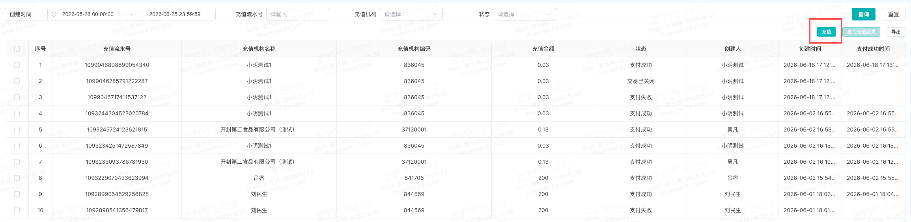

## 一、 业务场景与名词解释

### 1.1 业务场景（为什么用？）

- 省公司临时三方车业务目前是通过线下找车走调度计划操作的，网络货运平台上线后，省公司可以通过网络货运平台注册的司机在调度计划直接给网络货运平台下单，操作更便利；

### 1.2 核心名词解释（不迷路）

- **货主**：指在中通冷运网络货运平台上的发货方
- **网络货运平台**：即中通冷运网络货运平台，是专为网点、省公司、生态圈以及KA客户等解决整车业务场景的网络货运承运平台

## 二、 前置准备与环境配置

- **账号与权限要求**：权限角色需包含中通冷运租户权限， \[例如：网点/省公司\]，若无权限请联系系统管理员。
- **物理/环境准备**：需要一台可以联网的电脑，最好有chome浏览器
- **配套工具/链接**：
- 官方系统登录入口：[https://zc.ztocc.com/dashboard](https://zc.ztocc.com/dashboard)

## 三、 场景化标准操作步骤

### 场景一：\[省公司注册网络货运平台货主\]

- **系统功能路径**：登录系统 -\>顶部tab切换至【中通冷运】 -\>左侧边栏【基础资料】-\> 【货主管理】-\> 【企业货主】

### 核心操作步骤：

1. **\[新增货主\]**进入页面后，点击列表右上角的 **【新增】** 按钮。跳转至新增货主资料，并填写信息

2. **\[等待平台审核\]**提交资料后，系统会自动同步给平台进行审核，请关注审核状态，平台会在3个工作日内完成审核，在审核期间，可以编辑修改资料，修改提交后会重新提交审核；

3. **【审核通过后，维护税务信息】**

审核通过后，为了方便开票，请及时维护税务信息，点击【编辑】切换tab至【开票信息管理】，点击【新增】填写税务信息资料

**4.【联系总部运营关联云冷分拨账号】（重要！！！）**

需要联系总部运营@纪宗君@曾苏展@杨震东将网络货运平台货主账号与省公司下云冷的分拨中心账号做关联，从而实现云冷下单能够同步到网络货运平台

### 场景二：\[省公司货主充值\]

**系统功能路径**：登录系统 -\>顶部tab切换至【中通冷运】 -\>左侧边栏【财务管理】-\> 【充值提现】-\> 【充值】

### 核心操作步骤：

1. **\[点击充值\]**进入页面后，点击列表右上角的 **【充值】** 按钮。弹出充值框

**2.【核对账户信息，输入充值金额】**

在输入框中输入需要充值的额度，点击【确认】

**3.【根据引导完成充值】**

根据引导完成充值

### 场景三：\[省公司下单\]

**系统功能路径**：登录系统 -\>顶部tab切换至【冷链快运】 -\>左侧边栏【运营运输管理】-\> 【运输计划】-\> 【调度计划】

### 核心操作步骤：

1. **\[点击新增调度计划或在固定班线上点击【调度】\]**若临时班线，则点击【新增临时调度计划】，若为固定班线，则点击对应班线上的【调度】按钮

**2.\[选择运输公司和司机\]**

在运输公司中一定要选择【中通冷运（天津）科技有限公司】！！司机选择约定好的三方车的司机（前提：司机需要在中通冷运网络货运平台完成注册！！具体注册方式请见：[司机端注册操作说明](https://alidocs.dingtalk.com/i/nodes/7NkDwLng8Zqv4nlzsNPRolamJKMEvZBY?doc_type=wiki_doc)

）

**3.\[填写其他必填信息后输入运费\]**

在计费方式选择【自定义价格】，在计费单价输入需要支付司机的运费（不含税！！！！）

**4.\[核实是否下单成功\]**

在列表中，对应调度单号后面的【订单编号】字段是否存网络货运的订单号，若无，则联系技术支持帮忙处理，此单请不要继续往下操作；

## 四、 常见异常与兜底方案

| 序号 | ❌ 异常现象 / 报错提示 | 常见原因 | 解决方案 |
|------|----------------------------------|------------|--------------|
| 1 | 提示“无访问权限" | 该账号未授权 | 联系技术支持或小吉工单申请中通冷运权限 |
| 2 | 找不到司机 | 司机未再中通冷运司机端APP注册 | 司机下载APP完成注册和资料认证 |
| 3 | 下单未返回订单号 | 运输公司选择错误 | 请核对是否运输公司选择为【中通冷运（天津）科技有限公司】，若是，则联系技术支持排查 |

## 五、 高频常见问题（FAQ）

- **Q1：\[我一个省公司下面有多个分拨中心，是否需要建多个货主？\]**
- **A**：一个省公司为一个货主，在网络货运平台是以省公司名义下单，多个分拨中心可以共用；
- **Q2：\[下单之后后续怎么操作？\]**
- **A**：后续操作与云冷调度计划操作完全一致，司机操作司机小程序进行操作，后续数据和轨迹以及结算都会通过系统完成同步；