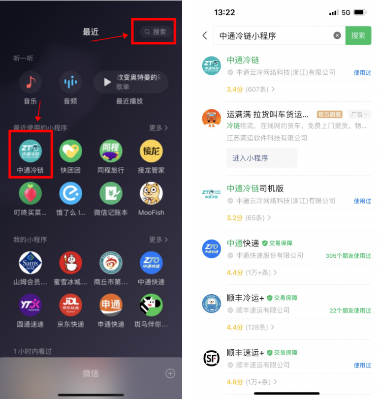

# 系统账号开通及权限配置

## 一、适用场景
本文适用于省区网管、一级/二级网点管理员为网点员工创建、授权及管理系统账号（包括鲸天系统、宝盒、鲸小宝、PDA等）的操作场景。

## 二、前置条件
- 账号添加规则：只有具备相应管理员权限的用户才能添加下属账号。
- 省区网点管理员账号由总部网管添加。
- 一级网点网点管理员账号由省区网管添加。
- 一级网点员工及下属二级网点网点管理员账号由一级网点网点管理员添加。
- 二级网点员工账号由二级网点网点管理员或一级网点网点管理员添加。

## 三、操作入口
系统菜单路径请以实际系统为准，常用入口：
- **基础配置 > 用户中心 > 员工管理**
- **系统管理 > 用户中心 > 用户管理**

## 四、操作步骤

### 4.1 添加员工账号
1. 进入 **基础配置 > 用户中心 > 员工管理**（或菜单搜索“员工管理”）。
2. 点击 **新增员工**，填写员工信息。
3. 设置 **登录账号** 和 **密码**。
4. 在 **是否允许查看录单成本** 字段中，若需要查看则选择 **“是”**，否则选择 **“否”**。目前默认显示“空白”，必须手动选择，否则员工无法查看录单成本。

   

5. 保存后，系统会自动创建鲸天系统账号及对应的宝盒账号。

### 4.2 给员工授权
1. 在 **员工管理** 中，找到该员工并点击 **授权**。
2. 选择 **角色类型**：支持以下预制角色（按网点或省区配置）：
   - 网点管理员
   - 网点客服
   - 网点操作员
   - 代理点业务员
   - 一级网点财务 / 二级网点财务
   - 省区网管（仅省区配置）
3. 选择 **角色**：根据需要勾选具体角色（如“ZTO 网点管理员”）。
4. 选择 **授权组织**：该员工所属的网点（可多选）。例如，员工同时负责 A、B 网点的客服工作，则勾选 A 网点和 B 网点。

   

5. 提交后，员工账号的 **用户状态** 变为 **“已开通”**，方可登录系统。

### 4.3 开通鲸小宝、PDA 等账号
1. 进入 **系统管理 > 用户中心 > 用户管理**。
2. 找到对应员工，点击 **重置密码**。
3. 设置新密码（该密码即为鲸小宝或 PDA 的登录密码）。
4. 重置后，员工可直接使用新密码登录鲸小宝 App 或 PDA 设备。

   

   

### 4.4 员工管理与用户管理的区别
| 功能模块 | 员工管理 | 用户管理 |
|----------|----------|----------|
| 主要操作 | 新增员工、设置登录账号/密码、授权组织/角色、编辑基础信息 | 编辑登录手机号、重置鲸小宝 App 密码、重置 PDA 密码 |
| 删除操作 | 员工离职时在此删除，宝盒账号将无法正常登录 | 不可直接删除员工 |

## 五、操作结果
- 新增员工后，系统自动创建对应的鲸天系统账号及宝盒账号。
- 授权后，员工账号状态变为“已开通”，可登录系统查看权限范围内的数据。
- 重置密码后，员工可使用新密码登录鲸小宝 App 或 PDA 设备。

## 六、注意事项
::: warning 注意事项
- 添加员工时，**是否允许查看录单成本**字段默认为空白，必须手动选择（是/否），否则员工无法查看录单成本。
- 授权时必须同时选择 **角色类型** 和 **授权组织**，否则员工账号无法开通。
- 预制角色按网点或省区配置，请根据实际管理范围选择。
- 员工离职时，请务必在 **员工管理** 中删除，宝盒账号将失效。
- 若员工同时负责多个网点，授权组织需勾选所有相关网点。
:::

## 七、常见问题
**Q：为什么员工登录后看不到任何数据？**
A：请检查是否已为该员工完成授权（角色+组织）。只有授权后用户状态才是“已开通”，才能登录查看对应数据。

**Q：如何重置鲸小宝或 PDA 密码？**
A：进入 **系统管理 > 用户中心 > 用户管理**，找到该员工后点击 **重置密码** 即可。

**Q：员工离职后，可以仅删除用户管理中的账号吗？**
A：不行。员工离职应通过 **员工管理** 删除该员工，宝盒账号会自动失效。用户管理仅用于编辑手机号和重置密码，不用于删除。

<!-- AI 优化遗漏的图片，已自动补回 -->
